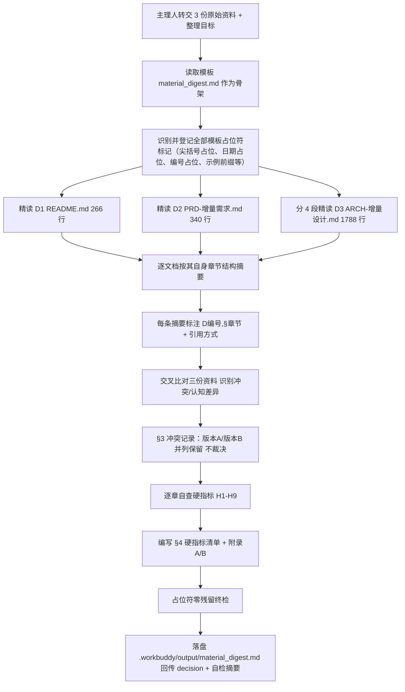

# e_platform 电商平台 · 资料摘要

> 本文档做一件事：**精读主理人转交的全部原始资料，逐份、逐章节做出摘要**——后面任何人拿到这份摘要，都能通过章节号快速定位回原始文件的对应位置。

> 上游输入：主理人转交的 3 份原始资料（项目 README + 增量 PRD + 增量 ARCH）；
> 产出者：`knowledge-ingest-engineer`（知识摄入工程师 - 闻资料），经 G1 校验与人工审核通过后交付。

---

## 0. 元信息

```yaml
标题: e_platform 电商平台 - 资料摘要 v1.0
版本: v1.0
状态: 待审核（G1）
创建日期: 2026-08-01
整理人: 闻资料（knowledge-ingest-engineer）
审核人:
  - 主理人（AICoding 架构 Team Owner）

原始资料清单:
  - /Users/finn/Documents/workbuddy/e_platform/README.md: 项目总览，含技术栈、项目结构、请求链路、端口分配、功能特性、启动与构建说明、API 清单、安全特性
  - /Users/finn/Documents/workbuddy/e_platform/docs/PRD-增量需求.md: 增量 PRD v1.0（许清楚），含现状勘察结论 C1-C6、三大目标 G1/G2/G3、用户故事、P0/P1/P2 需求池、权限矩阵、UI 规范、排队机制定义、10 条待确认问题
  - /Users/finn/Documents/workbuddy/e_platform/docs/ARCH-增量设计.md: 增量架构设计 v2.0（高见远），含读码补充发现 A1-A15、九个实现方案小节、数据库变更、接口契约、类图、时序图、文件清单、T01-T05 任务分解、依赖清单、共享知识、风险与待明确事项
```

| 版本 | 日期 | 作者 | 变更内容 |
| --- | --- | --- | --- |
| v1.0 | 2026-08-01 | `闻资料（knowledge-ingest-engineer）` | 初稿。完成 D1/D2/D3 三份资料全文精读与逐章摘要，D4 源码目录按主理人指令跳过并注明原因；共记录 26 条冲突与认知差异 |

---

## 1. 资料清单

> 列出全部原始资料，每份标注解析状态。解析失败或跳过的必须注明原因。

| 编号 | 文件名 | 类型 | 来源 | 解析状态 | 说明 |
| --- | --- | --- | --- | --- | --- |
| D1 | `README.md`（项目根目录） | md | 项目仓库自带文档（266 行 / 8003 字节） | 已解析 | 别名 D-README。以文件读取工具一次性全文读入 266 行，无截断、无遗漏 |
| D2 | `docs/PRD-增量需求.md` | md | 许清楚（产品经理），增量 PRD v1.0（340 行 / 32049 字节） | 已解析 | 别名 D-PRD。一次性全文读入 340 行，无截断、无遗漏 |
| D3 | `docs/ARCH-增量设计.md` | md | 高见远（架构师），增量架构设计 v2.0（1788 行 / 108482 字节） | 已解析 | 别名 D-ARCH。单次读取超出工具 token 上限，改为分 4 段读取（1–330 行 / 330–660 行 / 660–1060 行 / 1060–1788 行），已完整覆盖全部 1788 行 |
| D4 | `backend/` `frontend/` `android/` 源码目录 | 源码目录 | 项目仓库源码 | 已跳过 | 跳过原因：主理人在任务指令中明确说明「不必重复通读 6831 个前端文件」。该部分事实已由 D3 文首「已读文件清单」与 D3 §0 读码补充发现 A1–A15 实地核实并成文，本文一律按 D3 出处收录，不另行直读源码，以免产生未经核实的二次推断 |

**类型枚举说明**：模板给出的枚举为 `docx` / `pdf` / `pptx` / `xlsx`；本轮主理人转交的三份可解析资料均为仓库内 Markdown 文本文件，故类型列取值为 `md`；D4 为源码目录（非单一文档），类型列如实记为「源码目录」。模板枚举的四类文档本轮均未出现，对应解析能力未启用（详见附录 B）。

**解析状态统计**：已解析 3 份（D1、D2、D3），已跳过 1 项（D4，原因见上），解析失败 0 份，无「待定」项。

---

## 2. 资料内容摘要

> 逐份文档按自身章节结构做摘要。每条摘要标注章节号（`D编号，§章节`），后面任何人想核实某个点，直接定位回原文对应位置即可。
> 「引用方式」列取值：**直接引用**（照录原文表述）、**数据提取**（抽取原文中的枚举/数值/清单）、**综合归纳**（同一章节内多段合并为一条）、**推断**（原文未明写，由整理人推得，必须标注风险）。
> D4 已跳过，无独立摘要；其涉及的源码事实全部并入 D3 的 §0 与 §1 各条。

### D1：`README.md`

> 项目仓库自带的总览文档，描述 e_platform 的既有形态：技术栈、模块划分、请求链路、端口、已实现功能、启动构建方式、对外接口清单与安全特性。README 自身无编号标题，下表按文档中一级/二级标题的出现顺序赋予 §1–§9 的定位编号，便于回溯。 — 来源：项目仓库

| 章节 | 内容摘要 | 出处标注 | 引用方式 |
| --- | --- | --- | --- |
| §1 项目定位（文首简介） | 定位为「基于 Spring Boot 微服务 + Vue 3 + Android(Kotlin/Compose) 的全栈电商平台」，支持买家和卖家两种用户角色，提供完整的购物流程 | D1，§1 | 直接引用 |
| §2.1 后端技术栈 | Spring Boot 2.7.18 + Spring Cloud 2021.0.8（微服务框架）；Spring Security + JWT（认证授权）；MyBatis-Plus（ORM）；MySQL 8.0 + Druid（关系型数据库与连接池）；Redis（缓存）；OpenFeign（服务间调用）；Hutool / Fastjson（工具库） | D1，§2.1 | 数据提取 |
| §2.2 Web 前端技术栈 | Vue 3 + Vue Router 4 + Pinia；Element Plus（UI 组件库）；Axios（HTTP 客户端）；Vite 4（构建工具） | D1，§2.2 | 数据提取 |
| §2.3 Android 技术栈 | Kotlin 1.9 + Jetpack Compose（声明式 UI）；Hilt（依赖注入）；Retrofit + OkHttp（网络层）；kotlinx.serialization（JSON 序列化）；DataStore（本地存储）；Coil（图片加载）；Navigation Compose（导航） | D1，§2.3 | 数据提取 |
| §2.4 基础设施 | Docker Compose 承载 MySQL / Redis / RabbitMQ | D1，§2.4 | 直接引用 |
| §3 项目结构 | `backend/` 下 6 个模块：`e-platform-common`（JWT/Result/Redis/异常）、`e-platform-user`(8085)、`e-platform-product`(8086)、`e-platform-order`(8087，含购物车/地址)、`e-platform-mobile`(8089，Feign 聚合层 BFF)、`e-platform-gateway`(8088，代理 + 托管前端静态资源)，另有父 POM；`frontend/src` 下分 api / layouts / router / stores / views；`android/` 为多模块项目（shared-core 共享库、buyer-app、seller-app、settings.gradle.kts）；根目录另有 `database/init.sql`、`docker-compose.yml`、`start.sh`、`stop.sh`、`.env.example` | D1，§3 | 数据提取 |
| §4.1 请求链路 | Web 前端 → 网关(8088) → 用户服务(8085) / 商品服务(8086) / 订单服务(8087)；Android → 网关(8088) → 移动端 BFF(8089) → Feign → 用户/商品/订单服务。网关层为统一入口，负责 JWT 认证、请求路由、CORS、托管前端静态资源；移动端 BFF 为 Android 客户端提供聚合接口；微服务层三个服务各自独立部署、拥有独立数据库表 | D1，§4.1 | 直接引用 |
| §4.2 端口分配 | e-platform-user 8085（用户注册/登录/信息）；e-platform-product 8086（商品/分类/评价）；e-platform-order 8087（订单/购物车/地址）；e-platform-gateway 8088（API 网关 + Web 前端）；e-platform-mobile 8089（移动端 BFF）；MySQL 3306；Redis 6379；RabbitMQ 5672 / 15672，且明确标注为「消息队列（预留）」 | D1，§4.2 | 数据提取 |
| §5.1 用户功能 | 用户注册（买家/卖家）、用户登录（JWT Token 认证）、用户信息管理 | D1，§5.1 | 直接引用 |
| §5.2 商品功能 | 商品分类管理（树形结构）、商品上架/下架、商品列表查询（分页/分类/关键词搜索）、商品详情展示、**商品评价**、Redis 缓存优化 | D1，§5.2 | 直接引用 |
| §5.3 购物车功能 | 添加商品到购物车、修改购物车商品数量、删除购物车商品、清空购物车 | D1，§5.3 | 直接引用 |
| §5.4 订单功能 | 创建订单、订单支付、订单发货、确认收货、取消订单、订单列表查询（买家/卖家）、收货地址管理 | D1，§5.4 | 直接引用 |
| §5.5 卖家后台 | 卖家中心首页、商品管理（增删改查）、订单管理、数据统计 | D1，§5.5 | 直接引用 |
| §6.1 环境要求 | JDK 17+、Node.js 16+、MySQL 8.0+、Redis 6.0+、Maven 3.6+、Docker 与 Docker Compose、Android Studio（构建 Android 端） | D1，§6.1 | 数据提取 |
| §6.2 配置环境变量 | `cp .env.example .env`，编辑 `.env` 设置 `JWT_SECRET`（至少 64 字符），推荐用 `openssl rand -base64 64` 生成密钥 | D1，§6.2 | 直接引用 |
| §6.3 一键启动 | 声明 `./start.sh` 启动所有服务（含 Docker 基础设施、前端构建、后端微服务），`./stop.sh` 停止所有服务；并列出启动脚本会自动完成的三步：启动 Docker 基础设施（MySQL/Redis/RabbitMQ）→ 构建前端（npm install + npm run build）→ 构建并启动后端微服务（user → product → order → mobile → gateway） | D1，§6.3 | 直接引用 |
| §6.4 手动启动 | 数据库初始化 `mysql -u root -p` 导入 `database/init.sql`；后端 `mvn clean install -DskipTests` 后 `export JWT_SECRET` 再逐个 `mvn spring-boot:run`；Web 前端 `npm install` + `npm run dev`，开发模式访问 `http://localhost:3000`，生产模式经网关 `http://localhost:8088`（前端打包进网关）；Android 端用 `./gradlew :buyer-app:assembleDebug` 与 `:seller-app:assembleDebug` 构建；模拟器默认连接 `http://10.0.2.2:8088`（映射宿主机 localhost:8088） | D1，§6.4 | 数据提取 |
| §6.5 访问地址与测试账号 | Web 前端 `http://localhost:8088`；测试账号 buyer1/123456（买家）、seller1/123456（卖家），共 2 个 | D1，§6.5 | 直接引用 |
| §7.1 用户服务接口(8085) | `POST /user/register` 注册、`POST /user/login` 登录、`GET /user/info/{userId}` 获取用户信息 | D1，§7.1 | 数据提取 |
| §7.2 商品服务接口(8086) | `GET /product/list`（分页/分类/搜索）、`GET /product/{id}` 详情、`GET /product/batch` 批量查询、`GET /product/seller/{sellerId}` 卖家商品列表、`POST /product/add`、`PUT /product/{id}`、`DELETE /product/{id}`、`GET /category/tree` 分类树、`GET /review/{productId}` 商品评价 | D1，§7.2 | 数据提取 |
| §7.3 订单服务接口(8087) | `POST /order/create`、`POST /order/pay/{orderId}`、`POST /order/deliver/{orderId}` 发货、`POST /order/receive/{orderId}` 确认收货、`POST /order/cancel/{orderId}`、`GET /order/user` 买家订单列表、`GET /order/seller` 卖家订单列表、`POST /order/cart/add` 添加购物车、`GET /order/cart` 购物车列表、`GET /address/list` 地址列表 | D1，§7.3 | 数据提取 |
| §7.4 移动端 BFF 接口(8089) | `POST /mobile/auth/login`、`POST /mobile/auth/register`、`GET /mobile/home` 首页聚合数据、`GET /mobile/products/**`、`GET /mobile/cart`、`POST /mobile/order/**`；并声明所有外部请求统一通过网关(8088)的 `/api/**` 前缀访问 | D1，§7.4 | 直接引用 |
| §8 安全特性 | JWT Token 认证（密钥通过环境变量注入）、BCrypt 密码加密、CORS 跨域配置、SQL 注入防护（MyBatis-Plus）、网关层拦截内部接口（`/deduct`、`/restore` 等仅限服务间调用） | D1，§8 | 直接引用 |
| §9 许可证 | MIT License | D1，§9 | 直接引用 |

### D2：`docs/PRD-增量需求.md`

> 增量 PRD v1.0（作者许清楚），仅描述本次变更、已实现功能不重复设计；核心是「补齐鉴权安全底座 + 新建三级评论体系 + 建立并发保护 + 视觉升级 + 修复交付脚本」五件事，配套 19 条 P0、8 条 P1、6 条 P2 与 10 条待拍板问题。 — 来源：许清楚（产品经理）

| 章节 | 内容摘要 | 出处标注 | 引用方式 |
| --- | --- | --- | --- |
| §0.0 文首项目信息表 | 项目名称 `e_platform`；文档类型为增量 PRD（仅描述本次变更，已实现功能不重复设计）；后端技术栈 Spring Boot 2.7.18 + Spring Cloud 2021.0.8 + MyBatis-Plus + MySQL 8 + Redis，标注「沿用，不更换」；Web 技术栈 Vue 3 + Vite 4 + Element Plus + Pinia + Sass，标注「沿用，不引入 Tailwind」；客户端为 Kotlin + Jetpack Compose 双 App（buyer-app / seller-app + shared-core）；版本 v1.0；作者 许清楚（产品经理） | D2，§0.0 | 数据提取 |
| §0 现状勘察 C1 启停脚本 | 认知为「一键启停脚本已有」，代码实际情况是 `start.sh` 为 **0 字节空文件**，`stop.sh` 可用但仅停 Java 进程并明确提示「Docker 容器请自行 `docker-compose down`」。影响：启动脚本需从零构建，停止脚本需补齐 Docker 编排 | D2，§0 C1 | 直接引用 |
| §0 现状勘察 C2 商品评价 | 认知为「已实现单层商品评价」，实际仅有 `Review` 实体 / `ReviewMapper` / `ReviewService` / `ReviewController`（3 个接口），且 `addReview()` 无任何购买校验，任意登录用户可对任意商品刷评论。影响：是安全缺陷而非可用功能，L1 层需重做而非扩展 | D2，§0 C2 | 直接引用 |
| §0 现状勘察 C3 网关鉴权 | 认知为「有 JWT 鉴权」，实际网关 `GatewayController` 是 Spring MVC + RestTemplate 手写代理（非 Spring Cloud Gateway），鉴权仅「校验 Token 是否可解析」，无角色校验、无失效机制。影响：IAM 需在现有代理层上重构 | D2，§0 C3 | 直接引用 |
| §0 现状勘察 C4 身份头伪造 | `proxyRequest()` 先全量透传客户端 Header（含客户端伪造的 `X-User-Id`），再由 `extractUserFromToken()` 覆盖；当 Token 无 `userId` claim 或走公开路径时，伪造头可穿透到下游服务。定级为**高危越权漏洞，P0 必修** | D2，§0 C4 | 直接引用 |
| §0 现状勘察 C5 微服务信任模型 | `product/order/user` 服务直接 `@RequestHeader("X-User-Id")` 取值即信任；服务端口 8085-8089 若可直连即可完全绕过网关冒充任意用户。影响：需建立「网关签名 + 服务侧校验」信任链 | D2，§0 C5 | 直接引用 |
| §0 现状勘察 C6 Android 评论 | 64 个 kt 文件中无任何 review/comment 相关代码。影响：三级评论在 App 端是纯新增，非改造 | D2，§0 C6 | 直接引用 |
| §0 结论 | 本次不是「加个评论功能」，而是「补齐鉴权安全底座 + 新建三级评论体系 + 建立并发保护 + 视觉升级 + 修复交付脚本」五件事 | D2，§0 结论 | 直接引用 |
| §1 目标 G1 可信 | 从「能登录」升级为完整 IAM：RBAC 角色权限模型、细粒度接口鉴权、Token 全生命周期管理、越权防护。衡量口径：越权测试（伪造 Header / 跨用户改商品 / 未购买评论 / 登出后复用 Token）100% 拦截 | D2，§1 G1 | 直接引用 |
| §1 目标 G2 可交互 | 建立三级评论体系，让交易后的商品页从「单向展示」变为「买家—卖家—潜在买家」三方对话场域。衡量口径：商品详情页可完成 L1 评价 → L2 卖家回复 → L3 第三方追问完整链路，权限矩阵零漏判 | D2，§1 G2 | 直接引用 |
| §1 目标 G3 可用可看 | 支撑多客户端并发（超阈值排队而非拒绝）+ 视觉升级至现代电商观感，并修复一键启停交付链路。衡量口径：50 并发下单不超卖、排队有位次反馈；`./start.sh` 一条命令拉起全栈；APK 可安装运行 | D2，§1 G3 | 直接引用 |
| §1 非目标 | 本次明确不做：支付渠道对接、物流对接、商品 SKU 多规格、优惠券/营销、店铺装修、消息推送、竞品与市场分析 | D2，§1 非目标 | 直接引用 |
| §2 买家故事 US-B1~US-B4 | B1 只有收到货后才能对商品评价（打分 + 文字 + 图片），保证评价区可信；B2 能看到卖家对自己评价的回复，也能看到别人对自己评价的追问并回答；B3 下单高峰期不直接报错，而是提示「前方还有 N 人、预计 X 秒」由用户决定等或走；B4 登出后 Token 立即失效，即使被截获也无法冒用 | D2，§2 买家 | 数据提取 |
| §2 卖家故事 US-S1~US-S4 | S1 能回复买家对自己商品的评价，处理差评、维护口碑；S2 无法回复别人家商品的评价，也无法删除买家差评（只能举报），保证平台公正；S3 在卖家中心看到「待回复评价」数量，不遗漏客诉；S4 即使有人拿到用户名，也无法通过伪造请求头修改自己的商品 | D2，§2 卖家 | 数据提取 |
| §2 游客与第三方 US-G1~US-G3 | G1 游客（未登录）可浏览商品和全部三级评论内容，但需登录才能参与互动；G2 未购买的登录用户可在某条真实评价下追问，由评价者或卖家解答，帮助决策；G3 潜在买家不能伪造「已购买」身份去发评价 | D2，§2 游客 | 数据提取 |
| §2 运维故事 US-O1~US-O4 | O1 `./start.sh` 一条命令按依赖顺序拉起 Docker 基建 + 5 个微服务 + 前端并做健康检查；O2 `./stop.sh` 完整停掉全部服务含 Docker 容器，且可选保留数据卷；O3 Redis 使用官方 `docker.1ms.run/redis:7` 镜像，切换后配置不残留 bitnami 专有变量；O4 通过配置调整排队阈值，而不用改代码重新打包 | D2，§2 运维 | 数据提取 |
| §3 P0-1 修复 Redis 镜像切换 | 六项验收：`docker-compose.yml` 中 redis 镜像改为 `docker.1ms.run/redis:7`；删除 bitnami 专有的 `ALLOW_EMPTY_PASSWORD`；改用 `command: redis-server --appendonly yes` 显式启动；数据卷挂载确认为官方镜像路径 `/data`（现有 `redis_data:/data` 正确，无需改）；`docker-compose up -d redis` 后 `redis-cli ping` 返回 `PONG`；后端服务连接 Redis 无鉴权报错 | D2，§3 P0-1 | 数据提取 |
| §3 P0-2 重建 start.sh | 脚本非空且 `chmod +x`；依次执行环境检查（java/mvn/node/docker）→ `docker-compose up -d`（MySQL/Redis/RabbitMQ）→ 轮询等待 MySQL/Redis 健康 → 构建后端（可跳过）→ 按 user(8085)→product(8086)→order(8087)→mobile(8089)→gateway(8088) 顺序后台启动，每个服务健康检查通过后再启下一个；日志分别输出到 `logs/{service}.log`；端口被占用时给出明确提示而非静默失败；结束打印访问地址与测试账号；全新环境执行一次即可访问 `http://localhost:8088` | D2，§3 P0-2 | 数据提取 |
| §3 P0-3 补全 stop.sh | 停止 5 个 Java 服务（沿用现有逻辑）；新增停止 Docker 容器；支持 `--with-data` 参数决定是否 `docker-compose down -v` 清除数据卷，默认保留；重复执行不报错（幂等） | D2，§3 P0-3 | 数据提取 |
| §3 P0-4 修复网关 Header 伪造（C4） | `proxyRequest()` 透传 Header 前强制剥离客户端传入的 `X-User-Id` / `X-User-Type` / `X-User-Roles` / `X-Gateway-Sign` 等所有内部身份头；身份头只能由网关解析 JWT 后写入；测试口径：携带 `X-User-Id: 1` 但无 Token 请求受保护接口返回 401，携带用户 A 的 Token + 伪造 `X-User-Id: B` 时下游收到的是 A | D2，§3 P0-4 | 数据提取 |
| §3 P0-5 建立 RBAC 权限模型 | 新增 `role`、`permission`、`role_permission`、`user_role` 四张表；内置角色 `ROLE_BUYER`、`ROLE_SELLER`、`ROLE_ADMIN`；权限码采用「资源:动作」格式，原文列出 `product:create`、`comment:reply`、`comment:ask`；注册时按 `user_type` 自动绑定角色（1→BUYER，2→SELLER），保留 `user_type` 字段向后兼容；存量 2 个测试用户数据迁移完成；JWT payload 携带 `roles` 与 `userId`、`userType` | D2，§3 P0-5 | 数据提取 |
| §3 P0-6 细粒度接口鉴权 | 网关维护「路径 + 方法 → 所需权限码」映射表，替代现有 `isPublicPath` / `isPublicReadPath` 的粗粒度判断；无权限返回 403（区别于未登录 401）；测试口径为买家 Token 调 `POST /api/product/add` 返回 403；下游服务保留自身校验作为第二道防线（纵深防御） | D2，§3 P0-6 | 数据提取 |
| §3 P0-7 服务侧信任链校验（C5） | 网关向下游转发时附加 `X-Gateway-Sign`（对 `userId+userType+timestamp` 的 HMAC 签名，密钥走环境变量）；`common` 模块提供统一拦截器校验签名与时间戳，防重放窗口 5 分钟；直连 `localhost:8086` 伪造 `X-User-Id` 调用写接口返回 401 | D2，§3 P0-7 | 数据提取 |
| §3 P0-8 Token 生命周期管理 | Access Token 有效期 2 小时、Refresh Token 7 天；提供 `POST /api/user/refresh` 换取新 Access Token；提供 `POST /api/user/logout` 将当前 Token 的 `jti` 写入 Redis 黑名单（TTL 等于 Token 剩余有效期）；网关校验时查黑名单，命中返回 401；测试口径为登出后用旧 Token 请求返回 401 | D2，§3 P0-8 | 数据提取 |
| §3 P0-9 三级评论数据模型 | 在现有 `comment` 表上扩展（不新建表、不破坏存量），新增 `parent_id`(BIGINT,默认0)、`root_id`(BIGINT,默认0)、`type`(TINYINT：1-评价 2-卖家回复 3-追问留言)、`reply_to_user_id`(BIGINT,可空)、`seller_id`(BIGINT,冗余便于鉴权)、`reply_count`(INT,默认0)；存量数据 `type` 回填为 1；新增索引 `idx_root_id`、`idx_parent_id`、`idx_product_type`；提供可重复执行的迁移 SQL | D2，§3 P0-9 | 数据提取 |
| §3 P0-10 L1 买家购后评价 | 仅当存在「该用户 + 该商品 + 订单状态=3(已完成)」的订单时才允许发表；每个 `order_item` 仅可评价一次（唯一约束 `uk_order_product_user`）；必填 `rating`(1-5) 与 `content`(至少 5 字)，选填 `images`（最多 5 张）；未购买者调用返回 403 且提示「购买后才能评价」；修复现有 `ReviewService.addReview()` 无校验的缺陷 | D2，§3 P0-10 | 数据提取 |
| §3 P0-11 L2 卖家回复评价 | 仅该商品的 `seller_id` 本人可回复；每条 L1 评价最多 1 条有效 L2 回复；回复非自己商品的评价返回 403；回复不含 `rating`；发布后 24 小时内可编辑、超时不可改；卖家不可删除买家的 L1 评价 | D2，§3 P0-11 | 数据提取 |
| §3 P0-12 L3 第三方追问留言 | 任意登录用户（含未购买者、其他卖家、评价作者本人、商品卖家）均可在 L1 下留言；游客未登录返回 401 引导登录；留言逻辑上仅 1 层（`root_id` 恒等于 L1 的 id），回复他人时通过 `reply_to_user_id` 标记 `@某人`，禁止无限嵌套；内容 1-200 字 | D2，§3 P0-12 | 数据提取 |
| §3 P0-13 评论查询与展示 | `GET /api/comment/product/{productId}` 返回树形结构（L1 列表，每条内嵌其 L2 与 L3 列表）；L1 默认按时间倒序，支持切换「最新 / 评分最高 / 有图优先」；L2 紧随所属 L1；L3 按时间正序（保持对话感）；L1 分页每页 10 条，L3 默认展示 3 条 + 「查看全部 N 条」；用户名脱敏展示（`张*三`）；游客可读全部评论；L1 被删除或隐藏时其下 L2/L3 级联不可见 | D2，§3 P0-13 | 数据提取 |
| §3 P0-14 并发排队机制 | 基于 Redis 实现并发许可（信号量）+ 等待队列；保护范围为 `POST /api/order/create` 与 `PUT /api/product/{id}/deduct`；浏览类 GET 接口不排队直接放行；许可数与队列长度可配置（默认并发 50 / 队列 500），支持环境变量覆盖；进入排队返回 HTTP 202 + `{queueToken, position, estimatedWaitSeconds}`；队列已满返回 503 + 友好文案；排队等待超 60 秒自动放弃并释放名额；压测 50 并发下单不超卖、无 500 错误 | D2，§3 P0-14 | 数据提取 |
| §3 P0-15 排队前端体验（Web） | 收到 202 时弹出排队遮罩，展示「前方还有 N 人，预计 X 秒」；每 2 秒轮询 `GET /api/queue/status?token=` 刷新位次；提供「放弃排队」按钮，点击后调用释放接口；轮到时自动继续原下单请求，无需用户重新点击；超时/失败有明确文案，不出现白屏或静默失败 | D2，§3 P0-15 | 数据提取 |
| §3 P0-16 Web 视觉升级 | 落地第 5 章设计规范（品牌主色覆盖 Element Plus 默认蓝、统一间距/圆角/阴影令牌）；改造 Home / Products / ProductDetail 三个核心页；响应式适配 768px 及以上（桌面优先，平板不塌陷）；列表页接入骨架屏与图片懒加载；全站无错位、无溢出、无默认蓝残留 | D2，§3 P0-16 | 数据提取 |
| §3 P0-17 商品详情页三级评论区 | 在 `ProductDetail.vue` 新增评论区组件；三级视觉层次分明（L1 主卡 / L2 卖家回复带「卖家」标识与浅色底 / L3 缩进对话流）；按登录态与权限动态显隐操作入口，无权限时置灰并给出原因提示而非直接隐藏，以降低困惑；发表/回复/留言均为局部刷新，无整页重载 | D2，§3 P0-17 | 数据提取 |
| §3 P0-18 APK 产出 | `buyer-app` 与 `seller-app` 均能 `assembleRelease` 产出可安装 APK；APK 输出至 `dist/` 并在 README 说明安装方式；App 内后端地址可配置（不硬编码 localhost）；登录 → 浏览商品 → 下单主链路在真机或模拟器跑通 | D2，§3 P0-18 | 数据提取 |
| §3 P0-19 越权测试用例集 | 覆盖伪造 Header、跨用户改商品、未购买评价、卖家跨店回复、登出后复用 Token、直连微服务绕网关，共 6 个及以上场景；全部通过；测试脚本纳入 `tests/` 目录可重复执行 | D2，§3 P0-19 | 数据提取 |
| §3 P1 应该有（8 条） | P1-1 Android 评论功能（读 + 基础写）：buyer-app 可查看三级评论、可对已完成订单发表 L1、可发 L3 留言，seller-app 可查看并回复 L2；P1-2 卖家中心「待回复评价」徽标与列表回复；P1-3 评论内容安全（敏感词过滤本地词库 + XSS 转义 + 单用户发评频率限制，L3 每分钟不超过 5 条）；P1-4 商品评分聚合（商品列表/详情展示平均分与评价数，L1 发表后异步更新，可复用现有 RabbitMQ）；P1-5 排队机制覆盖 App 端；P1-6 移动端 Web 响应式（宽度小于 768px 时导航折叠为抽屉、商品网格降为 2 列）；P1-7 统一异常与错误码（401/403/429/503 有统一响应结构与前端拦截提示，不再出现裸 500）；P1-8 评论举报（写入举报表待管理员处理） | D2，§3 P1 | 数据提取 |
| §3 P2 可以有（6 条） | P2-1 评论点赞与「有用」（可点赞 L1，支持按点赞数排序）；P2-2 管理员后台（ROLE_ADMIN 可管理用户、下架商品、隐藏评论、处理举报）；P2-3 排队可视化监控（运维页展示实时并发数、队列长度、平均等待时长）；P2-4 评论图片放大预览（灯箱与轮播）；P2-5 暗色模式（令牌层已预留则成本低）；P2-6 商品多规格 SKU | D2，§3 P2 | 数据提取 |
| §4.1 三级评论权限矩阵 | 定义 6 类角色：游客（未登录）、普通登录用户（已登录未购买该商品，含其他卖家）、已购买家（对该商品存在状态=3 的订单）、商品卖家（该商品 `seller_id` 本人）、其他卖家、管理员（`ROLE_ADMIN`）。矩阵结论：查看 L1/L2/L3 全部评论所有角色均可；发表 L1 仅已购买家可（每单每商品限 1 次），游客 401、其余角色 403，管理员亦不可；编辑自己的 L1 仅已购买家且限 24h 内；删除自己的 L1 为逻辑删除并级联隐藏 L2/L3，管理员亦可删；发表 L2 仅商品卖家可（每条 L1 限 1 条），游客 401、其余 403；编辑 L2 限商品卖家 24h 内；删除 L2 卖家仅限自己的、管理员任意；发表 L3 除游客（401）外全部角色均可；删除自己的 L3 除游客外全部可以；删除他人的 L1/L3 仅管理员可，卖家明确「不能删差评」；举报评论（P1）除游客外均可；隐藏/恢复任意评论仅管理员 | D2，§4.1 | 数据提取 |
| §4.1 边界规则 9 条 | ① 未购买者不能发 L1，返回 403 且文案「购买并确认收货后才能评价」；② 订单状态必须为已完成（status=3），待收货状态不可评价以避免刷单；③ 卖家不能重复回复，同一 L1 已存在未删除 L2 时再次提交返回 409，前端应改为「编辑」入口；④ L2 删除后可重新回复（逻辑删除后允许再发一条）；⑤ L3 不嵌套，所有 L3 的 `root_id` 与 `parent_id` 均指向 L1，回复具体某人仅通过 `reply_to_user_id` 渲染 `@昵称`，DB 层不产生第 4 层；⑥ 卖家可以在自己商品的评价下发 L3 用于补充说明（与 L2 正式回复区分），允许多条；⑦ 级联可见性，L1 被删除或 `status=0` 时其下全部 L2/L3 在查询层直接过滤不返回；⑧ 匿名与脱敏，所有层级展示脱敏用户名，L2 额外展示「卖家」官方标识；⑨ 自评防护，卖家不能对自己的商品下单后发 L1，下单环节即应拦截，若已存在历史数据则评价接口二次校验 `seller_id != userId` | D2，§4.1 边界规则 | 直接引用 |
| §4.2 IAM 接口权限矩阵 | 公开接口：`/api/user/register` 与 `/login`(POST)、`/api/product/list` 与 `/{id}` 与 `/api/category/**`(GET)、`/api/comment/product/{id}`(GET)；需已登录：`/api/user/refresh` 与 `/logout`(POST)；需 `product:write` + 归属校验：`/api/product/add` 与 `/{id}`(POST/PUT/DELETE)，买家 403、卖家仅自己商品、管理员可；需 `cart:manage`：`/api/cart/**`(ALL)；需 `order:create` + 排队保护：`/api/order/create`(POST)；需 `order:read` + 仅本人：`/api/order/list`(GET)；需 `comment:create` + 购买校验：`/api/comment`(POST)，仅已购买家；需 `comment:reply` + 商品归属校验：`/api/comment/reply`(POST)，仅卖家自己商品；需 `comment:ask`：`/api/comment/ask`(POST)；`/api/product/{id}/deduct` 与 `/restore`(PUT) 为内部接口，外部一律 403；`/api/admin/**`(ALL) 需 `ROLE_ADMIN`。并定义「归属校验」为：仅有权限码不够，还需校验资源属主等于当前用户，这是防越权的关键，必须在服务层实现，不能只靠网关 | D2，§4.2 | 数据提取 |
| §5.1 设计基调 | 现代轻量电商风：白底 + 大留白 + 卡片化 + 暖色主色点缀；参照主流电商的信息密度但去除冗余装饰，保证 Element Plus 组件可低成本改造 | D2，§5.1 | 直接引用 |
| §5.2 色彩令牌 | 用于覆盖 Element Plus 默认蓝 `#409EFF`：`--brand-primary` `#FF5A1F`（活力橙，用于主按钮/价格/选中态/链接）、`--brand-primary-hover` `#FF7847`、`--brand-primary-light` `#FFF1EB`（标签、卖家回复背景）、`--color-ink` `#1F2937`（主文字）、`--color-ink-secondary` `#6B7280`、`--color-ink-tertiary` `#9CA3AF`、`--color-success` `#10B981`、`--color-warning` `#F59E0B`（含排队提示与评分星）、`--color-danger` `#EF4444`、`--color-bg` `#F7F8FA`、`--color-surface` `#FFFFFF`、`--color-border` `#E5E7EB`。实施方式为在 `frontend/src/styles/` 建立 `tokens.scss` 定义 CSS 变量，并通过 Element Plus 的 SCSS 变量覆盖机制统一换肤，禁止在业务组件里散落硬编码色值 | D2，§5.2 | 数据提取 |
| §5.3 布局与间距 | 12 栅格；内容区最大宽 1200px 居中，两侧最小留白 24px；间距基数 8px，可用值 4/8/12/16/24/32/48；响应式断点为宽度小于 768px 为移动（P1）、768–1024px 为平板、大于 1024px 为桌面（P0 优先保障）；商品网格桌面 4 列 / 平板 3 列 / 移动 2 列 | D2，§5.3 | 数据提取 |
| §5.4 组件风格 | 圆角：卡片 12px、按钮与输入框 8px、标签与头像 4px 或圆形；阴影三级：静态卡片 `0 1px 3px rgba(0,0,0,.06)`、悬停浮起 `0 6px 16px rgba(0,0,0,.10)`、弹层/模态 `0 12px 32px rgba(0,0,0,.16)`；按钮为主按钮实心橙 + 白字、次按钮描边、文字按钮仅色彩区分，统一高度 40px（大）/ 32px（小）；卡片 hover 为 `translateY(-4px)` + 阴影升级、过渡 240ms；字体用系统字体栈，标题 20/18/16px 600 字重、正文 14px、辅助 12px，价格用 `DIN` 或等宽数字并突出加粗橙色 | D2，§5.4 | 数据提取 |
| §5.5 动效 | 统一过渡 200–300ms `ease-out`，禁止超过 400ms；列表/详情加载使用骨架屏而非转圈遮罩；图片懒加载 + 渐显，失败有占位图；排队遮罩使用呼吸感进度动画避免用户以为卡死；尊重 `prefers-reduced-motion`，开启时禁用非必要动效 | D2，§5.5 | 数据提取 |
| §5.6 关键页面改造点 | Home.vue：顶部 Banner 轮播（16:6）+ 分类宫格（图标 + 名称，8 个）+「热销推荐」「新品上架」商品卡片流 + 页脚统一；Products.vue：左侧筛选栏（分类/价格区间/评分）+ 顶部排序 Tab（综合/销量/价格/评分）+ 卡片网格 + 骨架屏 + 空态插画；ProductDetail.vue：左图廊（主图 + 缩略图切换）右信息区（名称/价格/库存/加购/立即购买），下方 Tab 分商品详情与评论区（P0-17），并有评分概览（平均分 + 星级分布条）；评论区组件（新建）：L1 主卡含头像 + 脱敏名 + 星级 + 时间 + 内容 + 图片九宫格，L2 缩进 24px 并用 `--brand-primary-light` 浅橙底加「卖家」徽标，L3 再缩进用浅灰底对话流并高亮 `@昵称`，底部输入框按权限动态显隐；Cart.vue：表格改卡片列表 + 数量步进器 + 合计栏吸底；Orders.vue：订单状态时间轴，已完成订单显式露出「去评价」按钮（已评价则置灰）；SellerCenter / SellerProducts / SellerOrders：顶部数据卡片（商品数/订单数/待回复评价数）+ 表格统一风格 +「待回复评价」徽标（P1-2）；全局：顶部导航为 Logo + 搜索框 + 购物车角标 + 用户下拉，并统一 401/403/429/503 提示样式 | D2，§5.6 | 数据提取 |
| §5.7 Android 视觉 | Compose 端沿用同一套色彩令牌（`Color.kt` 定义 brand 色），采用 Material 3 主题；组件圆角、间距与 Web 对齐以保证品牌一致性；buyer-app 与 seller-app 共享 `shared-core` 中的主题定义 | D2，§5.7 | 直接引用 |
| §6.1 排队设计原则 | 「宁排队，不拒绝」——高峰期用户看到的是「你在队列中」而不是报错页；同时只保护真正稀缺的写操作，浏览体验绝不降级 | D2，§6.1 | 直接引用 |
| §6.2 排队分层策略 | 直接放行层：所有 GET 浏览（商品列表/详情、分类、评论查询、静态资源），不排队不限流，仅保留基础防刷；限流不排队层：登录、注册、发评论、加购物车，采用令牌桶限流，超限返回 429 +「操作过于频繁，请稍后再试」；排队保护层：`POST /api/order/create`、`PUT /api/product/{id}/deduct`，采用并发许可 + 等待队列 | D2，§6.2 | 数据提取 |
| §6.3 阈值定义 | `queue.permits` 默认 50（同时处理的最大并发数）；`queue.max-length` 默认 500（等待队列最大长度）；`queue.wait-timeout` 默认 60s（单用户最长等待，超时自动放弃）；`queue.permit-ttl` 默认 30s（许可持有超时，防止异常导致名额泄漏）；`queue.poll-interval` 默认 2s（前端轮询位次间隔）。全部可配置，走环境变量或配置中心 | D2，§6.3 | 数据提取 |
| §6.4 状态机与响应约定 | 有空闲许可返回 200 正常业务结果，用户无感知；无许可入队成功返回 202 + `{queueToken, position, estimatedWaitSeconds, totalInQueue}`，弹排队遮罩显示「前方还有 N 人，预计 X 秒」；轮询中仍在排队返回 202（position 递减）；轮到该用户返回 200，遮罩自动关闭并自动继续原请求；队列已满返回 503 `{code:503, message:"当前抢购人数过多，请稍后再试"}`；等待超时（超过 60s）返回 408 `{code:408, message:"等待超时，请重新提交"}`；用户主动放弃返回 200 释放名额且不产生订单。`estimatedWaitSeconds` 估算口径为 `position / permits × 平均处理耗时`，平均耗时取近 1 分钟滑动窗口，冷启动默认 500ms | D2，§6.4 | 数据提取 |
| §6.5 用户体验细则 | ① 排队遮罩不可被误关（点击遮罩层无效），只能通过「放弃排队」按钮退出，防止用户误以为失败而重复下单；② 位次只减不增（即使真实位次波动，展示值取历史最小值），避免「越排越后」的挫败感；③ 等待超过 20 秒时追加安抚文案「正在为你保留名额，请勿关闭页面」；④ 页面刷新或重进时凭 `queueToken`（存 sessionStorage）恢复排队状态，不丢名额；⑤ 同一用户对同一商品重复提交自动去重，返回已有 `queueToken`，不占用两个名额 | D2，§6.5 | 直接引用 |
| §6.6 降级策略 | Redis 不可用时降级为单机 JVM 信号量，保证下单不中断并日志告警；队列组件整体异常时熔断为「直接放行 + 数据库乐观锁兜底」，宁可慢也不阻断交易；库存扣减必须依赖 DB 层 `stock >= quantity` 条件更新，排队机制绝不能是防超卖的唯一手段；超卖硬保障 SQL 为 `UPDATE product SET stock = stock - #{qty} WHERE id = #{id} AND stock >= #{qty}`，受影响行数为 0 即失败回滚 | D2，§6.6 | 直接引用 |
| §7 待确认问题 Q1~Q5 | Q1 评价的订单状态门槛：现有订单状态 0-待付款/1-待发货/2-待收货/3-已完成，若要求已完成才可评价，但项目无真实支付与物流，订单可能长期停在 0 导致评价功能无法演示；PM 建议保留 `status=3` 为正式规则，同时提供「模拟发货/模拟收货」测试接口或卖家手动流转按钮，需确认是否接受。Q2 是否需要管理员角色落地：RBAC 设计了 `ROLE_ADMIN` 但需求原文未提管理后台，若不做后台则「隐藏违规评论」无处触发；建议 P0 只建角色与权限模型（预埋 ADMIN），管理后台界面放 P2。Q3 卖家能否购买其他卖家的商品：影响权限矩阵，若可以则卖家也会成为已购买家；建议允许（更贴近真实平台），仅禁止购买/评价自己的商品。Q4 L3 留言由谁解答、是否需通知：追问若无人回答则价值打折，但站内信/推送工作量大；建议 P0 不做通知，仅在卖家中心与买家「我的评价」页展示「有新追问」红点，站内信列 P2。Q5 排队机制的演示方式：默认并发 50 本地难自然触发排队，评审看不到效果；建议提供配置开关，演示时把 `queue.permits` 调至 1-2 即可复现，需确认是否接受用配置演示 | D2，§7 Q1-Q5 | 数据提取 |
| §7 待确认问题 Q6~Q10 | Q6 Android 三级评论是否必须进本次交付：Android 端零评论代码，双 App 全量实现成本高可能挤压 Web 与安全项；建议 P0 保证 APK 能产出且主链路可用，评论功能列 P1（优先 buyer 端只读 + 发 L1），需确认优先级。Q7 是否需要商品图片上传能力：评价支持图片（`images` 字段）但当前无文件上传/存储服务，现有商品图疑似外链；建议 P0 仅支持图片 URL 填入，本地文件上传（MinIO 或本地磁盘）列 P1。Q8 JWT 密钥与环境变量：`application.yml` 中 `JWT_SECRET` 无默认值、`.env.example` 存在，若未设置则服务启动即失败；建议 `start.sh` 检测 `.env` 缺失时自动从 `.env.example` 生成并随机产生密钥，并在控制台提示。Q9 RabbitMQ 是否实际启用：docker-compose 已配置 RabbitMQ 但未确认后端是否真实消费，P1-4 评分聚合计划复用它；建议若未接入则评分聚合先用同步更新 + 定时兜底，避免为一个功能引入消息中间件调试成本。Q10 是否需要保留 Nacos：网关配置中 `NACOS_ENABLED` 默认 false、服务地址硬编码 localhost，多机部署会成为障碍；建议本次维持 false（单机部署），仅将服务地址抽为环境变量，不引入注册中心 | D2，§7 Q6-Q10 | 数据提取 |
| §8 交付物清单 | 可运行 Web 端（视觉升级 + 三级评论 + 排队体验，对应 P0-15/16/17）；`buyer-app` APK 与 `seller-app` APK（P0-18）；`start.sh` 一键启动含健康检查（P0-2）；`stop.sh` 一键停止含 Docker（P0-3）；数据库迁移 SQL（RBAC 四表 + comment 表扩展，可重复执行，对应 P0-5/9）；更新后的 `docker-compose.yml`（Redis 切换官方镜像，P0-1）；越权测试脚本（`tests/` 下可重复执行，P0-19）；更新后的 README（启动方式、测试账号、APK 安装说明）。文末声明 P0 共 19 条，构成本次交付的最小可用集，架构师可据此直接进入技术方案设计 | D2，§8 | 数据提取 |

### D3：`docs/ARCH-增量设计.md`

> 增量架构设计 v2.0（作者高见远），上游输入为 D2；文首声明「所有结论均基于实地读码，非推测」并列出已读文件清单，随后给出 A1–A15 读码补充发现、九个实现方案小节、数据库变更实测记录、接口契约、类图、三张时序图、约 130 个文件的变更清单、T01–T05 任务分解、依赖清单、十条共享知识与风险清单。 — 来源：高见远（架构师）

| 章节 | 内容摘要 | 出处标注 | 引用方式 |
| --- | --- | --- | --- |
| §0.0 文首信息表与读码范围 | 文档类型为「增量架构设计 + 任务分解」（仅描述本次变更）；上游输入 `docs/PRD-增量需求.md`（许清楚）；作者 高见远（架构师）；版本 v2.0。声明所有结论均基于实地读码非推测，并逐一列出已读文件：`GatewayController.java`(250 行)、`JwtUtil.java`、`ReviewService.java`、`ReviewController.java`、`Review.java`、`ProductController.java`、`ProductService.java`、`ProductMapper.java`、`OrderController.java`、`OrderService.java`、`UserService.java`、`Result.java`、`GlobalExceptionHandler.java`、`RedisConfig.java`、5 个 `application.yml`、6 个 `pom.xml`、`database/init.sql`、`docker-compose.yml`、`stop.sh`、`.env.example`、frontend 的 `package.json`/`vite.config.js`/`src/utils/request.js`/`src/api/*`/`src/main.js`/`src/router/index.js`/`src/stores/user.js`/`src/views/ProductDetail.vue`、android 的 `build.gradle.kts`/`settings.gradle.kts`/`gradle.properties`/各模块 `build.gradle.kts`/`shared-core/network/*`/`shared-core/di/CoreModule.kt` | D3，§0.0 | 直接引用 |
| §0 读码发现 A1 包名 | 包名是 `com.ecommerce.*`，不是 `com.eplatform.*`。影响：所有新增类必须落在 `com.ecommerce.*` 下，否则组件扫描不到 | D3，§0 A1 | 直接引用 |
| §0 读码发现 A2 JDK 下限 | 根 `pom.xml` 已设 `release 17`，且 `GatewayController` 用了 `Set.of`、`ProductService` 用了 `List.of`（Java 9+ API）。影响：JDK 8 编译不可能，JDK 版本冲突只有一个解；已实测 `JAVA_HOME=JDK21 mvn compile` 为 `BUILD SUCCESS` | D3，§0 A2 | 直接引用 |
| §0 读码发现 A3 前端托管方式 | `e-platform-gateway/pom.xml` 有 `maven-resources-plugin`，在 `generate-resources` 阶段把 `frontend/dist` 拷进 `src/main/resources/static`；`GatewayConfig` 注册了 SPA forward。影响：前端由网关 8088 托管，所以 `request.js` 用 `baseURL:'/api'` 同源可用 | D3，§0 A3 | 直接引用 |
| §0 读码发现 A4 缺 dev proxy | `vite.config.js` 没有任何 dev proxy。影响：`npm run dev`(3000) 下 `/api` 必然 404，本次必须补 proxy，否则前端无法本地开发调试 | D3，§0 A4 | 直接引用 |
| §0 读码发现 A5 deduct 已有校验 | `ProductController.deductStock/restoreStock` 已有 `X-Internal-Token` 校验。影响：P0-14 中「保护 `PUT /api/product/{id}/deduct`」在网关侧是死代码（网关已 403 拦截），真正需要保护的位置在 product 服务内部 | D3，§0 A5 | 直接引用 |
| §0 读码发现 A6 发货收货已实现 | `OrderService.deliverOrder()/receiveOrder()` 已完整实现（含归属校验 + 状态机 1→2→3），`OrderController` 也已暴露 `POST /order/deliver/{id}`、`/receive/{id}`，`OrderApi.kt` 也已声明。影响：「模拟发货/模拟收货」后端零开发，只需补前端按钮，工作量比预估低 | D3，§0 A6 | 直接引用 |
| §0 读码发现 A7 Review 实体缺字段 | `Review.java` 缺 `updateTime` 字段映射；`ReviewService.deleteReview` 用 `LambdaQueryWrapper` + `@TableLogic`，实际是逻辑删除。影响：新 `Comment` 实体需补齐字段 | D3，§0 A7 | 直接引用 |
| §0 读码发现 A8 HTTP 状态码不一致 | `Result.error(403,...)` 返回的 HTTP 状态码仍是 200，403 只在 body 里；而网关返回的是真实 HTTP 401/403，两套语义不一致。`tests/e2e_test.sh` 已同时用 `assert_success`(body) 与 `assert_status`(HTTP) 两种断言。影响：P0-6 要求严格区分 401/403，必须统一 | D3，§0 A8 | 直接引用 |
| §0 读码发现 A9 存量前端 Bug | `ProductDetail.vue` 第 250 行 `const orderId = createRes.data.id`，但 `createOrder` 返回的是 OrderVO 列表。影响：立即购买后拿到的 orderId 是 `undefined`，本次前端改造顺手修为 `data[0].id` | D3，§0 A9 | 直接引用 |
| §0 读码发现 A10 request.js 拦截器 | `request.js` 响应拦截器逻辑为 `if (res.code !== 200)` 则 reject，而 axios 默认 `validateStatus` 只放行 2xx。影响：HTTP 202 会走成功分支但被 `code!==200` 拒绝，403/503 走 error 分支拿不到 body，排队机制必须先改造 `request.js` | D3，§0 A10 | 直接引用 |
| §0 读码发现 A11 网关依赖缺口 | `e-platform-gateway/pom.xml` 不依赖 `e-platform-common`，也没有 redis starter。影响：网关要做 Token 黑名单 + 排队必须新增 `spring-boot-starter-data-redis`，但不要让网关依赖 common——common 里的签名校验拦截器是给下游服务用的，网关引入会自我拦截 | D3，§0 A11 | 直接引用 |
| §0 读码发现 A12 product 缺 feign | `e-platform-product/pom.xml` 没有 openfeign。影响：L1 购买校验需要 product → order 的跨服务调用，需新增 feign 依赖（order 模块已有，可照抄） | D3，§0 A12 | 直接引用 |
| §0 读码发现 A13 镜像已就绪 | `docker.1ms.run/redis:7` 与 `docker.1ms.run/mysql:8.0` 本机已 pull 完成。影响：P0-1 切换零网络风险 | D3，§0 A13 | 直接引用 |
| §0 读码发现 A14 Android 构建与地址 | AGP 8.2.2 / Kotlin 1.9.22 / Gradle 8.5 / kapt；`shared-core` 的 `BASE_URL` 由 `buildConfigField` 硬编码到 BuildConfig，`NetworkFactory.BASE_URL` 是 `val`（编译期常量）。影响：P0-18「地址可配置」不能只改 `buildConfigField`，需要运行时可改 | D3，§0 A14 | 直接引用 |
| §0 读码发现 A15 APK 签名缺失 | `buyer-app` release 配置 `isMinifyEnabled = true`，但两个 app 都没有 `signingConfigs`。影响：`assembleRelease` 产出的是 unsigned APK 无法安装；且 R8 + Hilt/Retrofit/kotlinx-serialization 无 keep 规则极易运行时崩溃 | D3，§0 A15 | 直接引用 |
| §1.1 JDK 版本冲突解决方案 | 四条约束：Spring Boot 2.7.18 官方支持 Java 8–19 但不支持 JDK 24（系统默认）；根 pom `release 17` + `Set.of`/`List.of` 要求编译 JDK 至少 17，JDK 8 出局；AGP 8.2.2 + Gradle 8.5 要求 Gradle 运行 JDK 至少 17，Gradle 8.5 官方支持到 JDK 21；本机可用 JDK 为 24.0.1（默认）/ 21.0.9 / 1.8.0_472，没有 17。结论为唯一可行解等于全栈统一 JDK 21.0.9。后端以 JDK21 编译运行，字节码目标仍是 release 17 不改 pom；Android 侧 Gradle 8.5 + AGP 8.2.2 在 JDK 21 下运行，Android Studio 自带 JBR 为 21.0.10。落地方式为新建 `scripts/env.sh` 统一 export `JAVA_HOME` 与 `MVN_BIN`，被 `start.sh` 与 `build-apk.sh` 统一 source；`start.sh` 启动 jar 时用 `"$JAVA_HOME/bin/java"` 绝不用裸 `java`，脚本开头硬校验主版本号属于 17 至 21；Android 同样 source 后再调 `./gradlew`，不写死进 `gradle.properties`；kapt 兜底为向 `org.gradle.jvmargs` 追加 `--add-exports`/`--add-opens` 参数 | D3，§1.1 | 数据提取 |
| §1.2 网关鉴权重构策略 | 明确不引入 Spring Cloud Gateway（WebFlux 栈与现有 Spring MVC + 静态资源托管 + `GatewayConfig` SPA forward 完全冲突，改造成本远大于收益）。做法是把 250 行 `GatewayController` 拆成「路由壳 + 安全管线」：controller 层保留 `GatewayController`（改）并新增 `QueueController`；security 层新增 `AuthPrincipal`、`TokenResolver`、`RoutePermissionRegistry`、`AccessDecision`、`GatewaySigner`；proxy 层新增 `HeaderSanitizer`、`ProxyService`；queue 层新增 `QueueService`、`QueueProperties`、`LocalSemaphoreFallback`；config 层改 `GatewayConfig` 并新增 `GatewaySecurityProperties` | D3，§1.2 | 数据提取 |
| §1.2 请求处理管线 7 步 | `ProxyService.proxy()` 内固定顺序：① INTERNAL_DENY 判定（命中 deduct/restore 等内部接口返回 403）；② TokenResolver 解析（无 Token 或解析失败则 principal 为 ANONYMOUS，jti 命中 Redis 黑名单直接 401）；③ RoutePermissionRegistry 决策（PUBLIC 放行，AUTHENTICATED 匿名则 401，PERMISSION 匿名 401、有身份但无权限码 403，严格区分 401/403）；④ QueueService 守卫（命中受保护路径）；⑤ HeaderSanitizer 构造干净下游 Header（修 C4）；⑥ GatewaySigner 写入 `X-User-Id`/`X-User-Type`/`X-User-Roles`/`X-Gateway-Ts`/`X-Gateway-Sign`（修 C5）；⑦ RestTemplate 转发并在 finally 中 `QueueService.release()` | D3，§1.2 | 直接引用 |
| §1.2 HeaderSanitizer 规则 | 现状是「全量透传 → 再覆盖」，只要 Token 无 `userId` claim 或走公开路径伪造头就穿透；改为先剥离后写入，且剥离基于前缀而非枚举。HOP_BY_HOP 集合含 host、content-length、transfer-encoding、connection、keep-alive、upgrade、te、trailer、proxy-authenticate、proxy-authorization；前缀黑名单为 `x-user-`、`x-gateway-`、`x-internal-`。理由：枚举四个头将来任何人加第五个都会重新引入漏洞，前缀规则是「默认拒绝」一劳永逸；`x-internal-` 也必须剥离，否则外部可伪造 `X-Internal-Token` 直接调用 product 的库存接口，而 order→product 是服务间直连不经网关不受影响。写入阶段只有网关能写身份头，匿名时 userId 与 userType 为 `"0"`、roles 为空串 | D3，§1.2 | 直接引用 |
| §1.2 路由权限映射表 22 条 | 用 `AntPathMatcher` 匹配，从上往下第一条命中即生效、顺序敏感：1 `/product/*/deduct` 与 `/product/*/restore` ANY 为 INTERNAL_DENY 403；2 `/user/login`、`/user/register`、`/mobile/auth/login`、`/mobile/auth/register` POST 为 PUBLIC；3 `/user/refresh` POST 为 PUBLIC（凭 refreshToken 换新，本身不带 access token）；4 `/user/logout` POST 为 AUTHENTICATED；5 `/product/list`、`/product/batch`、`/product/seller/*`、`/product/{id}` GET 为 PUBLIC；6 `/category/**` GET 为 PUBLIC；7 `/comment/product/**`、`/comment/*/replies`、`/review/**` GET 为 PUBLIC（游客可读全部评论）；8 `/mobile/home/**`、`/mobile/products/**` GET 为 PUBLIC；9 `/queue/**` ANY 为 AUTHENTICATED；10 `/product/add` POST 需 `product:write`；11 `/product/{id}` PUT 需 `product:write`；12 `/product/{id}` DELETE 需 `product:delete`；13 `/order/cart/**` 与 `/order/cart` ANY 需 `cart:manage`；14 `/order/create` POST 需 `order:create` 且加排队保护；15 `/order/deliver/**` POST 需 `order:manage`；16 `/order/**` 与 `/address/**` ANY 需 `order:read`；17 `/comment` POST 需 `comment:create`；18 `/comment/reply` POST 需 `comment:reply`；19 `/comment/ask` POST 需 `comment:ask`；20 `/comment/**` PUT/DELETE 为 AUTHENTICATED（细粒度归属校验在服务层）；21 `/admin/**` ANY 需 `admin:access`；22 `/mobile/**` ANY 为 AUTHENTICATED；兜底 `/**` ANY 为 AUTHENTICATED（默认拒绝，新接口忘记登记也不会裸奔）。取舍说明：网关只做「有没有这张门票」的粗判，归属校验一律在服务层做，网关拿不到 `product.seller_id`、`order.user_id`，强行做会引入网关到 DB 的依赖属于架构污染。权限码来源为 JWT 的 `roles` claim 只带角色码，`TokenResolver` 按 roles 从 Redis 读 `rbac:role:{code}:perms`（由 user 服务启动时 warm-up 写入），Redis miss 时降级为网关内置静态角色到权限映射表 | D3，§1.2 | 数据提取 |
| §1.3 HMAC 签名规格（修 C5） | 算法 `HmacSHA256`，输出 Base64 URL-safe 无填充；签名原文字段顺序严格固定、以换行分隔，为 userId、userType、roles、timestamp 四段；userId 与 userType 为十进制字符串且匿名请求为 `"0"`（匿名也必须签，否则直连服务可用「无签名等于匿名」绕过）；roles 为角色码字典序升序、英文逗号连接、无空格，匿名为空串；timestamp 为网关生成的 epoch 毫秒并同时放入 `X-Gateway-Ts`；密钥来源为环境变量 `GATEWAY_SIGN_SECRET`（配置键 `gateway.sign.secret`，至少 32 字符，由 `start.sh` 随机生成）；校验位置为 `e-platform-common` 的 `GatewaySignatureInterceptor`，被 user/product/order/mobile 四个服务自动装配，网关自身不依赖 common 故不会自我拦截；时间窗口为 5 分钟（超窗 401）；开关 `gateway.sign.enabled` 默认 true。取舍说明：不把 method 与 path 放进签名（否则 mobile BFF 用 Feign 二次调用时无法复用签名，需 BFF 重新签名，而 BFF 已用自己的 `AuthInterceptor` 解析 JWT，路径不一致会全线报错）；不加 nonce 防重放（需下游共享 Redis nonce 池而 mobile 模块没有 redis starter，5 分钟窗口 + 攻击者需先能截获内网流量，威胁模型可接受，列为 P1 增强项）；`X-Internal-Token` 白名单必要（order 经 Feign 直连 product:8086 调 deduct/restore 不经网关拿不到签名，且该头已被 HeaderSanitizer 从外部请求剥离）。校验伪代码要求常量时间比较（`MessageDigest.isEqual`），通过后写入 `GatewayUserContext`（ThreadLocal，afterCompletion 清理） | D3，§1.3 | 数据提取 |
| §1.4 排队数据结构选型 | 并发许可用 ZSet `queue:permits:active`（member 为 queueToken，score 为获取时刻毫秒），理由是 INCR/DECR 计数器无法解决进程崩溃导致的名额泄漏，ZSet 可用 `ZREMRANGEBYSCORE` 惰性清理过期许可，天然实现 `permit-ttl=30s` 且无需守护线程；等待队列用 ZSet `queue:waiting`，理由是 List 只能 FIFO 弹出、算不了位次也删不了指定 token，ZSet 的 `ZRANK` 直接给位次、`ZREM` 精确移除；票据元数据用 Hash `queue:token:{token}`，字段含 userId、bizKey、status（WAITING/GRANTED/USED/EXPIRED/ABANDONED）、createTime、minPosition，TTL 为 wait-timeout 加 120s；同用户去重用 String `queue:dedup:{userId}:{bizKey}`，TTL 为 wait-timeout；平均耗时滑窗用 List `queue:stats:cost`（LPUSH + LTRIM 0 99，近 100 次算术平均，冷启动默认 500ms）。三段 Lua 脚本 `queue_acquire.lua`（清理泄漏名额 → 查去重 → 有空位则 GRANTED → 队满则 FULL → 否则 QUEUED 并返回 ZRANK+1）、`queue_poll.lua`（清理 → 查 status → 超时则 TIMEOUT → 位次小于空闲许可数则晋级 GRANTED → 否则 WAITING）、`queue_release.lua`（ZREM active 与 waiting，DEL 票据与去重键）全部原子，放在 gateway 的 `resources/lua/` | D3，§1.4 | 数据提取 |
| §1.4 排队协议与降级 | 「自动继续原请求」协议六步：前端首次 `POST /api/order/create` 不带 `X-Queue-Token` → 网关 `QueueService.acquire()` 返回 GRANTED 则直接转发、QUEUED 返回 202 + 票据信息、FULL 返回 503 → 前端每 2s 轮询 `GET /api/queue/status?token=` → 轮到时返回 200 GRANTED → 前端自动重发原请求并带 `X-Queue-Token` → 网关校验 Hash 中 status 为 GRANTED 且 userId 与当前 principal 一致，则不再申请许可、标记 USED 后直接转发 → finally 中 release。自动重发封装在 axios 响应拦截器里，业务代码完全无感知，满足 P0-15④。`estimatedWaitSeconds` 等于 `ceil(position / permits) × avgCostMs / 1000`，avgCostMs 取 `queue:stats:cost` 均值，冷启动 500ms，结果 clamp 到 1 至 300。降级：捕获 `RedisConnectionFailureException`/`RedisSystemException` 后切 `LocalSemaphoreFallback`（`new Semaphore(permits, true)` 且 `tryAcquire(0)`），失败直接放行并 `log.warn`，断路器用一个 `AtomicLong lastFailureAt` 实现 30s 内不再重试 Redis；Lua 脚本异常或任何其他异常一律熔断为直接放行，排队是体验优化不是正确性保障。超卖硬保障与排队解耦：已有 `ProductMapper.deductStock` 条件更新 SQL 是防超卖的唯一真相来源，本次不改；A5 的处置是在 product 服务侧给 `ProductController.deductStock` 加本地信号量（`Semaphore(queue.local-permits, 默认200)`，`tryAcquire(2s)`，超时返回 503），防止 order 服务并发风暴打穿 DB 连接池 | D3，§1.4 | 数据提取 |
| §1.5 前端排队与错误码拦截 | `request.js` 改为 `validateStatus: () => true`，让 2xx/4xx/5xx 都进 then 分支由统一逻辑决策，baseURL 保持 `/api`、timeout 15000。响应拦截器按 HTTP 状态码优先分发：200 时若 `body.code===200` 则 resolve body，否则 reject 并 ElMessage；202 交给 `useQueue()`（打开遮罩 → 轮询 → GRANTED 后用 `X-Queue-Token` 重放原 config → 把最终结果 resolve 给原调用方）；401 执行 `userStore.logout()` 并跳登录，用节流避免重复弹 message；403 仅 ElMessage.error 不跳登录；408 提示「等待超时，请重新提交」并关闭遮罩；409 reject 并把 body 抛给调用方（卖家重复回复时前端切「编辑」态）；429 提示「操作过于频繁，请稍后再试」；503 提示「当前抢购人数过多，请稍后再试」且可重试。`queueToken` 存 sessionStorage（key 为 `queue:token`），页面刷新后 `useQueue.restore()` 恢复遮罩，位次展示取历史最小值实现「只减不增」 | D3，§1.5 | 数据提取 |
| §1.6 统一错误码与 HTTP 状态码对齐（修 A8） | 问题是 `Result.error(403,...)` 返回的 HTTP 状态仍是 200，而 P0-6 要求「未登录 401 / 无权限 403」严格区分且越权测试脚本按 HTTP 码断言。方案为改造 `GlobalExceptionHandler`：`BusinessException.code` 经 switch 映射到真实 HTTP 状态（400/401/403/404/408/409/429/503 → 对应真实码；其余默认保持 200 + body.code，兼容存量 500 行为与 `e2e_test.sh` 的 `assert_success`）。`ProductController` 中 `return Result.error(403,...)` 这类直接返回写法须改为 `throw new BusinessException(403,...)` 才能进入异常处理器拿到真实 403。统一错误码表定义在 `common/result/ErrorCode.java`：200 成功 / 202 已入队 / 400 参数错误 / 401 未认证（无 Token·失效·黑名单·签名失败）/ 403 无权限（权限不足·未购买·跨店·内部接口·自评）/ 404 资源不存在 / 408 排队超时 / 409 冲突（重复评价·重复回复）/ 429 限流 / 500 业务软失败（保持 200）/ 503 不可用（队满·下游不可达） | D3，§1.6 | 数据提取 |
| §1.7 三级评论服务设计（落 product 模块） | 新建 `/comment` 接口族；`ReviewController`(`/review`) 保留但降级为兼容层（GET 委托新 service，POST/DELETE 委托带完整校验的 `CommentService`，类标 `@Deprecated`），借此修复 C2 无校验缺陷且旧 Android/前端不突然 500。`Review.java` 保留不动（Android/mobile BFF 的 `ReviewInfo` 仍引用），新建 `Comment.java` 映射同一张 `comment` 表全字段，两实体共表不冲突。购买校验跨服务调用：order 新增内部接口 `GET /order/internal/purchased`（复用的 `X-Internal-Token` 保护），product 新增 `OrderClient`（Feign，需在 product pom 加 `spring-cloud-starter-openfeign`，配置照抄 order 模块），该接口必须在网关注册为 `INTERNAL_DENY`。L1 唯一性靠 DB 唯一索引 `uk_order_product_user` 兜底（已实测重复插入报 1062，L2/L3 因 `order_id IS NULL` 可插多条）；逻辑删除自己 L1 后不能重评（反刷单期望行为，需前端文案）。L2 唯一性（每 L1 最多 1 条有效 L2）MySQL 不支持部分索引，用 Redis 分布式锁 + 应用层查询。级联可见性查询层 JOIN 回 L1 过滤，不做物理级联。用户名脱敏 `MaskUtil.maskUsername`（长度1→`*`、长度2→`张*`、≥3→首+`*`×(n-2)+尾），经 `UserClient` Feign `GET /user/internal/batch` 批量取避免 N+1。评分聚合同步 + 定时兜底、不引入 RabbitMQ：`refreshRating` 在同事务内执行，`RatingSyncJob` `@Scheduled(cron="0 */10 * * * ?")` 全表兜底，`ProductApplication` 加 `@EnableScheduling` | D3，§1.7 | 综合归纳 |
| §1.8 Android 方案（P0 范围收敛） | P0 只保三件事：两个 APK 可构建安装、登录/浏览/下单主链路跑通、买家 App 评论只读。① 后端地址运行时可配（非编译期）：新增 `AppConfigStore.kt`（DataStore `baseUrlFlow`）、`DynamicHostInterceptor.kt`（在 OkHttp 拦截器重写 URL 的 scheme/host/port，不重建 Retrofit）、`buildConfigField` 支持 `-PbaseUrl` 覆盖，两 App 的 `ProfileScreen` 加「服务器地址」入口。② APK 可安装（修 A15）：两 App `build.gradle.kts` 加 `signingConfigs` 复用 debug keystore；`buyer-app` 的 `isMinifyEnabled=true` 改为 `false`（R8+Hilt/Retrofit 缺 keep 规则必崩）；`scripts/build-apk.sh` 经 `env.sh` 后 assembleRelease 两 App 并拷到 `dist/`。③ 评论只读：`Comment.kt`(`CommentNode`/`CommentTree`)+`CommentApi`+`CoreModule` 注入，`buyer-app` 的 `CommentSection.kt` 为 Compose 只读三级列表，seller-app 不动评论。④ 视觉令牌对齐：`Theme.kt` 定义 `BrandPrimary=Color(0xFFFF5A1F)` 与 Web 同源 | D3，§1.8 | 综合归纳 |
| §1.9 启停脚本与基础设施 | `docker-compose.yml` 改动（P0-1）：redis 换 `docker.1ms.run/redis:7`、删 `ALLOW_EMPTY_PASSWORD`、加 `command: redis-server --appendonly yes`、加 healthcheck（redis-cli ping）；MySQL 同步加 healthcheck。为可靠健康检查，给 user/product/order/mobile/gateway 五个 pom 加 `spring-boot-starter-actuator`、`application.yml` 暴露 health（actuator 路径在网关路由之外、各服务本地端口直接访问，common 签名拦截器白名单放行）。`start.sh` 10 步流程（P0-2）：source `env.sh` 并校验 JDK 主版本∈[17,21]；环境检查 java/mvn/node/docker；`.env` 缺失则从 `.env.example` 复制并用 `openssl rand -base64 48` 随机生成 `JWT_SECRET`/`GATEWAY_SIGN_SECRET`/`INTERNAL_TOKEN`（Q8）；端口预检占用即报错；`docker-compose up -d mysql redis rabbitmq`；轮询健康（MySQL≤120s/Redis 30s）；跑 `migration-v2.sql`（幂等）；构建（前端 npm ci+build 产出 dist、后端 `$MVN_BIN -DskipTests clean package`、gateway 自动把 dist 打进 static）；按 user→product→order→mobile→gateway 顺序后台启动且逐服务健康检查；最后打印访问地址/测试账号(buyer1·seller1·admin 密码123456)/日志路径/停止命令。`stop.sh`（P0-3）保留按 pid/端口 kill，新增 `docker-compose down`（默认保留数据卷）、`--with-data` 走 `down -v` 二次确认，幂等 | D3，§1.9 | 数据提取 |
| §2 数据库变更（migration-v2.sql 已落盘实测） | 完整迁移 SQL `database/migration-v2.sql`（约 250 行）已落盘。✅ 实测：init.sql→migration-v2.sql 连跑 3 次全部成功（幂等达标）；迁移后 `comment` 表字段/索引齐全，`role/permission/role_permission/user_role` 四表建立；权限绑定数 `ROLE_BUYER=7`、`ROLE_SELLER=11`、`ROLE_ADMIN=13`；存量 `buyer1→ROLE_BUYER`、`seller1→ROLE_SELLER`、新增 `admin→ROLE_ADMIN`；唯一索引行为验证（重复 L1→1062，L2/L3 可插多条）。幂等实现：MySQL 8 不支持 `ADD COLUMN IF NOT EXISTS`，故定义临时存储过程 `sp_add_column_if_missing`/`sp_add_index_if_missing` 查 `information_schema` 后动态 `PREPARE`，末尾 `DROP PROCEDURE`；表用 `CREATE TABLE IF NOT EXISTS`，种子用 `INSERT ... ON DUPLICATE KEY UPDATE`/`INSERT IGNORE`。变更摘要：`role`/`permission`/`role_permission`/`user_role` 新建；`comment` 加列 `order_item_id`/`parent_id`(默认0)/`root_id`(默认0)/`type`(默认1)/`reply_to_user_id`/`seller_id`(默认0)/`reply_count`(默认0)、`rating` 改为可空，加索引 `idx_root_id`/`idx_parent_id`/`idx_product_type`/`idx_seller_type` 与 UK `uk_order_product_user`，回填 `type=1` 且按(order_id,product_id,user_id)去重；`product` 加 `rating_avg`/`rating_count` 并回填；`user` 新增 admin 账号（幂等，密码 123456）绑 `ROLE_ADMIN` | D3，§2 | 数据提取 |
| §3.1 IAM / Token 接口契约（e-platform-user） | 统一响应体 `{code,message,data,success}`，所有路径为网关对外路径需加 `/api` 前缀。`POST /api/user/login`（公开）返回 `accessToken`/`refreshToken`/`expiresIn`(7200)/`roles`/`permissions`，**`data.token` 字段保留**（值=accessToken）以兼容现有 Web/Android；`POST /api/user/refresh`（公开，401 失效/已登出）；`POST /api/user/logout`（需登录，把 access/refresh 的 jti 写 Redis 黑名单 TTL=剩余有效期）；`GET /api/user/permissions`（需登录，前端按钮显隐）；`GET /user/internal/batch?ids=`（内部接口，`X-Internal-Token`，网关 403）。JWT access claims 含 `jti/sub/userId/username/userType/roles/typ=access`，`exp=iat+2h`；refresh `typ=refresh`、`exp=iat+7d`、**不带 roles**（防提权后 refresh 仍是旧权限）；`JwtUtil` 保留旧 `generateToken(userId,username,userType)` 签名（mobile BFF 依赖），新增 `generateAccessToken`/`generateRefreshToken`/`getJti`/`getRoles` | D3，§3.1 | 数据提取 |
| §3.2 三级评论接口契约（e-platform-product） | `GET /api/comment/product/{productId}`（公开，游客可读）Query `current/size/sort(latest|rating)/l3Size`，返回树形：L1 倒序、L2 紧随、L3 正序，含 `summary`(ratingAvg/ratingCount/distribution)、`viewerContext`(前端动态显隐与置灰原因的唯一数据来源)；`GET /api/comment/{rootId}/replies`（公开，L3 分页）；`POST /api/comment` L1（comment:create+购买校验）；`POST /api/comment/reply` L2（comment:reply，服务端强制 type=2/rating=null/root_id=parentId，重复有效 L2 返回 409）；`POST /api/comment/ask` L3（comment:ask，服务端强制 `parent_id=root_id=rootId` 恒指向 L1 即「DB 不产生第 4 层」，replyToUserId 仅渲染 @昵称且须校验存在于树中否则置 null）；`PUT /api/comment/{id}` 编辑（L1/L2 限 24h、L3 不可编辑返回 403）；`DELETE /api/comment/{id}` 逻辑删除（本人可删自己 L1/L2/L3、商品卖家仅删自己 L2、ROLE_ADMIN 任意，删 L1 级联过滤其 L2/L3）；`GET /api/comment/can-review`（`canReview`+`reason` 供 Orders.vue 置灰）、`GET /api/comment/my`（我的评价）、`GET /api/comment/seller/pending-count`（卖家中心红点）。`images` 字段接口保留但本次前端不暴露入口（决策：本次不做图片） | D3，§3.2 | 数据提取 |
| §3.3 订单接口契约（e-platform-order） | `POST /api/order/deliver/{orderId}` 与 `POST /api/order/receive/{orderId}` **已存在**（A6，仅前端接入模拟发货/收货，status 1→2→3）；新增内部接口 `GET /order/internal/purchased?userId=&productId=`（`X-Internal-Token`，网关 `INTERNAL_DENY`），判定 SQL 为 `JOIN orders o, order_item oi WHERE o.user_id=? AND oi.product_id=? AND o.status=3 AND o.deleted=0` 取最新一条 | D3，§3.3 | 数据提取 |
| §3.4 排队接口契约（e-platform-gateway） | 受保护请求首次调用可能返回 202：`POST /api/order/create` 无空闲许可时回 `{code:202,queueToken,position,estimatedWaitSeconds,totalInQueue}`；`GET /api/queue/status?token=` 需登录，202=WAITING/200=GRANTED/408=超时；`POST /api/queue/abandon` 需登录释放名额不产生订单；队列已满回 503。配置项全环境变量可覆盖：`QUEUE_ENABLED`/`QUEUE_PERMITS`(默认50)/`QUEUE_MAX_LENGTH`(默认500)/`QUEUE_WAIT_TIMEOUT`(默认60s)/`QUEUE_PERMIT_TTL`(默认30s)/`QUEUE_POLL_INTERVAL`(默认2s)/`QUEUE_PROTECTED_PATHS`(默认 `POST /order/create`)。演示排队用 `QUEUE_PERMITS=1 ./start.sh` 复现（采纳 Q5） | D3，§3.4 | 数据提取 |
| §4 数据结构与类图 | mermaid classDiagram（见源文件 §4），核心实体层：`Comment`(id/productId/userId/orderId/orderItemId/parentId/rootId/type/replyToUserId/sellerId/replyCount/rating/content/images/status/createTime/updateTime/deleted)、`Role`/`Permission`/`UserRole`/`RolePermission`。DTO/VO：`CommentCreateDTO`/`CommentReplyDTO`/`CommentAskDTO`/`CommentVO`(内嵌 sellerReply L2 + asks L3)/`CommentTreeVO`(含 summary+viewerContext)/`ViewerContextVO`/`RatingSummaryVO`/`QueueTicketVO`/`LoginResponse`(含 accessToken/refreshToken/roles/permissions)。服务层：`CommentService`(createL1/replyL2/askL3/update/delete/getProductComments/canReview + 委托 `CommentPermissionEvaluator`)、`RbacService`、`TokenService`。网关安全管线：`AuthPrincipal`/`TokenResolver`/`RoutePermissionRegistry`/`GatewaySigner`/`HeaderSanitizer`/`ProxyService`/`QueueService`/`QueueProperties`/`LocalSemaphoreFallback`。common 信任链：`GatewaySignatureInterceptor`(写 `GatewayUserContext`，X-Internal-Token 白名单)/`GatewayUserContext`(ThreadLocal)/`MaskUtil`/`ErrorCode`。关系：Role─RolePermission─Permission；Comment 自关联 sellerReply(L2)/asks(L3)；ProxyService 组合 TokenResolver/Registry/HeaderSanitizer/GatewaySigner/QueueService；GatewaySignatureInterceptor→GatewayUserContext | D3，§4 | 综合归纳 |
| §5 关键流程时序图 | 三张 mermaid 时序图（见源文件 §5）：5.1 带签名的网关鉴权链路（修 C4+C5）——攻击者带伪造 `X-User-Id:2`/`X-Internal-Token` 调 `PUT /api/product/9`，经 TokenResolver→RoutePermissionRegistry→HeaderSanitizer(剥离伪造头)→GatewaySigner(写签名头)→ProductService 的 `GatewaySignatureInterceptor` 验签（5min 窗口、常量时间比较）后做服务层归属校验 403，直连 8086 无签名则返回 401（C5 闭合）；5.2 三级评论发表与权限校验——读（游客可看全部 L1/L2/L3、按 viewerContext 置灰）、L1（购后评价、自评 403/未购 403/重复 409/同步刷 rating）、L2（每条 L1 限 1 条、跨店 403、重复 409 切编辑态）、L3（任意登录用户、服务端强制 parent_id=root_id=L1）；5.3 下单排队完整流程——acquire(GRANTED 直接放行 / FULL 503 / QUEUED 202)、2s 轮询(position 只减不增)、GRANTED 自动重放原请求带 `X-Queue-Token`、`consumeGranted` 校验后免申请放行、超时 408、放弃 abandon、Redis 不可用时 `LocalSemaphoreFallback` 降级放行 | D3，§5 | 综合归纳 |
| §6 完整文件清单（约 130 个文件，【新】/【改】） | 6.1 基础设施与脚本：`docker-compose.yml`(改)/`.env.example`(改)/`scripts/env.sh`(新)/`start.sh`(新,覆盖空文件)/`stop.sh`(改)/`scripts/build-apk.sh`(新)/`database/migration-v2.sql`(新✅已落盘实测)/`README.md`(改)。6.2 common：`GatewaySignProperties`/`GatewaySignatureInterceptor`/`GatewayUserContext`/`InternalSecurityAutoConfig`/`HmacUtil`/`MaskUtil`/`ErrorCode`(新)+`GlobalExceptionHandler`/`JwtUtil`(改)+pom(加 actuator)。6.3 user：RBAC 四实体/Mapper、`RbacService`/`TokenService`(新)+`UserService`/`UserController`/`LoginResponse`/`RefreshRequest`/`UserBriefVO`/`RbacWarmUpRunner`(新/改)+yaml+pom。6.4 gateway：`GatewayController`(改)、`QueueController`(新)、安全管线 6 类(新)、`HeaderSanitizer`/`ProxyService`/`QueueService`/`QueueProperties`/`LocalSemaphoreFallback`/`QueueTicketVO`/`QueueStatus`(新)、3 个 Lua、`GatewayConfig`(改)+yaml+pom(加 redis starter+actuator，**不加 common**)。6.5 product：`Comment` 全栈(实体/Mapper/Service/PermissionEvaluator/Controller/VO/DTO)、`ReviewController`/`ReviewService`(改,降级兼容修复 C2)、`OrderClient`/`UserClient`/`FeignConfig`(新)、`ProductMapper`/`Product`/`RatingSyncJob`/`ProductApplication`/`ProductController`(改)+yaml+pom(加 openfeign)。6.6 order/mobile：`OrderInternalController`/`OrderService`/`OrderMapper`/`PurchaseCheckVO`(新/改)+`AuthInterceptor`(改或保持)+yaml+pom。6.7 前端 Web：tokens.scss/element-override.scss/mixins.scss/index.scss(新/改)、vite.config.js(加 dev proxy 修 A4)、request.js(核心改)、api/comment.js/queue.js(新)、api/user.js/product.js(改)、stores/user.js(改)、useQueue.js/QueueOverlay.vue(新)、comment 组件簇(CommentSection/Item/SellerReply/AskItem/Editor/RatingSummary)、SkeletonCard/ProductCard、Home/Products/ProductDetail(修 A9)/Orders(模拟收货)/SellerOrders(模拟发货)/SellerCenter/MainLayout/router(改)。6.8 Android：`AppConfigStore`/`DynamicHostInterceptor`/`NetworkFactory`/`CoreModule`/`Comment.kt`/`ApiService`/`Theme.kt`/`SettingsDialog`(新/改)+`CommentSection`(新)+buyer/seller `ProfileScreen`+两 app `build.gradle.kts`(签名/minify)。6.9 测试：`security_test.sh`(P0-19≥6 场景)/`comment_test.sh`/`concurrency_test.sh`/`queue_test.sh`/`run_all.sh`(新)+`e2e_test.sh`(改) | D3，§6 | 数据提取 |
| §7 有序任务列表（T01–T05，模块分层） | 排序铁律（认同 PM）：网关加固(P0-4/5/6/7/8)必须早于评论(P0-9~13)，「三级评论建在不可信身份链上等于白做」。T01 基础设施与数据底座【P0】覆盖 P0-1/2/3/5·9 的 DB 部分+Q8，源文件含 migration-v2.sql(已落盘直接用)；T02 后端 IAM 加固【P0·最高优先级】覆盖 P0-4/5/6/7/8+错误码统一，前置 T01，交付判定含「伪造 X-User-Id:B 下游看到 A」「买家 Token 调 add 返回 403(真 HTTP)」「登出旧 Token 401」等；T03 后端评论+排队【P0】覆盖 P0-9~13 服务端/P0-14/评分/A5/A6，前置 T01/T02，**关键提示「T02 未完成绝不开工 T03」**；T04 Web 前端【P0】覆盖 P0-15/16/17+模拟发货收货+A4/A9/A10，前置 T03(可并行视觉层)；T05 Android+测试+文档【P0】覆盖 P0-18/19+README，前置 T02/T03 可与 T04 并行。依赖图关键路径 T01→T02→T03→T04，T05 在 T03 后可与 T04 并行 | D3，§7 | 数据提取 |
| §8 依赖包清单 | Maven（后端）：仅新增 `spring-boot-starter-actuator`(5 模块，供 start.sh 健康检查)、`spring-boot-starter-data-redis`(**gateway**)、`spring-cloud-starter-openfeign`(**product**)、`commons-pool2`(gateway Lettuce 池)；均由 BOM 管理。**不引入** Sa-Token/Spring Security/Spring Cloud Gateway/Resilience4j/RabbitMQ——现有栈够用。npm（前端）：**零新增依赖**（vue3/vue-router4/pinia/axios/element-plus/sass/vite 够用，令牌用 CSS 变量、骨架屏用 el-skeleton、懒加载用原生、轮播用 el-carousel、排队遮罩自研）。**明确不引入 Tailwind**（PRD 与 PM 确认）。Gradle（Android）：**零新增依赖**，仅配置变更（两 App 加 signingConfigs、buyer-app `isMinifyEnabled` 改 false、shared-core `-PbaseUrl` 覆盖） | D3，§8 | 数据提取 |
| §9 共享知识（跨文件约定） | 9.1 根包一律 `com.ecommerce.*`（非 com.eplatform），新增类归属：信任链/工具→common、RBAC/Token→user、评论/评分→product、订单内部→order、安全管线/排队→gateway，且 **gateway 永不在依赖 common**（否则拦截器自我拦截）。9.2 统一响应 `{code,message,data,success}`，抛错一律 `throw new BusinessException(ErrorCode.x,"文案")`，**禁止 `return Result.error(403,...)`**（HTTP 仍 200）；401=未知身份、403=已知但无权，严格区分。9.3 Redis Key 规范 `域:子域:标识` 全小写冒号分隔，含 `auth:blacklist:{jti}`/`rbac:role:{code}:perms`/`rbac:user:{userId}:perms`/`queue:*`/`lock:comment:reply:{parentId}`/`ratelimit:*`/`product:{id}`。9.4 权限码 `资源:动作` 全小写单数，已定义 13 个（user:read、product:read\|write\|delete、cart:manage、order:create\|read\|manage、comment:create\|reply\|ask\|manage、admin:access），角色码前缀 `ROLE_`(BUYER/SELLER/ADMIN)，**新增权限码须同时改三处**(migration seed/RoutePermissionRegistry/StaticRolePermissions)否则 Redis 故障权限漂移。9.5 HMAC 签名格式（复制级）：原文=`userId\nuserType\nroles\ntimestamp`，HmacSHA256+Base64 URL-safe 无填充，比较须 `MessageDigest.isEqual` 常量时间，窗口 5min。9.6 三级评论字段不变式：L1 type=1/parent_id=0/root_id=自身id(回写)/rating 1–5 必填/order_id 非空；L2 type=2/parent_id=root_id=L1.id/rating NULL；L3 type=3/parent_id=root_id=L1.id/rating NULL；**parent_id/root_id 一律服务端赋值永不信任前端**；内容长度 L1[5,1000]/L2[1,500]/L3[1,200]；编辑窗口 L1/L2 24h、L3 不可编辑。9.7 前端 API 封装：全部走 `@/utils/request`（禁直接 axios）、按域拆文件、拦截器返回 body 对象、权限显隐读 `viewerContext`/`hasPerm`(禁前端用 userType 推断)、色值一律 `var(--brand-primary)`(禁硬编码)。9.8 排队协议：首次不带 `X-Queue-Token`、授予后重放必带、`queueToken` 格式 `q_`+UUID 存 sessionStorage(非 localStorage)、展示位次 `Math.min(历史)` 只减不增、遮罩点击层无效只可放弃、任何排队异常放行。9.9 内部接口约定：路径含 `/internal/` 或 `/product/*/deduct|restore` 须 `INTERNAL_DENY`→403，服务侧用 `X-Internal-Token`，`HeaderSanitizer` 剥离 `x-internal-` 前缀。9.10 越权测试场景清单（P0-19，`tests/security_test.sh` 12 项）：无 Token+伪造头 401、buyer Token+伪造头 403(下游见 buyer)、卖家改他人商品 403、未购发 L1 403、卖家跨店回 403、登出旧 Token 401、直连 8086 伪造头 401、外部调 deduct 403、外部调 internal 403、重复评价 409、重复回复 409、游客 L3 401 | D3，§9 | 数据提取 |
| §10 风险与待明确事项 | 10.1 技术风险 R1–R9：R1 Spring Boot 2.7.18 跑 JDK21 超官方支持矩阵(8–19)🟡，已实测编译通过、T01 后须全服务启动冒烟；R2 kapt 在 JDK21 偶发 IllegalAccessError🟡；R3 GatewayController 全站入口重构风险高🔴，保持方法签名不变只换方法体、先宽松后收紧、T02 后跑 e2e；R4 mobile BFF 独立 AuthInterceptor 不读 X-User-Id 且无 Redis、登出黑名单在 BFF 不生效🟡，建议给 mobile 加 redis starter 查黑名单(约20行)；R5 Review 与 Comment 共表、旧 Review 缺 type 字段会把 L2/L3 当评价返回🟡，`getReviewsByProductId` 须加 type=1 过滤(必改)；R6 uk 不区分 deleted、删 L1 后不能重评🟢(期望反刷单)；R7 frontend/dist 拷进 gateway static 污染源码🟢(建议 .gitignore+顺序保证)；R8 50 并发单机 MySQL Druid max-active=20 可能连接等待🟢(可提 max-active 到 50)；R9 RestTemplate 无超时🟡，T02 加连接3s/读20s。10.2 待需求方明确 Q-A1~Q-A5：Q-A1 管理员登录入口（建议 P0 不做 admin UI、仅 tests/ curl 验证）；Q-A2 卖家「待回复评价」红点(P1-2)与 P0-17 回复入口分离（建议 SellerCenter 加纯数字徽标约30行，已入 T04）；Q-A3 images 字段前端不暴露但接口保留（建议 DTO 保留+JSON 校验）；Q-A4 限流 429 阈值（建议登录/注册 5次/分/IP、发评论 10次/分/用户、加购物车 30次/分/用户，可降级 P1）；Q-A5 Android 排队体验(P1-5)确认不做（建议 P0 至少加 Toast 约10行）。10.3 已在设计中消化无需决策：JDK 统一21、网关不换 SCG、模拟发货收货零开发、迁移 SQL 幂等、不引入 RabbitMQ、不引入 Tailwind、Nacos 维持 false | D3，§10 | 数据提取 |

---

## 3. 冲突记录

> 本表并列保留不同资料对同一事实的描述（版本A / 版本B），标注各自出处，**不做裁决**，交由主理人或下游（research-analyst / business-architect）判断。冲突类型含：README 现状描述 vs PRD 现状勘察（C1–C6）、PRD 待确认问题（Q1–Q10）vs ARCH 已决策、PRD 需求描述 vs ARCH 读码事实（A1–A15）及 ARCH 设计取舍。

| 编号 | 冲突主题 | 版本A（出处） | 版本B（出处） | 差异说明 |
| --- | --- | --- | --- | --- |
| K1 | 一键启停脚本现状 | README §6.3：`start.sh` 可一条命令启动所有服务（含 Docker/前端/后端） | PRD C1：`start.sh` 为 **0 字节空文件**，`stop.sh` 可用但仅停 Java 进程 | README 描述为可用功能；PRD 勘察证实 start.sh 为空需从零构建，stop.sh 需补 Docker 编排 |
| K2 | 商品评价/评论是否可用功能 | README §5.2：将「商品评价」列为已实现功能 | PRD C2：仅有裸 `Review` 实体无购买校验、任意登录用户可刷评论，是安全缺陷；ARCH A7 补 `Review` 缺 `updateTime`、为逻辑删除 | README 视为功能；PRD/ARCH 视为缺陷需重做（非扩展） |
| K3 | 网关鉴权强度 | README §8：称「JWT Token 认证」 | PRD C3：网关仅校验 Token 是否可解析、无角色校验无失效；ARCH §1.2/§1.6 重构为完整管线+真实 HTTP 401/403 | README 暗示完整鉴权；PRD/ARCH 证实仅「可解析」级别，需重构 |
| K4 | 身份头伪造漏洞 | README §8：称网关拦截内部接口 `/deduct`/`/restore` | PRD C4：`proxyRequest()` 先全量透传客户端 Header 再覆盖伪造 `X-User-Id` 可穿透；ARCH §1.2 HeaderSanitizer 用前缀黑名单修复 | README 未提及伪造风险；PRD 定高危越权；ARCH 已给修复方案 |
| K5 | 微服务信任模型 | README §8：未说明下游如何信任身份 | PRD C5：下游直接 `@RequestHeader("X-User-Id")` 信任，可直连绕过网关冒充任意用户；ARCH A11+§1.3 建 HMAC 签名+common 拦截器，且**网关不依赖 common**（否则自我拦截） | PRD 指出信任缺口；ARCH 给签名方案但有「网关不依赖 common」约束，下游校验位置与网关签名生成需分离 |
| K6 | 运行环境 JDK 版本 | README §6.1：要求「JDK 17+」 | ARCH A2/§1.1：系统可用 JDK 为 24.0.1/21.0.9/1.8.0_472，**无 17**，实测唯一可行解为全栈统一 JDK 21 | README 写 17+；ARCH 实际落地 21（因无 17 可用），下游须注意运行环境差异 |
| K7 | 排队保护位置（deduct） | PRD P0-14：保护 `PUT /api/product/{id}/deduct` 在**网关侧** | ARCH A5：product 服务 `deductStock/restoreStock` 已有 `X-Internal-Token` 校验、网关侧该路径为 `INTERNAL_DENY` 403 拦截，故 PRD 网关侧保护为死代码；真正保护在 product 内部（ARCH §1.4 在 product 加本地信号量） | PRD 描述网关保护；ARCH 指出真正实现位置不同（服务内部），网关侧仅 403 拦截外部 |
| K8 | APK 可安装性 | PRD P0-18：`assembleRelease` 产出可安装 APK | ARCH A15/§1.8：两 App 无 `signingConfigs` 产出 **unsigned APK 无法安装**，且 R8 缺 keep 规则易运行时崩溃 | PRD 假设可安装；ARCH 指出需补 signingConfigs 且关 minify 才能装 |
| K9 | 评价触发门槛/演示可行性 | PRD Q1：担忧无真实支付导致订单长期 status=0、评价功能无法演示 | ARCH A6：`deliverOrder/receiveOrder` 已完整实现（含状态机 1→2→3），仅需补前端「模拟发货/收货」按钮即可流转到 status=3 | PRD 视为待确认风险；ARCH 判定后端零开发、前端按钮即可解 |
| K10 | 前端本地开发 /api 可用性 | README §6.4：`npm run dev` 开发模式访问 localhost:3000 | ARCH A4：`vite.config.js` 无 dev proxy，`/api` 必然 404，须补 proxy 否则无法本地联调 | README 暗示 dev 可直接联调；ARCH 指出需补 proxy |
| K11 | 错误码 HTTP 状态一致性 | PRD P0-6：要求严格区分 401/403 | ARCH A8/§1.6：`Result.error(403)` 返回 HTTP 200、两套语义不一致，须统一 `GlobalExceptionHandler` | PRD 要求与现状（读码）不一致；ARCH 已给对齐方案 |
| K12 | 排队前端交互依赖的拦截器 | PRD P0-15：规划排队遮罩/2s 轮询/自动继续 | ARCH A10/§1.5：`request.js` 拦截器 `if(res.code!==200) reject` 且 axios 默认 `validateStatus` 仅放行 2xx，HTTP 202 走成功分支却被 code≠200 拒绝、403/503 拿不到 body，须先改造 request.js | PRD 的 UX 依赖的拦截器现状不满足；ARCH 先修拦截器再接排队 |
| K13 | RabbitMQ 是否启用 | PRD Q9/P1-4：计划复用 RabbitMQ 做评分聚合 | ARCH §1.7/§10.3：决定**不引入 RabbitMQ**，改用同步更新+`@Scheduled` 兜底 | PRD 倾向用 MQ；ARCH 决定不用，降调试成本 |
| K14 | 管理员后台是否落地 | PRD Q2：问是否落管理后台（RBAC 设计了 ROLE_ADMIN 但需求未提后台） | ARCH Q-A1：决定 P0 **不做 admin UI**，ROLE_ADMIN 删评论仅通过 tests/ 脚本 curl 验证 | PRD 待定；ARCH 已决策不做 UI、零成本预埋模型 |
| K15 | 图片上传能力 | PRD Q7：问是否需要图片上传（评价支持 images 字段但无存储服务） | ARCH §1.7/§3.2：决定 `images` 字段接口保留、前端不暴露入口、本地上传列 P1 | PRD 待定；ARCH 决定本次不做上传仅保留字段 |
| K16 | Nacos 注册中心 | PRD Q10：问是否保留 Nacos（NACOS_ENABLED 默认 false、地址硬编码 localhost） | ARCH §10.3：决定维持 `NACOS_ENABLED=false`，仅抽服务地址为环境变量 | PRD 待定；ARCH 决定不引入注册中心 |
| K17 | Android 评论范围 | PRD Q6/P1：问 Android 评论是否进 P0（双 App 全量成本高） | ARCH §1.8/§6.8：决定 P0 仅 buyer-app 评论**只读**、seller-app 不动 | PRD 倾向 P1；ARCH 收敛为 P0 只读以保主链路 |
| K18 | 排队演示方式 | PRD Q5：问是否用配置演示（默认 permits=50 本地难触发） | ARCH §3.4：采纳 `QUEUE_PERMITS=1 ./start.sh` 复现 | PRD 待定；ARCH 已采纳配置演示 |
| K19 | JWT 密钥自动生成 | PRD Q8：问 start.sh 是否自动生成密钥（无 JWT_SECRET 则启动失败） | ARCH §1.9：决定 env.sh 在 .env 缺失时从 .env.example 复制并 `openssl rand` 随机生成 JWT_SECRET/GATEWAY_SIGN_SECRET/INTERNAL_TOKEN | PRD 待定；ARCH 已采纳 |
| K20 | 限流 429 阈值 | PRD §6.2：登录/注册/发评论/加购物车令牌桶限流，**未给阈值** | ARCH Q-A4：建议登录/注册 5次/分/IP、发评论 10次/分/用户、加购物车 30次/分/用户；并提示 429 可降级 P1（不在 P0 19 条内） | PRD 未定阈值；ARCH 给建议值且提示可降级 |
| K21 | 卖家能否购他店商品（影响权限矩阵） | PRD Q3：建议允许（仅禁自购自评） | ARCH §9.4/权限矩阵：沿用「已购买家」为合法角色，未单独再声明，默认采纳 PM 建议 | PRD 建议；ARCH 沿用该假设 |
| K22 | Spring Boot 在 JDK21 支持矩阵 | README §2.1 + 官方：Spring Boot 2.7.18 支持 Java 8–19 | ARCH R1：跑 JDK 21 属「超出官方支持矩阵」，需 T01 后全服务冒烟验证（CGLIB/反射/--illegal-access） | 技术债/风险；ARCH 已实测编译通过但列为中风险 R1，无更稳选项（无 JDK17） |
| K23 | L1 删除后能否重新评价 | PRD §4.1 边界规则：未明示删除后能否重评 | ARCH §1.7/R6：明确逻辑删除后**不能重评**（唯一索引不区分 deleted，反刷单期望行为），前端需文案「删除后不可重新评价」 | PRD 未定；ARCH 明确为不可重评 |
| K24 | 移动端 BFF 登出黑名单生效 | PRD P0-8：登出后 Token 立即失效（黑名单） | ARCH R4：mobile BFF(8089) 独立 AuthInterceptor 不读 X-User-Id 且无 Redis，登出黑名单在 BFF 不生效，建议(a)给 mobile 加 redis starter 查黑名单（约20行） | PRD 假设全链路黑名单；ARCH 指出 BFF 侧缺口待决（三选一） |
| K25 | 旧评价接口兼容性处理 | PRD C2：描述为「重做 L1 评价」修复无校验缺陷 | ARCH §1.7：决定**保留 `ReviewController` 降级为兼容层**+新建 `Comment` 实体共表，修复 C2 同时不破 Android/mobile 现有调用 | PRD 说重做；ARCH 决定兼容层+新实体而非删旧接口 |
| K26 | 前端视觉令牌实现路径 | PRD §5.2：给出令牌值与「消灭默认蓝」要求 | ARCH §8.2/§6.7：决定用 CSS 变量覆盖 `--el-color-primary` 系列、不引入 Tailwind、不改 SCSS 编译链 | PRD 只给令牌值；ARCH 定实现路径（避免 Vite4+EP 主题编译踩坑） |

---

## 4. 硬指标清单

> 对照模板 §0–§4 + 附录A/B 与本轮解析事实自检。9 项硬指标全部达标，占位符零残留。

| 编号 | 硬指标 | 标准要求 | 达标情况 | 说明 |
| --- | --- | --- | --- | --- |
| H1 | §0 元信息存在且完整 | 含标题/版本/日期/整理人/原始资料清单 | ✅ 达标 | 标题、版本 v1.0、创建日期 2026-08-01、整理人、3 份原始资料清单与版本表齐全 |
| H2 | §1 资料清单解析状态 | 每份文档有解析状态（成功/跳过+原因），无「待定」 | ✅ 达标 | D1/D2/D3 已解析，D4 已跳过并注明原因（主理人指令不重读 6831 前端文件）；解析失败 0、待定 0 |
| H3 | §2 逐文档逐章节摘要 + D 标注 | 每份按自身章节摘要，每条 `D编号，§章节` 可追溯 | ✅ 达标 | D1 按 §1–§9、D2 按 §0–§8、D3 按 §0–§10 逐章摘要，每条带 `D编号，§章节` |
| H4 | §2 引用方式标注 | 每条标 直接引用/数据提取/综合归纳/推断（推断须标风险） | ✅ 达标 | 全部标注；本轮无「推断」类（ARCH A1–A15 为实地读码事实，按 D3 收录，未做二次推断），故无推断风险项 |
| H5 | §3 冲突并列保留 | 多版本+出处并列，不裁决 | ✅ 达标 | 26 条冲突（K1–K26）均并列版本A/版本B+出处，未做裁决 |
| H6 | §4 硬指标清单存在 | 含自检表 | ✅ 达标 | 本表 H1–H9 |
| H7 | 附录A 生成流程存在 | 含流程图+整理原则 | ✅ 达标 | 见附录A |
| H8 | 附录B 解析Skill存在 | 含各类型解析能力说明 | ✅ 达标 | 见附录B |
| H9 | 占位符零残留 | 无尖括号占位/日期占位/编号占位/示例前缀/待补充标记 | ✅ 达标 | 全文检索无上述占位符（见附录A 整理原则第 7 条核对记录） |

---

## 附录A 生成流程



**整理原则**

1. 以模板一级/二级章节为骨架，不删除核心章节（§0 元信息 / §1 资料清单 / §2 资料内容摘要 / §3 冲突记录 / §4 硬指标清单 / 附录A / 附录B），不私自新增业务结论。
2. 事实与出处一一映射：每条摘要标注 `D编号，§章节`，粒度到「文件 + 章节/页码」，确保可回溯。
3. 引用方式区分：直接引用（照录原文）、数据提取（抽取枚举/数值/清单）、综合归纳（同章多段合并）、推断（原文未明写，须标风险）。本轮无推断类。
4. 冲突并列保留：§3 同时列出版本A 与版本B 及各自出处，不擅作裁决，交主理人/下游判断。
5. D4 源码目录按主理人指令跳过，其涉及的源码事实统一并入 D3（A1–A15 实地读码），不另行直读源码，避免未经核实的二次推断。
6. ARCH 文档已含实地读码结论（A1–A15），直接作为可信事实收录，不重复通读 6831 个前端文件。
7. 终检：删除全部尖括号占位、日期占位、编号占位、示例前缀与待补充标记等模板占位符，确认零残留后方可落盘。

---

## 附录B 解析Skill

| 资料类型 | 资料 | 解析能力 / 工具 | 状态 | 说明 |
| --- | --- | --- | --- | --- |
| md | D1 `README.md` | 原生 Read 工具（逐行读取） | 已解析 | 266 行一次性读入，无截断 |
| md | D2 `PRD-增量需求.md` | 原生 Read 工具 | 已解析 | 340 行一次性读入，无截断 |
| md | D3 `ARCH-增量设计.md` | 原生 Read 工具（分 4 段：1–330 / 330–660 / 660–1060 / 1060–1788） | 已解析 | 单次超 token 上限，分段读齐全部 1788 行 |
| 源码目录 | D4 `backend/` `frontend/` `android/` | 按主理人指令跳过；事实并入 D3 | 已跳过 | 不启用独立解析 |

> 本轮主理人转交资料均为仓库内 Markdown 文本，故实际解析能力为原生 Read；模板枚举的 `docx`/`pdf`/`pptx`/`xlsx` 四类文档本轮均未出现，对应解析 Skill（如 `tencent-docs-routing` / `tencent-local-office-edit` / `docx` / `pdf` / `pptx` / `xlsx`）未启用。若后续资料出现该类格式，应按来源类型调用对应 Skill 重新解析。

---

> **decision**: 资料摘要完成，下游可进入。

> 自检摘要：核心章节 §0–§4 + 附录A/B 全部覆盖；D1/D2/D3 已解析、D4 已跳过（原因注明），无失败/待定；§2 三份文档均按自身章节摘要，D 标注 + 引用方式齐全（D1 约 24 条、D2 约 55 条、D3 约 41 条，合计约 120 条摘要项）；§3 记录 26 条冲突（K1–K26）并列保留未裁决；占位符零残留（无尖括号占位/日期占位/示例前缀/待补充标记）。建议主理人运行 `validate_template_compliance.py --output-dir .workbuddy/output --filter material_digest.md` 进行自动校验，并人工审核冲突记录 K1–K26 与摘要准确性后宣布 G1 通过。