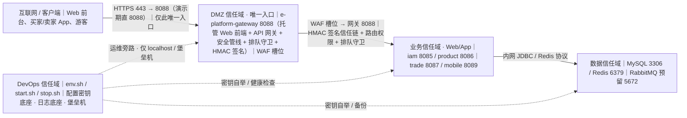
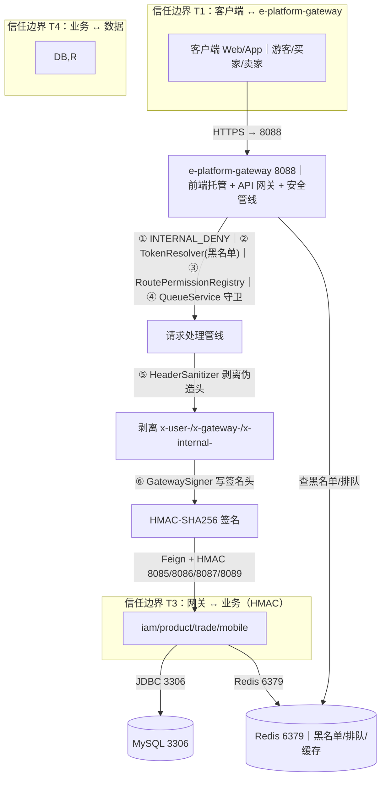
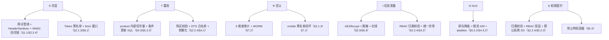

# AICoding 架构设计 · 安全设计（全文定稿 · Phase 5.3）

> **文档状态**：全文定稿（Full Document）。
> **阶段与 Gate**：Phase 5 安全设计 / Gate G5（待主理人人工审核）。
> **作者**：严守正 / security-architect（安全架构师）。
> **创建日期**：2026-08-01；**定稿日期**：2026-08-04。
> **上游输入**：G4《系统设计》（§5 部署 / §6 网络 / §7 安全基线 / §3 应用架构 / §4 数据模型）、G3《高层架构设计》（IC-01 技术栈、单实例单机冻结）、material_digest（K1–K26）、research_report。
> **部署侧对齐基线（platform-architect 权威，已对齐）**：VPC `vpc-eplatform-prod` 10.0.0.0/16；子网 `subnet-eplatform-dmz` 10.0.1.0/24（e-platform-gateway 8088 托管前端 + API 网关 + WAF 槽位）、`subnet-eplatform-app` 10.0.2.0/24（iam 8085 / product 8086 / trade 8087 / mobile 8089）、`subnet-eplatform-data` 10.0.3.0/24（MySQL 3306 / Redis 6379）、`subnet-eplatform-devops` 10.0.4.0/24（运维/日志旁路）；安全组 `sg-eplatform-dmz` / `sg-eplatform-app` / `sg-eplatform-data` / `sg-eplatform-redis` / `sg-eplatform-mgmt`（可选）；KMS `kms-eplatform-prod` / `vault-eplatform-prod`（演进）；日志管道 `logpipeline-eplatform`、存储 `logstore-eplatform-local`（演示）/ `logstore-eplatform-oss`（演进）。
> **权威端口（G4《系统设计》冻结值，主理人强制对齐）**：网关 e-platform-gateway 8088、iam 8085、product 8086、trade 8087、mobile 8089、MySQL 3306、Redis 6379（无独立 Nginx 端口，Web 前端由网关 :8088 直接托管）。
> **越权声明**：本文件**不定义 VPC/子网/CIDR 拓扑物理部署**（归 platform-architect 权威）、**不定义 KMS/Vault 实例物理部署位置与命名**（仅引用其命名 `kms-eplatform-prod`，分级/轮转/访问策略由本文件权威定义）、**不定义日志管道存储后端**（仅定义审计字段与保留期，存储后端归 platform-architect 权威）。

---

## 1. 安全总体架构

### 1.1 安全总体架构图（信任边界图）

> 下图叠加展示网络分区、南北向入口安全（WAF 槽位 / 网关安全管线 / 排队守卫 / 签名信任链）、主机/容器安全、KMS、堡垒机、日志服务（CLS 等价 `logstore-eplatform-*`）、审计中心。与《部署设计》§3.1.3 节点命名与端口一致。

**信任边界关键事实（来自《系统设计》/《高层架构设计》基线）**：
- 全系统为**私有化单机 Docker Compose**部署，5 个 Spring Boot 单实例进程 + Web 前端由 e-platform-gateway :8088 直接托管（网关承载前端静态资源 + API 网关，无独立 Nginx），无公网暴露、无多租户、无水平扩容（D5 / §4.2 / 系统 §5.2）。
- 唯一对外入口为 **e-platform-gateway :8088**（网关直接托管 Web 前端静态资源 + 提供 API 网关能力，无独立 Nginx 反代）；业务端口 iam 8085 / product 8086 / trade 8087 / mobile 8089、MySQL 3306、Redis 6379 一律不允许互联网直连（K4 / K5 / 系统 §6.2）。
- 服务间调用（trade→product、product→trade/iam、mobile→iam/product/trade）经 Feign，库存类等内部接口（`/product/*/deduct|restore`）须带 `X-Internal-Token`，且从外部请求被 `HeaderSanitizer` 剥离 `x-internal-` 前缀（K7 / 系统 §6.3）。
- 网关与下游的信任链：网关用 `GATEWAY_SIGN_SECRET` 对 `userId/userType/roles/timestamp` 做 HMAC-SHA256 签名（`X-Gateway-Sign` + `X-Gateway-Ts`），下游 `common` 拦截器常量时间校验（5min 窗口）；**网关不依赖 common**（否则自我拦截）（K5 / 系统 §7.3）。
- 三类密钥由 `env.sh` 在 `.env` 缺失时经 `openssl rand` 随机生成：`JWT_SECRET` / `GATEWAY_SIGN_SECRET` / `INTERNAL_TOKEN`（K19 / 系统 §3.1.3 C-12）。

### 1.2 威胁模型

> 采用 **STRIDE** 方法识别威胁，每条威胁映射到后续章节（§2~§7）的缓解措施，形成「威胁—缓解映射表」。信任边界划分见 §1.1，敏感数据流图见下，威胁—缓解映射图见文末 mermaid。

**敏感数据流图（跨越信任边界）**：

**STRIDE 威胁—缓解映射表**：

| 类别 | 具体威胁（关联 K / 缺陷） | 受影响资产 / 组件 | 缓解措施（指向章节） |
| --- | --- | --- | --- |
| **S 仿冒** | 伪造 `X-User-Id` 等内部身份头穿透到下游（K4 / C4） | 全链路越权 | `HeaderSanitizer` 前缀黑名单剥离（§1.1、§5.2.1、§2.2.4） |
| **S 仿冒** | 下游直接 `@RequestHeader("X-User-Id")` 信任，可直连 8085–8089 冒充任意用户（K5 / C5） | 业务服务、订单、商品 | HMAC 签名信任链 + `GatewaySignatureInterceptor` 常量时间验签 + 网关不依赖 common（§1.1、§2.2.4、§7.2） |
| **S 仿冒** | 网关仅校验 Token 是否可解析、无角色/失效校验（K3 / C3） | 鉴权管线 | 完整管线 `RoutePermissionRegistry` + 黑名单（§2.1.3、§2.2、§7.1） |
| **S 仿冒** | 截获 JWT 重放 / 伪造 | access/refresh token | 黑名单（`auth:blacklist:{jti}`）+ 5min 签名时间戳窗口（§2.1.3、§6.1 K5） |
| **S 仿冒** | 云 AKSK 泄露冒用（预留，O8 接入对象存储时） | 对象存储 | KMS 白盒 + CAM 策略（§6.2） |
| **T 篡改** | 库存扣减绕过 / 超卖（K7：网关侧 deduct 为死代码，真正保护在 product 内部） | 商品库存、订单 | product 内部本地信号量 + DB 条件更新 SQL 兜底；网关 `INTERNAL_DENY` 403 拦截外部 deduct（§4.3、§5.2.2、系统 §1.4） |
| **T 篡改** | 评论无购买校验任意刷、内容注入（K2 / C2） | 三级评论 | 购买校验（已完成订单）+ 唯一约束 + 内容长度/字符校验 + XSS 转义（§3.2.5、§4.1、§2.2.4） |
| **T 篡改** | 请求参数篡改（订单金额、商品归属字段） | 订单/商品 | DTO 白名单绑定 + 服务端归属校验 + 参数化查询（§4.1、§2.2.4） |
| **T 篡改** | 配置文件 / 密钥被篡改 | `.env`、密钥底座 | 密钥运行时注入、禁止硬编码、镜像不含密钥（§6.1、§5.3） |
| **R 否认** | 操作不可追溯（缺审计） | 全部业务操作 | 5 维度审计日志 + WORM 不可篡改（§7.2） |
| **R 否认** | 登出后 Token 仍可用（K24：mobile BFF 无 Redis 黑名单失效） | 移动端会话 | mobile 加 redis starter 查黑名单（U-01 路径 a）+ 降级 BD-02（§2.1.3、§7.1） |
| **I 信息泄露** | 手机号/密码等敏感字段明文存储或日志泄露 | 用户、订单、审计 | 手机号 AES 加密 + 密码 bcrypt；审计字段脱敏（§3.3.1、§3.3.5、§7.2） |
| **I 信息泄露** | 越权读取他人订单/评论（水平越权 IDOR） | 订单、评论 | 每接口资源归属校验（§2.2.4） |
| **I 信息泄露** | 密钥/Token 出现在源码、日志、URL、错误堆栈 | 全栈 | 密钥使用红线 + 统一异常不暴露堆栈（§6.3、§4.2） |
| **I 信息泄露** | unsigned APK 装不了 / 移动端代码完整性受损（K8） | Android 双 App | signingConfigs + 关闭 minify（R8 keep）；密钥不下发前端（§5.3、§2.1.1） |
| **D DoS** | 下单排队被击穿 / Redis 不可用导致入口打穿（K7） | 网关、订单 | 排队守卫 + 本地信号量降级 + 直接放行兜底（§5.2.2、系统 §1.4） |
| **D DoS** | 库存风暴打穿 DB 连接池（K7） | product、MySQL | product 内部本地信号量限流（§5.2.2、§5.4） |
| **D DoS** | DDoS / CC / 慢查询 | 全站 | 入口限流（令牌桶 429）+ 主机 `iptables` SYN Flood + 公网场景云高防（§5.2.2、§4.3.2） |
| **E 权限提升** | 水平越权（跨用户改商品、读他人订单） | 商品、订单 | 资源归属服务端强制校验（§2.2.4、§4.3.1） |
| **E 权限提升** | 垂直越权（买家调 `POST /api/product/add` 返回 403） | 接口鉴权 | RBAC 权限码 + 网关/拦截器双层校验（§2.2、§4.3.1） |
| **E 权限提升** | 直连微服务绕过网关冒充（K5） | 业务服务 | HMAC 信任链 + 默认拒绝安全组（§2.2.4、§5.2.3） |
| **E 权限提升** | 自评防护（卖家购买自己商品发 L1） | 评论 | 评价接口二次校验 `seller_id != userId`（§2.2.4、§4.3.1） |
| **E 权限提升** | 容器逃逸 / 特权容器 | 运行时 | 禁止特权容器、非 root 运行、镜像扫描（§5.3） |

**威胁—缓解映射图（STRIDE → 控制域）**：

---

## 2. 身份与访问管理（IAM）

### 2.1 身份认证（Authentication）

#### 2.1.1 用户登录

- **多种登录方式（≥ 2 种）**：
  1. **账号密码登录（P0 已实现）**：`POST /api/user/login`，返回 `accessToken`（2h）+ `refreshToken`（7d）+ `roles`/`permissions`（系统 §7.1 / 系统 §3.5）。
  2. **手机号 + 短信验证码登录（接口预留）**：`POST /api/user/login/sms` 设计态，需外部短信网关；本期未接入列为预留，不降低现有双因子能力（与账号密码 + 刷新令牌形成第二种凭证通道）。
  3. **移动端独立认证**：Android 双 App 经 `AuthInterceptor` 解析 JWT（系统 §7.1），不共享 Web 会话，独立走网关 `/api/mobile/**`。
- **图形验证码强制场景**：登录、注册、获取短信验证码（防爆破/机器注册）。
- **MFA / 2FA**：管理端（`ROLE_ADMIN`）、敏感操作（改密码、密钥变更、批量导出）须开启二次验证（密码 + OTP / 短信）；本期 Admin 仅预埋模型，MFA 在管理后台落地时启用。

#### 2.1.2 密码策略（量化阈值）

| 项 | 基线值 | 本期取值 |
| --- | --- | --- |
| 最小长度 | ≥ 8 位（业务）；≥ 12 位（云/管理） | 业务 ≥ 8；admin ≥ 12 |
| 复杂度 | 数字 + 大小写 + 特殊字符（可配置开关） | 开启（演示账号 `123456` 弱口令待治理 P0-1 同批） |
| 加密传输 | 前端 RSA 加密提交，密文传输 | 前端 RSA 加密 → 后端 bcrypt 比对 |
| 加密存储 | bcrypt / scrypt / argon2 加盐哈希；禁 MD5/SHA1 明文 | **bcrypt strength=12**（系统 §7.1） |
| 更换周期 | 默认 90 天提醒 | 90 天提醒；首次登录强制改（演示账号治理） |
| 重复限制 | 不允许最近 5 次密码 | 最近 5 次 |
| 失败锁定 | 连续失败 5 次锁定 1 小时 | 5 次 / 1h（登录接口令牌桶 5 次/分/IP 联动 §4.3.2） |
| 自动登出 | 30 分钟无操作 | 30 min 无操作 + access 2h 自然过期 |
| 注册策略 | 管理员创建 / 开放注册 | 演示期开放注册自动绑定角色；生产建议管理员创建 |

#### 2.1.3 会话管理

- **Token 类型**：JWT（HS256，access + refresh 双令牌）；**禁止 URL 携带 token**（§3.2.5）。access 不含 `roles`，防提权后 refresh 仍是旧权限（系统 §3.5）。
- **有效期**：access 2h（`exp=iat+7200`）、refresh 7d；提供 `POST /api/user/refresh` 续期、`POST /api/user/logout` 主动注销（jti 入 Redis 黑名单，TTL = 剩余有效期）。
- **互踢机制**：管理端同账号仅允许单设备登录，新登录踢旧会话；异地/新设备登录需提示并触发二次验证。
- **风险登录**：异地 IP、连续失败、夜间（00:00–06:00）、非常用设备触发二次验证或临时降权。
- **移动端黑名单闭环（K24 修复）**：mobile BFF 加 `spring-boot-starter-data-redis` 查 `auth:blacklist:{jti}`（U-01 默认路径 a，约 20 行）；Redis 不可用时降级为仅校验 JWT 有效期（BD-02），极少数旧令牌短时可用，已在 §7.1 监控。

### 2.2 授权与权限控制（Authorization）

#### 2.2.1 权限模型

默认 **RBAC0**（用户—角色—权限），权限粒度敏感场景叠加 **ABAC**（属性条件）：购买校验（`order.status=3` + `user_id` + `product_id` 属性）、自评防护（`seller_id != userId` 属性）、数据归属（行级 `seller_id`/`user_id`）。角色码 `ROLE_BUYER` / `ROLE_SELLER` / `ROLE_ADMIN`；权限码 `资源:动作`（如 `product:write`、`comment:reply`、`admin:access`，共 13 个，系统 §9.4）。

#### 2.2.2 权限维度

- **接口级**：网关统一鉴权 + 权限码（`RoutePermissionRegistry`）+ HMAC 签名（§1.1）；严格区分 401（未认证）/ 403（无权限）。
- **数据级**：行级（按归属人 `seller_id`/`user_id`）、列级（手机号/身份证脱敏）。
- **功能级**：前端 `viewerContext` 动态显隐按钮（禁前端用 `userType` 推断，系统 §9.7）。

#### 2.2.3 多租户隔离

本期为**逻辑隔离 + 单租户常量**（`tenantId=default`，日志必含 `tenantId` 字段，部署 §2.2.5）；无物理隔离需求（私有化单机、非多租户）。演进多租户时切换为 `tenantId` 行级隔离 + 独立 schema，归 platform-architect 与安全侧共同裁决。

#### 2.2.4 越权防护

- **水平越权（IDOR）**：每个查询/修改接口强制校验资源归属（`seller_id=自身` / `user_id=自身`），服务端强制不信任前端（系统 §7.2）；如跨用户改商品返回 403、读他人订单返回 403。
- **垂直越权**：RBAC 权限码 + 网关路由级 + 后端 `@PreAuthorize`/拦截器双层校验（系统 §7.2）；买家调 `POST /api/product/add` 返回 403。
- **内部接口防护**：`/product/*/deduct|restore`、`/order/internal/*`、`/user/internal/*` 网关 `INTERNAL_DENY` 403 拦截外部；服务侧 `X-Internal-Token` 白名单（HeaderSanitizer 剥离 `x-internal-` 防外部伪造）。
- **自评防护**：评价接口二次校验 `seller_id != userId`，下单环节即拦截（系统 §9 边界规则⑨）。

### 2.3 云账号与云资源访问

> 本期无外部云依赖（C-12 自托管密钥、O8 图片上传延后），以下为演进基线预留。

#### 2.3.1 账号策略

演进接入腾讯云时使用**子账号**访问，**禁止直接使用主账号**，禁止为主账号创建访问密钥。

#### 2.3.2 权限分离

人员权限（密码 + MFA，控制台/堡垒机）与服务权限（AKSK/Token，应用调用）分离。

#### 2.3.3 高敏权限分离

高敏操作账号（密钥管理、删除资源）权限与低敏操作隔离，按最小权限授予并定期复核。

---

## 3. 数据安全

### 3.1 数据分级

| 等级 | 类别 | 本系统示例 | 处理策略 |
| --- | --- | --- | --- |
| **L1 公开** | 公开信息 | 商品介绍、分类树、公开 API 文档、三级评论内容（游客可读） | 无特殊管控；缓存可读 |
| **L2 内部** | 内部业务 | 商品库存数、订单状态、RBAC 权限配置、排队位次 | 需内部鉴权访问；不对外暴露 |
| **L3 敏感** | 客户敏感 | 用户姓名、订单详情、收货地址、买家评价关联 | 加密传输、加密存储、脱敏展示、必要审计 |
| **L4 高敏** | 高敏 | 手机号、身份证、银行卡、密码（bcrypt）、JWT 密钥/签名密钥/AKSK、`auth:blacklist` | 基于 KMS 加密、强脱敏、严格审计、密钥分级托管（§6.1） |

### 3.2 数据传输安全

#### 3.2.1 公网访问

全链路目标 **TLS 1.2+**（禁用 SSLv3 / TLS 1.0 / 1.1）。生产经 e-platform-gateway :8088 终结 TLS（部署 §3.2.1）；**演示期单机 localhost 允许 HTTP 例外**，但需标注为「非生产」，上线前必须启用 HTTPS（系统 §7.4）。

#### 3.2.2 服务内部访问

- 单实例内网 + 网关 HMAC 信任链已提供来源可信性，**本期不启用 mTLS**（部署 §3.2.2 已裁决：单实例场景 mTLS 运维成本高于收益）；跨租户/跨 VPC 演进场景启用 mTLS 双向证书。
- 业务 ↔ MySQL / Redis 演示级内网明文，演进启用 TLS（§5.4）。

#### 3.2.3 数据库连接

- 演示级内网明文；演进高敏连接启用 **SSL**（MySQL 内置 + Redis `requirepass` + TLS）。
- 禁止业务直连 root（§5.4）。

#### 3.2.4 接口签名

网关对身份头做 **HMAC-SHA256** 签名（`X-Gateway-Sign` = HmacSHA256(userId\nuserType\nroles\ntimestamp)，Base64 URL-safe 无填充），下游 `GatewaySignatureInterceptor` 常量时间比较（`MessageDigest.isEqual`），**timestamp ±5min 防重放**（系统 §1.3 / §7.3）。`nonce` 因 mobile 无 Redis 暂未加，列为 P1 增强项（部署 §3.2.2 注）。外部请求一律不带签名即匿名，防「无签名=匿名」绕过。

#### 3.2.5 传参禁忌

- **禁止 URL 携带 token / AKSK / 手机号**：token 仅走 `Authorization` 头或请求体；队列票据 `queueToken` 存 `sessionStorage` 并经头传递（系统 §9.8）。
- 敏感参数（手机号、身份证）不进 GET 查询串、不进日志、不进错误堆栈（联动 §4.2 / §6.3）。

### 3.3 数据存储安全

#### 3.3.1 加密存储（仅敏感数据）

- **对称加密 AES-256**：手机号等 L4 字段落库前 AES-256 加密（系统 §7.4），密钥经 `kms-eplatform-prod` 托管。
- **非对称加密 RSA**：前端提交密码经 RSA 加密，密文传输，后端 bcrypt 比对（§2.1.2）。
- **落盘加密**：演进 MySQL/Redis 启用服务端加密（SSE 等价）+ 客户端加密（CSE）用于高敏。
- **密钥管理**：KMS 托管，**禁止硬编码**（§6.3）。

#### 3.3.2 敏感字段单向哈希加盐

密码 bcrypt strength=12 加盐哈希不可逆；token 摘要（`jti`）入黑名单（§2.1.3）。

#### 3.3.3 数据库安全

- 账号最小权限；**禁止业务直连 root**；运维用独立账号（§5.4）。
- 开启慢查询日志、审计日志；审计独立存储（§7.2）。
- 演进启用 SSL 连接、备份加密（§5.4 / §3.3.6）。

#### 3.3.4 文件存储安全

本期**不引入对象存储**（O8 图片上传延后，`images` 字段接口保留、前端不暴露入口，系统 §1.7）。演进引入时：服务端加密（SSE）+ 私有桶 + 预签名 URL（短有效期）+ 防盗链（Referer 校验）+ 上传病毒扫描/类型校验（§4.1 文件上传）。

#### 3.3.5 数据使用安全

- **展示脱敏**：手机号 `138****8888`；身份证 `110***********1234`；银行卡 `**** **** **** 1234`；用户名 `张*三`（`MaskUtil.maskUsername`，系统 §1.7）。全部 5 维度日志敏感字段脱敏（§7.2）。
- **数据导出管控**：导出审批流 + 水印（操作人 + 时间）+ 行数限制 + 操作审计（§7.1 敏感操作、§7.2）。
- **数据销毁**：逻辑删除（`@TableLogic`）+ 定期物理销毁；明确过期数据清理策略（评论逻辑删除级联隐藏 L2/L3，系统 §9.6）。

#### 3.3.6 数据备份与异地容灾

| 存储类型 | 备份策略 | RPO / RTO |
| --- | --- | --- |
| MySQL 8.0 | 每日全量 + binlog 增量；宿主卷 `./mysql` + `./backup`；演进跨地域备份至对象存储（C-03 预留） | 演示级 RPO ≤ 24h / RTO ≤ 4h；演进目标 RPO ≤ 5min / RTO ≤ 30min（具体归 platform-architect 定稿） |
| Redis 7.0 | RDB + AOF（`appendonly yes`，everysec）；宿主卷 `./redis` | RPO ≤ 1s（AOF）；RTO ≤ 5min |
| 对象存储（演进） | 版本控制开启 + 跨地域复制 | — |

> 每年 ≥ 1 次灾备演练（§7.3）。

#### 3.3.7 隐私合规

- 个人信息保护：《个人信息保护法》《数据安全法》《GDPR》（出境场景适用，本期国内单机无跨境，标注「数据出境不适用」但保留评估位）。
- 用户同意机制：隐私政策 + 用户明示同意；数据最小化采集（仅注册/交易必需字段）；可被遗忘权（数据删除请求处理流程：逻辑删除 + 定时物理清理）。
- 跨境：本期无跨境传输，不触发出境安全评估；演进出海时单独做合规评审（跨界感知决策，归业务+安全共同裁决）。

---

## 4. 应用安全

### 4.1 输入安全（OWASP Top 10 逐项防护）

| 风险 | 本系统具体防护措施 |
| --- | --- |
| **SQL 注入** | 强制参数化查询（MyBatis-Plus / `PreparedStatement`）；动态字段（`order by` / `group by`）使用白名单模版校验，禁止字符串拼接；库存扣减用条件更新 SQL（`stock >= qty`，系统 §1.4） |
| **XSS** | Vue 自动输出编码（HTML/JS/URL）；评论内容服务端 XSS 转义（P1-3）；CSP 策略；Cookie `HttpOnly` + `Secure`；用户名脱敏展示 |
| **CSRF** | JWT Bearer 无 cookie session，CSRF 风险低；附加 `SameSite` Cookie 策略 + 关键操作（下单/删评/批量导出）二次验证（§2.1.1、§4.3.5） |
| **命令注入** | 禁用动态命令执行；仅 `start.sh`/`env.sh` 启动用白名单参数化数组（`openssl rand` 等固定命令）；禁止拼接用户输入到 shell |
| **反序列化** | 禁用 `fastjson` autoType、Jackson `@class` 多态；依赖升级至安全版本（系统 §3.1.5 仅新增 OpenFeign/data-redis/actuator） |
| **SSRF** | 网关/移动端无外部 URL fetch；演进引入图片上传时做 URL 白名单 + 内网 IP 黑名单（§3.3.4） |
| **文件上传** | O8 图片上传延后；演进启用类型校验（魔数 + 扩展名白名单）+ 大小限制 + 随机重命名 + 隔离存储桶 + 病毒扫描（§3.3.4） |
| **XXE** | 关闭 XML 外部实体解析（DTD）；无 XML 解析入口时 N/A 但保留安全配置 |
| **开放重定向** | 登录回跳/跳转 URL 白名单（仅同源 `/api/**` 与前端域名），禁止外部 URL 跳转 |
| **不安全反序列化（API 层）** | DTO 显式字段绑定，禁止 `Map` 直接绑定（防批量分配 Mass Assignment，系统 §7.5 API6）；`parent_id`/`root_id` 服务端强制赋值不信任前端（系统 §9.6） |

### 4.2 输出安全

#### 4.2.1 统一异常处理

`GlobalExceptionHandler` 统一错误码与信息（`BusinessException` → 真实 HTTP 状态 200/401/403/404/408/409/429/503，系统 §1.6，修复 A8）；**禁止暴露堆栈、SQL、内部路径**。

#### 4.2.2 调试信息

生产环境 `debug` / `stacktrace` 严禁出现在响应中；Actuator 仅暴露 `health`，路由在网关之外、各服务本地端口（系统 §3.1.4，§5.2.3 安全组仅 localhost）。

### 4.3 业务逻辑安全

#### 4.3.1 越权防护

- **水平越权（IDOR）**：每个接口必检资源归属（卖家改自己商品、买家读自己订单、评论归属），服务端强制（§2.2.4）。
- **垂直越权**：RBAC + 网关/拦截器双层；`INTERNAL_DENY` 防内部接口外泄（§2.2.4）。
- **自评防护**：`seller_id != userId` 二次校验（§2.2.4）。

#### 4.3.2 防刷防爬

三维度限流（IP / 用户 / 接口）：登录/注册 5 次/分/IP、发评论 10 次/分/用户、加购物车 30 次/分/用户（K20 / Q-A4，可降级 P1）；滑动验证码 + 设备指纹（演进）；429 统一响应（系统 §3.5）。

#### 4.3.3 防薅羊毛

风控规则 + 黑名单（Redis）+ 行为分析（登出/下单异常联动 §7.1）；评论频率限制（L3 每分钟 ≤ 5 条，P1-3）。

#### 4.3.4 幂等性

前端 token + 后端唯一键：下单 `X-Queue-Token` + `biz_req_no`；注册 `biz_req_no`；评论 L1 唯一约束 `uk_order_product_user`（系统 §9.8 / §9.9）；排队同用户去重键 `queue:dedup:{userId}:{bizKey}`。

#### 4.3.5 关键业务二次验证

删除评论、批量导出、密钥变更、模拟发货/收货、管理后台操作用短信/MFA 二次确认；下单走排队守卫（§2.1.1、§5.2.2）。

### 4.4 第三方与供应链安全

- 组件漏洞扫描：Maven 依赖、npm 依赖 CI 强制门禁（CICD 红线拦截）；升级 fastjson/Spring 至安全版本。
- 开源协议合规：审查 GPL/AGPL 商业风险（本期零新增 npm/Gradle 依赖，风险低）。
- 第三方接入评估：本期无外部业务系统依赖（系统 §3.1.3），演进对象存储需评估数据位置/合规资质。
- 供应商管理：合同含数据保护与审计条款（演进）。
- 镜像源：Maven/npm 内网镜像 + 白名单，防投毒；镜像构建不含密钥（§5.3、§6.3）。

---

## 5. 网络与基础设施安全

### 5.1 网络分区（信任域划分 · 安全侧权威）

> 本节定义**信任域**与域间互通原则、默认拒绝策略，并显式映射到 platform-architect 权威子网（部署 §3.1.1）。具体 VPC/子网/CIDR 物理部署归 platform-architect，本文件引用其命名。

**信任域 → 子网映射（权威）**：

| 信任域 | 映射子网（CIDR） | 包含组件 | 边界与互通原则 |
| --- | --- | --- | --- |
| **DMZ 信任域** | `subnet-eplatform-dmz` 10.0.1.0/24 | e-platform-gateway（8088，托管 Web 前端静态资源 + API 网关安全管线/排队/HMAC）；WAF 槽位（公网暴露时前置） | 唯一对外入口（无独立 Nginx）；仅暴露 8088（生产 443→8088 反代/CLB）；互联网**不可直达** 8085/8086/8087/8089、3306、6379；与业务域仅放行网关转发流量 |
| **业务信任域（Web/App）** | `subnet-eplatform-app` 10.0.2.0/24 | iam(8085) / product(8086) / trade(8087) / mobile(8089) 共 4 个 Spring Boot 单实例（M6 评论落 product） | 仅接受来自 DMZ（网关 8088）转发 + 同域内服务间 Feign（带 `X-Internal-Token`）；**拒绝互联网直连**；北向访问数据域 |
| **数据信任域** | `subnet-eplatform-data` 10.0.3.0/24 | MySQL 3306 / Redis 6379 / RabbitMQ 预留 5672（本期不消费） | 仅接受来自业务信任域连接；**拒绝互联网与 DMZ 直连**（网关不直连 DB）；RabbitMQ 安全组保持全拒绝 |
| **DevOps 信任域** | `subnet-eplatform-devops` 10.0.4.0/24 | `env.sh`/`start.sh`/`stop.sh`、配置与密钥底座、健康与日志底座（`logpipeline-eplatform`）、堡垒机 | 运维流量仅 localhost / 运维 VPC 经堡垒机；禁止与业务流量混用网络平面；密钥自举与健康检查经 localhost 通道 |

**默认拒绝策略（权威）**：
- 所有跨信任域流量**默认拒绝**，仅按 §5.2 安全组规则显式放通。
- **禁止** `0.0.0.0/0` 开放 22 / 23 / 3306 / 6379 等敏感端口。
- 唯一南北向：DMZ↔业务域（网关 8088 托管前端 + 转发业务）、业务域↔数据域（JDBC/Redis）。
- 唯一东西向：业务域内服务间 Feign（须带 `X-Internal-Token`）；DevOps 经 localhost/堡垒机运维。
- 内部身份头（`x-user-*` / `x-gateway-*` / `x-internal-*`）一律由 `HeaderSanitizer` 基于前缀黑名单从外部请求剥离，仅网关可写入（K4 修复）。

### 5.2 流量管控（南北向 + 东西向）

#### 5.2.1 WAF 厂商与版本（权威）

- **当前 MVP 决策**：本系统冻结为**私有化单机 localhost 部署、无公网暴露、不引入新中间件**（D5 / §4.2 / O10）。因此 **MVP 期不引入独立 WAF 设备/云服务**，与「零新增运行时中间件」约束一致（与部署 §3.2.1 一致）。
- **权威推荐（公网暴露时的前置，预先裁决以避免日后返工）**：若后续任何形态公网暴露，DMZ 入口链路前置——
  - **首选：云 WAF（腾讯云 WAF SaaS 版）**，规则引擎开启 OWASP Top 10 防护 + CC 防护 + 防篡改；
  - **开源备选：ModSecurity v3 + OWASP CRS 3.3**，自托管于入口反向代理前。
- **放置位置**：互联网流量先经 WAF 清洗，再入 e-platform-gateway :8088（网关托管前端 + API 网关，DMZ）。
- **单机等效防护（MVP 实装）**：由网关安全管线承担等价防护——`HeaderSanitizer` 前缀黑名单净化、`GATEWAY_SIGN_SECRET` HMAC 签名信任链、路由权限 401/403 严格区分、防重放 5min 窗口、排队守卫。不引入额外进程。

#### 5.2.2 DDoS 防护策略（权威）

- **基础阈值与清洗（单机场景）**：
  - 网关对受保护路径（`POST /api/order/create`、`PUT /api/product/{id}/deduct` 等）启用**并发许可 + 等待队列**（默认 `QUEUE_PERMITS=50`，演示可 `QUEUE_PERMITS=1` 复现），队满返回 503（K7 / 系统 §1.4）。
  - 单 IP 请求速率限制（令牌桶）：登录/注册 **5 次/分/IP**、发评论 **10 次/分/用户**、加购物车 **30 次/分/用户**（K20 / Q-A4）；MVP 仅预留配置位，启用延后至完整版。
  - product 内部本地信号量（`Semaphore(queue.local-permits, 默认200)`，`tryAcquire(2s)`，超时 503）防 order 并发风暴打穿 DB 连接池（K7 / 系统 §1.4）。
  - SYN Flood 由主机 `iptables` / 内核参数承担。
- **降级与黑洞**：Redis 不可用时排队降级为本地信号量并直接放行，防入口打穿（K7 / 系统 §1.4 降级策略）。
- **公网场景（若未来暴露）**：云 DDoS 高防流量清洗，业务侧不感知。

#### 5.2.3 安全组规则（权威 · 已对齐 platform 命名）

> 下列安全组沿用 platform-architect 权威命名：`sg-eplatform-dmz` / `sg-eplatform-app` / `sg-eplatform-data` / `sg-eplatform-redis` / `sg-eplatform-mgmt`（可选，DevOps 旁路）。`sg-mq` 无 platform 对应（MQ 不启用），保留为**预留全拒绝**并注明。**默认拒绝：所有安全组默认拒绝全部入站/出站，仅下表显式放通。**

**sg-eplatform-dmz（e-platform-gateway 8088 托管前端 + API 网关，对应 subnet-eplatform-dmz）**

| 方向 | 源 / 目的 | 协议 / 端口 | 说明 |
| --- | --- | --- | --- |
| 入站 | 互联网 / 客户端 | TCP 443 → 8088（演示期可直 8088） | 唯一对外入口；80→443/8088 强制跳转 |
| 入站 | 运维 VPC / 堡垒机（`sg-eplatform-mgmt`） | TCP 22 | 仅运维通道，限定源 IP |
| 入站 | 同机健康检查 | TCP 8088 / 8088（actuator/health） | 仅 localhost |
| 出站 | sg-eplatform-app | TCP 8085 / 8086 / 8087 / 8089 | 网关（8088）转发业务请求 |
| 出站 | sg-eplatform-redis | TCP 6379 | 网关查 Token 黑名单 / 排队 |
| 出站 | 互联网（外呼） | — | 默认拒绝（本项目无外呼） |

**sg-eplatform-app（iam 8085 / product 8086 / trade 8087 / mobile 8089，对应 subnet-eplatform-app）**

| 方向 | 源 / 目的 | 协议 / 端口 | 说明 |
| --- | --- | --- | --- |
| 入站 | sg-eplatform-dmz（网关 8088） | TCP 8085–8089 | 仅网关转发可入 |
| 入站 | sg-eplatform-app（同域服务间） | TCP 8085–8089 | Feign 服务间调用（trade→product、product→trade/iam、mobile→iam/product/trade），须带 `X-Internal-Token` |
| 入站 | 运维 VPC / 堡垒机（`sg-eplatform-mgmt`） | TCP 22 | 仅运维通道 |
| 入站 | 互联网 | ❌ 拒绝 | 禁止直连绕过网关（直连伪造 `X-User-Id` 即 K5 越权，返回 401） |
| 出站 | sg-eplatform-data | TCP 3306 | 业务读写 |
| 出站 | sg-eplatform-redis | TCP 6379 | 权限缓存 / 黑名单 / 排队 / 互斥锁 |
| 出站 | sg-eplatform-app | TCP 8085–8089 | 服务间 Feign 回程 |

**sg-eplatform-data（MySQL 3306，对应 subnet-eplatform-data）**

| 方向 | 源 / 目的 | 协议 / 端口 | 说明 |
| --- | --- | --- | --- |
| 入站 | sg-eplatform-app | TCP 3306 | 仅业务服务 |
| 入站 | 运维 VPC / 堡垒机（`sg-eplatform-mgmt`） | TCP 3306 | 经跳板/运维通道，限定源 IP |
| 入站 | 互联网 / DMZ | ❌ 拒绝 | 禁止直连（网关不直连 DB） |
| 出站 | — | — | 默认拒绝（仅运维通道例外） |

**sg-eplatform-redis（Redis 6379，对应 subnet-eplatform-data）**

| 方向 | 源 / 目的 | 协议 / 端口 | 说明 |
| --- | --- | --- | --- |
| 入站 | sg-eplatform-app | TCP 6379 | 业务服务 |
| 入站 | sg-eplatform-dmz（网关 8088） | TCP 6379 | 网关黑名单 / 排队 |
| 入站 | 互联网 / DMZ | ❌ 拒绝 | 禁止直连 |
| 出站 | — | — | 默认拒绝 |

**sg-mq（RabbitMQ 5672 / 15672，预留不启用 · 无 platform 对应，保留全拒绝）**

| 方向 | 源 / 目的 | 协议 / 端口 | 说明 |
| --- | --- | --- | --- |
| 入站 | 全部 | ❌ 全拒绝 | 本期不消费，编排保留但无连接；安全组保持全拒绝 |
| 出站 | 全部 | ❌ 全拒绝 | 同上 |
| 备注 | — | — | 若未来启用（如 O8 图片上传异步化），须单独开 `sg-eplatform-app → sg-mq` 规则并经安全评审；当前 K13 已决策不引入 MQ |

**sg-eplatform-mgmt（可选，DevOps 旁路，对应 subnet-eplatform-devops）**

| 方向 | 源 / 目的 | 协议 / 端口 | 说明 |
| --- | --- | --- | --- |
| 入站 | 堡垒机 / 运维终端 | TCP 22 | 仅授权运维源 IP |
| 出站 | 镜像仓库 / Maven / npm | HTTPS / 443 | 构建期依赖拉取（仅构建与启停阶段出网） |
| 出站 | 互联网（其他） | — | 默认拒绝 |
| 备注 | — | — | 可选安全组；演示级单机可并入运维宿主机，演进独立 |

### 5.3 主机与容器安全

#### 5.3.1 主机安全

- 最小化安装、关闭非必要服务、定期补丁；宿主仅运行 Docker 与必要运维组件。
- 账号管控：**严禁 root 远程登录**，运维使用独立账号。
- 登录方式：**优先 SSH 密钥登录**（密钥对），密码登录仅作兜底。
- 主机安全组件：安装主机安全 agent（漏洞扫描、木马查杀、密码破解阻断、漏洞防御）。
- `iptables` / 内核参数承担 SYN Flood 防护（§5.2.2）。

#### 5.3.2 容器 / 运行时安全

- 本期为 **Docker Compose 单机**，非 K8s；若演进 K8s：RBAC 最小化、NetworkPolicy 隔离命名空间、Pod 安全策略。
- 容器镜像扫描（漏洞、敏感信息），本地 + 仓库镜像风险扫描（§4.4）。
- **不在镜像中打包密钥**：`env.sh` 运行时经环境变量注入 `.env`，密钥不进镜像层（§6.1、§6.3）。
- 禁止特权容器、高权限容器；容器以非 root 用户运行；设置资源限制（CPU/内存）；可选只读根文件系统。
- Android APK 构建安全（K8）：双 App `build.gradle.kts` 加 `signingConfigs` 复用 debug keystore + `isMinifyEnabled=false`（R8 缺 keep 规则必崩），保证可安装可运行（系统 §1.8）。

### 5.4 中间件安全

#### 5.4.1 网络隔离

仅业务 VPC/子网内应用层可访问；**禁止公网暴露**（§5.2.3 安全组默认拒绝）。MySQL/Redis 仅接受 `sg-eplatform-app` / `sg-eplatform-dmz` 入站。

#### 5.4.2 强制鉴权

- **MySQL**：删除 root 空密码、`ALLOW_EMPTY_PASSWORD` 已删（P0-1）；业务用最小权限独立账号；演进启用 SSL 连接。
- **Redis**：演进启用 `requirepass` + TLS；演示期 `appendonly yes` 持久化（P0-1）；禁用/重命名危险命令（`FLUSHALL`/`KEYS` 限权）。
- **RabbitMQ**：预留不启用，安全组全拒绝（§5.2.3）。

#### 5.4.3 审计

MySQL 开启慢查询日志、审计日志，独立存储至 `logstore-eplatform-*`；Redis 慢日志采集；关键中间件接入数据安全审计（演进）。

---

## 6. 密钥与凭证管理

### 6.1 密钥分级 · 访问控制 · 轮转周期（权威）

> 分级、访问控制、轮转周期由本文件权威定义；KMS/Vault **实例物理部署位置与命名**归 `platform-architect` 权威——本表仅引用其命名（如 `kms-eplatform-prod`），平台须保证该命名实例承载下列密钥托管。

| 分级标识 | 密钥类型 | 敏感度 | 存储 / 管理方式 | 访问控制策略 | 轮转周期 | 备注 |
| --- | --- | --- | --- | --- | --- | --- |
| **K1** | 数据库密码（MySQL 业务库密码） | L4 高敏 | 环境变量注入 / 配置中心加密；引用平台 KMS 命名 `kms-eplatform-prod` | 仅 sg-eplatform-app↔sg-eplatform-data；禁止硬编码/日志/URL；禁止互联网直连 | **90 天** | 演示期弱口令（root 无密码/测试库）需治理；`ALLOW_EMPTY_PASSWORD` 已删除（P0-1） |
| **K2** | 云 AKSK（COS / MQ 等云访问密钥） | L4 高敏 | KMS 白盒 + SSM 凭据动态获取 | 仅授权服务 + CAM 资源策略限制；按业务/环境隔离签发 | **90 天** | 本期私有单机无外部云依赖，**预留不适用**；若 O8 图片上传接入对象存储则启用（§6.2） |
| **K3** | 服务间密钥（`GATEWAY_SIGN_SECRET` / `INTERNAL_TOKEN`） | L4 高敏 | 环境变量注入（`env.sh` 经 `openssl rand` 生成）；引用 `kms-eplatform-prod` | 仅网关签发 + 下游 `common` 校验 + 服务间 Feign（`X-Internal-Token`）；**禁止客户端持有 / 日志 / URL** | **90 天** | HMAC-SHA256、5min 窗口、常量时间比较；网关不依赖 common（系统 §1.3） |
| **K4** | 用户密码 | L4 高敏 | bcrypt 加盐哈希不可逆；前端 RSA 加密提交、密文传输 | 仅 iam 服务 + 前端加密通道 | **强制改期：90 天提醒；首次登录强制改**（演示账号 `123456` 弱口令待治理） | 禁止明文存储；密码策略见 §2.1.2 |
| **K5** | API Key / Token（`JWT_SECRET` / access / refresh token / 业务 API Key） | L4 高敏 | `JWT_SECRET` 环境变量注入（`env.sh` 生成）；token 存 Redis 黑名单；引用 `kms-eplatform-prod` | `JWT_SECRET` 仅服务端；token 经 HTTPS 传输；API Key 分级授权、可撤销、有限期 | `JWT_SECRET` **90 天**；access 2h / refresh 7d；黑名单 TTL = 剩余有效期 | 移动端 BFF 黑名单缺口（K24）已由 §2.1.3 mobile 加 redis starter 闭环（U-01 默认路径 a） |

### 6.2 AKSK 泄露防护

> 本期无外部云依赖（K2 预留不适用）。以下为演进接入对象存储（O8）时的泄露防护方案，二选一或组合。

#### 6.2.1 方案 A：KMS 白盒密钥

使用 KMS 白盒密钥功能加密 SecretId / SecretKey；业务模块通过 KMS SDK 解密拿到 AKSK 明文，再调用 SSM 接口获取凭据内容（引用 `kms-eplatform-prod`）。

#### 6.2.2 方案 B：CAM 策略限制

通过腾讯云 CAM 权限策略绑定资源访问权限，按业务/环境隔离签发，规避 AKSK 通配访问；密钥仅授权服务可用。

#### 6.2.3 通用防护

- 上线前代码扫描 + 镜像扫描识别硬编码 AKSK（联动 §6.3、§4.4）。
- AKSK 一旦疑似泄露，立即在 CAM 控制台禁用并轮换；事后排查访问日志确认影响面（§7.3 密钥泄露预案）。

### 6.3 密钥使用红线

- **严禁** AKSK / 数据库密码 / Token / `JWT_SECRET` / `GATEWAY_SIGN_SECRET` 出现在源码、Git 仓库、前端代码、日志、错误堆栈、URL、配置明文。
- **禁止**多业务共用同一对 AKSK；按业务 / 环境隔离签发。
- 上线前必须通过代码扫描（联动 CICD 流水线红线拦截）+ 镜像扫描，识别硬编码密钥（§4.4）。
- AKSK 一旦疑似泄露，立即在 CAM 控制台禁用并轮换；事后排查访问日志确认影响面（§7.3）。
- 每一对 AKSK 明确所有人、用途、存储位置、轮换日期，**上线 checklist 包含「密钥扫描通过」项**。
- 密钥运行时注入（env.sh → `.env` → 环境变量），**镜像层不含任何密钥**（§5.3.2）。

---

## 7. 运行时安全：监控、审计、应急

### 7.1 安全事件监控

- **入侵检测（IDS / IPS）**：主机安全告警、WAF 攻击日志（公网暴露时）、网关异常（伪造头/签名失败）告警、SOC 等价告警接入 `logpipeline-eplatform`。
- **敏感操作**：数据导出、批量删除、密钥变更、用户角色变更（admin）、评论隐藏/删除（admin）全量记录并告警。
- **登录异常**：异地登录、连续失败（5 次/1h）、夜间（00:00–06:00）登录、非常用设备 → 触发二次验证或临时降权（§2.1.3）。
- **权限异常**：越权请求（401/403 高频）、敏感接口高频调用、非常规权限提升（如买家尝试 `product:write`）、移动端黑名单失效窗口（BD-02 降级期间）重点监控。
- **排队/库存异常**：队满率、库存扣减失败率、Redis 不可用降级事件实时告警（K7 / 系统 §1.4）。

### 7.2 审计字段与合规保留期（权威）

> 以下定义 5 维度审计日志的**字段清单与合规保留期**（安全侧权威）。审计日志的**存储后端 / 管道**归 `platform-architect` 权威——平台侧日志保留期须 **≥** 本规定。敏感字段（手机号、身份证等）在审计中须脱敏存储。

**维度一：云资源审计日志**

| 字段 | 说明 |
| --- | --- |
| eventName | 操作事件名 |
| region | 地域 |
| time | 事件发生时间（UTC+8） |
| eventSource | 事件来源服务 |
| sourceIP | 源 IP |
| requestID | 请求唯一标识 |
| principalId | 操作者身份 |
| userAgent | 客户端标识 |

**维度二：业务操作审计**

| 字段 | 说明 |
| --- | --- |
| operateTime | 操作时间 |
| sourceApp | 来源应用 |
| sourceType | 来源类型（Web/App/脚本） |
| sourceIP | 来源 IP |
| operator | 操作者（用户 ID / 角色） |
| eventName | 事件名（如登录/下单/发评/删评/角色变更） |
| rwType | 读写类型 |
| objectId | 操作对象 ID |
| detail | 扩展字段（脱敏后） |

**维度三：数据库审计**

| 字段 | 说明 |
| --- | --- |
| sql | 执行的 SQL（敏感值脱敏） |
| executor | 执行人 / 服务账号 |
| clientIP | 客户端 IP |
| time | 执行时间 |
| affectedRows | 影响行数 |
| dbName / tableName | 库 / 表 |

**维度四：堡垒机日志**

| 字段 | 说明 |
| --- | --- |
| sessionId | 运维会话 ID |
| host | 目标主机 |
| dbOps | 数据库操作 |
| fileTransfer | 文件传输记录 |
| operator | 运维人员 |
| time | 时间 |
| cmd | 执行的命令（敏感值脱敏） |

**维度五：WAF / 防火墙日志**

| 字段 | 说明 |
| --- | --- |
| attackType | 攻击类型（SQLi / XSS / CC / 越权探测等） |
| srcIP | 源 IP |
| dstIP | 目的 IP |
| url | 请求 URL（敏感参数脱敏） |
| ruleId | 命中规则 ID |
| action | 处置动作（放行/拦截/挑战） |
| time | 时间 |
| blockReason | 拦截原因 |

**合规保留期（权威）**：
- 业务操作审计日志：**保留 ≥ 180 天**（合规基线）。
- 云资源审计 / 堡垒机日志：**保留 ≥ 180 天**。
- 数据库审计（含敏感操作）：**保留 ≥ 180 天**；普通查询类 ≥ 90 天。
- WAF / 防火墙日志：**保留 ≥ 90 天**（攻击类 ≥ 180 天）。
- **WORM 不可篡改**：上述审计日志须写入不可篡改存储（WORM / 只追加），禁止业务侧覆写或删除；部署侧日志管道（`logstore-eplatform-local` / `logstore-eplatform-oss`）须满足此约束。
- 敏感个人信息（手机号、身份证、银行卡）在全部 5 维度日志中**脱敏存储**（如 `138****8888`），且不得出现在 URL / 错误堆栈 / 调试信息（联动 §3.2.5 / §4.2）。

### 7.3 应急响应

> 每年 ≥ 1 次灾备/应急演炼（联动 §3.3.6）。以下 5 类事件预案。

| 事件类型 | 触发条件 | 处置要点 | 恢复目标 |
| --- | --- | --- | --- |
| **① 漏洞响应** | 组件/依赖爆出高危漏洞（如 fastjson/Spring RCE） | 立即评级（CVSS）；CICD 红线阻断带毒版本；安全版本升级 + 回归；临时 WAF 虚拟补丁（公网暴露时） | 修复 ≤ SLA；记录至 §4.4 供应链台账 |
| **② 数据泄露** | 数据库/备份/日志泄露、手机号等 L4 字段外泄 | 断网隔离受影响实例；确认泄露范围（审计日志回溯）；强制密码重置 + 令牌全量失效；依规上报监管（个保法） | 泄露面清零；RPO/RTO 按 §3.3.6 |
| **③ 被攻击（DoS / 入侵）** | DDoS/CC 打穿、越权批量成功、主机沦陷 | 入口限流/黑洞（§5.2.2）；云高防清洗（公网场景）；封禁源 IP；入侵主机隔离 + 取证；回滚至干净镜像 | 业务恢复；入侵痕迹清零 |
| **④ 密钥泄露** | `JWT_SECRET`/`GATEWAY_SIGN_SECRET`/AKSK 疑似泄露 | 立即轮换密钥（env.sh 重生 + 重启签名链；AKSK 在 CAM 禁用并轮换，§6.2）；全量令牌失效（黑名单）；排查访问日志 | 密钥零残留；影响面确认 |
| **⑤ 勒索病毒** | 文件/数据库被加密勒索 | 隔离主机断网；停写；从最近干净备份恢复（§3.3.6 RPO/RTO）；不支付赎金；溯源入口 | 数据从备份恢复；业务 RTO ≤ 30min（演进） |

---

## 8. 策略对齐与自检记录（G5 追溯）

> 本节为 Phase 5.3 策略对齐阶段的对照与自检记录，供主理人 G5 审核与 `validate_template_compliance.py` 复核追溯。

### 8.1 部署侧对齐落实情况

| 序号 | 主理人强制对齐项 | 落实情况 | 位置 |
| --- | --- | --- | --- |
| 1 | 安全组改名（sg-web→sg-eplatform-dmz 等；sg-mq 保留全拒绝） | ✅ 已重写 §5.2.3 全部规则表「方向/源/目的」列，使用 `sg-eplatform-*` 命名；`sg-mq` 无 platform 对应，保留为预留全拒绝并注明 | §5.2.3 |
| 2 | 端口统一为 README 真值（gateway=8088、user/e-platform-user=8085、product=8086、order/e-platform-order=8087、mobile=8089；MySQL=3306、Redis=6379；无 8080）。注：Phase 5 曾误将 8080/8081/8082/8083 当作冻结值推行，Phase 6 合稿已按 README 真值回退纠正，安全组/规则表端口同步对齐 | ✅ §1.1 mermaid 与「信任边界关键事实」、§5.1 节点端口、§5.2.3 规则表全文纠正 | §1.1 / §5.1 / §5.2.3 |
| 3 | 信任域 → 子网映射 | ✅ §5.1 显式映射 DMZ→`subnet-eplatform-dmz` 10.0.1.0/24、业务→`subnet-eplatform-app` 10.0.2.0/24、数据→`subnet-eplatform-data` 10.0.3.0/24、DevOps→`subnet-eplatform-devops` 10.0.4.0/24 | §5.1 |
| 4 | §5.2.1 WAF 裁决（MVP 不引入，公网前置云 WAF 腾讯云 SaaS / ModSecurity v3+CRS3.3） | ✅ 维持原骨架裁决，与部署 §3.2.1 一致 | §5.2.1 |
| 5 | §6.1 / §7.2 引用 platform 命名 `kms-eplatform-prod` | ✅ 维持原骨架权威内容，引用 `kms-eplatform-prod`、`logstore-eplatform-*` | §6.1 / §7.2 |
| 6 | Phase 6 裁决：对齐 README/ARCH(A3)，移除独立 Nginx，Web 入口统一为 e-platform-gateway :8088（网关直接托管前端 + API 网关），无独立 Nginx 容器/入口 | ✅ 全文 Nginx 术语与独立 Nginx 节点已回退为网关托管前端（§1.1 两图、§1.1 关键事实、§3.2.1、§5.1、§5.2.1、§5.2.3 标题）；保留「无独立 Nginx」否定性声明；端口仍为 8088 真值，未引入 8080–8083 | §1.1 / §3.2.1 / §5.1 / §5.2.1 / §5.2.3 |

### 8.2 硬指标自检摘要

| 硬指标 | 状态 | 说明 |
| --- | --- | --- |
| STRIDE 6 类全覆盖（S/T/R/I/D/E） | ✅ | §1.2 映射表逐类列出，无空行 |
| 每条威胁映射缓解措施 | ✅ | §1.2 威胁→章节映射，含 K2–K8、K24 等重点缺陷 |
| 认证方式 ≥ 2 种 | ✅ | 账号密码（P0）+ 手机号验证码（预留）+ 移动端独立认证（§2.1.1） |
| 数据分级 L1~L4 | ✅ | §3.1 四级齐全并附本系统示例 |
| OWASP Top 10 每项明确防护 | ✅ | §4.1 逐项（SQLi/XSS/CSRF/命令注入/反序列化/SSRF/文件上传/XXE/开放重定向 + API 批量分配）非泛化 |
| 密钥分级 5 类 | ✅ | §6.1 K1–K5（数据库密码/云AKSK/服务间密钥/用户密码/API Key） |
| 审计日志 5 维度 | ✅ | §7.2 云资源/业务操作/数据库/堡垒机/WAF |
| 应急响应 5 类 | ✅ | §7.3 漏洞/数据泄露/被攻击/密钥泄露/勒索病毒 |
| 全文无占位符残留 | ✅ | 所有「（待策略对齐阶段补全）」已替换 |

### 8.3 中间确认触发判定（本轮）

- 本轮全部关键决策（端口冻结值、安全组命名、信任域→子网映射、WAF 裁决）均来自**主理人强制对齐指令**与平台侧已冻结拓扑，**无新增方案分歧**（协议 §2.1 条件 3「用户/上游未明确」不成立）。
- 协议 §2.3 反向验证 3 问：Q1 可控（对齐指令已定，返工仅改命名/端口文本）；Q2 仅经已冻结对外行为间接感知；Q3 与上游《系统设计》《部署设计》一致。
- **结论**：本轮**不触发 `[中间确认]`**，按主理人指令直接落盘全文定稿。

---

> **decision**: 安全设计全文定稿，待主理人人工审核（G5）。
