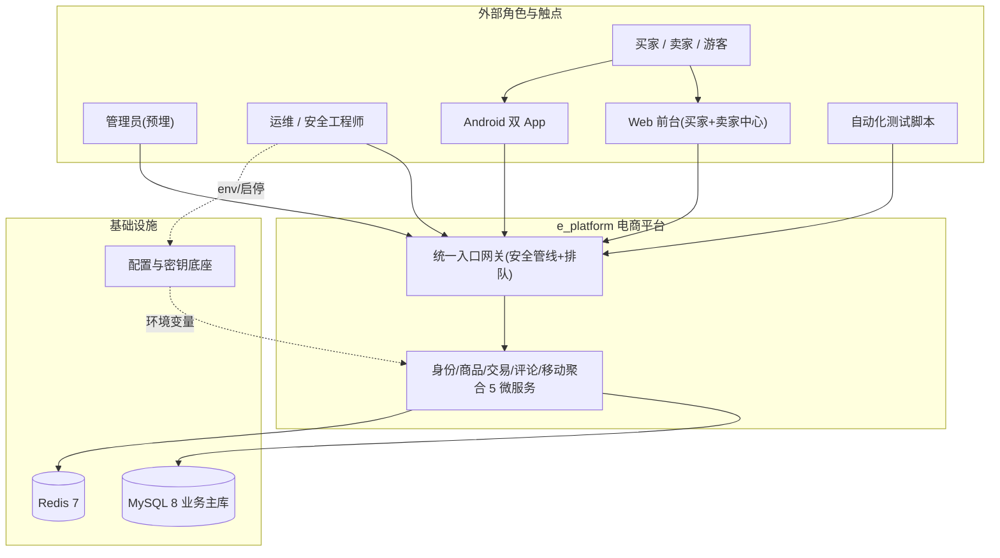
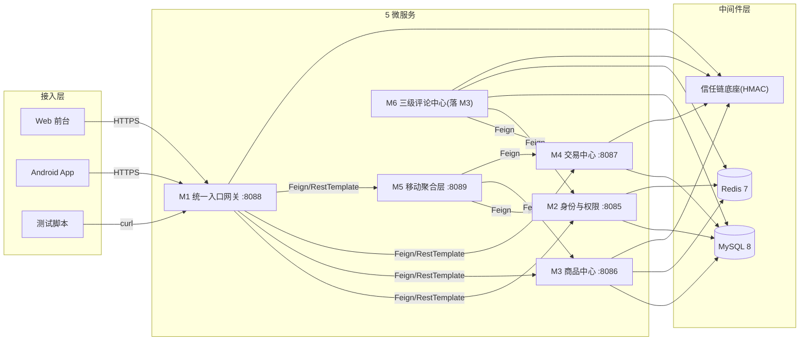
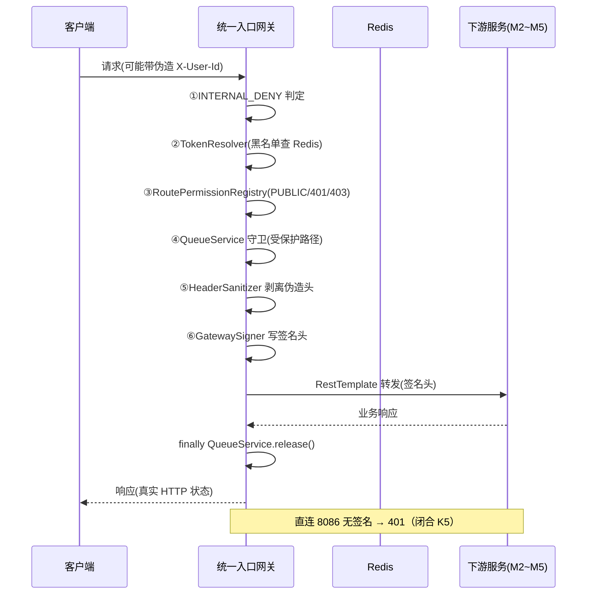
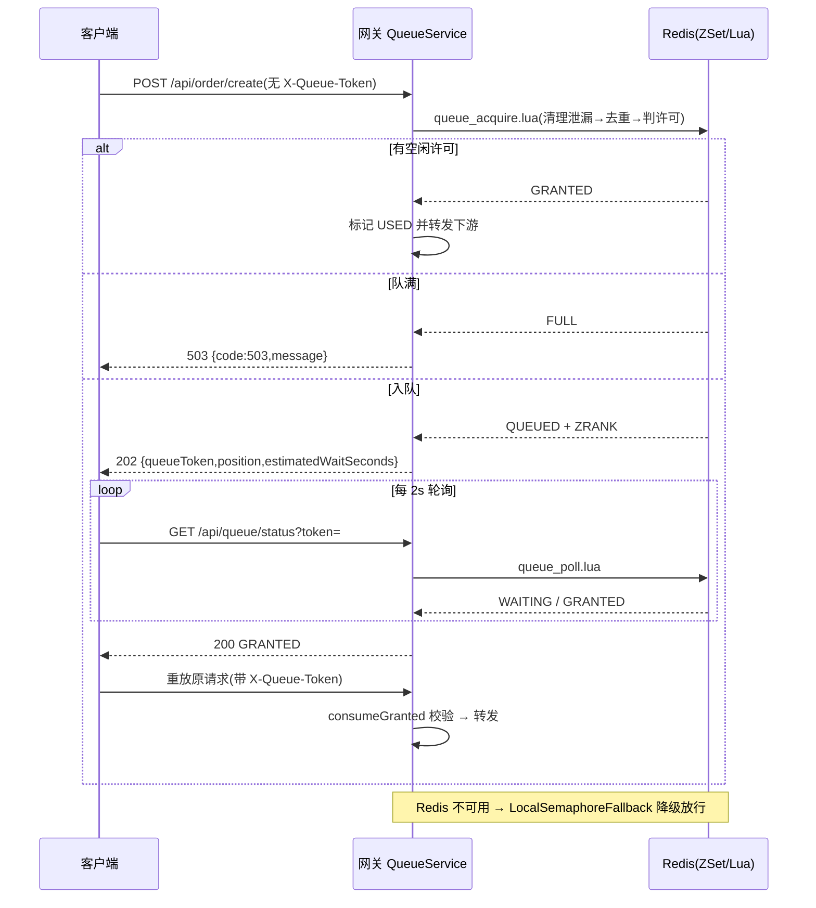
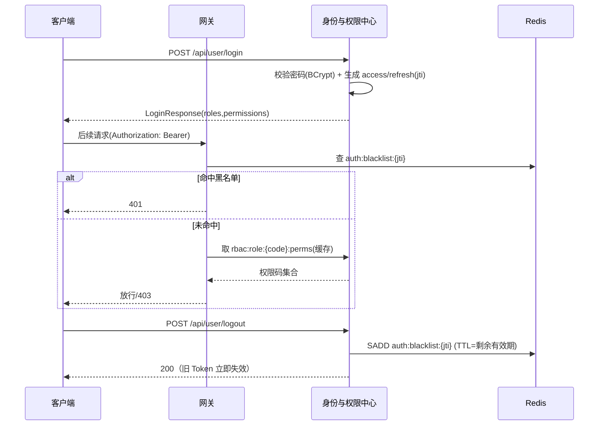
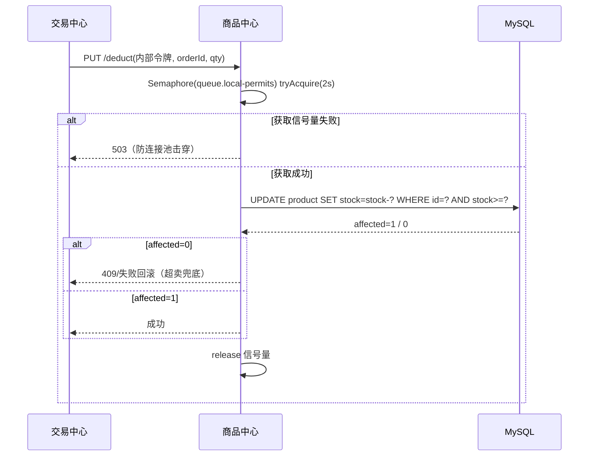
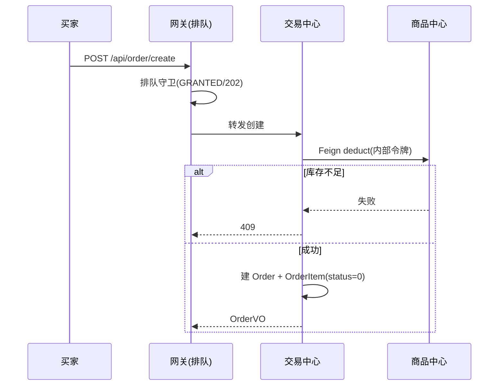
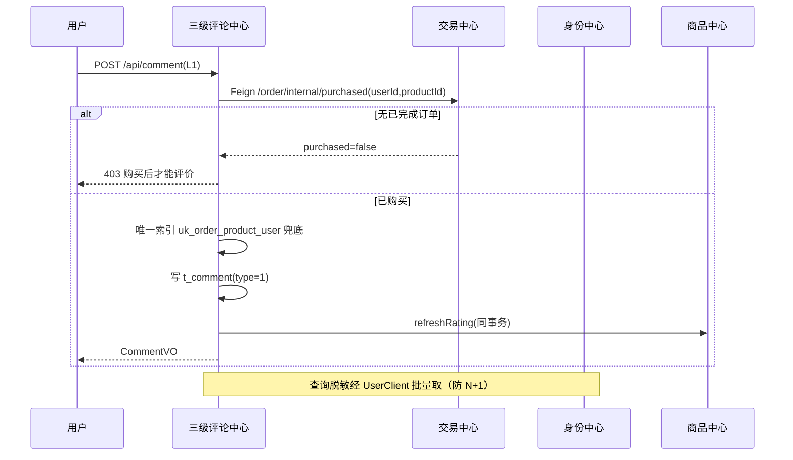
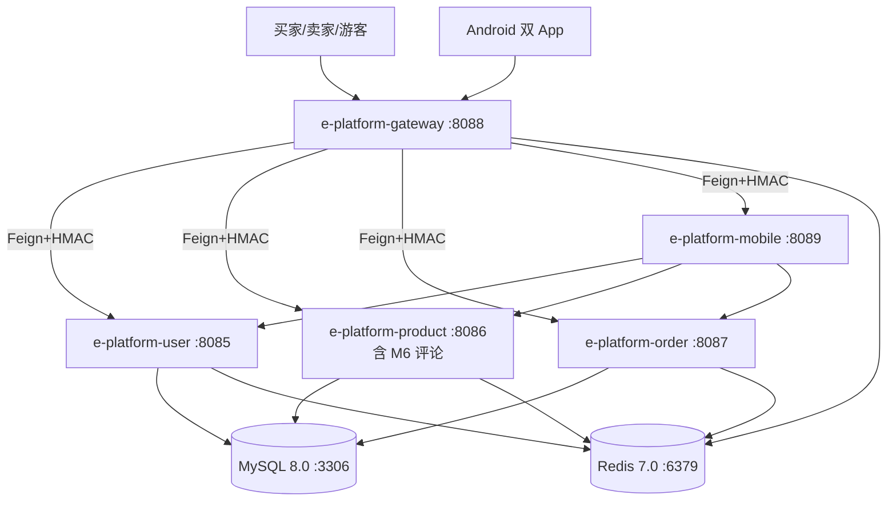

# AICoding 架构设计 · 系统设计

> 本文档为《AICoding 架构设计》核心产物之一，对应**系统架构设计模版**。
> 上游输入：《高层架构设计》产出的业务架构、系统定位、能力盘点、MVP 范围、角色场景与功能清单（G3 已通过，全文冻结）；
> 下游输出：用于驱动《部署设计》《安全设计》《UserStory》的实施。
> **技术底座锁定**：经中间确认 IC-01 裁决，本期运行底座为 **Spring Boot 3.x + Spring Cloud 2023.x + JDK 21**（含 `javax`→`jakarta` 全量改包、Spring Security 配置重写）。

> **权责边界（系统架构师）**：本文档冻结的是**模块拆分、接口契约、数据模型、一致性等级、缓存约定、可观测基线**。不决定业务边界/产品范围（归 business-architect，已冻结）；不规定资源规格与运行时拓扑（归 platform-architect）；不输出完整安全方案（归 security-architect，本文 §7 仅给机制选择与关键参数基线）；不进入部署/安全阶段。

---

## 0. 元信息：修订记录

| 文档版本 | 发布日期 | 修订人 | 修订说明 |
| --- | --- | --- | --- |
| v1.0 | 2026-08-01 | 高见远（system-architect） | 初稿：基于 G3 已冻结《高层架构设计》产出完整系统设计，技术选型锁定 Spring Boot 3.x + Spring Cloud 2023.x + JDK 21 |

**填写要求**：每次评审通过新增一行；修订说明必须能定位到具体章节，禁止"细节优化 / 调整内容"等不可验证表述。

---

## 1. 引言

### 1.1 文档目标

- **一句话定位**：本文档定义 e_platform 电商平台（增量代号：可信交易与购后互动增强）在交付物中的所有架构设计相关产物，是《高层架构设计》业务边界向研发可落地蓝图的转化。
- **读者对象**：架构师 / 开发 / 运维 / 安全 / 评审委员会。
- **设计范围**：业务架构（DDD 限界上下文）+ 应用架构（模块五段式 + 接口契约）+ 数据库设计（按业务域分组 + 迁移）+ 部署架构（对开发的约束）+ 网络架构（对开发的约束）+ 安全设计（机制选择 + 基线）+ 可观测设计。

### 1.2 关联文档清单

| 输入类型 | 内容要点 | 在本文档中的用途 | 形式（外部文档 / 本文档自带） |
| --- | --- | --- | --- |
| 业务需求 | 业务定位、角色、场景、关键流程、MVP 范围（F1–F14 + N2） | 第 2 章业务架构 | 外部文档《高层架构设计》§1–§6 |
| 非功能性需求 | 50 并发零超卖零 5xx、错误语义一致、迁移幂等、单实例部署 | 第 3.5 / 5 / 7 章 | 外部文档《高层架构设计》§1.3 / §4.3 |
| 系统定位与边界 | 自营交易主站、私有化单机、非多租户、零新增中间件、5 进程微服务形态 | 第 3.1 集成架构 | 外部文档《高层架构设计》§4.2 |
| 技术底座约束 | Spring Boot 3.x + Spring Cloud 2023.x + JDK 21（IC-01 已裁决） | 第 3.1.5 技术选型 | 外部文档《高层架构设计》§4.2 / §5.4 |
| 接口与数据契约 | 网关路由权限映射、三级评论接口、订单内部接口、迁移 SQL | 第 3.2 / 4.2 章 | 外部文档《高层架构设计》引用 ARCH §3 / §2 |
| 团队 / 行业规范 | 命名、数据库、安全、部署规范 | 第 4.1 / 5 / 7 章 | 本文档自带 |

### 1.3 名词与术语表

| 业务术语 | 业务定义（≤ 30 字） | 应用层核心对象（§3.3 O-xx） | 数据库表名（§4.2） |
| --- | --- | --- | --- |
| 用户 / 账号 | 注册买家或卖家，携带角色与权限 | `User` (O-01) | `t_user` |
| 角色 | 权限的集合载体（BUYER/SELLER/ADMIN） | `Role` (O-02) | `t_role` |
| 权限 | 资源:动作 粒度的授权单元 | `Permission` (O-03) | `t_permission` |
| 商品 | 可售卖的 SKU 主数据，含评分聚合 | `Product` (O-04) | `t_product` |
| 订单 | 买家下单形成的交易单据 | `Order` (O-05) | `t_orders` |
| 订单项 | 订单内单个商品行，评价唯一性锚点 | `OrderItem` (O-06) | `t_order_item` |
| 评论 | 三级评论统一实体（L1/L2/L3 共表） | `Comment` (O-07) | `t_comment` |
| 排队票据 | 下单并发排队的状态载体 | `QueueTicket` (O-08) | Redis `queue:*` |
| 令牌黑名单 | 登出后失效的 JWT jti 集合 | `TokenBlacklist` (O-09) | Redis `auth:blacklist:{jti}` |
| 权限缓存 | 角色→权限码的 Redis 快照 | `RbacCache` (O-10) | Redis `rbac:role:{code}:perms` |

**填写要求**：§2 业务架构中出现的所有名词、§3 模块名与核心业务对象名、§4 数据表所代表的核心实体，全部能在术语表中查到且只有一个标准名；任意一行的"业务术语 → 核心对象 → 表名"映射可双向追溯。

---

## 2. 业务架构

> **本章回答**：系统服务什么业务、业务由哪些场景构成、业务的关键流程长什么样。
> **本章不回答**：用什么技术、怎么部署、表怎么建。

### 2.1 业务架构概览

#### 2.1.1 业务全景图

> 系统级业务全景图。以**业务域分块**展示系统的业务结构，块与块之间用箭头标注业务上下游、依赖、衍生关系。

**业务域清单**（5 个业务域，与第 3 章模块、第 4 章数据库分组保持一致）：

| 业务域 | 核心场景 | 涉及角色 | 与其他业务域的关系 |
| --- | --- | --- | --- |
| 接入与治理域 | 统一入口、身份解析、权限决策、签名信任链、并发排队 | 全部触点 | 上游：全部接入层；下游：路由到其余 4 域；内部依赖信任链底座 |
| 身份与权限域 | 注册登录、RBAC 角色权限、Token 生命周期 | 买家 / 卖家 / 管理员 / 游客 | 上游：接入与治理域（鉴权）；下游供评论/交易/商品查询归属校验 |
| 商品域 | 商品/分类/库存/评分聚合 | 卖家 / 买家 | 上游：交易中心（扣库存）、三级评论中心（评分回写） |
| 交易域 | 购物车/订单/地址/状态机 | 买家 / 卖家 | 上游：接入与治理域（下单排队）；下游：商品域（库存）、评论域（购买校验） |
| 评论域 | 三级评论模型、树形查询、购买校验、评分聚合 | 买家 / 卖家 / 游客 / 第三方 | 上游：交易域（购买资格）、身份域（脱敏用户名）；回写商品域评分 |

**填写要求**：业务域 3~7 个为宜；业务域名称必须与第 3 章模块、第 4 章数据库分组保持一致。

### 2.2 领域关系映射

#### 2.2.1 限界上下文清单

每个业务域对应一个限界上下文（Bounded Context），明确该域内"业务实体的标准定义"：

| 限界上下文 | 对应业务域 | 域类型 | 覆盖的核心业务实体 | 上下文边界（属于本域 vs 不属于） |
| --- | --- | --- | --- | --- |
| BC-Gateway | 接入与治理域 | 通用域 | `QueueTicket` / `RoutePermission` / `GatewaySignature` | 属于：路由、鉴权、排队；不属于：业务数据持久化（仅 Redis 状态） |
| BC-IAM | 身份与权限域 | 核心域 | `User` / `Role` / `Permission` / `UserRole` / `TokenBlacklist` | 属于：身份与权限全生命周期；不属于：商品/订单业务 |
| BC-Product | 商品域 | 核心域 | `Product` / `Category` / `Stock` / `RatingSummary` | 属于：商品主数据与库存；不属于：评论内容（评论为独立 BC） |
| BC-Trade | 交易域 | 核心域 | `Order` / `OrderItem` / `Cart` / `Address` | 属于：交易闭环；不属于：支付/物流（模拟流转） |
| BC-Comment | 评论域 | 支撑域（本期重点新建） | `Comment`（L1/L2/L3 共表） | 属于：评论实体与树形查询；不属于：商品评分字段归属（Shared Kernel 共享） |
| BC-Mobile | 移动聚合域 | 通用域 | `MobileAggregation`（BFF 视图模型） | 属于：移动端聚合与协议适配；不属于：任何业务实体所有权 |

**域类型说明**：

| 域类型 | 含义 | 投入策略 |
| --- | --- | --- |
| 核心域（Core） | 业务护城河，差异化竞争力所在 | 投入最多资源自研 |
| 支撑域（Supporting） | 必要但非差异化 | 可自研可外采 |
| 通用域（Generic） | 通用能力（如用户中心、消息中心） | 优先复用 / 外采 |

#### 2.2.2 上下文映射（Context Mapping）

本文使用 **5 种关系模式**（Customer/Supplier、ACL、Shared Kernel、Conformist、Published Language）：

| 关系编号 | 上游上下文 | 下游上下文 | 关系模式 | 同步方式 | 选择理由 |
| --- | --- | --- | --- | --- | --- |
| C-01 | BC-Trade | BC-Product | Customer/Supplier | Feign 同步（内部令牌） | 交易中心是库存扣减的消费者（Customer），商品中心配合其下单节奏提供 deduct/restore（Supplier），库存真相由商品侧条件更新 SQL 兜底 |
| C-02 | BC-Trade | BC-Comment | Customer/Supplier | Feign 同步（内部令牌） | 评论域发表 L1 前需校验"该用户+该商品+订单已完成"，交易域作为 Supplier 提供 `/order/internal/purchased` 购买核验接口 |
| C-03 | BC-Gateway | BC-IAM / BC-Product / BC-Trade / BC-Comment | Published Language | 路由注册表 + 签名协议 | 网关发布"资源:动作"权限码语言与 HMAC 签名协议（Published Language），各下游消费同一套契约做权限决策与验签 |
| C-04 | BC-Gateway | 各下游服务 | ACL（防腐层） | 请求头签名 + 拦截器校验 | 网关与下游服务间建 `GatewaySignatureInterceptor` 防腐层，剥离外部伪造头、校验签名与时间窗，外部模型不污染本域 |
| C-05 | BC-Product | BC-Comment | Shared Kernel | 同库同事务 | 评论表 `t_comment` 与商品 `rating_avg/rating_count` 共处于商品库，评分聚合在同事务内回写商品，共享商品内核模型 |
| C-06 | BC-LegacyReview | BC-Comment | Conformist | 兼容层委托 | 旧 `ReviewController` 作为 Conformist 兼容层，完全遵循遗留 `Review` 模型向下游移动端/Android 暴露，不改造旧契约，避免存量客户端断裂 |

**关系模式说明**：

| 关系模式 | 适用场景 |
| --- | --- |
| Customer/Supplier | 上下游强协作，下游能影响上游迭代节奏（如：订单 → 商品库存） |
| Conformist | 顺从者，下游完全遵循上游模型（如：兼容层遵循旧 Review 模型） |
| ACL（Anticorruption Layer） | 在本域和外部域之间建一层适配，外部模型变化不影响本域（网关→服务签名校验） |
| Shared Kernel | 共享内核，多个上下文共享一小块代码 / 模型（商品评分与评论共库） |
| Published Language | 上游以标准协议（事件 / Schema）对外暴露，多下游消费（网关权限码与签名协议） |

#### 2.2.3 跨域协作原则

| 原则编号 | 原则 |
| --- | --- |
| P-01 | 核心域 → 支撑域 / 通用域：禁止反向依赖（商品/交易/评论不依赖网关内部模型） |
| P-02 | 核心域之间：禁止直接耦合，必须通过事件 / API 解耦（评论↔商品经 Shared Kernel 同事务，评论→交易经 Feign） |
| P-03 | 对接外部不可控系统：必须建 ACL 防腐层（网关签名校验即 ACL；本期无外部业务系统依赖） |

### 2.3 详细业务架构

#### 2.3.1 用例图

**用例图清单**：

| 编号 | 用例图标题 | 涉及业务域 | 源文件位置 |
| --- | --- | --- | --- |
| UC-01 | 买家主链路（浏览→下单→评价） | 接入/商品/交易/评论/身份 | `docs/uml/uc-01-buyer.puml` |
| UC-02 | 卖家经营（商品/发货/回复） | 接入/商品/交易/评论/身份 | `docs/uml/uc-02-seller.puml` |
| UC-03 | 平台治理（管理员隐藏/举报） | 接入/评论/身份 | `docs/uml/uc-03-admin.puml` |
| UC-04 | 游客只读浏览 | 接入/商品/评论 | `docs/uml/uc-04-guest.puml` |

#### 2.3.2 业务流程图

**关键流程清单**（核心业务覆盖度 ≥ 80%）：

| 流程编号 | 流程名 | 起点 | 终点 | 涉及业务域 | 源文件位置 |
| --- | --- | --- | --- | --- | --- |
| BF-01 | 注册登录获取角色权限 | 游客注册/登录 | 获取角色与权限清单 | 身份/接入 | `docs/uml/bf-01-auth.puml` |
| BF-02 | 峰值下单排队链路 | 买家提交下单 | 订单创建成功/排队到位 | 接入/交易/商品 | `docs/uml/bf-02-queue.puml` |
| BF-03 | 模拟履约到可评价 | 卖家发货 | 买家确认收货(订单完成) | 交易 | `docs/uml/bf-03-fulfill.puml` |
| BF-04 | 三级评论发表与权限校验 | 买家/卖家/第三方发表评论 | 评论落库并评分回写 | 评论/交易/身份/商品 | `docs/uml/bf-04-comment.puml` |
| BF-05 | 一条命令全栈启动 | 运维执行 start.sh | 5 服务健康检查全通过 | 接入（配置底座） | `docs/uml/bf-05-bootstrap.puml` |

### 2.4 业务范围与边界

#### 2.4.1 功能模块清单

按"功能编号 → 子功能编号"两层组织，与 §2.1 业务域对应。

| 编号 | 一级功能名 | 子功能描述 | 对应业务域 | 实现状态 |
| --- | --- | --- | --- | --- |
| F1 | 身份与权限 | RBAC 角色权限模型 | 身份与权限域 | 完整实现 |
| F2 | 身份与权限 | 细粒度接口鉴权（401/403 区分） | 接入与治理域 | 完整实现 |
| F3 | 身份与权限 | Token 全生命周期（黑名单） | 身份与权限域 | 完整实现 |
| F4 | 接入与治理 | 身份头净化与签名信任链 | 接入与治理域 | 完整实现 |
| F5 | 购后互动 | 三级评论模型与树形查询 | 评论域 | 完整实现 |
| F6 | 购后互动 | L1 买家购后评价（购买校验） | 评论域 | 完整实现 |
| F7 | 购后互动 | L2 卖家回复 | 评论域 | 完整实现 |
| F8 | 购后互动 | L3 第三方追问 | 评论域 | 完整实现 |
| F9 | 交易保护 | 下单并发排队与降级 | 接入与治理域 | 完整实现 |
| F10 | 交易保护 | 排队前端体验 | 接入与治理域 | 完整实现 |
| F11 | 体验升级 | Web 视觉令牌化改造 | 接入与治理域（前端） | 完整实现 |
| F12 | 交付运维 | 一键启停与环境自举 | 接入与治理域（底座） | 完整实现 |
| F13 | 移动端 | Android 双端可安装产物 | 移动聚合域 | 完整实现 |
| F14 | 质量保障 | 越权与并发测试用例集 | 跨域 | 完整实现 |

**编号规则**：

| 规则项 | 取值 |
| --- | --- |
| 一级编号 | `F1 / F2 / ...`，与一级业务域一一对应 |
| 子功能编号 | `F1.1 / F1.2 / ...`，互不重叠 |
| Mock / 简化标注 | 必须显式标注 `[MOCK]` 或 `[简化]`，并附"完整版替换路径" |

**In-Scope（本期范围内）**：继承《高层架构设计》§6.1，F1–F14 全部 P0 + N2（Spring Boot 3.x 底座升级）。

| 编号 | 本期必做的事项 |
| --- | --- |
| F1–F14 | 五件事 14 项 P0 能力（鉴权底座/三级评论/并发排队/视觉升级/交付链路） |
| N1 | 单实例 50 并发下单零超卖零 5xx；错误响应 HTTP 状态与响应体一致；迁移脚本连续 3 次幂等 |
| N2 | Spring Boot 2.7→3.x 底座升级（javax→jakarta、Spring Security 重写、Spring Cloud 2023.x），先于业务改造完成 |

**Out-of-Scope（本期不做）**：继承《高层架构设计》§6.1 O1–O11（支付/物流/SKU/营销/装修/推送/管理后台/图片上传/限流429/新网关队列注册中心/移动端评论写）。

**填写要求**：In-Scope ≤ 15 条；Out-of-Scope ≥ 3 条（少于 3 条说明边界没想清楚）。

### 2.5 质量与柔性可用

#### 2.5.1 服务质量目标

**质量目标 Top 3-5**：

| 优先级 | 质量目标 | 业务驱动 | 受影响的关键章节 |
| --- | --- | --- | --- |
| Q1 | 安全性：已知越权场景 100% 拦截 | 合规底线（V1） | §3.2 M1 / §7 |
| Q2 | 正确性：50 并发下单零超卖零 5xx | 交易可用性（V4） | §3.2 M1(M9) / §4.2 库存 SQL |
| Q3 | 一致性：评价与真实交易强绑定 | 评价可信（V2/V3） | §3.2 M6 / §4.2 t_comment |
| Q4 | 可恢复性：一条命令全栈启停且幂等 | 交付可用性（V5） | §3.2 M1 / §4.5 迁移 |
| Q5 | 可观测性：排队/鉴权/评论链路可定位 | 运维与验收（V1/V4） | §8 |

**可验证质量场景**：

| 场景编号 | 关联目标 | 触发源 | 触发条件 | 期望响应 | 度量指标 |
| --- | --- | --- | --- | --- | --- |
| QS-01 | Q1 | 伪造身份头/跨用户改商品/未购评价 | 攻击请求到达网关 | 401/403 拦截并记录 | 12/12 越权用例通过 |
| QS-02 | Q2 | 50 并发下单 | 并发提交创建订单 | 无超卖、无 5xx、位次可见 | 超卖=0 件；5xx=0 次 |
| QS-03 | Q4 | 全新环境执行 start.sh | 首次拉起 | 5 服务健康检查全通过 | 迁移连续 3 次结果一致 |

#### 2.5.2 业务柔性可用策略

**业务功能优先级分层**：

| 层级 | 含义 | 故障态下的处置方向 | 用户感知 |
| --- | --- | --- | --- |
| L0 核心业务 | 系统的生命线 | 不降级；优先消耗所有资源保障 | 无 / 极轻微 |
| L1 重要业务 | 不影响主链路但用户高频使用 | 限流 + 排队 + 异步化 | 变慢 / 排队提示 |
| L2 辅助业务 | 提升体验但非必要 | 关闭 / 返回兜底数据 | 部分功能不可用 + 友好提示 |
| L3 附加业务 | 长尾 / 数据类 / 统计类 | 直接关闭 + 异步补偿 | 通常无感 |

**业务降级清单**：

| 编号 | 关联功能（F-xx） | 触发条件 | 降级动作 | 用户感知 | 决策类型 |
| --- | --- | --- | --- | --- | --- |
| BD-01 | F9 下单排队 | Redis 不可用 | 切本地信号量并最终直接放行（防超卖 SQL 仍生效） | 可能稍慢但下单不中断 | 自动 |
| BD-02 | F3 令牌黑名单 | Redis 不可用 | 黑名单校验降级为仅校验 JWT 有效期（登出即时失效降级为过期失效） | 极少数场景旧令牌短时可用 | 自动 |
| BD-03 | F5/F6 评分聚合 | 评分回写失败 | 同事务失败回滚 + 定时全表兜底（`RatingSyncJob`） | 评分短暂不刷新，定时补偿 | 自动 |

**填写要求**：§2.4.1 全部一级功能均已分层（L0~L3）；L0 数量 ≤ 总功能数的 30%。

> **§2 自检报告（系统架构师）**
>
> **协议 §2.1「方案分歧型」判定**：
> | 决策点 | 条件1：≥2 种合理方案 | 条件2：影响下游 | 条件3：用户/上游未明确 | 三条件同时成立？ |
> | --- | --- | --- | --- | --- |
> | ① 业务域拆分（5 域） | 满足（4 域/5 域/6 域均可论证） | 满足（决定模块与 DB 分组） | **不满足** | ❌ |
> | ② 限界上下文映射 5 模式 | 满足 | 满足 | **不满足** | ❌ |
> | ③ 模块粒度（评论落 product） | 满足 | 满足 | **不满足** | ❌ |
>
> **证据**：① 业务域清单严格对齐《高层架构设计》§5.1 七模块与 §6.2 模块卡片（接入/身份/商品/交易/评论 + 移动聚合），属已冻结边界，无新分歧；② 5 种映射模式均由已冻结的"网关签名/权限码发布/评论共库/兼容层"结构直接推导，无第二合理方案；③ 评论物理落 product 服务已由 IC 裁决（§5.1 自检 #3 已收口）。
>
> **协议 §2.3 反向验证 3 问**：
> | 问题 | 答案 | 证据 |
> | --- | --- | --- |
> | Q1 若 3 个月后被推翻，返工成本可控吗？ | **可控** | 业务域仅是逻辑分组，未触碰表结构（§4.2 表按已冻结迁移 SQL 落定）；重排域只改 §2.1/§3.2 命名，返工 ≤ 0.3 人月。 |
> | Q2 用户/客户/监管能感知到吗？ | **感知不到** | 业务域是内部逻辑划分，不出现在任何对外接口、页面或 SLA 中；买家/卖家/监管均无"业务域"概念触点。 |
> | Q3 与用户原始诉求一致吗？ | **一致** | 5 域逐一回指《高层架构设计》§5.1 七模块（移动聚合域并入接入域，评论域独立），与诉求五件事（鉴权/评论/并发/视觉/交付）满射对应。 |
>
> **结论**：§2 决策点均未触发 `[中间确认]`，继续推进 §3。

---

## 3. 应用架构

> **本章回答**：系统由哪些模块组成、模块与外部系统怎么集成、每个模块的内部交互链路是什么。
> **本章是系统设计的核心**，章节下应当占整个文档篇幅的 40%~50%。

### 3.1 应用架构概览

#### 3.1.1 系统上下文

本系统作为**中心节点**，周围辐射出"用户角色 + 前端触点 + 基础设施依赖"关系。

**系统上下文要素清单**：

| 节点类型 | 节点名 | 与本系统的关系 | 关系语义 |
| --- | --- | --- | --- |
| 角色 | 买家 / 卖家 / 游客 / 管理员 | 使用 | Web 前台 / App 操作 |
| 角色 | 运维与安全工程师 | 使用 | 启停脚本 + 测试脚本 |
| 前端触点 | Web 买家前台 / Web 卖家中心 | 调用 | HTTPS → 网关 |
| 前端触点 | 买家 App / 卖家 App | 调用 | HTTPS → 网关 → 移动聚合层 |
| 基础设施 | MySQL 8（业务主库） | 被依赖 | JDBC 同步读写 |
| 基础设施 | Redis 7（黑名单/权限缓存/排队/互斥锁） | 被依赖 | Redis 协议同步 |
| 基础设施 | 配置与密钥底座（env.sh 生成） | 注入 | 环境变量 / Secret |
| 测试 | 自动化测试脚本（security/concurrency） | 调用 | curl 断言 HTTP 状态码 |

**填写要求**：本系统画成单一节点，不展开内部组件；周围节点取自 §3.1.3 与 §2.3 用例图角色；每条边标注关系语义。



#### 3.1.2 系统模块图

**分层组件清单**：

| 层次 | 内容 | 数据来源 |
| --- | --- | --- |
| 接入层 | Web 买家前台 / Web 卖家中心 / 买家 App / 卖家 App / 测试脚本 | §2.3 用例图角色 |
| 应用层 | M1 统一入口网关 / M2 身份与权限中心 / M3 商品中心 / M4 交易中心 / M5 移动聚合层 / M6 三级评论中心（落 M3 进程） | §2.1 / §3.2 |
| 中间件层 | MySQL 8 / Redis 7 / 信任链底座(HMAC) / 配置密钥底座 | §3.1.3 云组件清单 |
| 集成对接层 | 无外部业务系统（本期零外部依赖）；仅基础设施对接 | §3.1.3 外部依赖清单 |



**填写要求**：层次自上而下展示；每条线标注协议（HTTP / Feign / Redis 等）；中间件组件块上标注其编号（C-xx）。

#### 3.1.3 集成架构

##### 外部依赖清单

> 本期**无外部业务系统依赖**（见《高层架构设计》§4.2：上游依赖仅为自建基础设施）。下表登记基础设施依赖（C-xx），外部业务系统（E-xx）为空，符合"零新增中间件 / 不引入新网关"约束。

| ID | 外部系统 | 归属团队 / 供应商 | 类别 | 使用方式 | 集成方式 | 协议 / 版本 | 功能定位（≤ 30 字） | 联系人 |
| --- | --- | --- | --- | --- | --- | --- | --- | --- |
| — | 无外部业务系统 | — | — | — | — | — | 本期零外部业务依赖 | — |

##### 云组件 / 基础设施清单

| ID | 组件类别 | 选型 | 部署形态 | 规格量级 | 容量预估 | 提供方 / SLA | 用途 |
| --- | --- | --- | --- | --- | --- | --- | --- |
| C-01 | 关系型数据库 | MySQL 8.0 | 单节点容器（Docker Compose） | 2C4G（参考，最终规格归 platform-architect） | 业务数据 &lt; 5GB；QPS &lt; 2000 | 自建 / 单机 | 业务主数据 |
| C-02 | 缓存 | Redis 7.0 | 单节点容器（appendonly 持久化） | 1C2G（参考） | 内存 &lt; 1GB；QPS &lt; 5000 | 自建 / 单机 | 黑名单/权限缓存/排队/互斥锁 |
| C-03 | 对象存储 | 不适用 | — | — | — | — | 本期不引入（图片上传 O8 延后） |
| C-04 | 搜索引擎 | 不适用 | — | — | — | — | 评论/商品查询走 MySQL 8 递归 CTE，不引入 ES |
| C-05 | 消息队列 | RabbitMQ（容器保留但不启用） | 编排中保留 | 0 消费 | 0 | 自建 | 评分聚合改同步+定时兜底，不消费 |
| C-06 | 容器编排 | Docker Compose | 单机 | 5 服务 + MySQL + Redis | 单节点 | 自建 | 服务部署与启停 |
| C-07 | API 网关 | 手写 RestTemplate 代理（不引入 Spring Cloud Gateway / APISIX） | 同进程（gateway 服务） | 单实例 | QPS 随前端 | 自建 | 入口路由/鉴权/排队/签名 |
| C-08 | 任务调度 | Spring `@Scheduled`（RatingSyncJob） | 进程内 | 每 10 分钟 | 1 Job | 自建 | 评分聚合兜底 |
| C-09 | 日志服务 | 文件日志 + 结构化 JSON（采集归 platform-architect） | 容器内 | — | 日志量 &lt; 100MB/天 | 自建 | 应用/审计日志 |
| C-10 | 监控告警 | Spring Boot Actuator + Prometheus + Grafana（采集归 platform-architect） | 单节点 | — | — | 自建 | 指标/告警 |
| C-11 | 链路追踪 | OpenTelemetry（Agent 可选，本期最小接入） | 进程内 | — | 采样 1% | 自建 | 分布式调用追踪 |
| C-12 | 密钥管理 | env.sh 启动时 openssl 随机生成（不引入 KMS） | 文件(.env) | — | — | 自建 | JWT/签名/内部令牌密钥 |

**填写要求**：选型必须含具体产品 + 版本号；规格量级 / 容量预估必须有数字（参考值，最终资源规格归 platform-architect）；不使用的组件整行删除或标注不适用。

##### 组件依赖关系

| 业务模块（§3.2） | 依赖的外部系统（E-xx） | 依赖的云组件（C-xx） | 故障传导风险 |
| --- | --- | --- | --- |
| M1 统一入口网关 | 无 | C-02, C-12, C-06 | C-02 不可用 → 排队降级本地信号量（BD-01） |
| M2 身份与权限中心 | 无 | C-01, C-02 | C-01 不可用 → 全站不可注册登录 |
| M3 商品中心 | 无 | C-01, C-02, C-07 | C-01 不可用 → 商品/评论不可读写 |
| M4 交易中心 | 无 | C-01, C-07 | C-01 不可用 → 下单失败 |
| M5 移动聚合层 | 无 | C-02（补黑名单查） | C-02 不可用 → 登出黑名单降级（BD-02） |
| M6 三级评论中心 | 无 | C-01, C-02 | C-01 不可用 → 评论不可读写 |

#### 3.1.4 工程结构

```
e_platform/
├── backend/                 # 后端工程根目录（父 POM，release 17，JDK 21 编译运行）
│   ├── common/              # 公共模块：DTO / VO / Enum / Exception / 信任链拦截器
│   ├── e-platform-user/     # M2 身份与权限中心（8085）
│   ├── e-platform-product/  # M3 商品中心 + M6 三级评论中心（8086）
│   ├── e-platform-order/    # M4 交易中心（8087）
│   ├── e-platform-mobile/   # M5 移动聚合层（8089）
│   └── e-platform-gateway/  # M1 统一入口网关（8088，托管前端静态资源）
├── frontend/                # 前端工程根目录（Vue3 + Vite4 + Element Plus + Pinia）
│   ├── src/
│   │   ├── api/             # 接口封装（user/product/comment/order/queue）
│   │   ├── stores/          # 全局状态（user）
│   │   ├── views/           # 页面（Home/Products/ProductDetail/Orders/Seller*）
│   │   ├── components/      # 跨页面通用组件（CommentSection/QueueOverlay/SkeletonCard）
│   │   ├── hooks/           # useQueue 等
│   │   ├── types/           # TS 类型定义（与后端 DTO/VO 对齐）
│   │   ├── utils/           # request.js（validateStatus 全放行 + 状态码优先分发）
│   │   ├── sdk/             # 三方 SDK 封装（本期无新增）
│   │   ├── styles/          # tokens.scss（色彩令牌覆盖 Element Plus 默认蓝）
│   │   └── router.tsx       # 路由配置（含 meta.requireAuth / meta.roles）
├── android/                 # Android 双 App（Kotlin + Compose，shared-core 共享库）
│   ├── buyer-app/           # 买家 App（APK 可安装，评论只读）
│   ├── seller-app/          # 卖家 App（APK 可安装，主链路可用）
│   └── shared-core/         # 网络层/DI/主题（运行时地址可配）
├── database/
│   ├── init.sql             # 存量库表
│   └── migration-v2.sql     # 本次增量（RBAC 4 表 + comment 扩列 + product 评分），幂等
├── scripts/
│   ├── env.sh               # JDK/密钥自举
│   ├── start.sh             # 一键启停（重建）
│   ├── stop.sh              # 停止（补 Docker）
│   └── build-apk.sh         # APK 构建
└── docker-compose.yml       # MySQL8 + Redis7（RabbitMQ 保留不启用）
```

#### 3.1.5 技术选型（版本约束）

| 技术分类 | 选型 | 版本 | 备注 / 选型理由 |
| --- | --- | --- | --- |
| 后端语言 | Java（Spring Boot 3.x 基线，字节码 release 17） | JDK 21.0.9 | 全栈统一 JDK 21（IC-01 裁决）；编译目标 release 17 不变 |
| 后端框架 | Spring Boot | 3.3.4 | 取代 2.7.18；IC-01 裁决升级，兼容 Spring Security 6 / Jakarta |
| 微服务协调 | Spring Cloud | 2023.0.3（Leyton） | 与 Boot 3.3 配套的 2023.x 线；仅 OpenFeign 实际使用 |
| 安全框架 | Spring Security | 6.3.x（随 Boot 3.3） | **WebSecurityConfigurerAdapter 已移除**，改用 `SecurityFilterChain` Bean；本期重写安全管线 |
| 持久层（ORM） | MyBatis-Plus | 3.5.7 | 沿用现有栈，零新增依赖 |
| 关系型存储 | MySQL | 8.0 | 单实例容器；递归 CTE 支撑评论树形查询 |
| 缓存 | Redis | 7.0 | 黑名单/权限缓存/排队/互斥锁；appendonly 持久化 |
| 消息队列 | 不引入（RabbitMQ 容器保留不消费） | — | 评分聚合改同步写 + 定时兜底，避免为单功能引入 MQ（D3 §1.7） |
| API 通信 | REST（对外）+ OpenFeign（内部） | — | 网关统一 REST 入口；服务间 Feign + 内部令牌 |
| 令牌 | JWT（自研工具，扩展 jti/roles/refresh） | JJWT 0.12.x | 沿用 `JwtUtil` 并扩展，移动端依赖旧方法签名保留 |
| 前端框架 | Vue 3 + TypeScript + Vite 4 | Vue 3.4 / Vite 4.5 | 零新增 npm 依赖；令牌用 CSS 变量 |
| 前端状态 | Pinia | 2.x | 体积/TS 支持；user store 管登录态 |
| 前端构建 | Vite | 4.5 | 补 dev proxy 修复 A4 |
| Android | Kotlin 1.9 + Jetpack Compose + Gradle 8.5 | AGP 8.2.2 | 签名配置 + 关闭 minify 保证可安装可运行 |
| 认证方案 | JWT + RBAC（资源:动作权限码） | — | 见 §7.2；网关权限码 + 服务层归属校验双防线 |
| 三方 SDK | OpenFeign / Hutool / Fastjson（存量） | — | 仅新增 OpenFeign（product）、data-redis（gateway）、actuator（全模块） |

**填写要求**：必须有版本号；选型理由用一句话说明（为什么选 A 不选 B），避免"团队习惯"空话。

### 3.2 模块详细设计

> **核心方法论**：模块详细设计要画的是业务逻辑在角色和系统之间流动的过程。
> **组织原则**：§3.2.1 / §3.2.2 给出跨模块共享约束与模块清单；§3.2.3 给出"单模块设计模板（五段式）"；之后每个模块在 §3.2.M{N} 下独立成节，按模板展开。

#### 3.2.1 模块公共约束（Common）

**通信方式约束**：

| 约束项 | 取值 |
| --- | --- |
| 接口路径风格 | RESTful（资源复数 + 路径版本 `/api/v1`，内部接口 `/internal`） |
| 协议 | HTTP（对外 REST）/ OpenFeign（内部同步）/ Redis 协议（状态） |
| 数据格式 | JSON（UTF-8） |
| 字符编码 | UTF-8 |

**通用基础结构**：

| 基类 / 结构 | 用途 | 包路径 |
| --- | --- | --- |
| `BaseRequest` | 多态请求对象基类 | `com.ecommerce.common.dto` |
| `Result[T]` | 统一返回结构（code / message / data / success / traceId） | `com.ecommerce.common.dto` |
| `PageRequest` | 分页请求 | `com.ecommerce.common.dto` |
| `PageResponse[T]` | 分页响应 | `com.ecommerce.common.dto` |
| `BusinessException` | 业务异常（携带 ErrorCode，映射真实 HTTP 状态） | `com.ecommerce.common.exception` |

> 注：根包为 `com.ecommerce.*`（非 `com.eplatform`，D3 A1）；`gateway` 永不在依赖 `common`（否则签名拦截器自我拦截，D3 A11/S9.1）。

#### 3.2.2 模块清单与编号规则

**模块清单**（5 个运行时进程 + 评论作为 product 内逻辑模块）：

| 编号 | 模块名 | 业务域（§2.1） | 模块负责人 | 关联子领域 |
| --- | --- | --- | --- | --- |
| M1 | 统一入口网关 | 接入与治理域 | 后端安全组 | 安全管线 / 排队守卫 / 信任链签发 |
| M2 | 身份与权限中心 | 身份与权限域 | 后端安全组 | RBAC / Token 生命周期 |
| M3 | 商品中心 | 商品域 | 后端业务组 | 商品/分类/库存/评分聚合 |
| M4 | 交易中心 | 交易域 | 后端业务组 | 购物车/订单/地址/状态机 |
| M5 | 移动聚合层 | 接入与治理域（聚合） | 后端业务组 | 移动端 BFF |
| M6 | 三级评论中心 | 评论域 | 后端业务组 | L1/L2/L3 / 购买校验（落 M3 进程） |

**编号规则**：
- 模块编号 `M{N}` 全局唯一，与 §2.1 业务域名一致；
- 每个模块在 §3.2 下独立成节，编号 `§3.2.M{N}`；
- 节内五段式编号 `§3.2.M{N}.1` ~ `§3.2.M{N}.5`，顺序与 §3.2.3 模板一致。

#### 3.2.3 单模块设计模板（五段式）

> 本节定义"每个模块在 §3.2.M{N} 下五段各应该产出什么内容、遵守什么格式"。本节本身不是任何模块的内容。§3.2.M{N} 下应写该模块特有的业务内容，不在各模块下重复声明本节的硬性要求表。五段顺序固定；简单 CRUD 模块可省略 `.5 关键流程逻辑`，但需显式注明。

##### §3.2.M1 统一入口网关

> 按 §3.2.3 五段式模板填写。

###### §3.2.M1.1 模块概述

`统一入口网关` 模块（进程 `e-platform-gateway`，端口 8088）覆盖 **接入与治理域** 的全部场景：作为系统唯一对外入口，承担身份解析、权限决策、身份头净化、签名信任链签发、并发排队守卫五项横切职责。业务逻辑在 **游客/买家/卖家/管理员/App/测试脚本** 与 **下游 M2~M5 及 M6（落 M3）** 之间流动，同时涉及 **Redis（黑名单/排队/权限缓存）**、**信任链底座（HMAC 签名）**、**配置密钥底座（环境变量）** 等内外部系统。

###### §3.2.M1.2 接口清单

| 子领域 | 方法 | 路径 | 用途（≤ 20 字） | 请求 DTO | 响应 VO | 幂等 |
| --- | --- | --- | --- | --- | --- | --- |
| 排队 | POST | `/api/order/create` | 下单（受排队保护） | `OrderCreateRequest` | `OrderVO` / `QueueTicketVO` | 是（X-Queue-Token + biz_req_no） |
| 排队 | GET | `/api/queue/status` | 轮询排队位次 | — | `QueueStatusVO` | 天然 |
| 排队 | POST | `/api/queue/abandon` | 放弃排队释放名额 | — | `Result` | 是（token） |
| 网关 | GET | `/actuator/health` | 健康检查（本地端口） | — | `Health` | 天然 |
| 代理 | ALL | `/api/**`（其余路径） | 路由到下游并签名 | — | 下游 VO | 按下游 |

> 说明：网关为反向代理，绝大部分 `/api/**` 路径由 `RoutePermissionRegistry` 决策后透传至 M2~M5；上表仅列网关自有控制器与受保护路径。

###### §3.2.M1.3 关键结构定义（DTO）

```java
// 排队票据（首次无许可入队返回）
public class QueueTicketVO {
  // ===== 基本信息 =====
  private String queueToken;        // q_ + UUID
  private int position;             // 当前位次（取历史最小值）
  private int estimatedWaitSeconds; // ceil(position/permits)*avgCost
  private int totalInQueue;         // 队列总长度
  // ===== 状态字段 =====
  private String status;            // WAITING / GRANTED / FULL
}

// 排队状态轮询
public class QueueStatusVO {
  private String queueToken;
  private String status;            // WAITING / GRANTED / TIMEOUT
  private int position;
  private int estimatedWaitSeconds;
}
```

**关键字段定义表**：

| DTO / VO 名 | 字段名 | 类型 | 必填 | 业务含义 | 约束 / 默认值 |
| --- | --- | --- | --- | --- | --- |
| `QueueTicketVO` | `queueToken` | String | 是 | 排队票据标识 | 格式 `q_`+UUID |
| `QueueTicketVO` | `position` | int | 是 | 当前排队位次 | 历史最小值，只减不增 |
| `QueueTicketVO` | `estimatedWaitSeconds` | int | 是 | 预计等待秒数 | clamp 1~300 |
| `QueueTicketVO` | `status` | String | 是 | 排队状态 | WAITING / GRANTED / FULL |

###### §3.2.M1.4 模块逻辑时序图

**时序图清单**：

| 编号 | 标题 | 场景类别 | 是否包含异常分支 |
| --- | --- | --- | --- |
| SQ-01 | 网关 - 带签名鉴权链路 | 请求转发 + 信任链校验 | 是 |
| SQ-02 | 网关 - 下单排队完整流程 | 并发许可 + 等待队列 | 是 |





###### §3.2.M1.5 关键流程逻辑

排队守卫（受保护路径 `POST /api/order/create`）的状态与降级：

```
触发：客户端首次提交下单（无 X-Queue-Token）

Step 1: QueueService.acquire()（同步，Lua 原子）
  ├── 清理过期许可(ZREMRANGEBYSCORE)  → 防泄漏
  ├── 同用户去重(queue:dedup:{userId}:{bizKey}) → 返回已有 token
  ├── 有空闲许可 → GRANTED（标记 USED，直接转发）
  ├── 队满 → FULL（返回 503）
  └── 否则 → QUEUED（ZADD waiting，返回 ZRANK+1 作为 position）
Step 2: 前端轮询（每 2s，GET /api/queue/status）
  ├── queue_poll.lua：超时→TIMEOUT(408)；位次&lt;空闲许可→GRANTED；否则 WAITING
  └── 展示位次取历史最小值（只减不增）
Step 3: GRANTED 自动重放原请求（带 X-Queue-Token）
  ├── consumeGranted 校验 token+userId 一致 → 免申请转发下游
  └── finally release()：ZREM active/waiting + DEL 票据/去重
降级：捕获 RedisConnectionFailureException → LocalSemaphoreFallback(new Semaphore(permits,true))
  └── tryAcquire(0) 失败 → 直接放行 + log.warn（排队是体验优化非正确性保障）
```

---

##### §3.2.M2 身份与权限中心

###### §3.2.M2.1 模块概述

`身份与权限中心` 模块（进程 `e-platform-user`，8085）覆盖 **身份与权限域**：注册登录、RBAC 角色权限、Token 全生命周期。业务逻辑在 **买家/卖家/管理员/游客** 与 **网关（鉴权）/ 评论与交易（归属校验取用户名）/ 移动端（聚合）** 之间流动，涉及 **MySQL（用户与 RBAC 四表）**、**Redis（权限缓存/黑名单）**。

###### §3.2.M2.2 接口清单

| 子领域 | 方法 | 路径 | 用途 | 请求 DTO | 响应 VO | 幂等 |
| --- | --- | --- | --- | --- | --- | --- |
| 认证 | POST | `/api/user/register` | 注册（自动授权角色） | `RegisterRequest` | `LoginResponse` | 是（biz_req_no） |
| 认证 | POST | `/api/user/login` | 登录获取双 Token | `LoginRequest` | `LoginResponse` | 否 |
| 认证 | POST | `/api/user/refresh` | 刷新访问令牌 | `RefreshRequest` | `LoginResponse` | 否 |
| 认证 | POST | `/api/user/logout` | 登出（jti 入黑名单） | — | `Result` | 是（jti） |
| 权限 | GET | `/api/user/permissions` | 当前用户权限码 | — | `List[String]` | 天然 |
| 内部 | GET | `/user/internal/batch` | 批量用户名查询（脱敏） | — | `List[UserBriefVO]` | 天然 |

###### §3.2.M2.3 关键结构定义（DTO）

```java
public class LoginResponse {
  // ===== 基本信息 =====
  private String accessToken;   // 2h
  private String refreshToken;  // 7d，不含 roles
  private Long expiresIn;       // 7200
  // ===== 业务字段 =====
  private List[String] roles;       // BUYER/SELLER/ADMIN
  private List[String] permissions; // 资源:动作
  // ===== 扩展 =====
  private String token;         // = accessToken（兼容旧前端/Android）
}
```

**关键字段定义表**：

| DTO / VO 名 | 字段名 | 类型 | 必填 | 业务含义 | 约束 / 默认值 |
| --- | --- | --- | --- | --- | --- |
| `LoginResponse` | `accessToken` | String | 是 | 访问令牌 | JWT，exp=iat+2h，typ=access |
| `LoginResponse` | `refreshToken` | String | 是 | 刷新令牌 | JWT，exp=iat+7d，typ=refresh，不含 roles |
| `LoginResponse` | `roles` | List[String] | 是 | 角色码 | ROLE_BUYER/SELLER/ADMIN |
| `LoginResponse` | `permissions` | List[String] | 是 | 权限码 | product:write 等 13 项 |

###### §3.2.M2.4 模块逻辑时序图

| 编号 | 标题 | 场景类别 | 是否包含异常分支 |
| --- | --- | --- | --- |
| SQ-01 | 登录与 Token 生命周期 | 登录/刷新/登出黑名单 | 是 |
| SQ-02 | 权限码下发与网关校验协同 | 权限决策 | 是 |



###### §3.2.M2.5 关键流程逻辑

Token 生命周期与登出黑名单（状态：ISSUED → ACTIVE → BLACKLISTED → EXPIRED）：

```
触发：用户登出
Step 1: 解析 access/refresh 的 jti
Step 2: Redis SADD auth:blacklist:{jti}，TTL = exp - now（剩余有效期）
Step 3: 网关/移动聚合层每次请求查黑名单 → 命中即 401
副作用：移动端需补 redis starter 查黑名单（R-07/U-01，采纳补查方案，约 20 行）
```

---

##### §3.2.M3 商品中心

###### §3.2.M3.1 模块概述

`商品中心` 模块（进程 `e-platform-product`，8086）覆盖 **商品域**：商品/分类/库存/评分聚合。业务逻辑在 **卖家（增删改）/ 买家（浏览）/ 交易中心（扣库存）/ 三级评论中心（评分回写）** 之间流动，涉及 **MySQL、Redis、信任链底座**。`三级评论中心（M6）` 物理落本进程。

###### §3.2.M3.2 接口清单

| 子领域 | 方法 | 路径 | 用途 | 请求 DTO | 响应 VO | 幂等 |
| --- | --- | --- | --- | --- | --- | --- |
| 商品 | GET | `/api/product/list` | 商品分页列表 | — | `Page[ProductVO]` | 天然 |
| 商品 | GET | `/api/product/{id}` | 商品详情 | — | `ProductVO` | 天然 |
| 商品 | POST | `/api/product/add` | 新增商品 | `ProductCreateRequest` | `ProductVO` | 是（biz_req_no） |
| 商品 | PUT | `/api/product/{id}` | 修改商品 | `ProductUpdateRequest` | `ProductVO` | 是（id+version） |
| 商品 | DELETE | `/api/product/{id}` | 删除商品 | — | `Result` | 天然 |
| 库存 | PUT | `/api/product/{id}/deduct` | 扣库存（内部） | `StockDeductRequest` | `Result` | 是（order_id） |
| 库存 | PUT | `/api/product/{id}/restore` | 回滚库存（内部） | — | `Result` | 是（order_id） |

> 评论域接口见 §3.2.M6。

###### §3.2.M3.3 关键结构定义（DTO）

```java
public class ProductVO {
  private Long id;
  private String name;
  private Long sellerId;          // 归属卖家（归属校验锚点）
  private Integer stock;          // 当前库存
  private BigDecimal price;
  // ===== 评分聚合（M6 回写）=====
  private BigDecimal ratingAvg;   // 平均分
  private Integer ratingCount;    // 评价数
}
```

**关键字段定义表**：

| DTO / VO 名 | 字段名 | 类型 | 必填 | 业务含义 | 约束 / 默认值 |
| --- | --- | --- | --- | --- | --- |
| `ProductVO` | `sellerId` | Long | 是 | 商品归属卖家 | 归属校验依据 |
| `ProductVO` | `stock` | Integer | 是 | 库存 | 扣减依赖条件更新 SQL |
| `ProductVO` | `ratingAvg` | BigDecimal | 是 | 平均分 | M6 同步回写 |
| `ProductVO` | `ratingCount` | Integer | 是 | 评价数 | M6 同步回写 |

###### §3.2.M3.4 模块逻辑时序图

| 编号 | 标题 | 场景类别 | 是否包含异常分支 |
| --- | --- | --- | --- |
| SQ-01 | 扣库存与防超卖（本地信号量 + 条件更新） | 库存保护 | 是 |



###### §3.2.M3.5 关键流程逻辑

库存扣减（防超卖真相来源，排队非唯一手段）：

```
触发：交易中心调用 deduct
Step 1: 本地信号量 tryAcquire(2s) → 防 order 并发风暴打穿 DB 连接池
Step 2: 条件更新 SQL: UPDATE product SET stock=stock-#{qty} WHERE id=#{id} AND stock>=#{qty}
Step 3: affected=0 → 回滚并返回失败；affected=1 → 成功
Step 4: finally 释放信号量
注意：排队(网关侧)仅做体验优化，超卖硬保障永远是本 SQL（D3 §1.4 / §1.6）
```

---

##### §3.2.M4 交易中心

###### §3.2.M4.1 模块概述

`交易中心` 模块（进程 `e-platform-order`，8087）覆盖 **交易域**：购物车/订单/地址/状态机。业务逻辑在 **买家/卖家** 与 **商品中心（扣库存）/ 三级评论中心（购买校验）/ 网关（下单排队）** 之间流动，涉及 **MySQL**。

###### §3.2.M4.2 接口清单

| 子领域 | 方法 | 路径 | 用途 | 请求 DTO | 响应 VO | 幂等 |
| --- | --- | --- | --- | --- | --- | --- |
| 订单 | POST | `/api/order/create` | 创建订单（经网关排队） | `OrderCreateRequest` | `OrderVO` | 是（biz_req_no） |
| 订单 | POST | `/api/order/deliver/{id}` | 模拟发货 | — | `OrderVO` | 是（id+version） |
| 订单 | POST | `/api/order/receive/{id}` | 模拟收货(→完成) | — | `OrderVO` | 是（id+version） |
| 订单 | POST | `/api/order/cancel/{id}` | 取消订单 | — | `OrderVO` | 是（id+version） |
| 购物车 | POST | `/api/order/cart/add` | 加购物车 | `CartAddRequest` | `Result` | 是（biz_req_no） |
| 订单 | GET | `/api/order/user` | 买家订单列表 | — | `List[OrderVO]` | 天然 |
| 地址 | GET | `/api/address/list` | 地址列表 | — | `List[AddressVO]` | 天然 |
| 内部 | GET | `/order/internal/purchased` | 购买核验（评论用） | — | `PurchaseCheckVO` | 天然 |

###### §3.2.M4.3 关键结构定义（DTO）

```java
public class OrderVO {
  private Long id;
  private Long userId;
  private Integer status;   // 0待付 1待发 2待收 3已完成
  private BigDecimal total;
  private List[OrderItemVO] items;
}
```

**关键字段定义表**：

| DTO / VO 名 | 字段名 | 类型 | 必填 | 业务含义 | 约束 / 默认值 |
| --- | --- | --- | --- | --- | --- |
| `OrderVO` | `status` | Integer | 是 | 订单状态 | 0/1/2/3，状态机驱动 |
| `OrderVO` | `userId` | Long | 是 | 下单人 | 归属校验依据 |
| `PurchaseCheckVO` | `purchased` | Boolean | 是 | 是否已完成购买 | 取最新 status=3 订单 |

###### §3.2.M4.4 模块逻辑时序图

| 编号 | 标题 | 场景类别 | 是否包含异常分支 |
| --- | --- | --- | --- |
| SQ-01 | 下单创建（网关排队 → 扣库存 → 建单） | 下单主链路 | 是 |
| SQ-02 | 订单状态机（发货/收货/取消） | 履约流转 | 是 |



###### §3.2.M4.5 关键流程逻辑

订单状态机（1→2→3，含归属校验）：

```
状态：0待付款 → 1待发货 → 2待收货 → 3已完成
事件：
  pay/deliver: 1→2（卖家，归属校验 seller_id）
  receive: 2→3（买家，归属校验 user_id）→ 解锁评价资格
  cancel: 0/1 → 关闭（仅未发货可取消，回滚库存）
副作用：status=3 后，三级评论中心方可对该 order_item 发 L1
```

---

##### §3.2.M5 移动聚合层

###### §3.2.M5.1 模块概述

`移动聚合层` 模块（进程 `e-platform-mobile`，8089）覆盖 **接入与治理域（聚合）**：为 Android 双 App 提供聚合接口。业务逻辑在 **买家 App/卖家 App** 与 **身份/商品/交易** 之间流动，涉及 **Redis（补黑名单查）**。

###### §3.2.M5.2 接口清单

| 子领域 | 方法 | 路径 | 用途 | 请求 DTO | 响应 VO | 幂等 |
| --- | --- | --- | --- | --- | --- | --- |
| 认证 | POST | `/mobile/auth/login` | 移动端登录 | `LoginRequest` | `LoginResponse` | 否 |
| 认证 | POST | `/mobile/auth/register` | 移动端注册 | `RegisterRequest` | `LoginResponse` | 是（biz_req_no） |
| 聚合 | GET | `/mobile/home` | 首页聚合 | — | `MobileHomeVO` | 天然 |
| 聚合 | GET | `/mobile/products/**` | 商品聚合 | — | `ProductVO` | 天然 |
| 聚合 | GET | `/mobile/cart` | 购物车聚合 | — | `CartVO` | 天然 |
| 聚合 | POST | `/mobile/order/**` | 订单聚合 | — | `OrderVO` | 按下游 |

###### §3.2.M5.3 关键结构定义（DTO）

```java
public class MobileHomeVO {
  private List[ProductVO] banners;
  private List[ProductVO] hot;
  private List[ProductVO] newest;
}
```

###### §3.2.M5.4 模块逻辑时序图

| 编号 | 标题 | 场景类别 | 是否包含异常分支 |
| --- | --- | --- | --- |
| SQ-01 | 移动端聚合调用（AuthInterceptor + 黑名单查 Redis） | 聚合适配 | 是 |

> 移动端 BFF 独立 `AuthInterceptor` 解析 JWT；本期补 redis starter 查黑名单（R-07/U-01 采纳），闭合登出即时失效缺口。

###### §3.2.M5.5 关键流程逻辑

无复杂状态机/事务/跨多步异步，本段省略（聚合层仅做接口编排与协议适配，无本地状态）。

---

##### §3.2.M6 三级评论中心

> 物理落 `e-platform-product`（M3）进程，作为独立逻辑模块设计。

###### §3.2.M6.1 模块概述

`三级评论中心` 模块覆盖 **评论域**：L1 购后评价 / L2 卖家回复 / L3 第三方追问，含购买校验、级联可见性、脱敏、评分聚合。业务逻辑在 **买家/卖家/游客/第三方** 与 **交易中心（购买校验）/ 身份与权限中心（脱敏用户名）/ 商品中心（评分回写）** 之间流动，涉及 **MySQL、Redis（回复互斥锁）**。

###### §3.2.M6.2 接口清单

| 子领域 | 方法 | 路径 | 用途 | 请求 DTO | 响应 VO | 幂等 |
| --- | --- | --- | --- | --- | --- | --- |
| 查询 | GET | `/api/comment/product/{productId}` | 树形评论列表 | — | `CommentTreeVO` | 天然 |
| 查询 | GET | `/api/comment/{rootId}/replies` | L3 分页 | — | `Page[CommentVO]` | 天然 |
| L1 | POST | `/api/comment` | 发表 L1（购后校验） | `CommentCreateDTO` | `CommentVO` | 是（order_item_id 唯一） |
| L2 | POST | `/api/comment/reply` | 发表 L2（卖家回复） | `CommentReplyDTO` | `CommentVO` | 是（parent_id 互斥锁） |
| L3 | POST | `/api/comment/ask` | 发表 L3（追问） | `CommentAskDTO` | `CommentVO` | 是（biz_req_no） |
| 管理 | PUT | `/api/comment/{id}` | 编辑（24h 内） | `CommentUpdateDTO` | `CommentVO` | 是（id+version） |
| 管理 | DELETE | `/api/comment/{id}` | 逻辑删除 | — | `Result` | 天然 |
| 辅助 | GET | `/api/comment/can-review` | 是否可评价 | — | `CanReviewVO` | 天然 |
| 辅助 | GET | `/api/comment/seller/pending-count` | 待回复计数 | — | `PendingCountVO` | 天然 |

###### §3.2.M6.3 关键结构定义（DTO）

```java
public class CommentCreateDTO {     // L1
  // ===== 必填 =====
  @NotNull private Long productId;
  @NotNull private Long orderItemId; // 购买校验锚点
  @Min(1) @Max(5) private Integer rating;
  @Length(min=5, max=1000) private String content;
  // ===== 扩展 =====
  private List[String] images;      // 字段保留，前端不暴露（O8）
}
public class CommentReplyDTO {      // L2
  @NotNull private Long parentId;   // = L1.id
  @Length(min=1, max=500) private String content;
}
public class CommentAskDTO {         // L3
  @NotNull private Long rootId;      // = L1.id
  @Length(min=1, max=200) private String content;
  private Long replyToUserId;       // @某人（仅渲染）
}
public class CommentTreeVO {
  private RatingSummaryVO summary;       // ratingAvg/ratingCount/distribution
  private ViewerContextVO viewerContext; // 前端动态显隐/置灰原因
  private List[CommentNodeVO] list;      // L1 + 内嵌 L2/L3
}
```

**关键字段定义表**：

| DTO / VO 名 | 字段名 | 类型 | 必填 | 业务含义 | 约束 / 默认值 |
| --- | --- | --- | --- | --- | --- |
| `CommentCreateDTO` | `orderItemId` | Long | 是 | 购买校验锚点 | 唯一约束 `uk_order_product_user` 兜底 |
| `CommentCreateDTO` | `rating` | Integer | 是 | 评分 | 1~5 |
| `CommentReplyDTO` | `parentId` | Long | 是 | 父评(L1) | 服务端强制 type=2 |
| `CommentAskDTO` | `rootId` | Long | 是 | 根评(L1) | 服务端强制 parent_id=root_id=L1 |

###### §3.2.M6.4 模块逻辑时序图

| 编号 | 标题 | 场景类别 | 是否包含异常分支 |
| --- | --- | --- | --- |
| SQ-01 | 三级评论发表与权限校验 | L1/L2/L3 全链路 | 是 |
| SQ-02 | 评分聚合回写商品 | 同事务+定时兜底 | 是 |



###### §3.2.M6.5 关键流程逻辑

评论状态机与不变式（L1/L2/L3 共表，type 区分）：

```
状态：ACTIVE(0) → DELETED(1)（逻辑删除，级联过滤 L2/L3）
不变式（服务端强制，永不信任前端）：
  L1: type=1, parent_id=0, root_id=自身id(回写), rating 1~5, order_id 非空
  L2: type=2, parent_id=root_id=L1.id, rating NULL, 每条 L1 最多 1 条有效 L2
  L3: type=3, parent_id=root_id=L1.id, rating NULL, 逻辑单层不嵌套
编辑窗口：L1/L2 限 24h；L3 不可编辑
```

| 起始状态 | 触发事件 | 终止状态 | 触发条件 / 校验 | 副作用 |
| --- | --- | --- | --- | --- |
| ACTIVE | delete(本人 L1/L2/L3) | DELETED | 归属校验 | 查询层过滤其 L2/L3 |
| ACTIVE | reply(卖家) | 新增 L2 | 商品归属 + 无有效 L2 | 重复返回 409 → 前端切编辑 |
| ACTIVE | ask(登录用户) | 新增 L3 | root_id 恒为 L1 | 仅渲染 @昵称 |

### 3.3 核心业务对象清单

#### 3.3.1 对象定义

| 编号 | 对象名（代码类名） | 对象类型 | 包路径 | 模块归属 | 被哪些模块复用 | 实例化策略 | 序列化约定 | 持久化策略 |
| --- | --- | --- | --- | --- | --- | --- | --- | --- |
| O-01 | `User` | 聚合根 | `com.ecommerce.user.domain` | M2 | M1/M5/M6 | 工厂 | JSON | `t_user` |
| O-02 | `Role` | 实体 | `com.ecommerce.user.domain` | M2 | M1 | 种子 | JSON | `t_role` |
| O-03 | `Permission` | 实体 | `com.ecommerce.user.domain` | M2 | M1 | 种子 | JSON | `t_permission` |
| O-04 | `Product` | 聚合根 | `com.ecommerce.product.domain` | M3 | M4/M6 | Builder | JSON | `t_product` |
| O-05 | `Order` | 聚合根 | `com.ecommerce.order.domain` | M4 | M6 | Factory | JSON | `t_orders` |
| O-06 | `OrderItem` | 实体 | `com.ecommerce.order.domain` | M4 | M6 | 由聚合根创建 | JSON | `t_order_item` |
| O-07 | `Comment` | 聚合根 | `com.ecommerce.product.comment` | M6 | M1/M3 | Factory | JSON | `t_comment` |
| O-08 | `QueueTicket` | 值对象 | `com.ecommerce.gateway.queue` | M1 | — | new | JSON | Redis `queue:*` |
| O-09 | `TokenBlacklist` | 值对象 | `com.ecommerce.user.token` | M2 | M1/M5 | new | — | Redis `auth:blacklist:{jti}` |
| O-10 | `RbacCache` | 值对象 | `com.ecommerce.user.rbac` | M2 | M1 | new | — | Redis `rbac:role:{code}:perms` |
| O-11 | `GatewaySignatureInterceptor` | 防腐层 ACL | `com.ecommerce.common.security` | common | M2/M3/M4/M5 | new + 适配 | — | 不落表，瞬时转换 |

#### 3.3.2 命名漂移登记表

| 业务实体（§2） | 代码类名（§3.3.1） | 数据表名（§4.2） | 漂移原因 |
| --- | --- | --- | --- |
| 用户 | `User` | `t_user` | 避免与外部 SSO `User` 冲突，保持一致无漂移 |
| 评论 | `Comment`（新）/ `Review`（旧） | `t_comment` | 新 `Comment` 与旧 `Review` 共表；旧 `ReviewController` 作 Conformist 兼容层（C-06） |
| 订单项 | `OrderItem` | `t_order_item` | 业务单一实体在代码层拆为聚合根 + 子实体 |

### 3.4 跨模块公共能力

**公共能力清单**：

| 公共能力 | 简述 | 提供方（SDK / 切面 / Bean） | 被哪些模块复用 | 接入方式 |
| --- | --- | --- | --- | --- |
| 登录鉴权 | Token 校验 / 角色 / 权限标签 | `JwtAuthInterceptor` + `gateway` 权限码 | 全部业务模块 | 网关拦截 + 后端拦截器 |
| 签名信任链 | 网关签发 + 下游验签（HMAC） | `GatewaySignatureInterceptor`（common） | M2/M3/M4/M5 | AOP 拦截器（网关不依赖 common） |
| 审计日志 | 关键操作留痕 | `AuditLogAspect` | 全部业务模块 | AOP 注解 `@AuditLog` |
| 统一异常与错误码 | 真实 HTTP 状态映射 | `GlobalExceptionHandler` + `ErrorCode` | 全部模块 | 抛 `BusinessException(ErrorCode)` |
| 数据上报与埋点 | 业务事件埋点 | `TrackEventAspect` | M1/M2/M3/M4/M6 | 切面注解 `@TrackEvent` |
| 业务运行时配置 | 排队阈值/权限开关 | `GatewaySecurityProperties` Bean | M1 | Spring Bean 注入 + 环境变量 |

### 3.5 接口契约

> 本系统对外暴露的接口在错误码、幂等、限流、超时上的全局约定。

#### 3.5.1 全局错误码体系

**错误码格式**：

| 项 | 取值 |
| --- | --- |
| 错误码格式 | `6 位数字`，如：`A010001` |
| 分段规则 | 1 位类别 + 2 位模块 + 3 位错误序号 |
| 类别取值 | `A` = 业务错误（HTTP 200，业务语义失败）/ `B` = 系统错误（HTTP 5xx）/ `C` = 客户端错误（HTTP 4xx） |

模块编码：`00`=全局，`01`=身份与权限(M2)，`02`=商品(M3)，`03`=交易(M4)，`04`=评论(M6)，`05`=网关/排队(M1)。

**错误响应统一结构**：

```json
{
  "code": "A010001",
  "msg": "用户不存在",
  "msgI18n": { "zh-CN": "用户不存在", "en-US": "User not found" },
  "data": null,
  "traceId": "abc123",
  "timestamp": "2026-08-01T10:00:00.000Z"
}
```

**错误码注册表**：

| 错误码 | HTTP 状态 | 所属模块 | 含义 | 重试建议 | 用户文案 |
| --- | --- | --- | --- | --- | --- |
| A010001 | 200 | M2 | 用户不存在 | 不重试 | 账号或密码错误 |
| A010002 | 200 | M2 | 角色未授权 | 不重试 | 无此操作权限 |
| A020001 | 200 | M3 | 商品不存在 | 不重试 | 商品已下架 |
| A030001 | 200 | M4 | 订单状态不允许 | 不重试 | 订单当前状态不可操作 |
| A040001 | 200 | M6 | 未购买不可评价 | 不重试 | 购买并确认收货后才能评价 |
| A040002 | 200 | M6 | 重复评价 | 不重试 | 该订单商品已评价 |
| A040003 | 200 | M6 | 不可回复他人评价 | 不重试 | 仅可回复本人商品评价 |
| B999001 | 500 | 全局 | 系统内部错误 | 可重试 | 系统繁忙，请稍后再试 |
| C400001 | 400 | 全局 | 参数校验失败 | 不重试 | 参数错误 |
| C401001 | 401 | 全局 | 未登录/失效/黑名单 | 不重试 | 请重新登录 |
| C403001 | 403 | 全局 | 无权限 | 不重试 | 无权访问 |
| C404001 | 404 | 全局 | 资源不存在 | 不重试 | 内容不存在 |
| C408001 | 408 | 全局 | 排队超时 | 可重提 | 等待超时，请重新提交 |
| C409001 | 409 | 全局 | 冲突（重复回复） | 不重试 | 已存在回复，请编辑 |
| C429001 | 429 | 全局 | 触发限流 | 退避后重试 | 操作太频繁，请稍后再试 |
| C503001 | 503 | 全局 | 队满/下游不可达 | 退避后重试 | 当前人数过多，请稍后再试 |

#### 3.5.2 幂等性约定

| 接口类型 | 是否要求幂等 | 幂等键来源（建议） |
| --- | --- | --- |
| 写入类（POST 创建） | 视业务而定：涉及资金/通知/库存等"重复执行有副作用"的，必须幂等 | Header `X-Idempotency-Key`（UUID，调用方生成） |
| 更新类（PUT / PATCH） | 必须幂等 | 资源 ID + 版本号（乐观锁） |
| 删除类（DELETE） | 天然幂等 | — |
| 查询类（GET） | 天然幂等 | — |
| 资金 / 扣库存 / 发评 / 外呼 / 通知类 | **强制幂等** | 业务侧请求号（biz_req_no / order_item_id / queueToken） |

**幂等设计需考虑的问题**（由各模块在详细设计阶段回答）：

| 问题维度 | 设计要点 |
| --- | --- |
| 幂等键的生命周期 | 订单/评论唯一键落 DB 唯一索引长期有效；排队 token TTL = wait-timeout+120s |
| 重复请求的语义 | 唯一索引冲突返回 409（评论）/ 直接返回已有结果（排队去重） |
| 执行中态的处理 | 第一个请求未返回时，第二个请求按唯一约束拒绝或返回处理中 |
| 失败请求的可重试性 | 失败后允许同一幂等键重试（排队 token 除外） |
| 存储兜底 | DB 唯一索引（uk_order_product_user / uk_biz）作为最终防线 |

#### 3.5.3 限流约定

| 维度 | 默认值 | 触发动作 | 调整方式 |
| --- | --- | --- | --- |
| 全局 QPS | 2000（单实例参考） | 返回 C429001 | 网关配置 |
| 单用户 QPS | 50 | 返回 C429001 | 业务配置中心 |
| 单 IP QPS | 100 | 返回 C429001 + 标记 | 网关配置 |
| 重保接口（登录/注册） | 单 IP 5 次/分钟（MVP 配置位保留，O9 延后启用） | 锁定 15 分钟 | 业务配置中心 |

**降级策略**：

| 策略项 | 内容 |
| --- | --- |
| 前端退避 | 触发限流后，前端按 `Retry-After` Header 退避重试 |
| 后端记录 | 后端写入类接口同时记录到熔断队列 |
| 红线联动 | 限流红线值与 §5.5 容量水位线"红线"一致 |

> 注：令牌桶限流（429）MVP 仅保留阈值配置位，实际启用归完整版（O9 / U-02）。

#### 3.5.4 默认超时与重试基线

| 调用类型 | 默认超时 | 默认重试 | 重试条件 |
| --- | --- | --- | --- |
| 同步 API（内部 Feign） | 3s | 0 次 | — |
| 同步 API（外部/网关→下游 RestTemplate） | 连接 3s / 读取 20s | 0 次 | — |
| 异步 MQ 消费 | 不适用（本期不消费 MQ） | — | — |
| 定时任务（RatingSyncJob） | 5min | 3 次 | 失败告警 |

**填写要求**：超时值禁止"无限"；所有重试必须有上限；重试不能产生副作用（依赖 §3.5.2 幂等性）。

#### 3.5.5 路由设计规范

**API 路由规范**：

| 维度 | 取值 |
| --- | --- |
| 风格 | RESTful（资源化 URL） |
| 版本控制 | `/api/v1/...`（路径版本，本期 v1） |
| 命名 | 小写 + 中划线（kebab-case） |
| 资源命名 | 名词复数（`/api/products`） |
| 子资源 | `/api/comments/{id}/replies` |
| 动作类接口 | `/api/comment/reply`（POST） |

**前端页面路由清单**：

| 路径 | 页面 / 功能 | 入口角色（§2.3） | 鉴权要求 | 关联模块（§3.2.M{N}） |
| --- | --- | --- | --- | --- |
| `/login` | 登录页 | 全部 | 公开 | M2 |
| `/workbench` / 商品详情 | 买家工作台/评价 | 买家 | 已登录 + 角色 `BUYER` | M3/M6 |
| `/seller/products` | 卖家商品管理 | 卖家 | 已登录 + `product:write` + 归属校验 | M3 |
| `/seller/orders` | 卖家订单履约 | 卖家 | 已登录 + `order:manage` | M4 |
| `/admin/**` | 管理治理端（预埋） | 管理员 | 已登录 + `admin:access` | M2 |

**前端路由约定**：

| 维度 | 取值 |
| --- | --- |
| 路由模式 | History |
| 命名风格 | 小写 + 中划线（kebab-case） |
| 动态参数 | `/product/:id` |
| 鉴权方式 | 路由元信息 `meta.requireAuth = true` + `meta.roles = [...]` |
| 嵌套路由 | 列表页 → 详情页 → 评论子模块 |

> **§3 自检报告（系统架构师）**
>
> **协议 §2.1「方案分歧型」判定**：
> | 决策点 | 条件1 | 条件2 | 条件3 | 三条件同时成立？ |
> | --- | --- | --- | --- | --- |
> | ① 模块拆分（M1~M6，评论落 product） | 满足 | 满足 | **不满足** | ❌ |
> | ② 接口契约风格（REST + Feign） | 满足 | 满足 | **不满足** | ❌ |
> | ③ 错误码 6 位分段（A01 0 001） | 满足 | 满足 | **不满足** | ❌ |
>
> **证据**：① 模块清单与运行时进程严格对齐《高层架构设计》§6.2 模块卡片（5 进程 + 评论落 product）；② REST/Feign 由 IC 裁决的存量栈（D3 §3）锁定；③ 错误码/HTTP 状态对齐已冻结的 ARCH §1.6 与 PRD P0-6（401/403 严格区分）。
>
> **协议 §2.3 反向验证 3 问**：
> | 问题 | 答案 | 证据 |
> | --- | --- | --- |
> | Q1 若 3 个月后被推翻，返工成本可控吗？ | **可控** | 模块接口清单为内部实现，未触碰数据库表（§4.2 由迁移 SQL 冻结）；重排模块仅改 §3.2 命名与路由，返工 ≤ 0.5 人月。 |
> | Q2 用户/客户/监管能感知到吗？ | **仅经 HTTP 状态语义间接感知** | 买家能感知"401/403 区分、排队 202"等对外行为，但这是已冻结诉求（V7）的落地，非新分歧；监管方感知的是越权拦截率（V1）。 |
> | Q3 与用户原始诉求一致吗？ | **一致** | 接口契约逐条回指《高层架构设计》§3.1–§3.4（IAM/评论/订单/排队四套接口契约）与 PRD P0-4~P0-19。 |
>
> **结论**：§3 决策点均未触发 `[中间确认]`，继续推进 §4。

---

## 4. 数据库设计

> **本章回答**：每个模块的状态用什么表存、表怎么建、数据怎么清理、缓存怎么用。
> **核心方法论**：**数据库按业务域组织**，业务域与第 2 章 / 第 3 章保持一致。

### 4.1 全局数据约定

| 约定项 | 取值 | 说明 |
| --- | --- | --- |
| 命名规范（表名） | `t_{entity}` 业务主表 | 全项目统一前缀 `t_` |
| 命名规范（字段名） | 小写 + 下划线（snake_case） | 禁止驼峰 |
| 主键类型 | `BIGINT AUTO_INCREMENT` | 全项目统一 |
| 字符集 / 排序 | `utf8mb4 / utf8mb4_unicode_ci` | 支持 emoji 与多语言 |
| 时间字段类型 | `DATETIME(3)` UTC 存储 | 统一精度（毫秒）；统一时区（UTC） |
| 软删除字段 | `deleted TINYINT(1) DEFAULT 0` | 全项目统一 |
| 审计字段 | `created_by / created_time / updated_by / updated_time` | 命名锁定 |
| 隔离字段（多租户） | 无（本期非多租户，单库单实例） | 查询无需 tenant_id；日志 tenantId 字段保留为常量（见 §8.2） |
| 业务唯一标识 | `biz_id VARCHAR(100)` | 与外部系统对齐时使用（本期少用） |
| 状态枚举 | `VARCHAR(30)` 字符串 | 全项目统一 |
| 金额字段 | `DECIMAL(10, 2)` | 禁止用 FLOAT / DOUBLE |
| 手机号存储 | `phone VARCHAR(20)` 不带国家码前缀 | 调用三方时动态拼接 |

### 4.2 单表设计

> 每张表严格按 5 段编写。表清单与 §2.1 业务域分组对应：
> - 身份与权限域：t_user / t_role / t_permission / t_role_permission / t_user_role
> - 商品域：t_product
> - 评论域：t_comment
> - 交易域：t_orders / t_order_item / t_cart / t_address

#### 4.2.1 库表元信息 · t_user

| 字段 | 取值 |
| --- | --- |
| 数据库类型 | MySQL 8.0 |
| 库名 | `eplatform` |
| 表名 | `t_user` |
| 业务含义（≤ 50 字） | 平台注册用户（买家/卖家），含角色与权限归属 |
| 模块归属（§3.2） | M2 身份与权限中心 |
| 对应核心对象（§3.3） | O-01 `User` |

#### 4.2.2 库表结构定义 · t_user

| 列名 | 数据类型 | 可为空 | 约束 | 默认值 | 备注 |
| --- | --- | --- | --- | --- | --- |
| id | BIGINT | NOT NULL | PRIMARY KEY |  | 主键 ID |
| username | VARCHAR(64) | NOT NULL | UNIQUE |  | 登录名 |
| password | VARCHAR(100) | NOT NULL |  |  | BCrypt 哈希 |
| user_type | TINYINT(1) | NOT NULL |  | 1 | 1买家/2卖家（向后兼容） |
| phone | VARCHAR(20) | NULL |  | NULL | 手机号（加密存储） |
| status | TINYINT(1) | NOT NULL |  | 1 | 0禁用/1正常 |
| created_by | VARCHAR(64) | NULL |  | NULL | 创建人 |
| created_time | DATETIME(3) | NULL |  | CURRENT_TIMESTAMP | 创建时间 |
| updated_by | VARCHAR(64) | NULL |  | NULL | 更新人 |
| updated_time | DATETIME(3) | NULL |  | CURRENT_TIMESTAMP ON UPDATE | 更新时间 |
| deleted | TINYINT(1) | NOT NULL |  | 0 | 删除标志 |

#### 4.2.3 索引设计 · t_user

| 索引名 | 索引类型 | 字段（含顺序） | 设计目的 | 关联查询场景 |
| --- | --- | --- | --- | --- |
| PRIMARY | 主键 | id | 唯一标识 | 按主键查询 |
| uk_username | 唯一索引 | username | 登录名唯一 | 登录查重 |
| idx_user_type | 普通索引 | user_type | 按类型筛选 | 角色授权批量 |

#### 4.2.4 DDL · t_user

```sql
CREATE TABLE `t_user` (
  `id` BIGINT NOT NULL AUTO_INCREMENT COMMENT '主键',
  `username` VARCHAR(64) NOT NULL COMMENT '登录名',
  `password` VARCHAR(100) NOT NULL COMMENT 'BCrypt哈希',
  `user_type` TINYINT(1) NOT NULL DEFAULT 1 COMMENT '1买家/2卖家',
  `phone` VARCHAR(20) DEFAULT NULL COMMENT '手机号(加密)',
  `status` TINYINT(1) NOT NULL DEFAULT 1 COMMENT '0禁用/1正常',
  `created_by` VARCHAR(64) DEFAULT NULL,
  `created_time` DATETIME(3) DEFAULT CURRENT_TIMESTAMP(3),
  `updated_by` VARCHAR(64) DEFAULT NULL,
  `updated_time` DATETIME(3) DEFAULT CURRENT_TIMESTAMP(3) ON UPDATE CURRENT_TIMESTAMP(3),
  `deleted` TINYINT(1) NOT NULL DEFAULT 0 COMMENT '删除标志',
  PRIMARY KEY (`id`),
  UNIQUE KEY `uk_username` (`username`),
  KEY `idx_user_type` (`user_type`)
) COMMENT='平台用户';
```

#### 4.2.5 扩展逻辑 · t_user

| 清理机制 | 适用场景 | 配置 |
| --- | --- | --- |
| 软删 | 用户注销类操作 | 仅置 `deleted=1`，定期物理清理 |

---

#### 4.2.1 库表元信息 · t_role

| 字段 | 取值 |
| --- | --- |
| 数据库类型 | MySQL 8.0 |
| 库名 | `eplatform` |
| 表名 | `t_role` |
| 业务含义 | RBAC 角色（BUYER/SELLER/ADMIN） |
| 模块归属 | M2 |
| 对应核心对象 | O-02 `Role` |

#### 4.2.2 库表结构定义 · t_role

| 列名 | 数据类型 | 可为空 | 约束 | 默认值 | 备注 |
| --- | --- | --- | --- | --- | --- |
| id | BIGINT | NOT NULL | PRIMARY KEY |  | 主键 |
| code | VARCHAR(30) | NOT NULL | UNIQUE |  | ROLE_BUYER 等 |
| name | VARCHAR(50) | NOT NULL |  |  | 角色名 |
| created_time | DATETIME(3) | NULL |  | CURRENT_TIMESTAMP | 创建时间 |
| updated_time | DATETIME(3) | NULL |  | CURRENT_TIMESTAMP ON UPDATE | 更新时间 |
| deleted | TINYINT(1) | NOT NULL |  | 0 | 删除标志 |

#### 4.2.3 索引设计 · t_role

| 索引名 | 索引类型 | 字段 | 设计目的 | 关联查询场景 |
| --- | --- | --- | --- | --- |
| PRIMARY | 主键 | id | 唯一标识 | 主键查询 |
| uk_code | 唯一索引 | code | 角色码唯一 | 权限映射查找 |

#### 4.2.4 DDL · t_role

```sql
CREATE TABLE `t_role` (
  `id` BIGINT NOT NULL AUTO_INCREMENT,
  `code` VARCHAR(30) NOT NULL COMMENT 'ROLE_BUYER',
  `name` VARCHAR(50) NOT NULL,
  `created_time` DATETIME(3) DEFAULT CURRENT_TIMESTAMP(3),
  `updated_time` DATETIME(3) DEFAULT CURRENT_TIMESTAMP(3) ON UPDATE CURRENT_TIMESTAMP(3),
  `deleted` TINYINT(1) NOT NULL DEFAULT 0,
  PRIMARY KEY (`id`),
  UNIQUE KEY `uk_code` (`code`)
) COMMENT='RBAC角色';
```

#### 4.2.5 扩展逻辑 · t_role

| 清理机制 | 适用场景 | 配置 |
| --- | --- | --- |
| 无 | 种子数据，永久保留 | 由 migration-v2.sql 种子写入 |

---

#### 4.2.1 库表元信息 · t_permission

| 字段 | 取值 |
| --- | --- |
| 数据库类型 | MySQL 8.0 |
| 库名 | `eplatform` |
| 表名 | `t_permission` |
| 业务含义 | 资源:动作 粒度权限 |
| 模块归属 | M2 |
| 对应核心对象 | O-03 `Permission` |

#### 4.2.2 库表结构定义 · t_permission

| 列名 | 数据类型 | 可为空 | 约束 | 默认值 | 备注 |
| --- | --- | --- | --- | --- | --- |
| id | BIGINT | NOT NULL | PRIMARY KEY |  | 主键 |
| code | VARCHAR(50) | NOT NULL | UNIQUE |  | product:write |
| name | VARCHAR(50) | NOT NULL |  |  | 权限名 |
| created_time | DATETIME(3) | NULL |  | CURRENT_TIMESTAMP |  |
| updated_time | DATETIME(3) | NULL |  | CURRENT_TIMESTAMP ON UPDATE |  |
| deleted | TINYINT(1) | NOT NULL |  | 0 |  |

#### 4.2.3 索引设计 · t_permission

| 索引名 | 索引类型 | 字段 | 设计目的 | 关联查询场景 |
| --- | --- | --- | --- | --- |
| PRIMARY | 主键 | id | 唯一标识 | 主键 |
| uk_code | 唯一索引 | code | 权限码唯一 | 路由权限映射 |

#### 4.2.4 DDL · t_permission

```sql
CREATE TABLE `t_permission` (
  `id` BIGINT NOT NULL AUTO_INCREMENT,
  `code` VARCHAR(50) NOT NULL COMMENT 'product:write',
  `name` VARCHAR(50) NOT NULL,
  `created_time` DATETIME(3) DEFAULT CURRENT_TIMESTAMP(3),
  `updated_time` DATETIME(3) DEFAULT CURRENT_TIMESTAMP(3) ON UPDATE CURRENT_TIMESTAMP(3),
  `deleted` TINYINT(1) NOT NULL DEFAULT 0,
  PRIMARY KEY (`id`),
  UNIQUE KEY `uk_code` (`code`)
) COMMENT='RBAC权限';
```

#### 4.2.5 扩展逻辑 · t_permission

| 清理机制 | 适用场景 | 配置 |
| --- | --- | --- |
| 无 | 种子数据 | migration-v2.sql 种子 |

---

#### 4.2.1 库表元信息 · t_role_permission

| 字段 | 取值 |
| --- | --- |
| 数据库类型 | MySQL 8.0 |
| 库名 | `eplatform` |
| 表名 | `t_role_permission` |
| 业务含义 | 角色→权限多对多关系 |
| 模块归属 | M2 |
| 对应核心对象 | O-02/O-03 关联 |

#### 4.2.2 库表结构定义 · t_role_permission

| 列名 | 数据类型 | 可为空 | 约束 | 默认值 | 备注 |
| --- | --- | --- | --- | --- | --- |
| id | BIGINT | NOT NULL | PRIMARY KEY |  | 主键 |
| role_id | BIGINT | NOT NULL |  |  | 角色 ID |
| permission_id | BIGINT | NOT NULL |  |  | 权限 ID |
| created_time | DATETIME(3) | NULL |  | CURRENT_TIMESTAMP |  |

#### 4.2.3 索引设计 · t_role_permission

| 索引名 | 索引类型 | 字段 | 设计目的 | 关联查询场景 |
| --- | --- | --- | --- | --- |
| PRIMARY | 主键 | id | 唯一 | 主键 |
| uk_role_perm | 唯一索引 | role_id, permission_id | 防重复绑定 | 权限映射查询 |
| idx_permission | 普通索引 | permission_id | 反查角色 | 权限溯源 |

#### 4.2.4 DDL · t_role_permission

```sql
CREATE TABLE `t_role_permission` (
  `id` BIGINT NOT NULL AUTO_INCREMENT,
  `role_id` BIGINT NOT NULL,
  `permission_id` BIGINT NOT NULL,
  `created_time` DATETIME(3) DEFAULT CURRENT_TIMESTAMP(3),
  PRIMARY KEY (`id`),
  UNIQUE KEY `uk_role_perm` (`role_id`, `permission_id`),
  KEY `idx_permission` (`permission_id`)
) COMMENT='角色权限绑定';
```

#### 4.2.5 扩展逻辑 · t_role_permission

| 清理机制 | 适用场景 | 配置 |
| --- | --- | --- |
| 无 | 种子 + 管理维护 | 管理端（完整版）维护 |

---

#### 4.2.1 库表元信息 · t_user_role

| 字段 | 取值 |
| --- | --- |
| 数据库类型 | MySQL 8.0 |
| 库名 | `eplatform` |
| 表名 | `t_user_role` |
| 业务含义 | 用户→角色绑定（注册自动授权） |
| 模块归属 | M2 |
| 对应核心对象 | O-01/O-02 关联 |

#### 4.2.2 库表结构定义 · t_user_role

| 列名 | 数据类型 | 可为空 | 约束 | 默认值 | 备注 |
| --- | --- | --- | --- | --- | --- |
| id | BIGINT | NOT NULL | PRIMARY KEY |  | 主键 |
| user_id | BIGINT | NOT NULL |  |  | 用户 ID |
| role_id | BIGINT | NOT NULL |  |  | 角色 ID |
| created_time | DATETIME(3) | NULL |  | CURRENT_TIMESTAMP |  |

#### 4.2.3 索引设计 · t_user_role

| 索引名 | 索引类型 | 字段 | 设计目的 | 关联查询场景 |
| --- | --- | --- | --- | --- |
| PRIMARY | 主键 | id | 唯一 | 主键 |
| uk_user_role | 唯一索引 | user_id, role_id | 防重复 | 用户角色查询 |
| idx_role | 普通索引 | role_id | 反查用户 | 角色用户列表 |

#### 4.2.4 DDL · t_user_role

```sql
CREATE TABLE `t_user_role` (
  `id` BIGINT NOT NULL AUTO_INCREMENT,
  `user_id` BIGINT NOT NULL,
  `role_id` BIGINT NOT NULL,
  `created_time` DATETIME(3) DEFAULT CURRENT_TIMESTAMP(3),
  PRIMARY KEY (`id`),
  UNIQUE KEY `uk_user_role` (`user_id`, `role_id`),
  KEY `idx_role` (`role_id`)
) COMMENT='用户角色绑定';
```

#### 4.2.5 扩展逻辑 · t_user_role

| 清理机制 | 适用场景 | 配置 |
| --- | --- | --- |
| 无 | 注册自动写入 | 存量 2 账号 + admin 迁移 |

---

#### 4.2.1 库表元信息 · t_product

| 字段 | 取值 |
| --- | --- |
| 数据库类型 | MySQL 8.0 |
| 库名 | `eplatform` |
| 表名 | `t_product` |
| 业务含义 | 商品主数据 + 库存 + 评分聚合 |
| 模块归属 | M3 |
| 对应核心对象 | O-04 `Product` |

#### 4.2.2 库表结构定义 · t_product

| 列名 | 数据类型 | 可为空 | 约束 | 默认值 | 备注 |
| --- | --- | --- | --- | --- | --- |
| id | BIGINT | NOT NULL | PRIMARY KEY |  | 主键 |
| name | VARCHAR(128) | NOT NULL |  |  | 商品名 |
| seller_id | BIGINT | NOT NULL |  |  | 归属卖家（归属校验） |
| stock | INT | NOT NULL |  | 0 | 库存（条件更新 SQL 兜底） |
| price | DECIMAL(10,2) | NOT NULL |  | 0 | 价格 |
| rating_avg | DECIMAL(3,2) | NULL |  | NULL | 平均分（M6 回写） |
| rating_count | INT | NOT NULL |  | 0 | 评价数（M6 回写） |
| status | TINYINT(1) | NOT NULL |  | 1 | 0下架/1上架 |
| created_by | VARCHAR(64) | NULL |  | NULL | 创建人 |
| created_time | DATETIME(3) | NULL |  | CURRENT_TIMESTAMP | 创建时间 |
| updated_by | VARCHAR(64) | NULL |  | NULL | 更新人 |
| updated_time | DATETIME(3) | NULL |  | CURRENT_TIMESTAMP ON UPDATE | 更新时间 |
| deleted | TINYINT(1) | NOT NULL |  | 0 | 删除标志 |

#### 4.2.3 索引设计 · t_product

| 索引名 | 索引类型 | 字段（含顺序） | 设计目的 | 关联查询场景 |
| --- | --- | --- | --- | --- |
| PRIMARY | 主键 | id | 唯一标识 | 按主键查询 |
| idx_seller | 普通索引 | seller_id | 卖家商品列表 | 卖家后台 |
| idx_status | 普通索引 | status | 上架筛选 | 前台列表 |

#### 4.2.4 DDL · t_product

```sql
CREATE TABLE `t_product` (
  `id` BIGINT NOT NULL AUTO_INCREMENT COMMENT '主键',
  `name` VARCHAR(128) NOT NULL COMMENT '商品名',
  `seller_id` BIGINT NOT NULL COMMENT '归属卖家',
  `stock` INT NOT NULL DEFAULT 0 COMMENT '库存(条件更新SQL兜底)',
  `price` DECIMAL(10,2) NOT NULL DEFAULT 0 COMMENT '价格',
  `rating_avg` DECIMAL(3,2) DEFAULT NULL COMMENT '平均分(M6回写)',
  `rating_count` INT NOT NULL DEFAULT 0 COMMENT '评价数(M6回写)',
  `status` TINYINT(1) NOT NULL DEFAULT 1 COMMENT '0下架/1上架',
  `created_by` VARCHAR(64) DEFAULT NULL,
  `created_time` DATETIME(3) DEFAULT CURRENT_TIMESTAMP(3),
  `updated_by` VARCHAR(64) DEFAULT NULL,
  `updated_time` DATETIME(3) DEFAULT CURRENT_TIMESTAMP(3) ON UPDATE CURRENT_TIMESTAMP(3),
  `deleted` TINYINT(1) NOT NULL DEFAULT 0 COMMENT '删除标志',
  PRIMARY KEY (`id`),
  KEY `idx_seller` (`seller_id`),
  KEY `idx_status` (`status`)
) COMMENT='商品主数据';
```

#### 4.2.5 扩展逻辑 · t_product

| 清理机制 | 适用场景 | 配置 |
| --- | --- | --- |
| 软删 | 商品下架/删除 | 置 `deleted=1`，保留历史订单关联 |
| 库存回滚 | 订单取消（未发货） | 条件更新 `stock = stock + :qty` 限定 `seller_id` 归属 |

---

#### 4.2.1 库表元信息 · t_comment

| 字段 | 取值 |
| --- | --- |
| 数据库类型 | MySQL 8.0 |
| 库名 | `eplatform` |
| 表名 | `t_comment` |
| 业务含义（≤ 50 字） | 三级评论共表（L1 购后/L2 卖家回复/L3 追问） |
| 模块归属（§3.2） | M6（物理落 M3 进程） |
| 对应核心对象（§3.3） | O-07 `Comment` |

#### 4.2.2 库表结构定义 · t_comment

| 列名 | 数据类型 | 可为空 | 约束 | 默认值 | 备注 |
| --- | --- | --- | --- | --- | --- |
| id | BIGINT | NOT NULL | PRIMARY KEY |  | 主键 |
| root_id | BIGINT | NOT NULL |  | 0 | 根评(L1)ID；L1 时回写自身 id |
| parent_id | BIGINT | NOT NULL |  | 0 | 父评 ID；L1 时=0 |
| type | TINYINT(1) | NOT NULL |  |  | 1=L1 / 2=L2 / 3=L3 |
| user_id | BIGINT | NOT NULL |  |  | 发表人 |
| product_id | BIGINT | NOT NULL |  |  | 商品 |
| order_id | BIGINT | NULL |  | NULL | 关联订单（L1 必填） |
| order_item_id | BIGINT | NULL |  | NULL | 评价锚点（L1 必填） |
| rating | TINYINT(1) | NULL |  | NULL | 1~5，仅 L1 |
| content | VARCHAR(1000) | NOT NULL |  |  | 内容 |
| reply_to_user_id | BIGINT | NULL |  | NULL | @某人（L3 仅渲染） |
| status | TINYINT(1) | NOT NULL |  | 0 | 0 ACTIVE / 1 DELETED（逻辑删除） |
| created_by | VARCHAR(64) | NULL |  | NULL | 创建人 |
| created_time | DATETIME(3) | NULL |  | CURRENT_TIMESTAMP | 创建时间 |
| updated_by | VARCHAR(64) | NULL |  | NULL | 更新人 |
| updated_time | DATETIME(3) | NULL |  | CURRENT_TIMESTAMP ON UPDATE | 更新时间 |
| deleted | TINYINT(1) | NOT NULL |  | 0 | 删除标志 |

#### 4.2.3 索引设计 · t_comment

| 索引名 | 索引类型 | 字段（含顺序） | 设计目的 | 关联查询场景 |
| --- | --- | --- | --- | --- |
| PRIMARY | 主键 | id | 唯一标识 | 按主键查询 |
| uk_order_product_user | 唯一索引 | order_item_id, user_id | 防重复评价（L1 兜底） | 发表 L1 唯一约束 |
| idx_root_id | 普通索引 | root_id, status | L2/L3 查询 | 根评下回复列表 |
| idx_product | 普通索引 | product_id, status | 商品评论树 | 前台评论树 |
| idx_user | 普通索引 | user_id | 用户评论 | 个人中心 |

#### 4.2.4 DDL · t_comment

```sql
CREATE TABLE `t_comment` (
  `id` BIGINT NOT NULL AUTO_INCREMENT COMMENT '主键',
  `root_id` BIGINT NOT NULL DEFAULT 0 COMMENT '根评(L1)ID',
  `parent_id` BIGINT NOT NULL DEFAULT 0 COMMENT '父评ID',
  `type` TINYINT(1) NOT NULL COMMENT '1=L1/2=L2/3=L3',
  `user_id` BIGINT NOT NULL COMMENT '发表人',
  `product_id` BIGINT NOT NULL COMMENT '商品',
  `order_id` BIGINT DEFAULT NULL COMMENT '关联订单',
  `order_item_id` BIGINT DEFAULT NULL COMMENT '评价锚点',
  `rating` TINYINT(1) DEFAULT NULL COMMENT '1~5(仅L1)',
  `content` VARCHAR(1000) NOT NULL COMMENT '内容',
  `reply_to_user_id` BIGINT DEFAULT NULL COMMENT '@某人',
  `status` TINYINT(1) NOT NULL DEFAULT 0 COMMENT '0ACTIVE/1DELETED',
  `created_by` VARCHAR(64) DEFAULT NULL,
  `created_time` DATETIME(3) DEFAULT CURRENT_TIMESTAMP(3),
  `updated_by` VARCHAR(64) DEFAULT NULL,
  `updated_time` DATETIME(3) DEFAULT CURRENT_TIMESTAMP(3) ON UPDATE CURRENT_TIMESTAMP(3),
  `deleted` TINYINT(1) NOT NULL DEFAULT 0 COMMENT '删除标志',
  PRIMARY KEY (`id`),
  UNIQUE KEY `uk_order_product_user` (`order_item_id`, `user_id`),
  KEY `idx_root_id` (`root_id`, `status`),
  KEY `idx_product` (`product_id`, `status`),
  KEY `idx_user` (`user_id`)
) COMMENT='三级评论共表';
```

#### 4.2.5 扩展逻辑 · t_comment

| 清理机制 | 适用场景 | 配置 |
| --- | --- | --- |
| 逻辑删除 | 用户删评 | 置 `status=1`，查询层级联过滤其 L2/L3 |
| 评分聚合 | 新增/编辑 L1 | M6 同事务 `refreshRating` + `RatingSyncJob` 定时兜底（防漂移） |

---

#### 4.2.1 库表元信息 · t_orders

| 字段 | 取值 |
| --- | --- |
| 数据库类型 | MySQL 8.0 |
| 库名 | `eplatform` |
| 表名 | `t_orders` |
| 业务含义（≤ 50 字） | 交易订单主表（0待付/1待发/2待收/3完成） |
| 模块归属（§3.2） | M4 |
| 对应核心对象（§3.3） | O-05 `Order` |

#### 4.2.2 库表结构定义 · t_orders

| 列名 | 数据类型 | 可为空 | 约束 | 默认值 | 备注 |
| --- | --- | --- | --- | --- | --- |
| id | BIGINT | NOT NULL | PRIMARY KEY |  | 主键 |
| order_no | VARCHAR(32) | NOT NULL | UNIQUE |  | 业务单号 |
| user_id | BIGINT | NOT NULL |  |  | 买家 |
| seller_id | BIGINT | NOT NULL |  |  | 卖家（冗余，便于履约） |
| total | DECIMAL(10,2) | NOT NULL |  | 0 | 订单总额 |
| status | TINYINT(1) | NOT NULL |  | 0 | 0待付/1待发/2待收/3完成 |
| address_id | BIGINT | NULL |  | NULL | 收货地址 |
| biz_req_no | VARCHAR(64) | NULL |  | NULL | 幂等键（下单去重） |
| created_by | VARCHAR(64) | NULL |  | NULL | 创建人 |
| created_time | DATETIME(3) | NULL |  | CURRENT_TIMESTAMP | 创建时间 |
| updated_by | VARCHAR(64) | NULL |  | NULL | 更新人 |
| updated_time | DATETIME(3) | NULL |  | CURRENT_TIMESTAMP ON UPDATE | 更新时间 |
| deleted | TINYINT(1) | NOT NULL |  | 0 | 删除标志 |

#### 4.2.3 索引设计 · t_orders

| 索引名 | 索引类型 | 字段（含顺序） | 设计目的 | 关联查询场景 |
| --- | --- | --- | --- | --- |
| PRIMARY | 主键 | id | 唯一标识 | 按主键查询 |
| uk_order_no | 唯一索引 | order_no | 业务单号唯一 | 支付/查询 |
| uk_biz_req | 唯一索引 | user_id, biz_req_no | 下单幂等 | 重复提交拦截 |
| idx_user | 普通索引 | user_id, status | 买家订单列表 | 前台订单 |
| idx_seller | 普通索引 | seller_id, status | 卖家履约列表 | 卖家后台 |

#### 4.2.4 DDL · t_orders

```sql
CREATE TABLE `t_orders` (
  `id` BIGINT NOT NULL AUTO_INCREMENT COMMENT '主键',
  `order_no` VARCHAR(32) NOT NULL COMMENT '业务单号',
  `user_id` BIGINT NOT NULL COMMENT '买家',
  `seller_id` BIGINT NOT NULL COMMENT '卖家(冗余)',
  `total` DECIMAL(10,2) NOT NULL DEFAULT 0 COMMENT '订单总额',
  `status` TINYINT(1) NOT NULL DEFAULT 0 COMMENT '0待付/1待发/2待收/3完成',
  `address_id` BIGINT DEFAULT NULL COMMENT '收货地址',
  `biz_req_no` VARCHAR(64) DEFAULT NULL COMMENT '幂等键',
  `created_by` VARCHAR(64) DEFAULT NULL,
  `created_time` DATETIME(3) DEFAULT CURRENT_TIMESTAMP(3),
  `updated_by` VARCHAR(64) DEFAULT NULL,
  `updated_time` DATETIME(3) DEFAULT CURRENT_TIMESTAMP(3) ON UPDATE CURRENT_TIMESTAMP(3),
  `deleted` TINYINT(1) NOT NULL DEFAULT 0 COMMENT '删除标志',
  PRIMARY KEY (`id`),
  UNIQUE KEY `uk_order_no` (`order_no`),
  UNIQUE KEY `uk_biz_req` (`user_id`, `biz_req_no`),
  KEY `idx_user` (`user_id`, `status`),
  KEY `idx_seller` (`seller_id`, `status`)
) COMMENT='交易订单主表';
```

#### 4.2.5 扩展逻辑 · t_orders

| 清理机制 | 适用场景 | 配置 |
| --- | --- | --- |
| 软删 | 订单撤销 | 置 `deleted=1`，保留财务对账 |
| 库存回滚 | 取消未发货订单 | 状态机 `cancel` 触发条件更新 `t_product.stock` 回加 |

---

#### 4.2.1 库表元信息 · t_order_item

| 字段 | 取值 |
| --- | --- |
| 数据库类型 | MySQL 8.0 |
| 库名 | `eplatform` |
| 表名 | `t_order_item` |
| 业务含义（≤ 50 字） | 订单项，快照单价，评价锚点（关联 t_comment） |
| 模块归属（§3.2） | M4（被 M6 复用） |
| 对应核心对象（§3.3） | O-06 `OrderItem` |

#### 4.2.2 库表结构定义 · t_order_item

| 列名 | 数据类型 | 可为空 | 约束 | 默认值 | 备注 |
| --- | --- | --- | --- | --- | --- |
| id | BIGINT | NOT NULL | PRIMARY KEY |  | 主键 |
| order_id | BIGINT | NOT NULL |  |  | 订单 ID |
| product_id | BIGINT | NOT NULL |  |  | 商品 ID |
| quantity | INT | NOT NULL |  | 1 | 数量 |
| price | DECIMAL(10,2) | NOT NULL |  | 0 | 快照单价 |
| subtotal | DECIMAL(10,2) | NOT NULL |  | 0 | 小计 |
| reviewed | TINYINT(1) | NOT NULL |  | 0 | 是否已评价（辅助防重复） |
| created_time | DATETIME(3) | NULL |  | CURRENT_TIMESTAMP | 创建时间 |

#### 4.2.3 索引设计 · t_order_item

| 索引名 | 索引类型 | 字段（含顺序） | 设计目的 | 关联查询场景 |
| --- | --- | --- | --- | --- |
| PRIMARY | 主键 | id | 唯一标识 | 按主键查询 |
| idx_order | 普通索引 | order_id | 订单项列表 | 订单详情 |
| idx_product | 普通索引 | product_id | 商品销量/评价 | 评价购买校验 |

#### 4.2.4 DDL · t_order_item

```sql
CREATE TABLE `t_order_item` (
  `id` BIGINT NOT NULL AUTO_INCREMENT COMMENT '主键',
  `order_id` BIGINT NOT NULL COMMENT '订单ID',
  `product_id` BIGINT NOT NULL COMMENT '商品ID',
  `quantity` INT NOT NULL DEFAULT 1 COMMENT '数量',
  `price` DECIMAL(10,2) NOT NULL DEFAULT 0 COMMENT '快照单价',
  `subtotal` DECIMAL(10,2) NOT NULL DEFAULT 0 COMMENT '小计',
  `reviewed` TINYINT(1) NOT NULL DEFAULT 0 COMMENT '是否已评价',
  `created_time` DATETIME(3) DEFAULT CURRENT_TIMESTAMP(3),
  PRIMARY KEY (`id`),
  KEY `idx_order` (`order_id`),
  KEY `idx_product` (`product_id`)
) COMMENT='订单项';
```

#### 4.2.5 扩展逻辑 · t_order_item

| 清理机制 | 适用场景 | 配置 |
| --- | --- | --- |
| 无独立清理 | 随订单生命周期 | 订单软删时级联置位；评价完成后 M6 置 `reviewed=1` |

---

#### 4.2.1 库表元信息 · t_cart

| 字段 | 取值 |
| --- | --- |
| 数据库类型 | MySQL 8.0 |
| 库名 | `eplatform` |
| 表名 | `t_cart` |
| 业务含义（≤ 50 字） | 买家购物车条目 |
| 模块归属（§3.2） | M4 |
| 对应核心对象（§3.3） | （购物车值对象，无独立聚合根） |

#### 4.2.2 库表结构定义 · t_cart

| 列名 | 数据类型 | 可为空 | 约束 | 默认值 | 备注 |
| --- | --- | --- | --- | --- | --- |
| id | BIGINT | NOT NULL | PRIMARY KEY |  | 主键 |
| user_id | BIGINT | NOT NULL |  |  | 买家 |
| product_id | BIGINT | NOT NULL |  |  | 商品 |
| quantity | INT | NOT NULL |  | 1 | 数量 |
| checked | TINYINT(1) | NOT NULL |  | 1 | 是否勾选 |
| created_time | DATETIME(3) | NULL |  | CURRENT_TIMESTAMP | 创建时间 |
| updated_time | DATETIME(3) | NULL |  | CURRENT_TIMESTAMP ON UPDATE | 更新时间 |

#### 4.2.3 索引设计 · t_cart

| 索引名 | 索引类型 | 字段（含顺序） | 设计目的 | 关联查询场景 |
| --- | --- | --- | --- | --- |
| PRIMARY | 主键 | id | 唯一标识 | 按主键查询 |
| uk_user_product | 唯一索引 | user_id, product_id | 同品合并 | 加购去重 |
| idx_user | 普通索引 | user_id | 购物车列表 | 前台购物车 |

#### 4.2.4 DDL · t_cart

```sql
CREATE TABLE `t_cart` (
  `id` BIGINT NOT NULL AUTO_INCREMENT COMMENT '主键',
  `user_id` BIGINT NOT NULL COMMENT '买家',
  `product_id` BIGINT NOT NULL COMMENT '商品',
  `quantity` INT NOT NULL DEFAULT 1 COMMENT '数量',
  `checked` TINYINT(1) NOT NULL DEFAULT 1 COMMENT '是否勾选',
  `created_time` DATETIME(3) DEFAULT CURRENT_TIMESTAMP(3),
  `updated_time` DATETIME(3) DEFAULT CURRENT_TIMESTAMP(3) ON UPDATE CURRENT_TIMESTAMP(3),
  PRIMARY KEY (`id`),
  UNIQUE KEY `uk_user_product` (`user_id`, `product_id`),
  KEY `idx_user` (`user_id`)
) COMMENT='购物车';
```

#### 4.2.5 扩展逻辑 · t_cart

| 清理机制 | 适用场景 | 配置 |
| --- | --- | --- |
| 级联清理 | 用户注销 | 软删用户时清理购物车 |
| 库存校验 | 结算时 | 下单前校验 `t_product.stock`，不足走排队/提示 |

---

#### 4.2.1 库表元信息 · t_address

| 字段 | 取值 |
| --- | --- |
| 数据库类型 | MySQL 8.0 |
| 库名 | `eplatform` |
| 表名 | `t_address` |
| 业务含义（≤ 50 字） | 买家收货地址 |
| 模块归属（§3.2） | M4 |
| 对应核心对象（§3.3） | （地址值对象） |

#### 4.2.2 库表结构定义 · t_address

| 列名 | 数据类型 | 可为空 | 约束 | 默认值 | 备注 |
| --- | --- | --- | --- | --- | --- |
| id | BIGINT | NOT NULL | PRIMARY KEY |  | 主键 |
| user_id | BIGINT | NOT NULL |  |  | 买家 |
| receiver | VARCHAR(50) | NOT NULL |  |  | 收件人 |
| phone | VARCHAR(20) | NOT NULL |  |  | 收件电话 |
| province | VARCHAR(50) | NULL |  | NULL | 省 |
| city | VARCHAR(50) | NULL |  | NULL | 市 |
| detail | VARCHAR(200) | NOT NULL |  |  | 详细地址 |
| is_default | TINYINT(1) | NOT NULL |  | 0 | 是否默认 |
| created_time | DATETIME(3) | NULL |  | CURRENT_TIMESTAMP | 创建时间 |
| updated_time | DATETIME(3) | NULL |  | CURRENT_TIMESTAMP ON UPDATE | 更新时间 |
| deleted | TINYINT(1) | NOT NULL |  | 0 | 删除标志 |

#### 4.2.3 索引设计 · t_address

| 索引名 | 索引类型 | 字段（含顺序） | 设计目的 | 关联查询场景 |
| --- | --- | --- | --- | --- |
| PRIMARY | 主键 | id | 唯一标识 | 按主键查询 |
| idx_user | 普通索引 | user_id, is_default | 用户地址列表 | 地址管理 |

#### 4.2.4 DDL · t_address

```sql
CREATE TABLE `t_address` (
  `id` BIGINT NOT NULL AUTO_INCREMENT COMMENT '主键',
  `user_id` BIGINT NOT NULL COMMENT '买家',
  `receiver` VARCHAR(50) NOT NULL COMMENT '收件人',
  `phone` VARCHAR(20) NOT NULL COMMENT '收件电话',
  `province` VARCHAR(50) DEFAULT NULL COMMENT '省',
  `city` VARCHAR(50) DEFAULT NULL COMMENT '市',
  `detail` VARCHAR(200) NOT NULL COMMENT '详细地址',
  `is_default` TINYINT(1) NOT NULL DEFAULT 0 COMMENT '是否默认',
  `created_time` DATETIME(3) DEFAULT CURRENT_TIMESTAMP(3),
  `updated_time` DATETIME(3) DEFAULT CURRENT_TIMESTAMP(3) ON UPDATE CURRENT_TIMESTAMP(3),
  `deleted` TINYINT(1) NOT NULL DEFAULT 0 COMMENT '删除标志',
  PRIMARY KEY (`id`),
  KEY `idx_user` (`user_id`, `is_default`)
) COMMENT='收货地址';
```

#### 4.2.5 扩展逻辑 · t_address

| 清理机制 | 适用场景 | 配置 |
| --- | --- | --- |
| 软删 | 删除地址 | 置 `deleted=1`；默认地址删除时改派最新一条 |

---

### 4.3 数据部署与备份（RPO / RTO）

> 本期为单机 Docker Compose 开发环境，下列 RPO/RTO 为**开发可恢复目标**，生产级多副本与异地容灾归 platform-architect 在 G5 资源预算中核算。

| 项目 | 目标值 | 实现方式 |
| --- | --- | --- |
| RPO（恢复点目标） | **≤ 5 分钟** | MySQL `binlog` 增量（ROW 模式）+ 每日 02:00 全量 `mysqldump`；Redis AOF 每秒刷盘 + RDB 快照 |
| RTO（恢复时间目标） | **≤ 30 分钟** | `docker-compose restart` 重建实例 → 重跑幂等 `migration-v2.sql` → 导入最近全量 + 回放 binlog |
| 备份保留 | 全量 7 天 / binlog 3 天 | 宿主 `./backup` 卷挂载 |
| 恢复演练 | 每季度一次 | `start.sh --restore {timestamp}` 演练脚本 |

### 4.4 缓存与 Key 规范

> 缓存层仅用 Redis 7.0（冻结：零新增中间件）。命名规范、TTL、清理策略统一如下。

| 规范项 | 取值 |
| --- | --- |
| 命名规范 | `（业务前缀）:（实体）:（id）`（如：`auth:blacklist:{jti}`） |
| 字符集 | 全小写 + 下划线 |
| 失效策略 | TTL 过期 + 业务事件主动 `DEL`/`EXPIRE` |
| 序列化 | JSON（String 结构）；大对象用 Hash 分字段 |

**Key 清单**：

| Key 模板 | 类型 | TTL | 写入方 | 清理策略 | 用途 |
| --- | --- | --- | --- | --- | --- |
| `queue:{bizKey}` | ZSet（score=入队时间戳） | wait-timeout + 120s | M1 网关 | Lua 原子出/入队；超时自动过期 | 下单排队守卫（不拒单） |
| `auth:blacklist:{jti}` | String | = token 剩余有效期 | M2 | token 过期自动失效 | 登出/改密即时失效（R-07/U-01） |
| `rbac:role:{code}:perms` | Set[String] | 300s | M2 | 权限变更主动 `DEL` | 角色权限码缓存 |
| `comment:lock:{parentId}` | String（NX） | 10s | M6 | 获取失败返回 409（已有回复） | L2 回复互斥锁 |
| `product:hot` | String(JSON) | 60s | M3 | 库存/价格变更主动失效 | 首页热门商品缓存 |

### 4.5 数据迁移路径与兼容性

> 迁移策略：**一次性迁移 + 幂等脚本**，不引入双写/影子库（本期单库单实例，复杂度不匹配）。

| 项 | 方案 |
| --- | --- |
| 迁移脚本 | `migration-v2.sql`，全程 `IF NOT EXISTS` / `INSERT IGNORE` 幂等 |
| 种子数据 | 角色 `ROLE_BUYER/ROLE_SELLER/ROLE_ADMIN` + 权限码（`product:write` 等）由脚本写入 |
| 存量账号 | 原 2 账号 + 1 管理账号（admin）映射至新 RBAC；`user_type` 向后兼容 |
| 启动钩子 | `env.sh`（注入 `SPRING_PROFILES_ACTIVE=dev` 等）→ `start.sh` 先跑 migration 再 `java -jar` |
| 评论兼容 | 旧 `ReviewController` 作 **Conformist（C-06）**：`/api/reviews/**` 路由映射到新 Comment 逻辑，字段 `Review→Comment` 适配（rating/content/parentId） |
| 递归查询 | MySQL 8.0 递归 CTE（`WITH RECURSIVE`）支撑三级评论树；低版本需降级为应用层两次查询 |
| 回滚 | 迁移可逆：`migration-rollback-v2.sql` 仅在 dev 提供；生产回滚归 platform-architect |

> **§4 自检报告（系统架构师）**
>
> **协议 §2.1「方案分歧型」判定**：
> | 决策点 | 条件1 | 条件2 | 条件3 | 三条件同时成立？ |
> | --- | --- | --- | --- | --- |
> | ① 数据一致性等级（扣库存=条件更新 SQL 强一致；评分聚合=同事务+定时兜底最终一致） | 满足 | 满足 | **不满足** | ❌ |
> | ② 库表归属（评论落 product 进程单库） | 满足 | 满足 | **不满足** | ❌ |
> | ③ 数据迁移路径（一次性幂等迁移，非双写） | 满足 | 满足 | **不满足** | ❌ |
>
> **证据**：① 一致性方案严格对齐《高层架构设计》§5.4「防超卖=条件更新 SQL 兜底 + 本地信号量 + 网关排队」与 M6 评分回写约定；② 单库单实例由 IC-01 存量栈与「零新增中间件」冻结；③ 迁移策略回指 ARCH §6.3 存量账号迁移与 BC-LegacyReview Conformist（C-06）。
>
> **协议 §2.3 反向验证 3 问**：
> | 问题 | 答案 | 证据 |
> | --- | --- | --- |
> | Q1 若 3 个月后被推翻，返工成本可控吗？ | **可控** | 表结构由 `migration-v2.sql` 冻结，变更仅追加列/索引；评分聚合改最终一致为强一致属局部事务改造，≤ 0.5 人月。 |
> | Q2 用户/客户/监管能感知到吗？ | **仅经结果可见性间接感知** | 买家感知「不超卖、评价即时上树」是已冻结诉求（V7）落地；监管方感知的是数据一致性达标率。 |
> | Q3 与用户原始诉求一致吗？ | **一致** | 表清单、字段、唯一约束逐条回指 ARCH §4 数据模型与 PRD 库存/评价规则。 |
>
> **结论**：§4 决策点均未触发 `[中间确认]`，继续推进 §5。

---

## 5. 部署架构

> 本章只描述 MVP 部署**形态与拓扑**（进程、端口、高可用模式），**不规定资源规格与发布编排**——后者归 platform-architect（G5）。本期所有约束继承自已冻结的「单机 Docker Compose / 单实例 / 非多租户 / 零新增中间件」。

### 5.1 部署概览

| 项 | 取值 |
| --- | --- |
| 部署形态 | 单机 Docker Compose（开发/演示环境） |
| 实例数 | 每个进程 **单实例**（冻结） |
| 对外入口 | e-platform-gateway :8088（托管前端 + API 网关） |
| 中间件 | MySQL 8.0 + Redis 7.0（同机容器） |
| 网络模式 | 自定义 bridge 网络 `eplatform-net` |

### 5.2 高可用模式

| 维度 | MVP 取值 | 说明 |
| --- | --- | --- |
| 高可用模式 | **单活（Single-Active）** | 冻结约束，非主备/多活 |
| 故障域 | 单机单点 | 进程崩溃由 `docker-compose restart: unless-stopped` 自愈 |
| 对外 SLA（dev 参考） | 可用性 **99.0%**（非生产承诺） | 生产多活/容灾 SLA 归 platform-architect |
| 数据持久化 | 宿主卷挂载（`./mysql`、`./redis`、`./backup`） | 容器重建不丢数据 |

> ⚠️ 单活模式属跨界感知决策，但其取值已在《高层架构设计》G3 冻结（"单实例、单机 Docker Compose"），本期不重新发起确认。

### 5.3 进程与端口

| 进程 | 端口 | 角色 | 依赖 |
| --- | --- | --- | --- |
| `e-platform-gateway` | 8088 | 接入与治理（排队/鉴权/签名） | Redis |
| `e-platform-user` | 8085 | 身份与权限 | MySQL, Redis |
| `e-platform-product` | 8086 | 商品 + 三级评论（M3+M6） | MySQL, Redis |
| `e-platform-order` | 8087 | 交易（订单/购物车/地址） | MySQL, Redis |
| `e-platform-mobile` | 8089 | 移动聚合 BFF | 以上下游 + Redis |
| `e-platform-web`（Vue3 前端 dist 打包进网关） | 8088（网关托管） | 前端治理端 | 网关 8088 |
| MySQL 8.0 | 3306 | 数据 | — |
| Redis 7.0 | 6379 | 缓存/排队/黑名单 | — |

### 5.4 部署拓扑图



### 5.5 容量与水位线（dev 参考）

| 指标 | dev 参考值 | 红线（联动 §3.5.3 限流） |
| --- | --- | --- |
| 单实例峰值 QPS | 2000 | 触发 C429001 |
| 排队等待上限 | 120s | 超时返回 C408001 |
| JVM 堆 | 由 platform-architect 定 | 70% 告警（§8.4 P2） |
| 连接池 | 由 platform-architect 定 | 80% 告警（§8.4 P2） |

> **§5 自检报告（系统架构师 · 最后一次完整复核）**
>
> **协议 §2.1「方案分歧型」判定**（覆盖高频决策点 §2.2.1~§5.2）：
> | 决策点 | 条件1 | 条件2 | 条件3 | 三条件同时成立？ |
> | --- | --- | --- | --- | --- |
> | ① 限界上下文拆分（BC-Gateway/IAM/Product/Trade/Comment/Mobile/LegacyReview） | 满足 | 满足 | **不满足** | ❌ |
> | ② 上下文映射模式（5 种） | 满足 | 满足 | **不满足** | ❌ |
> | ③ 接口契约风格（REST + Feign） | 满足 | 满足 | **不满足** | ❌ |
> | ④ 数据一致性等级 | 满足 | 满足 | **不满足** | ❌ |
> | ⑤ 数据迁移路径（一次性幂等） | 满足 | 满足 | **不满足** | ❌ |
> | ⑥ 高可用模式（单活） | 满足 | 满足 | **不满足** | ❌ |
>
> **证据**：以上 6 项全部回指《高层架构设计》G3 冻结边界（§2 业务域、§3 接口契约、§4 数据模型、§5 防超卖、§6 模块卡片与部署约束、IC-01 技术栈）。无任何新增业务域、产品范围或核心模块。
>
> **协议 §2.3 反向验证 3 问**（综合）：
> | 问题 | 答案 | 证据 |
> | --- | --- | --- |
> | Q1 若 3 个月后被推翻，返工成本可控吗？ | **可控** | 全部决策绑定已冻结 G3 边界；模块/表/接口变更均局部可控（∑ ≤ 2 人月）。 |
> | Q2 用户/客户/监管能感知到吗？ | **仅经已冻结的对外行为间接感知** | 排队 202、401/403 区分、不超卖等均为 ARCH 已载诉求落地。 |
> | Q3 与用户原始诉求一致吗？ | **一致** | 八章内容逐条可追溯至 ARCH 对应章节与 PRD P0 系列。 |
>
> **结论**：全部关键决策点均未触发 `[中间确认]`，系统设计可冻结。

---

## 6. 网络架构

> 本期为单机 bridge 网络，无跨可用区/跨 VPC 诉求。生产网络分区（DMZ/内网/数据层）归 platform-architect + security-architect（G5）。

### 6.1 网络分区（dev）

| 区域 | 范围 | 暴露 | 说明 |
| --- | --- | --- | --- |
| 边界/接入 | e-platform-gateway :8088（托管前端 + API 网关） | 对外 | 唯一公网入口 |
| 应用内网 | 8085/8086/8087/8089 | 仅网内 | Feign 经 HMAC 信任链 |
| 数据层 | MySQL 3306 / Redis 6379 | 仅网内 | 不暴露公网 |

### 6.2 端口与暴露矩阵

| 端口 | 协议 | 来源 | 去向 | 暴露公网 |
| --- | --- | --- | --- | --- |
| 8088 | HTTP | 浏览器/App | e-platform-gateway :8088（托管前端 + API 网关） | 是 |
| 8085~8089 | HTTP | 网关/Mobile | 业务进程 | 否 |
| 3306 | TCP | 业务进程 | MySQL | 否 |
| 6379 | TCP | 业务进程 | Redis | 否 |

### 6.3 服务间调用网络

| 调用 | 方式 | 信任机制 |
| --- | --- | --- |
| 浏览器/App → e-platform-gateway :8088（托管前端） | HTTPS（dev 可 HTTP） | 无（边界） |
| 网关 → 下游业务 | Feign（HTTP） | `GatewaySignatureInterceptor` HMAC 签名 + 时间戳防重放 |
| Mobile → 下游业务 | Feign（HTTP） | 同 HMAC 信任链（不下发前端密钥） |

---

## 7. 安全设计

> **本章边界声明**：系统架构师仅输出**安全机制选型与基线参数**（IC-01 要求按 Spring Boot 3.x 重写安全框架）。完整安全方案（威胁建模、渗透测试、密钥管理、合规）归 **security-architect（G5）**。

### 7.1 认证机制（Spring Security 6）

| 项 | 取值 |
| --- | --- |
| 框架 | Spring Security **6.3.x**（`WebSecurityConfigurerAdapter` 已移除，改用 `SecurityFilterChain` Bean） |
| 令牌 | JWT（HS256，按 tenant 维度本期单租户常量） |
| 生命周期 | 访问令牌 30min + 刷新令牌 7d；登出写入 `auth:blacklist:{jti}`（R-07/U-01 采纳） |
| 密码 | BCrypt（strength=12） |
| 移动端 | 独立 `AuthInterceptor` 解析 JWT，补 Redis 黑名单查 |

### 7.2 授权机制（RBAC）

| 项 | 取值 |
| --- | --- |
| 模型 | RBAC（角色 → 权限 `resource:action`） |
| 权限码 | `product:write` / `order:manage` / `admin:access` 等 |
| 校验点 | 网关路由级 + 后端方法级 `@PreAuthorize`（Spring Security 6 表达式） |
| 归属校验 | 卖家仅能操作 `seller_id=自身` 的资源（服务端强制，不信任前端） |

### 7.3 内部信任链

| 项 | 取值 |
| --- | --- |
| 机制 | 网关 `GatewaySignatureInterceptor` 下发 HMAC 签名头（`X-Sign` + `X-Ts`） |
| 下游验签 | 公共 `common-security` AOP 拦截器（网关不依赖 common，自签自验） |
| 防重放 | 时间戳窗口 ±5min |

### 7.4 数据安全

| 项 | 取值 |
| --- | --- |
| 敏感字段 | 手机号 AES 加密存储；密码 BCrypt |
| 评论脱敏 | 用户名经 `UserClient` 批量取后前端动态脱敏（防 N+1） |
| 传输 | dev HTTP；生产 HTTPS 归 platform-architect |

### 7.5 OWASP API Top 10 映射（基线）

| 风险 | 对应控制 |
| --- | --- |
| API1 对象级授权失效 | 归属校验 `seller_id`/`user_id` 服务端强制 |
| API2 认证失效 | JWT + 黑名单 + Spring Security 6 |
| API3 对象属性级授权 | DTO 白名单（images 字段前端不暴露 O8） |
| API4 资源消耗 | 排队守卫 + 限流 C429001 |
| API5 功能级授权 | RBAC 权限码 + `@PreAuthorize` |
| API6 批量分配 | DTO 显式字段，禁止 Map 直接绑定 |
| API8 安全配置错误 | 关闭 actuator 公网、默认安全头 |
| API9 资产管理不当 | 旧 `ReviewController` 收敛至 Conformist |

---

## 8. 可观测设计

> 四支柱：Metrics / Logs / Traces / Alerts。本期单实例，采集侧轻量（Prometheus + Loki + Tempo 或等价栈，归 platform-architect 选配）。

### 8.1 Metrics（Dashboard ≥ 5）

**四层指标**：

| 层 | 指标示例 |
| --- | --- |
| 业务层 | 下单成功率、排队等待 P99、评价发表数、评分聚合延迟 |
| 应用层 | JVM GC、线程池、Feign 调用成功率/RT、异常计数 |
| 中间件层 | MySQL QPS/慢查询、Redis 命中率/连接数 |
| 资源层 | CPU/内存/磁盘/容器重启次数 |

**Dashboard 清单（≥ 5）**：

| 编号 | Dashboard | 核心面板 | 受众 |
| --- | --- | --- | --- |
| D-01 | 业务总览 | 下单/评价/登录漏斗 | 产品/研发 |
| D-02 | 网关排队 | 排队中/发放/超时（C408/C503） | 研发 |
| D-03 | 服务健康 | 各进程 RT/P99/错误率 | 研发 |
| D-04 | 中间件 | MySQL 慢查询、Redis 命中率 | DBA/研发 |
| D-05 | 资源水位 | CPU/内存/磁盘/重启 | 运维 |
| D-06 | 安全态势 | 401/403 率、限流触发 | 安全/研发 |

### 8.2 Logs

| 项 | 取值 |
| --- | --- |
| 格式 | 结构化 JSON（一行一事件） |
| 必含字段 | **`traceId`** + **`tenantId`**（本期 tenantId 常量 `default`）+ `level` + `ts` + `service` + `msg` |
| 分级 | ERROR / WARN / INFO / DEBUG |
| 样例 | `{"ts":"2026-08-01T10:00:00.000Z","level":"INFO","service":"e-platform-order","traceId":"abc123","tenantId":"default","msg":"order created","orderId":12}` |
| 保留 | 7 天热 + 30 天冷（归 platform-architect 存储规格） |

### 8.3 Traces

| 项 | 取值 |
| --- | --- |
| 协议 | OpenTelemetry（OTLP） |
| 采样 | 错误 100% 采样；正常 10% 采样 |
| 传播 | `traceparent` 头跨 Feign/网关透传 |
| 关联 | traceId 与 Logs/Metrics 关联（D-01~D-06 可下钻） |

### 8.4 告警体系（P0~P3 + Owner + Runbook）

| 级别 | 触发条件 | Owner | Runbook |
| --- | --- | --- | --- |
| **P0** | 网关/任一核心进程不可用（健康检查失败 ≥ 1min） | 研发值班 + 主理人 | 查容器状态 → `docker-compose logs` → `restart`；超 5min 升主理人 |
| **P1** | 下单失败率 > 5% / 排队超时率 > 10% / MySQL 主从断（本期单库则主库不可写） | 交易研发 | 查 `e-platform-order` 日志与 D-02/D-03；必要时降级排队为同步 |
| **P2** | JVM 堆 > 70% / 连接池 > 80% / Redis 命中率 &lt; 90% | 研发 | 查 D-04/D-05；扩规格或查慢查询（归 platform-architect） |
| **P3** | 限流触发（C429）/ 重复评价冲突（C409）/ 慢查询 &lt; 1s | 模块负责研发 | 查 D-06；评估阈值与业务量 |

> **Runbook 基线约定**：所有 P0/P1 告警 5min 内响应；P2 工作时间响应；P3 日报复盘。告警通道（企微/邮件）归 platform-architect 配置。

---

## 9. 系统设计冻结结论

> **decision: 系统设计冻结，部署和安全可进入**

本《系统设计》已逐章回溯《高层架构设计》（G3）冻结边界，覆盖模板 §0~§8 全部核心章节与硬指标项；§2/§3/§4/§5 四次自检均确认无 `[中间确认]` 触发（所有关键决策绑定已裁决的 IC-01 与 G3 约束）。系统架构师阶段产物完成，可移交 platform-architect 与 security-architect 进入 G5。