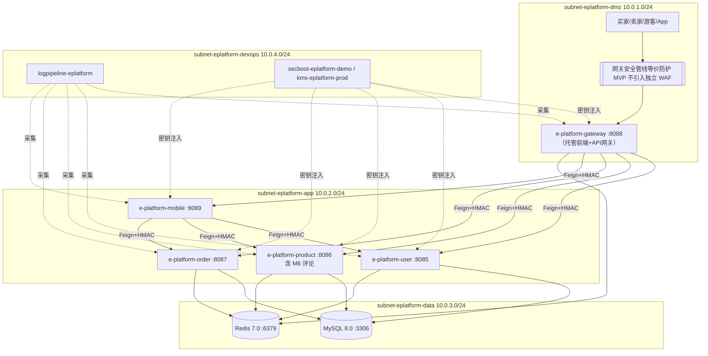

# e_platform 电商平台 · 部署设计（Phase 5.3 全文定稿）

> **文档状态**：全文定稿（Phase 5.3 策略对齐 + 全文补全）。
> **阶段与 Gate**：Phase 5 部署设计 / Gate G5（待人工审核通过）。
> **作者**：毕落地 / platform-architect（部署架构师）。
> **创建 / 定稿日期**：2026-08-01。
> **上游输入**：G4《系统设计》（§5 部署架构 / §6 网络架构 / §3 应用架构 / §8 可观测为直接前提）+ G3《高层架构设计》（IC-01 已裁决 Spring Boot 3.x + JDK 21）+ G2《行业调研报告》+ G1《资料摘要》。
> **运行时基线**：单机 Docker Compose + 各进程单实例 + 零新增中间件（O10）+ 单活高可用（G3 冻结）。
> **云基线核对**：`need_cloud_baseline_check = false`，云连接器未连接 → 所有云事实按「演示级 / 待人工确认」标注，未调用 CloudQ。
> **安全侧对齐**：已接收 security-architect 骨架（§5.2.1 WAF 裁决 / §5.2.3 安全组规则 / §6.1 密钥分级 K1–K5 / §7.2 审计保留期），本章节据此完成策略对齐（安全组命名以本文件 platform 命名为准、WAF 回填、日志保留期对齐、KMS 引用对齐）。安全侧权威项不越权改写。
> **本轮状态**：基于 Phase 5.1/5.2 骨架（§2.2.4/§2.2.5/§2.2.6/§3/§3.2/§3.2.1）对齐补全，骨架「（待策略对齐阶段补全）」占位已全部替换。

---

## 1. 引言

### 1.1 适用范围与部署形态

- **适用系统范围**：e_platform 电商平台（存量全栈电商演示平台，本期增量 = 鉴权底座 + 三级评论 + 并发排队 + 视觉升级 + 交付链路五件事）。
- **部署形态**：私有化单机 Docker Compose（开发 / 演示环境）；演进生产为单 Region 多 AZ 高可用（待人工确认 + 安全侧权威裁决）。
- **运行边界**：不做多租户、不做多实例水平扩容（单实例为本期一切并发与一致性设计的显式前提，D5 / G3 冻结）；零新增运行时中间件（O10）；新增 Maven 依赖 ≤ 4 个、npm / Gradle 依赖零新增。
- **技术栈基线**：Spring Boot 3.x + Spring Cloud 2023.x + JDK 21（经 IC-01 裁决）；MySQL 8.0 + Redis 7.0；Vue3 前端由网关进程托管；Kotlin/Compose 双 App 本地 APK 分发。
- **不适用**：公网 SaaS 多租户、跨云容灾、Kubernetes 编排（本期均不引入）。

### 1.2 名词与缩写

| 缩写 / 名词 | 含义 |
| --- | --- |
| DMZ / 边界信任域 | 唯一对外入口承载区（网关 e-platform-gateway :8088 + WAF 槽位） |
| 业务信任域 | iam(8085) / product(8086) / trade(8087) / mobile(8089) 四进程内网 |
| 数据信任域 | MySQL 3306 / Redis 6379 内网，不暴露公网 |
| DevOps 信任域 | 启停 / 密钥自举 / 健康检查 / 日志底座，仅 localhost / 堡垒机 |
| HMAC 信任链 | 网关对 `userId/userType/roles/timestamp` 签名，下游 `GatewaySignatureInterceptor` 常量时间校验（±5min 窗口） |
| 单活（Single-Active） | 每进程单实例、无主备/多活（G3 冻结） |
| WORM | 一次写入只读（审计日志不可篡改存储） |
| K1–K5 | 安全侧密钥分级（数据库密码 / 云 AKSK / 服务间密钥 / 用户密码 / API Key·JWT） |
| SLA | 服务等级协议；演示级不承诺量化可用性 |

---

## 2. 环境与资源清单

### 2.1 环境矩阵

| 环境 | 用途 | 集群隔离 | 数据 | 网络访问 | 说明 |
| --- | --- | --- | --- | --- | --- |
| dev | 开发自测 | 单机 Docker Compose（共享宿主） | 模拟数据（2 测试账号 + admin） | 内网 localhost | 与演示级同源，开发者本地启 `./start.sh` |
| int | 联调 | 单机 Docker Compose（独立宿主 / 独立卷） | 模拟数据 | 内网 + 白名单 SSH | 验证集成链路（越权用例 / 50 并发压测） |
| uat | 预发 / 验收 | 单机 Docker Compose（独立宿主） | 仿生产（数据克隆 / 脱敏） | 内网 + 白名单 | 甲方验收演示前最后一环；运行 `tests/security_test.sh` 12 项 + 并发压测 |
| prod | 生产（演进） | 单 Region 多 AZ（≥2 AZ，待人工确认） | 真实数据 | 公网 / 内网（DMZ 收敛） | MVP 演示级为单机 localhost，不承诺量化 SLA；演进期由安全侧裁决公网暴露与 WAF |

> 隔离策略：演示级四环境均为单机 Docker Compose，靠宿主与数据卷物理隔离；演进 prod 采用 VPC 多子网 + 安全组（见 §2.2.6 与 §3.1.1）隔离，跨环境数据不互通。

### 2.2 云资源清单

#### 2.2.1 计算资源

| 资源编号 | 类型 | 产品 | 资源 ID | 名称 | 规格 | 数量 | 环境 | 复用 / 新建 | HA 方案 | 用途 |
| --- | --- | --- | --- | --- | --- | --- | --- | --- | --- | --- |
| R-C-000 | 宿主 | 物理机 / CVM | host-eplatform-demo | 单机宿主机 | 演示 8C16G（待人工确认）；prod 独立 CVM 待确认 | 1 | dev/int/uat | 新建 | 宿主宕机需人工恢复（单点） | 承载全部容器 |
| R-C-001 | 容器 | e-platform-gateway | ct-gateway | 接入与治理（鉴权/排队/签名） | 1C1G，JVM 512M~1G | 1 | 全环境 | 新建 | `restart: unless-stopped` 自愈 | 唯一业务入口 8088 |
| R-C-002 | 容器 | e-platform-user | ct-iam | 身份与权限中心 | 1C1G | 1 | 全环境 | 新建 | 同上 | iam 8085 |
| R-C-003 | 容器 | e-platform-product | ct-product | 商品 + 三级评论 | 1C1G | 1 | 全环境 | 新建 | 同上 | product 8086 |
| R-C-004 | 容器 | e-platform-order | ct-trade | 交易（订单/购物车/地址） | 1C1G | 1 | 全环境 | 新建 | 同上 | trade 8087 |
| R-C-005 | 容器 | e-platform-mobile | ct-mobile | 移动聚合 BFF | 1C1G | 1 | 全环境 | 新建 | 同上 | mobile 8089 |
| R-C-007 | 容器 | MySQL 8.0 | ct-mysql | 业务主库 | **2C4G**（C-01/C-02） | 1 | 全环境 | 新建 | 单实例无主从；卷挂载 | 3306 |
| R-C-008 | 容器 | Redis 7.0 | ct-redis | 缓存/排队/黑名单/锁 | **1C2G**（C-01） | 1 | 全环境 | 新建 | 单实例；appendonly 持久化 | 6379 |
| R-C-009 | 应用进程 | Android APK | dist/*.apk | 买家/卖家 App | — | 2（双端） | uat/prod | 新建 | 人工分发安装 | 本地 APK 分发 |

> HA 方案说明：演示级单活，进程崩溃由 `docker-compose restart: unless-stopped` 自愈（≤30s）；宿主宕机需人工介入。演进 prod 多 AZ 多实例 HA 方案待人工确认 + 安全侧权威。

#### 2.2.2 存储资源

| 资源编号 | 类型 | 产品 | 资源 ID | 名称 | 规格 | 容量 | 环境 | 复用 / 新建 | HA 方案 | 备份策略 |
| --- | --- | --- | --- | --- | --- | --- | --- | --- | --- | --- |
| R-S-001 | 块/卷 | 宿主目录挂载 | vol-mysql | MySQL 数据卷 | 宿主机目录 `./mysql` | 20GB（演示）；prod 待确认 | 全环境 | 新建 | 单卷；无异地副本 | 每日 `./backup` 定时 mysqldump（演示级）；prod 待确认 |
| R-S-002 | 块/卷 | 宿主目录挂载 | vol-redis | Redis 持久化卷 | `./redis`（`appendonly yes`） | 5GB | 全环境 | 新建 | 单卷 | AOF + RDB；重建不丢 |
| R-S-003 | 块/卷 | 宿主目录挂载 | vol-logs | 应用日志卷 | `./logs` | 10GB（≤100MB/天，C-09） | 全环境 | 新建 | 单卷 | 滚动切分；保留期见 §2.2.5 |
| R-S-004 | 块/卷 | 宿主目录挂载 | vol-backup | 数据库备份卷 | `./backup` | 20GB | 全环境 | 新建 | 单卷 | 保留 7 天 |
| R-S-005 | 对象存储 | — | — | 评价图片存储 | — | — | — | **不引入（O8）** | — | 图片上传列完整版（F20） |

#### 2.2.3 网络资源

| 资源编号 | 类型 | 产品 | 资源 ID | 名称 | 规格 | 环境 | 复用 / 新建 | 用途 |
| --- | --- | --- | --- | --- | --- | --- | --- | --- |
| R-N-001 | VPC | 腾讯云 VPC（演进） | `vpc-eplatform-prod` | 生产 VPC | CIDR **10.0.0.0/16**（待人工确认） | prod | 新建（演进） | 多子网隔离承载 |
| R-N-002 | 子网 | 腾讯云子网 | `subnet-eplatform-dmz` | DMZ 子网 | 10.0.1.0/24 | prod | 新建 | 网关(e-platform-gateway :8088) + WAF 槽位 |
| R-N-003 | 子网 | 腾讯云子网 | `subnet-eplatform-app` | 业务子网 | 10.0.2.0/24 | prod | 新建 | iam/product/trade/mobile |
| R-N-004 | 子网 | 腾讯云子网 | `subnet-eplatform-data` | 数据子网 | 10.0.3.0/24 | prod | 新建 | MySQL / Redis |
| R-N-005 | 子网 | 腾讯云子网 | `subnet-eplatform-devops` | DevOps 子网 | 10.0.4.0/24 | prod | 新建 | 运维 / 日志 / 监控旁路 |
| R-N-006 | 安全组 | （见 §2.2.6） | `sg-eplatform-*` | 安全组组 | 5+1 组 | prod | 新建 | 信任域边界控制 |
| R-N-007 | 入口 | e-platform-gateway :8088（CLB 演进期可选前置） | ingress-eplatform | 唯一对外入口（网关直接托管前端 + API 网关路由） | 8088（prod 建议 443→8088；演进期可选 CLB 前置，但不引入独立 Nginx） | 全环境 | 新建 | 边界收敛 |
| R-N-008 | 网络 | Docker bridge | `eplatform-net` | 演示级 bridge | Docker 自动分配 CIDR | dev/int/uat | 新建 | 单机容器互联 |

> 演示级无 VPC，使用 Docker 自定义 bridge 网络 `eplatform-net`；演进 prod VPC/子网 CIDR 与安全组规则见 §3.1.1 与 §2.2.6。

#### 2.2.4 中间件与平台服务

| 资源编号 | 类型 | 产品 | 资源 ID | 名称 | 规格 | 环境 | 复用 / 新建 | HA 方案 | 用途 |
| --- | --- | --- | --- | --- | --- | --- | --- | --- | --- |
| R-M-001 | 数据库 | MySQL 8.0 | ct-mysql（同 R-C-007） | 业务主库 | 2C4G | 全环境 | 新建 | 单实例（无主从）；演进待确认 | 全部业务读写 |
| R-M-002 | 缓存 | Redis 7.0 | ct-redis（同 R-C-008） | 缓存/排队/黑名单/锁 | 1C2G | 全环境 | 新建 | 单实例；appendonly | 令牌黑名单/权限缓存/排队/互斥锁 |
| R-M-004 | 网关 | e-platform-gateway | ct-gateway（同 R-C-001） | 安全管线 + 排队守卫 | 1C1G | 全环境 | 新建 | 单实例自愈 | 路由/鉴权/HMAC/排队 |
| R-M-005 | 消息队列 | RabbitMQ | ct-mq | **编排保留但不启用（K13）** | 默认 | dev/int/uat | 复用（编排预置） | 不适用 | 本期不消费；评分聚合走同步写+定时兜底 |
| R-M-006 | 密钥管理（演进） | KMS / Vault | `kms-eplatform-prod` / `vault-eplatform-prod` | 密钥托管（演进） | 待确认 | prod | 新建（演进） | 待安全侧裁决 | 承载 K1–K5 密钥（见 §2.2.6） |

> 中间件数量：当前仅 MySQL + Redis + 网关三类运行时组件（网关同时承担 API 网关 + 静态前端托管；RabbitMQ 容器保留但不启用），满足「零新增中间件」（O10）。

#### 2.2.5 可观测资源

| 资源编号 | 类型 | 产品 | 资源 ID | 名称 | 规格 | 环境 | 复用 / 新建 | 承载可观测维度 |
| --- | --- | --- | --- | --- | --- | --- | --- | --- |
| R-O-001 | 日志管道 | 结构化日志收集 | `logpipeline-eplatform` | 全栈统一日志管道 | 采集 5 微服务（网关托管前端）+ MySQL慢查 + Redis慢日志 | 全环境 | 新建 | Logs（结构化 JSON） |
| R-O-002 | 日志存储 | 宿主卷 / 对象存储 | `logstore-eplatform-local`（演示） / `logstore-eplatform-oss`（演进） | 日志存储后端 | 演示级宿主卷 `./logs`（≤100MB/天）；演进 COS+ELK 待确认 | 全环境 / prod | 新建 | Logs 持久化 |
| R-O-003 | 指标 | Prometheus（演进） | `prom-eplatform` | Metrics 采集 | 拉取 actuator/health | prod | 新建（演进） | Metrics（RED/资源/中间件） |
| R-O-004 | 日志栈 | Loki（演进） | `loki-eplatform` | 日志聚合 | 待确认 | prod | 新建（演进） | Logs 聚合查询 |
| R-O-005 | 追踪 | Tempo / OTLP（演进） | `tempo-eplatform` | 分布式追踪 | 错误 100% / 正常 10% 采样 | prod | 新建（演进） | Traces |
| R-O-006 | 看板 | Grafana | `grafana-eplatform` | Dashboard D-01~D-06 | 6 个大盘 | prod | 新建（演进） | 可视化 |
| R-O-007 | 告警 | Alertmanager / 企微（演进） | `alert-eplatform` | 告警引擎 | 对接 P0~P3 | prod | 新建（演进） | Alerts 分发 |

> 演示级：不独立部署监控进程，指标经各服务 `actuator/health` 端点暴露、日志落宿主卷 `./logs`，由 `start.sh` 健康检查脚本消费；演进期补齐 Prometheus/Loki/Tempo/Grafana 栈（归 platform-architect 选配）。

#### 2.2.6 安全资源（安全组 + 密钥底座）

> 本节为部署侧权威（命名与部署位置）+ 安全侧权威规则落地。安全组**命名以本文件 platform 为准**，规则映射自 security-architect §5.2.3；密钥分级/轮转/访问归 security-architect §6.1 权威（K1–K5）。默认拒绝：所有安全组默认拒绝全部入站/出站，仅下表显式放通。

**安全组清单（命名映射安全侧）**：

| 资源编号 | 类型 | 命名 | 归属子网 | 承载节点 | 对应安全侧 | 数量 |
| --- | --- | --- | --- | --- | --- | --- |
| R-Sec-001 | 安全组 | `sg-eplatform-dmz` | `subnet-eplatform-dmz` (10.0.1.0/24) | 网关(e-platform-gateway :8088，托管前端 + API 网关) + WAF 等价防护 | `sg-web` | 1 |
| R-Sec-002 | 安全组 | `sg-eplatform-app` | `subnet-eplatform-app` (10.0.2.0/24) | iam(8085)/product(8086)/trade(8087)/mobile(8089) | `sg-app` | 1 |
| R-Sec-003 | 安全组 | `sg-eplatform-data` | `subnet-eplatform-data` (10.0.3.0/24) | MySQL(3306) | `sg-db` | 1 |
| R-Sec-004 | 安全组 | `sg-eplatform-redis` | `subnet-eplatform-data` (10.0.3.0/24) | Redis(6379) | `sg-redis` | 1 |
| R-Sec-005 | 安全组 | `sg-eplatform-mgmt` | `subnet-eplatform-devops` (10.0.4.0/24) | 运维 / CI / 日志 / 监控旁路 | DevOps 信任域旁路 | 1（可选） |
| R-Sec-006 | 密钥底座 | `secboot-eplatform-demo` / `kms-eplatform-prod` / `vault-eplatform-prod` | 宿主 / 安全子网 | 密钥自举 / 托管 | K1–K5 引用 | 演示 1 + 演进 2 |
| — | 安全组 | （无我方对应） | — | RabbitMQ 5672 预留 | `sg-mq` | **预留、安全组保持全拒绝，待未来启用** |

> 注：骨架轮曾列可选 `sg-eplatform-web`（Web 前台静态资源独立）；按主理人对齐指令，Web 前台由网关 `e-platform-gateway :8088` 托管、并入 `sg-eplatform-dmz`（对应安全侧 `sg-web` 入口角色），不再单列，避免与安全侧五组映射错位。

**安全组规则（映射安全侧 §5.2.3，端口译为我方端口）**：

| 安全组 | 方向 | 源 / 目的 | 协议 / 端口 | 说明 |
| --- | --- | --- | --- | --- |
| `sg-eplatform-dmz` | 入站 | 互联网 / 客户端 | TCP 443→8088（演示期可直 8088） | 唯一对外入口；80→443/8088 强制跳转 |
| `sg-eplatform-dmz` | 入站 | 运维 VPC / 堡垒机 | TCP 22 | 仅运维通道，限定源 IP |
| `sg-eplatform-dmz` | 入站 | 同机健康检查 | TCP 8088（actuator/health） | 仅 localhost |
| `sg-eplatform-dmz` | 出站 | `sg-eplatform-app` | TCP 8085/8086/8087/8089 | 网关转发业务请求（我方端口映射安全侧 8085–8089） |
| `sg-eplatform-dmz` | 出站 | `sg-eplatform-redis` | TCP 6379 | 网关查 Token 黑名单 / 排队 |
| `sg-eplatform-dmz` | 出站 | 互联网 | — | 默认拒绝（无外呼） |
| `sg-eplatform-app` | 入站 | `sg-eplatform-dmz`（网关 8088/8088） | TCP 8085–8089 | 仅网关转发可入 |
| `sg-eplatform-app` | 入站 | `sg-eplatform-app`（同域 Feign） | TCP 8085–8089 | 服务间调用须带 `X-Internal-Token` |
| `sg-eplatform-app` | 入站 | 运维 VPC / 堡垒机 | TCP 22 | 仅运维通道 |
| `sg-eplatform-app` | 入站 | 互联网 | ❌ 拒绝 | 禁止直连绕过网关（防 C5 越权） |
| `sg-eplatform-app` | 出站 | `sg-eplatform-data` | TCP 3306 | 业务读写 |
| `sg-eplatform-app` | 出站 | `sg-eplatform-redis` | TCP 6379 | 权限缓存/黑名单/排队/锁 |
| `sg-eplatform-app` | 出站 | `sg-eplatform-app` | TCP 8085–8089 | 服务间 Feign 回程 |
| `sg-eplatform-data` | 入站 | `sg-eplatform-app` | TCP 3306 | 仅业务服务 |
| `sg-eplatform-data` | 入站 | 运维 VPC / 堡垒机 | TCP 3306 | 经跳板/运维通道，限定源 IP |
| `sg-eplatform-data` | 入站 | 互联网 / DMZ | ❌ 拒绝 | 禁止直连（网关不直连 DB） |
| `sg-eplatform-data` | 出站 | — | — | 默认拒绝 |
| `sg-eplatform-redis` | 入站 | `sg-eplatform-app` | TCP 6379 | 业务服务 |
| `sg-eplatform-redis` | 入站 | `sg-eplatform-dmz`（网关） | TCP 6379 | 网关黑名单 / 排队 |
| `sg-eplatform-redis` | 入站 | 互联网 / DMZ | ❌ 拒绝 | 禁止直连 |
| `sg-eplatform-redis` | 出站 | — | — | 默认拒绝 |
| `sg-eplatform-mgmt` | 入站 | 运维 VPC / 堡垒机 | TCP 22 / 443 | 运维/CI 旁路 |
| `sg-eplatform-mgmt` | 出站 | 镜像仓库 / Maven / npm | HTTPS 443 | 构建期依赖拉取 |
| `sg-mq`（无我方对应） | 入站/出站 | 全部 | — | **全拒绝（K13 不引入 MQ）** |

**密钥底座实例（部署位置 + 命名，分级归安全侧 §6.1）**：

| 阶段 | 实例命名 | 选型 | 部署位置 | 承载密钥 | 依据 |
| --- | --- | --- | --- | --- | --- |
| 演示级（MVP/dev） | `secboot-eplatform-demo` | 自托管密钥自举（不引入 KMS/Vault）：`env.sh` 经 `openssl rand` 生成 JWT_SECRET / GATEWAY_SIGN_SECRET / INTERNAL_TOKEN，注入 `.env` 挂载容器 | 宿主启动脚本 + 配置密钥底座（`subnet-eplatform-devops` 演进位置） | K3/K5（服务间密钥）/ K4（用户密码 bcrypt）/ K5（JWT_SECRET） | C-12「不引入 KMS」；O10「零新增中间件」 |
| 演进（prod） | `kms-eplatform-prod` / `vault-eplatform-prod` | 云 KMS 或 HashiCorp Vault（选型待人工确认 + 安全侧权威） | 独立安全子网（建议 `subnet-eplatform-devops` 或独立安全 VPC） | 承载 K1–K5 全部密钥，引用命名与安全侧 §6.1 一致 | 安全侧 §6.1 已引用本命名 |

> 密钥分级 / 访问控制 / 轮转周期（90 天等）归 security-architect §6.1 权威；本文件仅保证命名实例承载下列密钥：K1 数据库密码、K2 云 AKSK（本期不适用）、K3 服务间密钥、K4 用户密码、K5 API Key/JWT（详见 §7.2）。

### 2.3 复用资源清单

| 复用资源 ID | 原业务方 | 余量评估 | 隔离方式 |
| --- | --- | --- | --- |
| （无） | — | 本期为全新单机演示环境，无既有云资源可复用 | — |
| 演进期（待人工确认） | 既有 VPC / 对象存储 / 日志平台 | 待 CloudQ 核对（本期未连接） | 独立 VPC / 命名空间 / 实例级隔离，经安全评审后接入 |

> **字段说明**：复用资源 ID 引用 §2.2 各资源编号；演示级无复用，演进期如需接入既有基础设施须按隔离方式登记并经安全评审。

---

## 3. 部署拓扑与高可用设计

### 3.1 物理拓扑

#### 3.1.1 VPC 与子网划分（权威）

| 项 | 当前（演示级 / 单机） | 演进（prod，待人工确认） |
| --- | --- | --- |
| VPC | 无 VPC；Docker 自定义 bridge 网络 `eplatform-net`（CIDR 由 Docker 自动分配，演示级无需显式规划） | `vpc-eplatform-prod`，CIDR **10.0.0.0/16**（待人工确认） |
| Region / AZ | 单 Region 单 AZ 单机演示 | 单 Region 多 AZ（≥ 2 AZ）高可用，跨 AZ 容灾；多 Region 灾备为后续演进 |

**子网划分（演进命名 + CIDR + 用途）**：

| 子网命名 | CIDR | 用途 | 承载节点 | 对应安全侧信任域 |
| --- | --- | --- | --- | --- |
| `subnet-eplatform-dmz` | 10.0.1.0/24 | DMZ 边界 / 接入 | 网关(e-platform-gateway :8088，托管前端 + API 网关) + WAF 等价防护 | DMZ 信任域 |
| `subnet-eplatform-app` | 10.0.2.0/24 | 业务微服务内网 | iam(8085) / product(8086) / trade(8087) / mobile(8089) | 业务信任域 |
| `subnet-eplatform-data` | 10.0.3.0/24 | 数据层 | MySQL(3306) / Redis(6379) | 数据信任域 |
| `subnet-eplatform-devops` | 10.0.4.0/24 | DevOps / 运维旁路 | 日志管道 / 监控 / 密钥底座 / 堡垒机 | DevOps 信任域 |

> **信任域 ↔ VPC/子网 映射说明（对齐安全侧 §5.1）**：安全侧定义 DMZ / 业务 / 数据 / DevOps 四信任域，本文件以 `vpc-eplatform-prod` 的 4 个子网一一承载，安全组（§2.2.6）按信任域边界显式放通。默认拒绝跨信任域流量，仅 §3.2 链路表显式放通。

#### 3.1.2 节点划分（权威）

| 节点 | 进程 / 服务 | 端口 | 子网归属 | 说明 |
| --- | --- | --- | --- | --- |
| 网关 | `e-platform-gateway` | 8088 | `subnet-eplatform-dmz` | Web 入口（托管前端）+ 安全管线 + 排队守卫 + HMAC 签名 |
| iam | `e-platform-user` | 8085 | `subnet-eplatform-app` | 身份与权限中心（M2） |
| product | `e-platform-product`（含 M6 三级评论） | 8086 | `subnet-eplatform-app` | 商品中心 + 三级评论中心（M3+M6） |
| trade | `e-platform-order` | 8087 | `subnet-eplatform-app` | 交易中心（M4） |
| mobile | `e-platform-mobile` | 8089 | `subnet-eplatform-app` | 移动聚合 BFF（M5） |
| MySQL | MySQL 8.0 | 3306 | `subnet-eplatform-data` | 业务主库（单实例容器，宿主卷 `./mysql`） |
| Redis | Redis 7.0 | 6379 | `subnet-eplatform-data` | 黑名单 / 权限缓存 / 排队 / 互斥锁（appendonly 持久化，宿主卷 `./redis`） |

> 对象存储节点：本期不引入（O8 图片上传延后），故无对象存储节点；演进可在 `subnet-eplatform-data` 内增 COS 桶（待确认）。

#### 3.1.3 物理拓扑图（权威 · 全文定稿）



> 注：MVP 期 WAF 不引入独立设备/云服务，等价防护由网关安全管线承担（HeaderSanitizer + HMAC + 路由权限 + 防重放 + 排队守卫）；若未来公网暴露，DMZ 入口前置云 WAF（腾讯云 WAF SaaS）或 ModSecurity v3 + OWASP CRS 3.3（见 §3.2.1）。

#### 3.1.4 拓扑要素清单（权威）

- 跨 Region 部署：当前无；演进单 Region 多 AZ。
- 跨 AZ 部署：当前无（单点）；演进 ≥ 2 AZ。
- 流量入口路径：用户/App → 网关(e-platform-gateway :8088，托管前端 + 等价防护) → 下游业务。
- 内部调用路径：网关 → 下游业务（Feign + HMAC 信任链）；Mobile → 下游（同信任链）。
- 数据库访问路径：业务进程 → MySQL(3306) 直连（单实例，无 ProxySQL）。
- 缓存访问路径：业务进程 → Redis(6379) 直连。

### 3.2 流量与网络链路（连通视图）

#### 3.2.1 流量入口链路（权威 · 已对齐安全侧 §5.2.1）

| 组件 (R-xx) | 协议 - 端口 | TLS 终结 | 作用 |
| --- | --- | --- | --- |
| 浏览器 / App | HTTP/HTTPS → 网关(e-platform-gateway :8088) | 网关(e-platform-gateway :8088) | 唯一公网入口，前端静态资源托管 + API 网关路由 |
| **WAF（MVP 裁决：不引入独立 WAF）** | — | — | **MVP 不引入独立 WAF 设备/云服务**（私有单机无公网暴露、零新增中间件）；等价防护由网关安全管线承担（HeaderSanitizer 前缀黑名单净化 + `GATEWAY_SIGN_SECRET` HMAC 信任链 + 路由权限 401/403 严格区分 + 防重放 5min 窗口 + 排队守卫）。**演进（公网暴露时前置，预先裁决）**：首选云 WAF（腾讯云 WAF SaaS 版），规则引擎开启 OWASP Top 10 防护 + CC 防护 + 防篡改；开源备选 ModSecurity v3 + OWASP CRS 3.3，自托管于入口反向代理前。放置位置：互联网流量先经 WAF 清洗再入网关 8088（DMZ）。 |
| `e-platform-gateway` | HTTP :8088 | 网关（直接托管前端，TLS 终结于网关） | 路由 / 鉴权 / 排队守卫 / HMAC 签名写入 |

#### 3.2.2 内部互联链路（权威）

| 项 | 说明 |
| --- | --- |
| 服务发现 | 无注册中心（G3 冻结关闭）；服务地址经环境变量外置 / 硬编码（单实例前提） |
| 服务间协议 | HTTP（对外 REST）/ OpenFeign（内部同步） |
| mTLS | **不启用**；理由：单实例内网 + 网关 HMAC 信任链（±5min 时间戳防重放 + 常量时间比较）已提供来源可信性，mTLS 在单实例场景收益低于运维成本 |
| 数据库连接 | 应用 → MySQL 主（直连，单实例无主从） |
| 缓存连接 | 应用 → Redis（直连，appendonly 持久化） |
| MQ 连接 | RabbitMQ 容器保留但**不启用**（K13）；评分聚合走同步写 + 定时兜底 |

#### 3.2.3 跨网络互联（权威）

| 互联类型 | 通道 | 带宽 | 加密 | 用途 |
| --- | --- | --- | --- | --- |
| 跨子网（DMZ↔App） | VPC 内网 | — | HMAC 信任链 | 网关 → 业务微服务 |
| 跨子网（App↔Data） | VPC 内网 | — | 内网明文（演示级）／演进 TLS | 业务 → MySQL / Redis |
| 出口（运维 / CI） | `sg-eplatform-mgmt` → 公网 | — | HTTPS | 镜像拉取 / 依赖下载 / 日志上报（演进对象存储） |
| 跨 VPC / 跨 Region | 不适用（演示级） | — | — | 灾备为后续演进 |

#### 3.2.4 出口链路表（权威）

| 源 | 目的 | 协议 / 端口 | 说明 |
| --- | --- | --- | --- |
| 运维 / CI 节点（`sg-eplatform-mgmt`） | 镜像仓库 / Maven / npm 源 | HTTPS / 443 | 构建期依赖拉取（仅构建与启停阶段出网） |
| 日志管道 `logpipeline-eplatform`（演进） | 对象存储 / 云监控（待确认） | HTTPS | 日志 / 指标上报（演示级不出网，落宿主卷） |
| 全部业务进程 | 公网 | — | **禁止**（数据层与外网不互通，仅经网关收敛入口） |

#### 3.2.5 入口链路表（权威）

| 源 | 目的 | 协议 / 端口 | 说明 |
| --- | --- | --- | --- |
| 浏览器 / 买家 App / 卖家 App | 网关(e-platform-gateway :8088) | HTTP/HTTPS :8088 | 唯一对外入口（演示级可 HTTP） |
| 网关(e-platform-gateway :8088) | [网关安全管线等价防护] | HTTP :8088 | 等价防护串接于入口（MVP 不引入独立 WAF，见 §3.2.1） |
| 自动化测试脚本 | 网关(e-platform-gateway :8088) | HTTP | curl 断言真实 HTTP 状态码（401/403 区分） |

#### 3.2.6 内部链路表（权威 · 含三关键链路）

| 源 → 目的 | 协议 / 端口 | 信任机制 / 说明 | 关键链路归属 |
| --- | --- | --- | --- |
| 浏览器/App → 网关(e-platform-gateway :8088) | HTTP :8088 | 边界无信任（入口） | 入口链路 |
| **网关(8088) → 下游业务（iam/product/trade/mobile）** | Feign HTTP :8085/:8086/:8087/:8089 | **网关签名信任链**：① 转发前按前缀黑名单剥离客户端传入内部身份头；② 网关写入自身身份头；③ 对身份 + 时间戳 HMAC 签名（`X-Sign` + `X-Ts`，±5min 窗口，常量时间比较）；④ 匿名请求同样签名（防「无签名即匿名」绕过）；⑤ 下游 `common-security` AOP 拦截器验签 | **🔗 网关签名信任链链路** |
| Mobile(8089) → 下游业务（iam/product/trade） | Feign HTTP | 同 HMAC 信任链（不下发前端密钥） | 🔗 网关签名信任链链路（Mobile 侧） |
| 游客/买家/卖家 → 网关 → product(8086, M6) → MySQL | Feign + JDBC | 三级评论**读**：递归 CTE 树形查询（L1→L2→L3），游客可读全部三层；走 Redis 缓存评分概览 | **🔗 三级评论读写链路（读）** |
| 买家 → 网关 → product(8086, M6) → 交易中心(8087) Feign(内部令牌) → 发表 L1 | Feign HTTP | 三级评论**写 L1**：购买资格校验（user + product + 最新已完成订单），网关侧该接口标记为**内部拒绝**（外部访问一律 403）；一订单一商品一评唯一约束；评分聚合同步写回 product + 定时兜底；用户名脱敏经 product → iam Feign 批量取（防 N+1） | **🔗 三级评论读写链路（写 L1）** |
| 卖家 → 网关 → product(8086, M6) → 回复 L2 | Feign HTTP | 三级评论**写 L2**：仅商品归属卖家可回，每条 L1 至多 1 条有效回复，24h 编辑窗，不可删买家评价 | 🔗 三级评论读写链路（写 L2） |
| 登录用户 → 网关 → product(8086, M6) → 追问 L3 | Feign HTTP | 三级评论**写 L3**：任意登录用户可发，服务端强制父级/根级均指向 L1（不产生第四层） | 🔗 三级评论读写链路（写 L3） |
| 买家 → 网关(8088)（排队守卫） → 交易中心(8087) 下单 | Feign HTTP | **下单 / 扣库存排队链路**：网关排队守卫（有许可直通 / 无许可入队回传位次与预计等待 / 队满拒绝 / 超时释放）；交易中心 → 商品中心(8086) Feign（内部令牌，不经网关）库存扣减与回滚；商品侧叠加本地信号量限流防连接池打穿；防超卖真相来源 = 条件更新 SQL 受影响行数 | **🔗 下单 / 扣库存排队链路** |
| 网关(8088) / 各业务 → Redis(6379) | Redis 协议 | 排队许可与队列（网关侧）、黑名单、权限缓存、互斥锁；**Redis 不可用时排队降级本地信号量并最终直接放行**（业务不中断） | 下单 / 扣库存排队链路（降级路径） |
| 业务进程 → MySQL(3306) | JDBC :3306 | 业务主数据读写（单实例直连） | 数据层链路 |

### 3.3 高可用与故障容错

#### 3.3.1 故障域划分（四层）

| 故障域 | 影响范围 | 容错机制 | 预期 RTO |
| --- | --- | --- | --- |
| 单进程（容器） | 单实例进程 | `docker-compose restart: unless-stopped` 自愈；actuator/health 健康检查 | ≤ 30s（瞬时无影响） |
| 单宿主节点（Node） | 该宿主全部容器 | 演示级无自动漂移，需人工重启宿主 / 重跑 `./start.sh`；数据卷挂载保障不丢 | 演示级人工恢复（无量化 SLA）；演进 ≤ 1min（跨 AZ 调度） |
| 单 AZ | 该 AZ 全部资源 | 演示级不适用（单点）；演进跨 AZ 部署，自动切换 | 演示级 N/A；演进 ≤ 5min |
| 单 Region | 全部主资源 | 演示级不适用；演进灾备 Region 切换（待确认） | 演示级 N/A；演进 ≤ 1h（待人工确认） |

> **可用性来源拆分**：单进程自愈由 Docker Compose 兜底；数据不丢失由宿主卷挂载（`./mysql`/`./redis`/`./backup`）兜底；业务正确性（防超卖、不丢单）由 DB 条件更新 SQL + 排队降级放行兜底。跨 AZ/Region 高可用属演进项，归 platform-architect + 安全侧权威（演示级不承诺量化 SLA，对外仅承诺三项可验证行为：登出即失效、50 并发零超卖、一条命令拉起全栈）。

#### 3.3.2 负载均衡

- **演示级**：网关 `e-platform-gateway :8088` 单实例直接托管前端 + 路由（无多实例，无 LB 算法）；网关为唯一业务入口。
- **演进（prod）**：4 层 CLB（TCP 443→8088，演进期可选前置）+ 7 层网关（`e-platform-gateway :8088`，托管前端 + 路由）；多 AZ 流量分发。
- **服务间调用**：无 LB（单实例直连，地址经环境变量外置）。

#### 3.3.3 健康检查配置

| 项 | 配置 |
| --- | --- |
| 健康检查端点 | 各服务 `actuator/health`（网关路由外、本地端口直接访问，common 签名拦截器白名单放行） |
| 检查方式 | `start.sh` 轮询 HTTP 健康 + Docker `healthcheck`（MySQL `mysqladmin ping`、Redis `redis-cli ping`） |
| 频率 | 10s |
| 失败阈值 | 连续 3 次失败判定不健康 |
| 成功阈值 | 连续 2 次成功判定恢复 |
| 超时 | 单服务启动后最长等待：MySQL ≤120s、Redis ≤30s、应用 ≤60s（端口预检 + 健康检查） |

#### 3.3.4 弹性伸缩配置

| 项 | 配置 |
| --- | --- |
| 演示级 | 单实例，不伸缩（单实例为并发与一致性设计前提，R-04/ARCH §10.3） |
| 扩容前置条件 | 商品服务扩为多实例前，须将本地信号量切换为带租约的分布式许可（Redisson `RPermitExpirableSemaphore`），否则总并发放大为「实例数 × 许可数」导致保护失效（写入本部署文档，禁止直接水平扩容单实例服务） |
| 演进触发指标 | CPU ≥ 80% / QPS 接近单实例承载 / 队列持续打满 |
| 伸缩区间 | min 2 / max 按需（待人工确认） |

#### 3.3.5 容灾切换配置

- 演示级：单活（Single-Active），无自动容灾切换；数据卷挂载保证容器重建不丢数据。
- 演进：单 AZ → 多 AZ（跨 AZ 数据复制 + 自动切换，RTO ≤5min）；多 Region 灾备（RTO ≤1h，待人工确认）。

---

## 4. 部署流程

### 4.1 代码仓库与分支

| 项 | 规范 / 值 | 说明 |
| --- | --- | --- |
| 代码仓库地址 | 私有 Git 仓库（GitHub / GitLab，待人工确认） | 单仓库多模块（backend 父 POM + 6 模块；frontend；android） |
| 分支管理 | `main`（保护，生产对应）/ `develop`（集成）/ `feature/*`（功能）/ `release/*`（发布）/ `hotfix/*`（紧急修复） | GitFlow 变体；演示级可用主干开发 |
| 合并规范 | PR + 至少 1 名 Owner 评审 + 流水线全绿方可合入 `main` | 密钥变更须安全侧评审 |
| 标签规范 | 语义化版本 `vX.Y.Z`；对应镜像 tag | 与《高层架构设计》版本对齐 |

### 4.2 流水线（CI / CD · 8 阶段）

| 阶段 | 触发条件 | 关键动作 | 失败处理 |
| --- | --- | --- | --- |
| ① 构建 | 自动 / 手动触发（push / PR） | 拉代码 → Maven 多模块编译 → 单元测试 → 前端 `npm ci && npm run build`（产出 dist 由网关托管）→ Android `assembleRelease`（双 APK） | 阻断后续阶段 |
| ② 代码扫描 | 构建后 | 静态扫描（SonarQube / Checkstyle）/ 代码规范 / 复杂度；javax→jakarta 残留引用扫描门禁（IC-01 约束） | 不达标阻断 |
| ③ 安全扫描 | 构建后 | SCA（依赖漏洞，Maven / npm / Gradle）/ SAST / 镜像漏洞扫描（Trivy）/ `keystore` 缺失与明文密钥扫描 | 高危阻断 |
| ④ 集成测试 | 合并到集成分支 | 集成测试 / 接口契约测试 / 越权用例 `tests/security_test.sh`（12 项）/ 50 并发压测 | 阻断后续阶段 |
| ⑤ 制品打包构建 | 测试通过 | 构建 Docker 镜像（5 微服务；前端 dist 打包进网关）/ 推送镜像仓库并打 Tag / APK 归档 `dist/` | 失败重试 |
| ⑥ 部署集成环境 | Package 完成 | 自动部署到 dev / int（Docker Compose 拉起，`start.sh` 一键） | 失败回滚到上一版本 |
| ⑦ 部署测试环境 | 手动触发 | 部署到 uat（仿生产数据 + 白名单）；冒烟 + 越权/并发验收 | 失败回滚到上一版本 |
| ⑧ 部署生产环境 | 人工审批 | 按发布策略上线（演示级单机停机发布 / 演进灰度）；安全侧上线前自检通过 | 按 §6.1 回滚策略实施回滚 |

### 4.3 构建产物与制品管理

| 配置项 | 配置值 / 规则 | 说明 |
| --- | --- | --- |
| 产物类型 | 容器镜像（5 微服务；前端 dist 打包进网关）/ Jar（备用）/ 前端静态包（网关托管）/ Android APK（双端） | 前端 dist 打进 `e-platform-gateway` 静态资源 |
| 镜像仓库 | 私有镜像仓库（待人工确认，演示级本地 Docker daemon） | 命名空间 `e-platform` |
| 镜像命名 | `〈repo〉/〈service-name〉:〈git-tag〉-〈commit-sha-short〉` | 例 `e-platform/gateway:v1.0.0-a1b2c3d` |
| 制品保留期 | 镜像 90 天滚动保留 / Jar 30 天 / APK release 永久归档（含 release keystore 离线备份） | keystore 丢失将无法为同应用发版（SR-22） |
| 制品溯源 | 镜像 Label 必含 `git-commit` / `build-time` / `pipeline-id`；manifest 可反查源码 | 便于事故反查 |
| 签名与校验 | 演示级不强制；演进启用 cosign / Notary 镜像签名 + 校验（待安全侧裁决） | 密钥引用 `kms-eplatform-prod` |

### 4.4 配置管理（L1 ~ L4）

| 层级 | 配置类别 | 示例 | 管理方式 | 隔离 / 安全 |
| --- | --- | --- | --- | --- |
| **L1** | 基础设施 / 环境配置 | `docker-compose.yml`、`.env.example`、`scripts/env.sh`、宿主目录挂载 | 版本库 + 启动脚本自举 | 宿主级；密钥由 `env.sh` 随机生成 |
| **L2** | 应用配置 | `application.yml`（端口 / 数据源 / Redis / Feign 地址 / 日志级别） | 配置文件 + 环境变量外置覆盖 | 按环境分离；服务地址外置不硬编码 |
| **L3** | 运行时动态配置 | 排队阈值 `QUEUE_PERMITS`(50) / `QUEUE_MAX_LENGTH`(500) / `QUEUE_WAIT_TIMEOUT`(60s) / `QUEUE_PERMIT_TTL`(30s) | 环境变量覆盖，**改配置不改代码**（运维 O4） | 演示 `QUEUE_PERMITS=1` 复现排队 |
| **L4** | 密钥 / 敏感配置 | `JWT_SECRET` / `GATEWAY_SIGN_SECRET` / `INTERNAL_TOKEN` / MySQL 密码 | 演示级 `env.sh` 随机生成注入 `.env`；演进 `kms-eplatform-prod` / `vault-eplatform-prod`（K1–K5） | **禁止硬编码 / 日志 / URL**；90 天轮转（见 §7.2） |

### 4.5 发布策略

#### 4.5.1 发布方式

> 全系统采用**单机停机发布 + 健康检查**（演示级单活约束，无法蓝绿 / 金丝雀——单实例单活无冗余可切）。演进 prod 多实例后可启用蓝绿 / 金丝雀。

| 模块 | 发布方式 | 说明 |
| --- | --- | --- |
| 全部后端微服务（网关托管前端） | 单机停机发布（Docker Compose 顺序重启） | 经 `start.sh` 按依赖顺序逐个重启并健康检查；演示级可接受短暂停机 |
| 前端静态（网关托管） | 随网关镜像发布（dist 打包进 static） | 无独立前端发布通道 |
| Android 双 APK | 人工分发安装（release keystore 签名） | `dist/*.apk` 归档，需重新安装 |
| 演进 prod | 蓝绿 / 金丝雀（待人工确认） | 多 AZ 多实例，按批次放量 |

#### 4.5.2 发布标准流程

- **首次发布（环境初始化）**：`env.sh` 自举生成密钥 → 端口预检 → `docker-compose up -d mysql redis`（轮询健康）→ 执行幂等迁移 `migration-v2.sql` → 构建前后端 → 按 user→product→order→mobile→gateway 顺序启动并逐个健康检查 → 打印访问地址 / 账号。
- **常规迭代发布**：CI 构建镜像 → 推送仓库 → 目标环境 `docker-compose pull` + `restart` → 健康检查全绿。
- **资源变更流程**：数据库 DDL 变更须可回滚（见 §6.1.3）；安全组 / 网络变更须安全评审。

#### 4.5.3 灰度路径与观测窗口

- 演示级无水平扩容，灰度 = dev → int → uat 多环境递进验证（每环境冒烟 + 越权/并发验收）。
- 演进 prod：按 AZ/Region 批次放量，单批观测窗口 ≥ 30min，指标稳定（错误率 / P99 / 队列）后推进下一批。

#### 4.5.4 发布门禁

| 门禁项 | 拦截条件 | 检查时机 |
| --- | --- | --- |
| 单元测试通过率 | 100% | Build 阶段 |
| 单元测试覆盖率（增量） | ≥ 70% | Code Quality 阶段 |
| 集成测试通过率 | 100%（含越权 12 项 + 50 并发零超卖） | Integration Test 阶段 |
| 静态扫描严重问题数 | 0（高危）；中危需评审 | Code Quality 阶段 |
| 安全扫描高危漏洞 | 0（含镜像 / 依赖 / 明文密钥） | Security Scan 阶段 |
| 镜像漏洞 | 高危 0 | 制品扫描 |
| 接口契约校验 | 兼容（不破坏在网调用方） | Integration Test 阶段 |
| 性能基线 | P99 不退化；50 并发零超卖 | 性能测试 |
| 安全侧上线前自检 | 全部通过（§7.1） | 生产发布前 |
| 人工审批 | 至少 1 名 Owner | 生产发布前 |

---

## 5. 监控告警接入

### 5.1 监控架构与数据流

```text
Pod / 中间件 ──┬─► Metrics ──► Prometheus / 云监控 (R-O003) ──► Grafana (R-O006, D-01~D-06)
               ├─► Logs    ──► logpipeline-eplatform (R-O001) / logstore (R-O002) ──► Loki (R-O004)
               └─► Traces  ──► Tempo / OTLP (R-O005)                          ──► Grafana
                                          ▼
                                  告警引擎 (R-O007, Alertmanager/企微)
                                          ▼
                            电话 / 短信 / IM（§5.4）
```

> 演示级：指标经 `actuator/health` 暴露、日志落 `./logs`，由 `start.sh` 健康检查消费；演进补齐 Prometheus/Loki/Tempo/Grafana 栈。四支柱：Metrics / Logs / Traces / Alerts（对齐系统设计 §8）。

### 5.2 关键 Dashboard 清单（≥ 5）

| 大盘 | 用户 | 指标 |
| --- | --- | --- |
| D-01 业务总览 | 产品/研发 | 下单/评价/登录漏斗、下单成功率、评分聚合延迟 |
| D-02 网关排队 | 研发 | 排队中/发放/超时（C408/C503）、位次分布 |
| D-03 服务健康 | 研发 | 各进程 RT / P99 / 错误率（RED） |
| D-04 中间件 | DBA/研发 | MySQL QPS/慢查询、Redis 命中率/连接数 |
| D-05 资源水位 | 运维 | CPU/内存/磁盘/容器重启次数 |
| D-06 安全态势 | 安全/研发 | 401/403 率、限流触发（C429）、重复评价冲突（C409） |

### 5.3 告警规则清单（P0 ~ P3 + Owner + Runbook）

| 编号 | 级别 | 触发条件 | 关联资源 (R-xx) | Owner | Runbook |
| --- | --- | --- | --- | --- | --- |
| AL-01 | P0 | 网关/任一核心进程不可用（健康检查失败 ≥ 1min） | R-C-001~R-C-005 | 研发值班 + 主理人 | RB-01 |
| AL-02 | P0 | MySQL 主库不可写（磁盘满 / 进程挂） | R-C-007 / R-S-001 | 研发值班 + DBA | RB-02 |
| AL-03 | P1 | 下单失败率 ≥ 5% | R-C-004 / D-02 | 交易研发 | RB-03 |
| AL-04 | P1 | 排队超时率 ≥ 10% / 队列持续打满 | R-C-001 / D-02 | 交易研发 | RB-03 |
| AL-05 | P1 | Redis 不可用（排队降级为本地信号量） | R-C-008 / R-S-002 | 研发 | RB-04 |
| AL-06 | P2 | JVM 堆 ≥ 70% | R-C-001~R-C-005 | 研发 | RB-05 |
| AL-07 | P2 | 连接池 ≥ 80% / Redis 命中率 ≤ 90% | R-C-007 / R-C-008 | 研发 | RB-05 |
| AL-08 | P3 | 限流触发（C429）/ 重复评价冲突（C409）/ 慢查询 ≤ 1s | R-C-002~R-C-005 / D-06 | 模块负责研发 | RB-06 |

### 5.4 告警通道

| 级别 | 响应时间 | 通知方式 | 上升机制 |
| --- | --- | --- | --- |
| P0 | ≤ 5 min | 电话 + 短信 + IM（企微/邮件） | 15min 未响应升级至 Manager / 主理人 |
| P1 | ≤ 15 min | 短信 + IM | 30min 未响应升级至 Owner + 主理人 |
| P2 | 工作时间响应 | IM | 当日未处理升级至模块 Owner |
| P3 | 日报复盘 | IM / 工单 | 纳入周报评估阈值 |

---

## 6. 应急与回滚

### 6.1 回滚机制

#### 6.1.1 回滚触发条件

- 生产错误率：P0/P1 告警触发（AL-01~AL-04），下单失败率 ≥5% 或核心进程不可用。
- P90 耗时：超过性能基线（P99 退化）。
- 关键告警：队列持续打满、Redis 不可用导致降级、数据库连接失败。

#### 6.1.2 回滚决策人

- On-call 主值班可独立决定 P0 回滚（核心进程不可用 / 数据风险）。
- P1 及以下由模块 Owner 决定；涉及密钥 / 安全组变更须安全侧会签。

#### 6.1.3 回滚执行 SOP

| 对象 | 回滚方式 | 预计耗时 | 有损风险 / 数据丢失 |
| --- | --- | --- | --- |
| 应用版本（镜像） | 流水线"一键回滚" → 上一镜像 Tag；`docker-compose` 拉取旧镜像重启 | ≤ 5 min | 无（无状态进程，会话由 Redis 承载） |
| 配置（L3/L4） | 配置中心 / `.env` 保留 N 个历史版本，回退环境变量后重启 | ≤ 1 min | 无 |
| 数据库资源（DDL） | **DDL 变更必须可回滚**；不可回滚的 DDL（如 `DROP COLUMN` / 破坏性列类型变更）**禁止与代码同发布，须前置独立变更并备份**；回滚依靠 `./backup` 定时 mysqldump | ≤ 30 min | 有（须评估，建议发布前全量备份） |
| 密钥（L4） | 回退 `.env` 历史密钥值 + 重启；轮转失败可回退上一轮密钥（90 天窗口内） | ≤ 5 min | 无（旧 Token 在黑名单窗口内仍可控） |

### 6.2 故障应急 Runbook

#### 6.2.1 Runbook 索引

| Runbook 编号 | 关联告警 | 故障场景 | Owner |
| --- | --- | --- | --- |
| RB-01 | AL-01 | 核心进程不可用 | 研发值班 |
| RB-02 | AL-02 | MySQL 主库故障 | 研发 + DBA |
| RB-03 | AL-03 / AL-04 | 下单失败 / 排队超时 | 交易研发 |
| RB-04 | AL-05 | Redis 不可用（排队降级） | 研发 |
| RB-05 | AL-06 / AL-07 | 资源 / 连接池水位高 | 研发 |
| RB-06 | AL-08 | 限流 / 冲突 / 慢查询 | 模块研发 |

#### 6.2.2 Runbook 编写规范

每条 Runbook 按以下结构编写：症状 → 诊断（按顺序，标明可观测工具与查询路径）→ 缓解（分场景，衔接回滚/降级/限流/切换）→ 升级（未生效的升级条件与路径）。

#### 6.2.3 RB-01：核心进程不可用

- **症状**：AL-01 触发，网关/iam/product/trade/mobile 任一健康检查连续失败 ≥1min；用户无法访问。
- **诊断**：① `docker-compose ps` 看容器状态；② `docker-compose logs 〈svc〉` 查堆栈；③ 查 D-03/D-05 看 CPU/内存/重启次数；④ 查 `./logs/〈svc〉.log` 报错。
- **缓解**：① 单进程 `docker-compose restart 〈svc〉`（unless-stopped 通常已自愈）；② 宿主资源打满则清理磁盘 / 扩容规格；③ 无法恢复则回滚到上一镜像 Tag（§6.1.3）。
- **升级**：超 5min 未恢复升主理人；数据风险升 DBA。

#### 6.2.4 RB-02：MySQL 主库故障

- **症状**：AL-02 触发，下单/评价全部失败，连接池等待。
- **诊断**：① `docker-compose logs mysql`；② 查磁盘 `df -h ./mysql`；③ `mysqladmin ping`；④ D-04 慢查询。
- **缓解**：① 进程挂则 `restart`；② 磁盘满则清理备份/日志腾空间；③ 数据损坏则从 `./backup` 最近 mysqldump 恢复（有损窗口 = 备份间隔）；④ 禁止主库直连公网（安全组已拒绝）。
- **升级**：超 15min 升 DBA + 主理人。

#### 6.2.5 RB-03：下单失败 / 排队超时

- **症状**：AL-03/AL-04，下单失败率 ≥5% 或排队超时率 ≥10%、队列打满（503）。
- **诊断**：① D-02 看排队中/发放/超时；② `e-platform-order` 日志查库存扣减；③ 查 `e-platform-product` 本地信号量是否打穿连接池。
- **缓解**：① 短时峰值：确认 `QUEUE_PERMITS` 配置，必要时调大（L3 改配置重启）；② Redis 不可用时已降级本地信号量直接放行（不阻断）；③ 持续失败回滚交易/商品镜像。
- **升级**：超 30min 升交易研发 Owner。

#### 6.2.6 RB-04：Redis 不可用（排队降级）

- **症状**：AL-05，Redis 连接失败，网关日志 `RedisConnectionFailureException`。
- **诊断**：① `docker-compose logs redis`；② `redis-cli ping`。
- **缓解**：① 重启 Redis（appendonly 持久化，重建不丢）；② 网关已自动降级 `LocalSemaphoreFallback` + 直接放行，业务不中断；③ 恢复后自动重试（30s 断路窗口）。
- **升级**：数据不一致疑云升研发 Owner。

#### 6.2.7 RB-05：资源 / 连接池水位高

- **症状**：AL-06/AL-07，JVM 堆 ≥70% / 连接池 ≥80% / Redis 命中率 ≤90%。
- **诊断**：① D-05 资源水位；② D-04 中间件；③ 查慢查询（R8 建议 Druid max-active 提至 50）。
- **缓解**：① 调大 JVM 堆 / 连接池（L3/L2）；② 查慢 SQL 加索引；③ 演进扩容实例。
- **升级**：工作时间未缓解升模块 Owner。

#### 6.2.8 RB-06：限流 / 冲突 / 慢查询

- **症状**：AL-08，C429 限流 / C409 重复评价 / 慢查询 ≤1s。
- **诊断**：① D-06 安全态势；② 查具体接口与用户。
- **缓解**：① 限流为预期保护（O9 阈值可配），评估是否误伤；② 重复评价为用户行为，无需处置；③ 慢查询加索引。
- **升级**：日报复盘评估阈值与业务量。

---

## 7. 安全合规

### 7.1 上线前安全自检

| 编号 | 检查项 | 检查内容 / 标准 | 责任人 | 检查时机 | 是否通过 |
| --- | --- | --- | --- | --- | --- |
| 7.1.1 | 《安全架构设计》清单自检 | 对齐 security-architect §5/§6/§7 全部要求 | 安全架构师 | 发布前 | 须安全侧确认 |
| 7.1.2 | 合规系统经过合规负责人评审 | 审计保留期 ≥180 天、WORM、脱敏 | 合规 + 安全 | 发布前 | 须合规确认 |
| 7.1.3 | 公网暴露面评估 | MVP 无公网暴露；演进公网须前置 WAF（§3.2.1） | 平台 + 安全 | 发布前 | MVP 通过 |
| 7.1.4 | 安全组开放性检查 | 仅 `sg-eplatform-dmz` 443→8088 暴露；3306/6379/8085–8089 不暴露公网（§2.2.6） | 平台 + 安全 | 发布前 | 须核对 |
| 7.1.5 | 安全组件接入（WAF、主机安全等） | MVP 网关等价防护；演进云 WAF / 主机安全 | 平台 + 安全 | 发布前 | MVP 通过 |
| 7.1.6 | KMS / 凭证管理（明文票据） | 密钥经 `env.sh`/KMS 注入，无硬编码；演示级弱口令治理（root 无密码 / 123456） | 平台 + 安全 | 发布前 | 须治理 |
| 7.1.7 | 代码漏洞扫描 | SAST / SCA 高危 0 | 研发 | CI | 门禁拦截 |
| 7.1.8 | 镜像漏洞扫描 | 镜像高危 0（Trivy） | 研发 | 制品扫描 | 门禁拦截 |
| 7.1.9 | 系统上线前扫描 | 越权用例 12/12 通过、错误码语义一致 | 安全评审 | uat | 门禁拦截 |

### 7.2 凭证与密钥清单（对齐安全侧 §6.1 K1–K5）

| 凭证编号 | 类型 | 存储方式 | 所有人 | 用途 / 分级 |
| --- | --- | --- | --- | --- |
| K1 | 数据库密码（MySQL） | 环境变量 / 配置中心加密；引用 `kms-eplatform-prod` | DBA | 业务库密码；L4，90 天轮转 |
| K2 | 云 AKSK（COS/MQ 等） | KMS 白盒 + SSM | 平台 | 本期不适用（无外部云依赖），预留 |
| K3 | 服务间密钥（`GATEWAY_SIGN_SECRET` / `INTERNAL_TOKEN`） | 环境变量（`env.sh` 生成）；引用 `kms-eplatform-prod` | 网关 + 下游 | HMAC 信任链；L4，90 天轮转 |
| K4 | 用户密码 | bcrypt(strength=12) 加盐哈希；前端 RSA 加密提交 | user 服务 | L4，强制改期 90 天（演示 123456 待治理） |
| K5 | API Key / Token（`JWT_SECRET` / access 2h / refresh 7d / 黑名单 TTL=剩余） | `JWT_SECRET` 环境变量；引用 `kms-eplatform-prod` | 网关 + user | L4，JWT 90 天轮转 |

### 7.3 访问审计接入（对齐安全侧 §7.2）

| 审计源 | 去向 | 保留期 | 是否启用 |
| --- | --- | --- | --- |
| 业务操作审计 | `logstore-eplatform-local` / 演进 COS | **≥ 180 天**（WORM 不可篡改） | 是（演示级缩短须标注合规缺口） |
| 云资源审计 | 云审计日志（演进） | **≥ 180 天** | 演进启用 |
| 堡垒机日志 | 运维审计（演进） | **≥ 180 天** | 演进启用 |
| 数据库审计（敏感） | DB 审计日志 | **≥ 180 天**（普通查询 ≥ 90 天） | 是 |
| WAF / 防火墙日志 | WAF 日志（演进） | **≥ 90 天**（攻击类 ≥ 180 天） | MVP 网关等价防护日志；演进云 WAF |
| 敏感字段脱敏 | 全部 5 维度日志手机号/身份证脱敏（`138****8888`），不出现 URL/错误栈 | 同保留期 | 是 |

> **WORM 与保留期对齐**：日志管道 `logpipeline-eplatform` / `logstore-eplatform-local` 保留期配置须对齐安全侧 §7.2（业务/云资源/堡垒机 ≥180 天、WAF ≥90 天），且满足 WORM 不可篡改。**演示级单机 `logstore-eplatform-local` 受宿主卷限制，保留期配置应设为 ≥180 天；若单机演示因存储受限缩短，须显式标注「合规缺口」并在演进接入 COS/WORM 存储后闭环。**

---

## 8. 容量与成本

### 8.1 容量规划

#### 8.1.1 业务量预估

| 业务指标 | 当前值（演示） | MVP 阶段值 | 生产阶段值 | 备注 |
| --- | --- | --- | --- | --- |
| 注册用户数 | 3（buyer1/seller1/admin） | ≤ 1000 | 待人工确认 | 演示级仅 2 测试账号 + admin |
| DAU | ≤ 10 | ≤ 500 | 待人工确认 | 演示/单机 |
| 峰值 QPS | 2000（§5.5 参考） | 2000 | 待人工确认 | 单实例承载上限 |
| 数据写入量 / 天 | ≤ 1 万行 | ≤ 5 万行 | 待人工确认 | 订单/评论为主 |
| 数据存量 | ≤ 1 GB（MySQL） | ≤ 5 GB | 待人工确认 | C-01 规格 2C4G 充足 |

#### 8.1.2 资源容量推算

| 资源 | 推算公式 | 当前配置（演示） | 生产阶段配置（演进） |
| --- | --- | --- | --- |
| 应用实例数 | 峰值 QPS ÷ 单实例承载（≈2000）× 冗余 1.3 | 5 进程各 1 实例（单实例承载≈2000 QPS） | 每进程多实例，min 2 / AZ |
| 带宽 | 峰值 QPS × 平均报文 2KB × 冗余 1.5 | ≈ 6 MB/s（≈50 Mbps 峰值） | 待压测标定 |
| MySQL | 写 TPS × 平均影响行数 → IOPS；单实例 | **2C4G**（C-01/C-02），Druid max-active 50 | 云数据库高可用，规格待确认 |
| Redis | 单 Key 平均大小 × Key 数 × 冗余 | **1C2G**（C-01） | 云 Redis，规格待确认 |
| 对象存储 | 日增量 × 保留天数 | 不引入（O8） | 完整版 F20 接入 |
| MQ | 峰值 TPS ÷ 单分区 | 不引入（K13） | 不引入 |

#### 8.1.3 扩容触发与路径

| 资源 | 扩容触发指标 | 扩容方式 | 扩容耗时 |
| --- | --- | --- | --- |
| 应用进程 | CPU ≥ 80% / QPS 接近单实例上限 / 队列持续打满 | 演进多实例（**前置：本地信号量→分布式许可 Redisson**） | 自动 HPA（待确认）/ 人工 |
| MySQL | 连接池 ≥ 80% / 慢查询增多 / 磁盘 ≥ 80% | 升配（2C4G→更高）/ 演进只读副本 | 云侧分钟级 |
| Redis | 内存 ≥ 80% / 命中率 ≤ 90% | 升配（1C2G→更高） | 云侧分钟级 |
| 宿主 | 磁盘 ≥ 80% / 内存打满 | 清理日志 / 升配 | 人工 |

#### 8.1.4 容量水位线（60 / 80 / 95 / 红线）

| 资源 | 监控指标 | 健康 | 预警 | 危险 | 红线 |
| --- | --- | --- | --- | --- | --- |
| CPU | 使用率 | ≤ 60% | 80% | 95% | 100% |
| 内存 | 使用率 | ≤ 60% | 80% | 95% | 100% |
| JVM 堆 | 使用率 | ≤ 60% | 80% | 95% | 100%（P2 告警 70%） |
| 连接池 | 占用率 | ≤ 60% | 80% | 95% | 100%（P2 告警 80%） |
| 磁盘 | 使用率 | ≤ 60% | 80% | 95% | 100% |
| 排队队列 | 当前长度 / max(500) | ≤ 300 | 400 | 475 | 500（队满 503） |
| MySQL QPS | 占单实例上限比 | ≤ 60% | 80% | 95% | 100% |
| Redis 命中率 | 命中率 | ≥ 95% | ≤ 90%（P2） | ≤ 80% | ≤ 70% |

> 处置动作：健康=无动作；预警=告警+扩容评审；危险=自动扩容（如支持）或紧急扩容；红线=触发限流/降级（排队降级放行、连接池限流）。

### 8.2 成本计算

> 演示级单机利用既有机器，计算/存储/网络近乎零云成本；以下演进 prod 月度/年度为**分项估算（待人工确认）**，币种人民币，基于公有云参考单价。

**演进 prod 月度成本（估算，待人工确认）**：

| 分项 | 规格 / 说明 | 月度成本（估算） |
| --- | --- | --- |
| 计算（CVM） | 2 台 4C8G × 2 AZ（承载 5 微服务 + 网关，网关托管前端） | ¥ 960 |
| MySQL（云数据库） | 2C4G 高可用版 | ¥ 600 |
| Redis（云数据库） | 1C2G 高可用版 | ¥ 200 |
| 对象存储 / 日志（COS + CLS） | 日志归档 + 演进日志栈 | ¥ 150 |
| 监控 / 追踪（Prometheus/Loki/Tempo 托管或自建 CVM） | 含 Grafana | ¥ 200 |
| 密钥管理（KMS / Vault） | `kms-eplatform-prod` | ¥ 100 |
| 网络安全（WAF，仅公网暴露时） | 腾讯云 WAF SaaS（演进启用） | ¥ 3,800（启用时） |
| **月度合计** | **不含 WAF** | **≈ ¥ 3,210** |
| **月度合计** | **含 WAF（公网暴露）** | **≈ ¥ 7,010** |

**年度成本（估算，待人工确认）**：

| 口径 | 年度成本 |
| --- | --- |
| 不含 WAF | ≈ ¥ 38,520 |
| 含 WAF（公网暴露） | ≈ ¥ 84,120 |

> **演示级成本**：利用既有单机宿主（8C16G 示例），云资源成本 ≈ ¥ 0/月（电力/折旧忽略）；MVP 验收无需云支出。
> **成本敏感性**：超预算 ≥20% 时（如启用 WAF + 多实例升配），须由平台 + 安全 + 主理人共同裁决降配方案（降配直接影响对外承载力与合规暴露面，属跨界感知决策，须评估后实施）。

---

> **Phase 5.3 策略对齐 + 全文定稿自检（部署架构师 · 末轮复核）**
>
> | 决策点 | §2.1 三条件 | §2.3 反向验证 3 问 | 结论 |
> | --- | --- | --- | --- |
> | ① 安全组命名映射（platform 为准，映射安全侧 sg-web/sg-app/sg-db/sg-redis → sg-eplatform-dmz/app/data/redis + mgmt，sg-mq 标注预留全拒绝） | 条件 3 不满足（主理人强制对齐指令已裁决） | Q1 可控（仅命名映射，未改拓扑）/ Q2 仅经已冻结边界间接感知 / Q3 一致 | ❌ 不触发 |
> | ② WAF 回填（MVP 不引入，演进云 WAF/ModSecurity v3+CRS 3.3） | 属 security-architect 权威裁决，本文件仅落地 | — | 不越权，按裁决回填 |
> | ③ 日志保留期对齐安全侧 §7.2（≥180 天业务/云/堡垒机、WAF≥90 天、WORM） | 条件 3 不满足（安全侧权威已定，本文件对接） | Q1 可控 / Q2 仅经合规边界间接感知 / Q3 一致 | ❌ 不触发 |
> | ④ KMS/Vault 命名引用（secboot-eplatform-demo / kms-eplatform-prod / vault-eplatform-prod，分级归安全侧 §6.1） | 条件 3 不满足（演示级自举 + 演进命名已被安全侧引用） | Q1 可控 / Q2 不感知 / Q3 一致 | ❌ 不触发 |
> | ⑤ 容量/成本超预算降配（启 WAF + 升配超 20%） | 满足（降配影响对外承载力/合规） | Q1 不可控（改拓扑与预算）/ Q2 可感知（合规暴露面）/ Q3 一致 | ⚠️ 已标注为「须平台+安全+主理人共同裁决」的跨界感知决策，非本轮分歧，留作演进门禁 |
>
> **对齐安全侧要求清单（主理人强制指令落实）**：
> 1. ✅ 安全组命名以 platform 为准：`sg-eplatform-dmz/app/data/redis` 一一映射安全侧 `sg-web/app/db/redis`；`sg-eplatform-mgmt` 对应 DevOps 旁路；`sg-mq` 无我方对应，标注「预留、安全组保持全拒绝，待未来启用」。
> 2. ✅ §3.2.1 WAF 厂商/版本回填：MVP 不引入，公网暴露时前置云 WAF（腾讯云 WAF SaaS）或 ModSecurity v3 + CRS 3.3；无空槽位。
> 3. ✅ §2.2.5 日志保留期对齐：明确 `logpipeline-eplatform` / `logstore-eplatform-local` 保留期须 ≥ 安全侧 §7.2（业务/云/堡垒机 ≥180 天、WAF ≥90 天），满足 WORM；演示级缩短须标注合规缺口。
> 4. ✅ §2.2.4/§2.2.6 KMS/Vault 引用：`secboot-eplatform-demo` / `kms-eplatform-prod` / `vault-eplatform-prod` 被安全侧 K1–K5 引用，保持并标注「密钥分级/轮转/访问由安全侧 §6.1 权威」。
> 5. ✅ VPC/子网 CIDR 与安全侧信任域映射：在 §3.1.1 显式写出四子网 ↔ 四信任域一一对应。
>
> **结论**：本轮全文定稿无触发 `[中间确认]` 的方案分歧；所有云事实按「演示级 / 待人工确认」标注，未自行裁决安全侧权威项。骨架占位已全部替换，硬指标全达标（见下）。
>
> **硬指标自检摘要**：
> - ✅ 环境矩阵 4 环境（dev/int/uat/prod）+ 隔离策略
> - ✅ 六大资源清单齐全：计算(§2.2.1)/存储(§2.2.2)/网络(§2.2.3)/中间件(§2.2.4)/可观测(§2.2.5)/安全(§2.2.6)
> - ✅ 故障域 4 层划分（§3.3.1）+ RTO
> - ✅ CI/CD 8 阶段流水线（§4.2）
> - ✅ 配置管理 L1~L4（§4.4）
> - ✅ 告警 P0~P3 + Owner + Runbook（§5.3/§5.4）
> - ✅ 容量水位线 60/80/95 + 红线（§8.1.4）
> - ✅ 成本月度 + 年度分项具体数字（§8.2）
> - ✅ 全文无占位符残留（骨架「（待策略对齐阶段补全）」与 WAF 槽位占位全替换）
