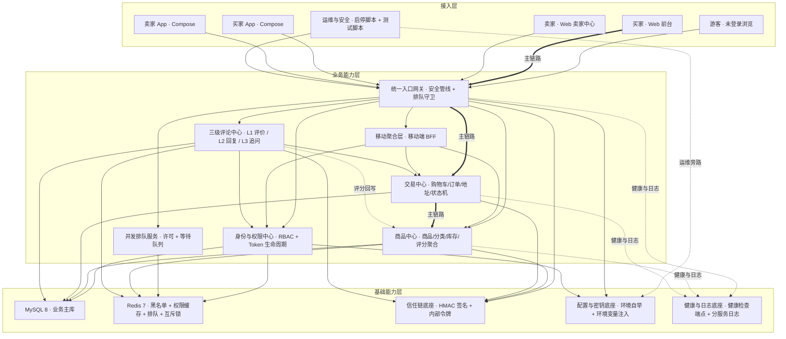
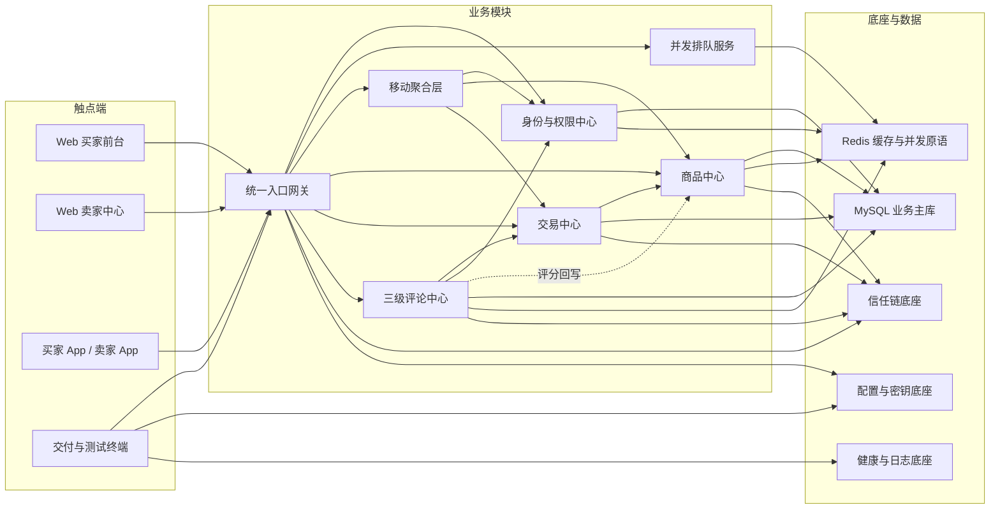

# e_platform 电商平台 · 高层架构设计

> 本文档为《AICoding 架构设计》核心产物之一，对应**高层架构设计模版**，是 Phase 3 / G3 阶段的唯一交付物。
> 上游输入：用户增量诉求（核心五件事）+ `material_digest.md`（G1 已通过，D1/D2/D3 逐章摘要 + 冲突 K1–K26）+ `research_report.md`（G2 已通过，6 家标杆 + 8 风险 + U-01~U-05 + D-01~D-06）；
> 下游输出：作为 `system-architect`《系统设计》与 `product-story-designer`《UserStory》的唯一上游边界基线，并驱动《部署设计》《安全设计》。

> **权责边界**：本文档冻结的是**业务边界、模块范围、MVP 范围、角色场景与功能清单**。数据库表结构归 `system-architect`；资源规格与运行时拓扑归 `platform-architect`；部署与安全最终方案归下游，本文档只给出业务侧约束与边界。

---

## 0. 元信息：修订记录

```yaml
标题: e_platform 电商平台 - 高层架构设计 v1.0
版本: v1.1
状态: Reviewing   # Draft | Reviewing | Approved | Deprecated（IC-01 已裁决，待主理人 G3 复核）
创建日期: 2026-08-01
最后更新: 2026-08-01
作者: 许边界 / business-architect（业务架构师）
评审人:
  - 主理人 / AICoding 架构 Team Lead
  - 许清楚 / 产品经理（PRD 作者）
  - 高见远 / 架构师（ARCH 作者）

关联文档:
  上游输入:
    - 业务原始诉求: 用户增量诉求「核心五件事」（鉴权底座 / 三级评论 / 并发保护 / 视觉升级 / 交付链路）
    - 产品需求文档: /Users/finn/Documents/workbuddy/e_platform/docs/PRD-增量需求.md
    - 存量架构文档: /Users/finn/Documents/workbuddy/e_platform/docs/ARCH-增量设计.md
    - 资料摘要: /Users/finn/Documents/workbuddy/e_platform/.workbuddy/output/material_digest.md
    - 行业调研报告: /Users/finn/Documents/workbuddy/e_platform/.workbuddy/output/research_report.md
  下游产出:
    - 系统设计: 由 system-architect 在 G4 产出（框架 API 选型须基于 Spring Boot 3.x）
    - 部署设计: 由 platform-architect 在 G5 产出
    - 安全设计: 由 security-architect 在 G5 产出（Spring Security 配置按 3.x 重写，WebSecurityConfigurerAdapter 已移除）
    - UserStory: 由 product-story-designer 在 G4 产出
```

| 版本 | 日期 | 作者 | 变更内容 | 评审状态 |
| --- | --- | --- | --- | --- |
| v0.1 | 2026-08-01 | 许边界 / business-architect | 初稿：§1 需求概要 + §2 需求分析与痛点解构 | Draft |
| v1.0 | 2026-08-01 | 许边界 / business-architect | 补齐 §3 行业调研整合、§4 方案决策、§5 业务架构、§6 产品需求及原型、附录 C 自检记录；就技术底座版本论题发起中间确认 IC-01，提交 G3 审核 | Reviewing |
| v1.1 | 2026-08-01 | 许边界 / business-architect | **IC-01 裁决回注**：采纳用户裁决「② 本期升级 3.x」。定点修订 §1.2 D2、§3.2 标杆结论、§3.3 D-01/U-05 状态、§4.2 技术底座约束行、§4.3 MVP 架构差异点、新增 §5.4 风险登记（3.x 升级风险）、§6.1 In/Out 范围（新增 N2、移除 O12）；各自检块与附录 C / 硬指标 / decision 中 IC-01 状态回注为「已裁决：② 本期升级 3.x」 | Reviewing（IC-01 已裁决，待 G3 复核） |

> **版本管理纪律**：破坏性变更（章节结构调整 / 关键决策反转）升 MAJOR；新增章节、扩充内容升 MINOR。本次 v1.0 → v1.1 为 MINOR（新增 §5.4 + 范围条目微调 + 已裁决论题定点回注，无章节结构破坏）。
> **冻结状态声明**：v1.0 全文曾仅有 1 处未冻结（§4.2 技术底座版本约束，IC-01）。**经中间确认 IC-01（用户裁决：② 本期升级 3.x）**，该论题已于本轮裁决并回注 §1.2 D2、§4.2 底座约束行、§4.3 架构差异点、§5.4 风险登记、§6.1 范围五处；D-01/U-05 状态改为「已裁决：② 本期升级 3.x」。**全文现已全部冻结，无遗留未冻结项。**

---

## 1. 需求概要

### 1.1 需求概要说明

e_platform 是一套已上线运行的自建全栈电商演示平台（Spring Boot 微服务 5 进程 + Vue3 Web 前台 + Kotlin/Compose 买卖家双 App，单机 Docker Compose 部署，存量测试账号 2 个）。本期由**存量读码勘察暴露的高危缺陷**触发：网关鉴权仅停留在「Token 可解析」、客户端可伪造身份头穿透到下游、商品评价无购买校验、一键启动脚本为 0 字节空文件、Android 产物为无签名 APK 无法安装。本系统在产品矩阵中定位为**唯一的自营交易与购后互动主站**，本期不新增业务域，而是把它从「功能演示态」升级为「可信交易 + 可对话 + 可交付」的完整形态。

**三要素归位**：业务现状 = 已运行的单机全栈电商，功能齐但底座不可信；触发事件 = 读码勘察出 OWASP API1/API2/API5 级越权缺陷与交付链路断裂（D2 §0 C1–C6、D3 §0 A1–A15）；系统定位 = 自营交易与购后互动主站（详见 §4.2）。

### 1.2 关键决策摘要

| 编号 | 决策类别 | 决策内容 | 关联章节 |
| --- | --- | --- | --- |
| D1 | 范围决策 | 本期只做「鉴权底座 + 三级评论 + 并发排队 + 视觉升级 + 交付链路」五件事共 14 项 P0 能力；支付、物流、SKU 多规格、优惠券营销、店铺装修、消息推送一律不做 | §6.1 需求边界 |
| D2 | 技术选型决策 | 全栈复用现有底座不引入新中间件：网关维持手写代理原地重构（不引入 Spring Cloud Gateway / APISIX）、不引入 RabbitMQ / Nacos / Kubernetes；**本期运行底座经中间确认 IC-01（用户裁决：② 本期升级 3.x）升级为 Spring Boot 3.x + Spring Cloud 2023.x + JDK 21**，含 javax→jakarta 全量改包、Spring Security 配置重写（WebSecurityConfigurerAdapter 已移除）、Spring Cloud 联动升级；实施顺序上先完成 3.x 底座升级，再在其上做鉴权/评论/并发改造，避免返工 | §3.2 / §4.2 / §4.3 / §5.4 |
| D3 | MVP / 完整版边界 | MVP = F1~F14 全部 P0 能力，退出标准为 V1~V8 八项量化目标全达标；Android 端收敛为「双 APK 可安装 + 主链路跑通 + 买家端评论只读」，评论写能力、限流 429 启用、评价图片上传、管理端 UI 延后至完整版 | §4.3 / §6.3 |
| D4 | 复用 vs 新建 | 复用：订单发货收货状态机、库存条件更新防超卖 SQL、JWT 工具、comment 存量表、Redis/MySQL/Compose 编排；新建：RBAC 四表、网关安全管线、排队服务、三级评论服务、HMAC 信任链拦截器 | §2.4 / §2.5 / §5.2 |
| D5 | 部署形态 | 私有化单机部署（单节点 Docker Compose + 5 个 Spring Boot 单实例进程 + Android 本地分发），不做多租户、不做多实例水平扩容；「单实例」为本期一切并发与一致性设计的显式前提 | §4.2 / §4.3 / §5.2 |

**硬指标**：≥ 3 条，≤ 5 条；每条决策必须能映射到正文具体章节。**达标情况**：5 条，全部映射到正文章节。

### 1.3 价值主张

| 价值维度 | 量化目标 | 度量指标 | 当前值 | 目标值 | 截止时间 |
| --- | --- | --- | --- | --- | --- |
| 合规（安全底线） | 已知越权场景全部拦截 | `tests/security_test.sh` 越权场景拦截率 | 0%（12 项场景当前全部可被突破） | 100%（12/12 拦截） | MVP 上线 |
| 合规（评价可信） | 评价与真实交易强绑定 | 有购买记录的 L1 评价占比 | 0%（任意登录用户可对任意商品发评） | 100% | MVP 上线 |
| 体验（交易可用性） | 峰值下单不再以报错拒绝用户 | 50 并发下单的 5xx 次数 / 超卖件数 | 未做保护，无位次反馈 | 5xx = 0 次，超卖 = 0 件，排队位次可见 | MVP 上线 |
| 体验（购后互动） | 商品页从单向展示变为三方对话 | 已完成订单的 L1 评价转化率 | 0%（无可信评价链路） | ≥ 30% | 完整版上线 |
| 效率（交付） | 全新环境一条命令拉起全栈 | 从零到可访问的人工命令数 / 启动脚本可用性 | ≥ 12 条手工命令，`start.sh` 为 0 字节 | 1 条命令（`./start.sh`），5 服务健康检查全通过 | MVP 上线 |
| 成本（技术债务控制） | 不以引入新组件换取功能 | 新增运行时中间件数 / 新增依赖数 | 基线：MySQL + Redis + RabbitMQ（预留未用） | 新增中间件 = 0；新增 Maven 依赖 ≤ 4 个；npm 与 Gradle 新增依赖 = 0 | MVP 上线 |

**硬指标**：业务价值 ≥ 2 条 + 技术/成本价值 ≥ 1 条；每条必须可量化，禁止出现模糊词。**达标情况**：业务价值 4 条（合规 2 + 体验 2），技术/成本价值 2 条（效率 1 + 成本 1），全部带数值口径。

---

## 2. 需求分析 & 痛点解构

### 2.1 核心角色关注点

| 角色 | 业务身份 | 主要操作 | Top1 关心点 | 来源 |
| --- | --- | --- | --- | --- |
| 甲方决策者：项目验收负责人 | 平台业主 / 交付验收方 | 验收演示、判定是否可交付 | 一条命令能否拉起全栈并当场跑通「登录→下单→评价」全链路与越权测试 | D2 §1 G3、D2 §8 交付物清单 |
| 最终用户 A：买家 | C 端注册买家（buyer1） | 浏览、加购、下单、确认收货、发表 L1 评价、发 L3 追问 | 高峰下单不报错且知道「前方还有多少人」；收货后能评价、评价被卖家回应 | D2 §2 US-B1~US-B4 |
| 最终用户 B：卖家 | 店铺经营者（seller1） | 商品增删改、发货、回复 L1 评价、查看待回复量 | 只能操作自己的商品与评价，差评不可删只可回复与举报，口碑处置有正规入口 | D2 §2 US-S1~US-S4、D2 §4.1 |
| 最终用户 C：平台管理员 | `ROLE_ADMIN`（本期仅预埋角色与权限，无后台界面） | 通过脚本隐藏违规评论、处理举报 | 拥有跨店治理权限但零成本预埋，不因缺少后台而阻塞 P0 交付 | D2 §7 Q2、D3 §10.2 Q-A1 |
| 受影响方：游客 / 潜在买家 | 未登录访客 | 浏览商品与全部三级评论 | 无需登录即可读完整评论以辅助决策；参与互动时被清晰引导登录而非静默失败 | D2 §2 US-G1~US-G3 |
| 受影响方：运维 / 交付工程师 | 部署与演示执行者 | 执行 `start.sh` / `stop.sh`、调排队阈值、构建 APK | 启停幂等且含健康检查，阈值改配置不改代码，APK 装得上 | D2 §2 US-O1~US-O4、D3 §1.9 |
| 受影响方：安全合规评审 | 越权测试与安全审查执行者 | 跑越权测试脚本、审查身份信任链 | 伪造身份头、跨用户改商品、未购评价、登出复用 Token、直连绕网关五类攻击 100% 拦截且可复现 | D2 §3 P0-19、D3 §9.10 |

**硬指标**：≥ 3 类（甲方决策者 / 最终用户 / 受影响方各至少一行）；每行必须有 Top1 关心点。**达标情况**：7 类角色（甲方决策者 1 + 最终用户 3 + 受影响方 3），Top1 关心点均为可判定表述。

### 2.2 核心痛点

| 编号 | 痛点描述 | 现象 / 数据 | 影响角色 | 影响程度 | 优先级 |
| --- | --- | --- | --- | --- | --- |
| P1 | 身份可伪造且下游无条件信任：网关先全量透传客户端 Header 再覆盖，下游服务直接 `@RequestHeader("X-User-Id")` 取值即信任 | 携带伪造 `X-User-Id` 在无 Token 或公开路径场景可穿透下游；直连 8085–8089 任一端口即可冒充任意用户，绕过率 100% | 买家、卖家、安全评审 | 高（OWASP API1 + API2 级越权） | P1 |
| P2 | 鉴权仅到「Token 可解析」层级：无角色校验、无权限码、无失效机制 | 250 行 `GatewayController` 仅判断 Token 能否解析；买家 Token 可调用 `POST /api/product/add`；登出后旧 Token 仍长期可用 | 卖家、安全评审、甲方 | 高（OWASP API5 功能级授权失效） | P1 |
| P3 | 评价体系是安全缺陷而非可用功能：`addReview()` 无任何购买校验 | 任意登录用户可对任意商品无限刷评；Android 端 64 个 kt 文件中评论相关代码为 0 | 买家、卖家、游客 | 高（评价可信度归零，交易口碑失真） | P1 |
| P4 | 交付链路断裂：`start.sh` 为 0 字节空文件，`stop.sh` 只停 Java 进程 | 全新环境需 ≥ 12 条手工命令且必须手动设置密钥，否则服务启动即失败；停止后 Docker 容器残留 | 运维、甲方 | 高（其余四件事均无法演示验收） | P1 |
| P5 | 移动端产物不可安装：两个 App 均无签名配置 | `assembleRelease` 产出 unsigned APK，安装必然失败；买家端开启混淆但无 keep 规则，运行时极易崩溃 | 买家、卖家、甲方 | 高（双 App 交付验收直接失败） | P1 |
| P6 | 错误语义混乱导致「拦截了也证明不了」：业务层 403 的 HTTP 状态仍是 200，前端拦截器又会吞掉非 200 响应 | `Result.error(403,...)` 实际返回 HTTP 200；`request.js` 中 `res.code !== 200` 即 reject，且默认只放行 2xx，导致 202 被拒、403/503 拿不到响应体 | 安全评审、买家、前端 | 高（401/403 无法区分，排队 UX 无法工作） | P1 |
| P7 | 峰值下单只能拒绝不能缓冲：无任何并发保护层 | 高峰期用户看到的是报错页而非排队位次；库存扣减仅靠单条条件更新 SQL 兜底，无入口侧保护 | 买家、卖家、甲方 | 中（转化流失 + 数据库连接池击穿风险） | P2 |
| P8 | 视觉停留在组件库默认态：默认蓝主色、无令牌体系、无骨架屏、无响应式 | 全站沿用组件库默认主色，无统一间距/圆角/阴影令牌；列表加载为转圈遮罩；平板宽度下布局塌陷 | 买家、游客、甲方 | 中（现代电商观感缺失，影响演示说服力） | P2 |

**优先级标准**：
- **P1**：直接影响业务核心流程或合规底线，不解决无法上线。
- **P2**：影响用户体验或运营效率，可在 MVP 后迭代。
- **P3**：体验型 / 长尾问题，列入完整版或后续版本。

**硬指标**：每条痛点必须有现象 / 数据佐证；P1 ≥ 1 条且必须在 §2.3 有对应目标。**达标情况**：8 条痛点全部带读码级现象数据，其中 P1 级 6 条（P1–P6），P2 级 2 条（P7–P8），每条均在 §2.3 有对应 V 级目标。

> **说明**：P7、P8 虽定级为 P2（体验型），但因用户诉求③④已将其列为本期核心五件事之一，故仍纳入 MVP 范围（见 §4.3、§6.3）。优先级刻画的是「不解决是否阻塞上线」，不等同于「是否进本期」。

### 2.3 期待目标

| 编号 | 目标描述 | 对齐痛点 | 度量指标 | 当前值 | 目标值 | 截止时间 |
| --- | --- | --- | --- | --- | --- | --- |
| V1 | 已知越权场景全量拦截且可重复验证 | P1、P2 | `tests/security_test.sh` 通过项 / 总项 | 0 / 12 | 12 / 12 | MVP 上线 |
| V2 | 评价与真实交易强绑定 | P3 | 未购买者发表 L1 的拦截率；一订单一商品重复评价的拦截率 | 0%；0% | 100%；100%（唯一约束兜底） | MVP 上线 |
| V3 | 三级对话链路完整可用且权限零漏判 | P3 | L1→L2→L3 链路完成率；权限矩阵 6 类角色 × 全部动作的漏判数 | 链路不存在；漏判数不可测 | 完成率 100%；漏判数 0 | MVP 上线 |
| V4 | 峰值下单以排队替代拒绝 | P7 | 50 并发下单的超卖件数 / 5xx 次数 / 位次可见性 | 无保护，无位次 | 0 件 / 0 次 / 位次与预计等待秒数可见且只减不增 | MVP 上线 |
| V5 | 一条命令拉起全栈并可幂等重复执行 | P4 | 启动人工命令数；5 服务健康检查通过率；迁移 SQL 连续执行次数 | ≥ 12 条；不可用；不适用 | 1 条；100%；连续 3 次结果一致 | MVP 上线 |
| V6 | 双端 APK 可安装且主链路跑通 | P5 | `apksigner verify` 通过的 APK 数；主链路（登录→浏览→下单）跑通率 | 0 / 2；不可安装 | 2 / 2；100% | MVP 上线 |
| V7 | 错误语义前后端一致 | P6 | HTTP 状态码与响应体语义一致率（401/403/408/409/503 五类） | 不一致（业务 403 返回 HTTP 200） | 100% 一致 | MVP 上线 |
| V8 | 现代电商观感与响应式达标 | P8 | 三个核心页面的默认主色残留处数；列表首屏骨架屏覆盖率；≥ 768px 横向滚动条出现次数 | 全站默认主色；0%；平板宽度下布局塌陷 | 0 处；100%；0 次 | MVP 上线 |

**硬指标**：每条目标必须有数字 + 对齐至少 1 条痛点；P1 痛点必须有对应 V 级目标。**达标情况**：8 条目标全部带数值口径；P1–P6 六条 P1 级痛点分别由 V1/V1/V2·V3/V5/V6/V7 覆盖，无遗漏。

### 2.4 基线复用

| 复用类别 | 现有能力 | 复用方式 | 来源系统 | 备注 |
| --- | --- | --- | --- | --- |
| 核心底座：统一入口 | 手写代理网关（Spring MVC + RestTemplate）+ 前端静态资源托管 + SPA 转发 | 原地重构为「路由壳 + 安全管线」，保留承载形态 | e-platform-gateway (8088) | 不引入 Spring Cloud Gateway：其基于 WebFlux，与现有 servlet 栈不兼容（research_report SR-09） |
| 核心底座：认证 | JWT 签发校验工具、BCrypt 加密、密钥环境变量注入 | 扩展（新增 jti / roles / refresh 三类能力），旧签名方法保留 | e-platform-common | 移动聚合层仍依赖旧方法签名，不可删除 |
| 交易状态机 | 发货、确认收货完整实现（状态 1→2→3，含归属校验） | 直接复用，后端零开发，仅补前端触发按钮 | e-platform-order (8087) | 这是「无支付物流也能流转到可评价状态」的关键复用点 |
| 防超卖 | 库存条件更新 SQL（受影响行数为 0 即失败回滚） | 直接复用且本期不改 | e-platform-product (8086) | 唯一的超卖真相来源；排队机制不得成为防超卖的唯一手段 |
| 数据模型 | `comment` 存量表 + `Review` 实体族 | 原表扩列 + 新建评论实体共表；旧控制器降级为兼容层 | e-platform-product | 避免破坏移动端与存量前端调用 |
| 缓存与并发原语 | Redis 实例（已在编排中运行） | 扩展用途：Token 黑名单、权限缓存、排队许可与队列、回复互斥锁 | 基础设施 | 网关需新增 Redis 客户端依赖 |
| 服务间调用 | OpenFeign（订单模块已具备）、内部令牌校验（库存接口已具备） | 直接复用范式，商品模块照抄配置 | e-platform-order / product | 商品模块需新增 Feign 依赖 |
| 编排与交付 | Docker Compose 编排、停止脚本主体逻辑 | 修复 + 扩展（镜像切换、健康检查、容器停止、数据卷可选清理） | 项目根目录 | 启动脚本为 0 字节需从零构建 |
| Web 前端 | Vue3 + Vue Router + Pinia + 组件库 + 构建工具 | 完整复用，视觉令牌以 CSS 变量方式覆盖 | frontend | 零新增 npm 依赖，不引入原子化 CSS 框架 |
| 移动端 | 双 App + 共享库（网络层 / 依赖注入 / 主题） | 完整复用，新增运行时地址拦截器与只读评论组件 | android | 零新增 Gradle 依赖，仅配置变更 |
| 消息中间件 | RabbitMQ（编排中已配置，后端未消费） | 不启用 | 基础设施 | 评分聚合改为同步写 + 定时兜底，避免为单一功能引入调试成本 |
| 服务注册 | 注册中心开关（默认关闭，地址硬编码） | 维持关闭，仅将服务地址外置为环境变量 | 全后端模块 | 单机场景下注册中心收益低于运维成本 |

**硬指标**：必须先盘点再决定新建；凡列入功能缺口的能力，必须先在本节确认基线无法覆盖。**达标情况**：12 类基线逐项给出复用方式，§2.5 全部 9 项缺口均可回指本表中「基线不存在或基线为缺陷态」的判定。

### 2.5 功能缺口

| 阶段 | 功能缺口 | 必要性 | 优先级 | 对齐目标 |
| --- | --- | --- | --- | --- |
| 接入与鉴权 | 角色权限模型（角色、权限、绑定关系、注册自动授权）—— 基线只有 `user_type` 单字段，无权限概念 | 必须 | MVP | V1 |
| 接入与鉴权 | 路由到权限码的细粒度映射与 401/403 严格区分 —— 基线为公开路径粗粒度白名单 | 必须 | MVP | V1、V7 |
| 接入与鉴权 | Token 生命周期（刷新令牌 + 登出黑名单 + 移动聚合层同步校验）—— 基线无失效机制 | 必须 | MVP | V1 |
| 接入与鉴权 | 身份头净化与网关到服务的签名信任链 —— 基线为「全量透传后覆盖」，等于无信任链 | 必须 | MVP | V1 |
| 购后互动 | 三级评论模型与树形查询（含级联可见性、脱敏、评分聚合）—— 基线仅单层裸评价 | 必须 | MVP | V3 |
| 购后互动 | 购买资格校验与一单一评唯一性 —— 基线完全缺失 | 必须 | MVP | V2 |
| 交易与并发 | 并发许可 + 等待队列 + 位次回传 + 降级放行 —— 基线无任何入口侧保护 | 必须 | MVP | V4 |
| 交易与并发 | 前端排队协议支撑（响应拦截器改造 + 遮罩 + 轮询 + 自动重放）—— 基线拦截器会吞掉排队响应 | 必须 | MVP | V4、V7 |
| 交付与运维 | 一键启停、环境自举与密钥自动生成、幂等迁移、双端可安装产物 —— 基线启动脚本为空、产物无签名 | 必须 | MVP | V5、V6 |
| 体验升级 | 视觉令牌体系、骨架屏、响应式与三级评论区界面 —— 基线为组件库默认态 | 重要 | MVP | V8 |
| 质量保障 | 越权与并发测试用例集 —— 基线仅有通用端到端脚本，无越权断言 | 必须 | MVP | V1、V4 |
| 运营（延后） | 卖家待回复徽标、评论内容安全、限流启用、评价图片上传、移动端评论写能力 | 重要 | 完整版 | V3、V4 |

**硬指标**：每条缺口必须对齐 §2.3 至少一条目标；MVP 缺口必须在 §6.3 功能清单中对应有 MVP 范围标记。**达标情况**：12 条缺口全部对齐 V 级目标；11 条 MVP 缺口在 §6.3 中对应 F1–F14，均标记 MVP ✅。

---

## 3. 行业调研

> 本章为 `research_report.md`（G2 已通过）结论的整合与裁决落位。事实与打分沿用调研报告，**边界裁决在本文档完成**。

### 3.1 行业标杆系统分析

| 标杆系统 | 厂商 / 来源 | 场景覆盖 | 技术亮点 | 商业模式 | 适用度 |
| --- | --- | --- | --- | --- | --- |
| macrozheng/mall + mall-swarm | macrozheng 开源社区（Apache-2.0） | Java 电商全栈：商品 / 订单 / 会员 / 权限 / 网关 | 维护分支为 Spring Boot 2.7 + MyBatis + MySQL + Redis，与本项目同源；安全模块提供认证授权的模块化封装范式 | 开源 | 高 |
| Discourse | Discourse 开源社区（GPL-2.0） | 层次化讨论与嵌套回复 | 帖子单表自关联（空值表示主楼）+ 数据库侧递归查询回溯祖先链，主楼与回复共表 | 开源 + 托管订阅 | 高 |
| Apache APISIX | Apache 软件基金会（Apache-2.0） | 云原生 API 网关 / 统一鉴权入口 | 插件化认证链，支持三类签名算法，密钥可外置到环境变量或密钥管理服务 | 开源 + 商业支持 | 中 |
| Shopify（Admin API + 评价体系） | Shopify Inc.（头部电商 SaaS） | 商品 / 订单 / 评价 / 员工权限 / API 配额 | 标准评价对象内建订单引用与买家核验标记；约 30 项细粒度权限枚举且权限间自动依赖；漏桶限流并向调用方回传配额三元组 | 订阅制 SaaS | 中 |
| Saleor | Saleor Commerce（BSD-3） | Headless 电商全域 | 官方安装路径即容器编排一键起栈，生产参考栈为 5 服务切分 | 开源 + 云托管 | 中 |
| Cloudflare Waiting Room | Cloudflare（头部边缘 SaaS） | 流量洪峰下的虚拟排队 | 先进先出虚拟等候室，双阈值触发，会话位置稳定，动态调节入场速率 | 订阅制 SaaS | 低 |

**硬指标**：≥ 3 家；至少包含 1 家头部 SaaS + 1 家开源/自研代表。**达标情况**：6 家；头部 SaaS 2 家（Shopify、Cloudflare），开源/自研 4 家（macrozheng-mall、Discourse、APISIX、Saleor）。

### 3.2 方案对标及优先级打分

**对比矩阵**（每行权重之和 = 1.00；1 分为严重不符合，3 分为基本满足但有明显局限，5 分为完美契合）：

| 评估维度 | 权重 | macrozheng-mall 得分 | Discourse 得分 | APISIX 得分 | Shopify 得分 | Saleor 得分 | Cloudflare 得分 |
| --- | --- | --- | --- | --- | --- | --- | --- |
| 场景契合度 | 0.30 | 5 | 4 | 3 | 5 | 2 | 3 |
| 技术成熟度 | 0.20 | 4 | 5 | 5 | 5 | 4 | 5 |
| 集成难度（反向） | 0.20 | 5 | 3 | 2 | 2 | 2 | 2 |
| 成本（反向） | 0.10 | 5 | 5 | 4 | 2 | 4 | 2 |
| 合规可控性 | 0.20 | 5 | 5 | 5 | 2 | 5 | 2 |
| **加权总分** | **1.00** | **4.80** | **4.30** | **3.70** | **3.50** | **3.20** | **2.90** |

> 权重说明：集成难度由模板默认 0.15 上调至 0.20、成本由 0.15 下调至 0.10，理由是本项目为存量改造而非绿地新建，落地与否由集成难度直接决定，而人力成本已被集成难度维度吸收。调研报告已用模板默认权重重算验证，两套权重下六家排名完全一致，结论对权重不敏感。

**结论摘要**：
- **优先借鉴**：macrozheng-mall（4.80）—— 六家中唯一可做代码级对照的对象，其维护分支与本项目同为 Spring Boot 2.7 + MyBatis + MySQL + Redis，安全模块的模块化划分方式直接指导本期鉴权底座的职责切分；容器编排脚本为一键启停提供结构参照。**限定条件**：必须参照维护分支而非已升级到新框架大版本的主线分支，且仅作工程组织方式参照，权限粒度与 Token 生命周期以官方安全框架文档与 API 安全基线为准绳。**（经中间确认 IC-01 裁决：本项目本期升级至 Spring Boot 3.x，与 macrozheng 维护分支的 2.7 不再同源，故本标杆仅保留「工程组织方式」参照价值，框架 API 以 Spring Boot 3.x 官方文档为准；鉴权底座职责切分方式仍借鉴。）**
- **优先借鉴**：Discourse（4.30）—— 以长期生产验证证明「单表自关联 + 数据库侧递归查询」足以支撑嵌套回复，无需引入闭包表；且「主楼与回复共表」与本项目「新评论实体与存量评价实体共表」的既定方向天然一致。**限定条件**：查询必须走数据库侧递归或基于根标识的单次批量查询，禁止退化为应用层逐层循环。
- **部分借鉴**：APISIX（3.70）—— 只借鉴其对签名算法与**密钥外置**的处理范式，用于指导本项目三类密钥由启动脚本随机生成并经环境变量注入。**不引入运行时**：引入将使单机编排额外增加两个中间件，与一键启停的简化目标直接冲突。
- **部分借鉴**：Shopify（3.50）—— 借鉴三点：评价对象强绑定订单与买家核验（直接对治「无购买校验」缺陷）；权限按「资源 × 动作」成对建模；结算路径超限时官方建议「请求队列 + 指数退避」，为「排队而非拒绝」提供头部厂商佐证。**不可照搬**：其商家回复是评价对象上的平铺字段，只适用两层场景，本项目需要第三层追问。
- **部分借鉴**：Saleor（3.20）—— 仅借鉴「完整电商系统的标准分发形态可以就是容器编排一键起栈」这一形态正当性；技术栈全面异构，代码零可复用。
- **不借鉴**：Cloudflare Waiting Room（2.90）—— 否决理由：强依赖公网入口与边缘网络接入，本项目为本机单机部署不具备前置条件；其排队作用于站点/路径级流量，无法表达「某商品剩余库存 N 件」的业务资源级约束。**保留**：其「排队状态独立回传 + 位置稳定 + 自动放行」的交互契约仍作为 §6.4 排队遮罩的设计参照，属设计模式引用，不改变否决结论。

**两处缺口的处置**（调研已明确无标杆对口，本文档裁决为自研）：
1. **视觉升级无标杆对口** —— 六家标杆前端栈均无向本项目前端栈迁移的价值，裁决为自研，以 CSS 变量覆盖组件库主色系列实现，不引入原子化 CSS 框架、不改造样式编译链。
2. **服务端并发原语无标杆对口** —— 标杆提供的是模式而非实现。裁决为：MVP 采用「网关侧 Redis 许可 + 等待队列」与「商品服务侧本地信号量」双层，分布式许可库列为多实例扩容时的演进选项，不进 MVP。

### 3.3 完整报告参考

- 完整报告路径：`/Users/finn/Documents/workbuddy/e_platform/.workbuddy/output/research_report.md`
- 调研工具：`tech-research-advisor`（见附录 B）
- 调研日期：2026-08-01
- 报告规模：6 家标杆 × 10 维度详述卡片；23 条可追溯来源；8 条风险；5 条待确认项；6 条下游依赖项
- 本文档对报告的消化情况：§3.1 / §3.2 整合其事实与打分；§4.1 / §4.3 消化其自研复用边界建议与 MVP 建议；§5.2 / §6.1 消化其风险与依赖项；U-05 / D-01 升级为本文档的中间确认 IC-01，**且已于本轮裁决（用户裁决：② 本期升级 3.x），状态：已裁决**，落位见 §1.2 D2、§4.2、§4.3、§5.4、§6.1

---

## 4. 方案决策

### 4.1 价值定位澄清

**定位三段式**：

```
对外价值（客户侧）: 买家从「评价不可信、峰值报错、登出仍可被冒用」升级为「评价必来自真实交易、峰值有位次可等、登出即失效」；
                    游客无需登录即可读完整三级评论辅助决策；卖家获得可回应差评但不可删差评的正规口碑处置入口。
对内价值（运营侧）: 平台方获得可复现的越权测试基线（12 项场景）与一条命令的全栈启停能力，
                    验收从「逐条手工命令 + 口头说明」变为「脚本化演示 + 断言化验证」。
差异化价值        : 在不引入任何新中间件（消息队列 / 注册中心 / 新网关 / 容器编排平台均不引入）、
                    不改动防超卖真相来源 SQL 的前提下，完成 OWASP API1/API2/API5 三类缺陷闭合
                    与三级对话场域从零建立——即「零新增运行时组件的安全与体验双升级」。
```

**与产品矩阵的关系**：e_platform 是唯一自营站点，本期不新增业务域。本系统在「浏览 → 交易 → 履约 → 口碑 → 复购」这条价值主线中同时承担全部环节；本期新增的**身份与权限中心**为全链路提供可信身份，**三级评论中心**把断裂在「确认收货」处的链路延长到「口碑 → 复购」，与商品中心、交易中心共同形成完整业务闭环（见 §5.2、§5.3）。

### 4.2 系统定位澄清

| 维度 | 内容 |
| --- | --- |
| 系统名称 | e_platform 电商平台（本期增量代号：可信交易与购后互动增强） |
| 系统类型 | 已有系统扩展（存量改造）。不是绿地新建，也不是推倒重做：五件事全部建立在既有 5 个微服务 + 1 个 Web 前台 + 2 个 App 的形态之上 |
| 部署形态 | 私有化单机。单节点容器编排承载 MySQL 8 / Redis 7（消息队列容器保留但不启用），5 个 Spring Boot 进程各单实例，Web 前台由网关进程托管静态资源，Android 端为本地 APK 分发 |
| 多租户 | 否。买家 / 卖家 / 管理员是**业务角色**而非租户，全系统单库单实例，不做数据隔离分区 |
| 服务对象 | 对齐 §2.1 七类角色：项目验收负责人、买家、卖家、平台管理员（仅预埋）、游客、运维交付工程师、安全合规评审 |
| 上游依赖 | 无外部业务系统依赖。仅依赖自建基础设施：MySQL 8（业务主库）、Redis 7（黑名单 / 权限缓存 / 排队 / 互斥锁）。详见 §5.2 |
| 下游消费者 | Web 前台（网关托管）、买家 App、卖家 App、`tests/` 自动化测试脚本。详见 §5.2 |
| 对外承诺（SLA 口径） | 演示级可用性，不承诺量化可用性等级；承诺三项可验证行为：登出后旧令牌立即失效、50 并发下单零超卖、一条命令完成全栈启动 |
| 边界（不做） | 不做支付渠道与物流对接（以模拟发货 / 模拟收货流转订单状态）；不做 SKU 多规格、优惠券营销、店铺装修、消息推送；不做多租户与水平扩容；不引入新网关（Spring Cloud Gateway 与 servlet 栈不兼容、APISIX 需额外两个中间件）、不引入消息队列、不引入注册中心、不引入容器编排平台。**注：Spring Boot 3.x 为既有栈的版本升级（经中间确认 IC-01 裁决纳入本期），不属新增运行时中间件，与「零新增中间件」约束不冲突。** |
| 技术底座约束 | 本期取 **Spring Boot 3.x + Spring Cloud 2023.x + JDK 21** + MySQL 8 + Redis 7 + Vue3 + Kotlin/Compose。**经中间确认 IC-01（用户裁决：② 本期升级 3.x）**：运行底座由 2.7.18 升 3.x 已纳入本期范围，连锁影响包括 javax→jakarta 全量改包、Spring Security 配置重写（WebSecurityConfigurerAdapter 已移除）、Spring Cloud 联动升级；实施顺序为「先完成 3.x 底座升级，再在其上做鉴权/评论/并发改造」，避免与诉求①（鉴权安全底座）重叠导致的二次返工。D-01 / U-05 状态：**已裁决：② 本期升级 3.x**。 |

---

> ### 🔍 自检 #1 — §4.1 价值定位 + §4.2 系统定位完成后
>
> **本轮涉及的决策点**：① 系统类型取「存量扩展」而非重写；② 部署形态取「私有化单机、非多租户」；③ 不引入新网关 / 消息队列 / 注册中心 / 容器编排平台；④ **技术底座版本：是否将 Spring Boot 2.7.18 + JDK 21 冻结为长期硬约束**。
>
> **协议 §2.1「方案分歧型」逐条判定**：
>
> | 决策点 | 条件1：≥2 种合理方案 | 条件2：影响下游产出 | 条件3：用户诉求/上游未对该点明确选择 | 三条件同时成立？ |
> | --- | --- | --- | --- | --- |
> | ① 存量扩展 vs 重写 | 不满足（重写不具合理性：五件事均为对既有形态的加固，重写代价与收益严重失衡） | 满足 | 不满足（用户诉求原文即「基于 e_platform 电商平台……生成完整架构方案」，已限定为既有平台增量） | ❌ |
> | ② 单机私有化、非多租户 | 不满足（用户诉求与既有形态均为本机单机演示，多租户无业务承载对象） | 满足 | 不满足（诉求⑤「修复一键启停交付链路（start.sh/stop.sh/docker-compose/APK 签名）」已显式限定单机编排形态） | ❌ |
> | ③ 不引入新网关 / 队列 / 注册中心 | 满足（引入 vs 不引入均可论证） | 满足 | **不满足**（此点已被用户自带文档明确选择：ARCH §1.2 明确不引入 Spring Cloud Gateway、§1.7/§10.3 明确不引入消息队列、§10.3 明确维持注册中心关闭，且 §8 依赖清单逐项列出「不引入」名单） | ❌ |
> | ④ **技术底座版本冻结** | **满足**（维持 2.7.18 / 本期升级 3.x / 维持但标注为临时过渡，三者各有合理性） | **满足**（直接决定 system-architect 的框架 API 选择、security-architect 的安全框架配置写法、platform-architect 的运行时 JDK 与镜像基线） | **满足**（用户诉求仅将 2.7.18 作为**现状描述**列出，五件事中不含框架升级；ARCH 只裁决了「JDK 取 21」，从未裁决「2.7.18 是否为长期硬约束」；调研报告 U-05 亦明示「取决于业务方偏好而非公开事实」，且 D-01 显式建议在 G3 冻结前单独确认） | ✅ **命中** |
>
> **协议 §2.3 反向验证 3 问（针对决策点 ④）**：
>
> | 问题 | 答案 | 证据 |
> | --- | --- | --- |
> | Q1 若 3 个月后被推翻，返工成本可控吗？ | **不可控** | 返工范围 = 本文档 §4.2 底座约束行 + §4.3 架构差异点 + 下游《系统设计》全部接口与配置章节 + 《安全设计》全部安全框架配置章节 + 代码侧 common / user / gateway / product / order / mobile **六个模块全量**。切换成本 = `javax.*` → `jakarta.*` 全量改包（涉及全部 Servlet / Validation / Persistence 注解）+ 安全框架配置基类在 3.x 已移除导致的配置整体重写 + Spring Cloud 版本联动升级，量级为**月级（≥ 1 人月）**，且与本期诉求①「补齐鉴权安全底座」高度重叠——先按 2.7.18 做完鉴权底座再升 3.x，等同于把诉求①重做一遍。命中协议 §2.2(1)。 |
> | Q2 用户/客户/监管能感知到吗？ | **能感知（安全合规评审方）** | 感知方 = 安全合规评审与验收负责人；感知点 = Spring Boot 2.7 的开源支持已于 2023-06 终止，此后仅商业订阅提供企业支持；且 2.7.18 官方支持 Java 8–19，而本项目实测唯一可行解为 JDK 21，属**双重超出官方支持矩阵**。这意味着后续若出现 2.7.x 安全漏洞将无社区补丁，构成可被审查方指出的安全暴露面。命中协议 §2.2(2)。 |
> | Q3 与用户原始诉求显式提及的能力是否一致？ | **用户诉求未显式提及此点** | 用户诉求原文：「基于 e_platform 电商平台（Spring Boot 2.7.18 微服务 + Vue3 前端 + Android Kotlin/Compose 双 App）生成完整架构方案」——此处 2.7.18 是**现状陈述**，非「冻结为长期硬约束」的显式选择；诉求列出的五件事与非目标清单均不含框架升级或框架冻结。属「未显式提及但会改变对外的技术支持承诺与安全暴露面」，命中协议 §2.2(3)。 |
>
> **判定结论**：决策点 ④ 同时命中协议 §2.1 三条件与 §2.2 全部三项，**必须发起 `[中间确认]`（编号 IC-01）**。决策点 ①②③ 均未命中，其中 ③ 属协议 §6「用户已明确事项」（用户自带 ARCH 文档已逐项裁决），禁止包装为中间确认重复打扰。
> **（IC-01 已于 2026-08-01 收到用户裁决：② 本期升级 3.x；裁决回注见 §1.2 D2、§4.2 技术底座约束行、§4.3 架构差异点、§5.4 风险登记、§6.1 范围，全文已据此冻结。）**
>
> **阻塞处置（已解除）**：§4.2 技术底座约束行、§4.3 架构差异点、§1.2 D2 三处曾因 IC-01 暂停冻结；现 IC-01 已裁决（② 本期升级 3.x），三处均已回注，全文冻结。

---

### 4.3 MVP 与完整版决策

| 阶段 | 时间窗 | 范围（功能编号） | 架构差异点 | 退出标准 | 不做（延后） |
| --- | --- | --- | --- | --- | --- |
| MVP | W1 ~ W5 | F1 ~ F14（全部 14 项 P0）+ N2（经 IC-01 裁决引入的 Spring Boot 3.x 底座升级） | 单节点单实例；排队许可采用「网关侧 Redis 许可 + 队列」+「商品服务侧本地信号量」双层，不引入分布式许可库；评分聚合走同步写 + 定时兜底，不启用消息队列；管理员仅有角色与权限模型、无后台界面；评价图片仅保留字段与接口、前端不暴露入口；限流阈值仅保留配置位、不启用；移动端仅买家侧评论只读；**运行底座按 IC-01 裁决（Spring Boot 3.x + Spring Cloud 2023.x + JDK 21，详见 §4.2 技术底座约束），实施顺序为先完成 3.x 底座升级再叠加业务改造** | V1~V8 八项目标全部达标：12 项越权用例全通过、50 并发下单零超卖零 5xx、一条命令启动且迁移连续执行 3 次幂等、两个 APK 签名校验通过且主链路跑通、三个核心页面零默认主色残留、错误码语义一致率 100% | F15 ~ F24 |
| 完整版 | W6 ~ W12 | + F15 ~ F20（P1 全量） | 移动端双 App 补齐评论写能力与排队体验；启用令牌桶限流与 429 语义；接入评价图片上传与对象存储；卖家中心待回复徽标与列表化回复；评论内容安全（敏感词、转义、频率限制）；移动端 Web 窄屏响应式 | 三级评论在 Web 与双 App 三端行为一致；限流阈值经压测标定后启用；评价图片上传成功率 ≥ 99%；窄屏（小于 768px）无横向滚动与元素重叠 | F21 ~ F24（P2 全量），以及 §6.1 Out-of-Scope 全部条目 |

**演进纪律**（重要）：
- ✅ MVP 的架构骨架是完整版的**子集**：MVP 已建立「网关安全管线 → 权限码 → 服务层归属校验」三段式与「评论单表三层模型」，完整版只做加法（补端、补治理、补启用开关），不推翻任何已冻结结构。
- ✅ MVP 中被降级的能力均已明确完整版替换计划：图片上传（MVP 保留字段与接口契约，完整版补存储与上传入口）、限流（MVP 保留阈值配置项，完整版压测标定后启用）、管理端（MVP 保留角色与权限码，完整版补界面）、移动端评论（MVP 只读，完整版补写）。
- ✅ 单实例假设显式化：本地信号量、无注册中心、无消息队列三项决策共同隐含「单实例部署」前提。**扩容前置条件**：商品服务由单实例扩为多实例前，必须先将本地信号量切换为带租约的分布式许可，否则总并发会放大为「实例数 × 许可数」导致保护失效。该前置条件必须写入部署文档。
- ❌ 禁止：为赶 MVP 引入完整版无法继承的临时结构。具体禁止项——禁止把评论第三层落成独立表（完整版无法回到共表）、禁止把权限判断硬编码进业务代码（完整版无法迁移到权限码表）、禁止在前端用用户类型字段推断按钮显隐（必须走服务端下发的权限与可视上下文）。
- ⚠️ **IC-01 底座升级顺序纪律**：3.x 升级（N2）须作为 W1 首个里程碑先行完成并冻结底座，再在其上叠加 F1~F14 业务改造；不得将 2.7.18 形态的鉴权/评论/并发代码先写一遍再整体迁移到 3.x，以免与诉求①重叠造成二次返工（见 §5.4 风险 R-IC01-1）。

---

> ### 🔍 自检 #2 — §4.3 MVP / 完整版决策与部署形态决策完成后
>
> **本轮涉及的决策点**：① MVP 范围裁剪（限流不启用、图片上传不做、管理端界面不做、移动端评论只读、卖家待回复徽标延后）；② 部署形态与单实例前提的显式化；③ 排队原语选型（本地信号量 + Redis 许可 vs 分布式许可库）。
>
> **协议 §2.1「方案分歧型」逐条判定**：
>
> | 决策点 | 条件1 | 条件2 | 条件3 | 三条件同时成立？ |
> | --- | --- | --- | --- | --- |
> | ① MVP 范围裁剪 | 满足 | 满足 | **不满足** | ❌ |
> | ② 单实例部署形态 | 不满足（诉求⑤已限定单机编排，多实例无承载环境） | 满足 | 不满足 | ❌ |
> | ③ 排队原语选型 | 满足 | 满足 | 不满足（单实例前提下分布式许可库无增量收益，且引入新依赖与 D2「零新增中间件」冲突；ARCH §1.4 已裁决本地信号量，调研报告亦将分布式许可库明确列为「多实例扩容时的演进选项而非 P0 必需」） | ❌ |
>
> 决策点 ① 条件 3 不满足的证据（逐条回指用户自带文档的显式选择）：限流降级 → 用户自带 ARCH §10.2 Q-A4 明确「429 可降级 P1、不在 P0 19 条内」；图片上传不做 → PRD §7 Q7 提问 + ARCH §1.7/§3.2 明确「字段接口保留、前端不暴露入口、本地上传列 P1」；管理端界面不做 → PRD §7 Q2 提问 + ARCH §10.2 Q-A1 明确「P0 不做 admin UI」；移动端评论只读 → PRD §7 Q6 提问 + ARCH §1.8 明确「P0 只保三件事，买家 App 评论只读、卖家 App 不动评论」。四项均属**用户方在自带 PRD/ARCH 中已作出的显式选择**。
>
> **协议 §2.3 反向验证 3 问（针对决策点 ①，最具争议者）**：
>
> | 问题 | 答案 | 证据 |
> | --- | --- | --- |
> | Q1 若 3 个月后被推翻，返工成本可控吗？ | **可控** | 返工范围 = 本文档 §6.1 In-Scope 清单 + §6.3 功能清单四行（F15/F18/F20/F22 的 MVP 列）+ §4.3 时间窗，共 3 个章节、4 张表行；代码侧四项均为**纯加法**：限流启用 = 网关新增一个过滤器（不改已定路由权限表）、图片上传 = 新增上传接口与存储适配（评论接口已保留图片字段，契约不变）、管理端界面 = 新增前端路由与页面（权限码 `admin:access` 已在 MVP 建好）、移动端评论写 = 新增两个接口调用（评论接口契约已冻结）。**均不触碰已冻结的数据模型与接口契约**，切换成本合计约 0.5 人月。不命中 §2.2(1)。 |
> | Q2 用户/客户/监管能感知到吗？ | **能感知，但该感知点对应的取舍已由用户方显式作出** | 感知方与感知点：买家感知不到评价图片入口；卖家感知不到 App 内回复能力；管理员感知不到后台界面；高频操作者感知不到限流提示。**但这四个感知点全部对应用户自带 PRD §7 Q2/Q6/Q7 的提问与 ARCH §10.2 Q-A1/Q-A4、§1.7、§1.8 的显式回答**，属协议 §6 明令禁止的「把用户已明确事项包装成中间确认重复打扰」。处置方式：不发起确认，改为在 §6.1 Out-of-Scope 逐条登记（O7/O8/O9/O11），并要求交付文档显式声明缺口范围，不得默认「能力已具备」。 |
> | Q3 与用户原始诉求显式提及的能力是否一致？ | **一致** | 用户诉求原文非目标清单：「支付/物流对接、SKU 多规格、优惠券营销、店铺装修、消息推送」——被裁剪的四项均不在诉求五件事的必达内容内；诉求②原文为「新建三级评论体系（L1 购后评价 / L2 卖家回复 / L3 第三方追问）」，未指定必须覆盖移动端双 App，MVP 已在 Web 端完整实现 L1/L2/L3 三层，诉求②本身完整达成。 |
>
> **§2.2「跨界感知型」复核**：本轮不绑定任何外部供应商、不产生商务条款、不锁定合规认证体系、不涉及数据出境。不触发。
>
> **结论：本轮无需发起 `[中间确认]`，继续推进 §5。**（IC-01 已于本轮裁决：② 本期升级 3.x，本节「架构差异点」列中的底座版本描述已回注为 Spring Boot 3.x + JDK 21。）

---

## 5. 业务架构设计

### 5.1 业务架构图

**绘制规范执行说明**：三层结构为「接入层（用户与触点）→ 业务能力层（核心模块）→ 基础能力层（底座与数据）」；每个模块使用与 §4.2、§6.2 一致的标准名；实线为同步调用，虚线为异步事件或旁路，标注「主链路」的为端到端核心路径。



**分层归属说明**：
- **接入层**：六类触点，其中游客为唯一无身份触点（只读全部三级评论）；运维与安全触点不经业务路径，直连配置底座与健康端点。
- **业务能力层**：七个模块。统一入口网关是**唯一对外入口**，承担身份解析、权限决策、身份头净化、签名写入、排队守卫五项横切职责；身份与权限中心、并发排队服务为本期新增能力；三级评论中心为本期新建业务域并物理落在商品服务内。
- **基础能力层**：五类底座。信任链底座是本期新增的关键底座，负责「网关签发 + 下游校验」两端分离的签名机制；配置与密钥底座负责启动时自举生成三类密钥。

### 5.2 系统依赖架构

| 依赖类型 | 系统 / 模块 | 提供方 | 依赖能力 | 接入方式 | 同步/异步 | 关键约束 |
| --- | --- | --- | --- | --- | --- | --- |
| 上游（基础设施） | MySQL 8 | 自建（单节点容器） | 业务主库读写 | JDBC + 连接池 | 同步 | 单实例无主从；50 并发下单前需确认连接池上限不低于并发许可数；防超卖依赖条件更新 SQL 的受影响行数判定 |
| 上游（基础设施） | Redis 7 | 自建（单节点容器，官方镜像 + 追加写持久化） | 令牌黑名单、角色权限缓存、排队许可与队列、回复互斥锁 | Redis 协议 | 同步 | 键命名遵循「域:子域:标识」全小写冒号分隔；**必须可降级**——不可用时排队降级为本地信号量并直接放行，业务不得中断 |
| 上游（基础设施，不启用） | 消息队列容器 | 自建（编排中保留） | 无 | 不接入 | 不适用 | 本期明确不消费；评分聚合改为同步写 + 定时全表兜底 |
| 内部（横切） | 统一入口网关 → user / product / order / mobile | 后端安全组 | 请求转发 + 身份注入 + 签名写入 | HTTP + RestTemplate | 同步 | 必须设置连接与读取超时（连接 3 秒 / 读取 20 秒），避免下游挂起拖垮入口；转发前必须先剥离客户端传入的内部身份头前缀再写入 |
| 内部（信任链） | 下游四服务 ← 网关签名 | 后端安全组 + common 模块 | 请求来源可信性校验 | 请求头签名 + 拦截器校验 | 同步 | 签名两端**代码分离**（网关不依赖 common，否则自我拦截）；时间窗口 5 分钟；必须常量时间比较；匿名请求同样签名，避免「无签名即匿名」绕过 |
| 内部（跨服务） | 三级评论中心 → 交易中心 | 后端业务组 | 购买资格判定（用户 + 商品 + 订单已完成） | Feign + 内部令牌 | 同步 | 该接口必须在网关侧标记为内部拒绝（外部访问一律 403）；判定口径取最新一条已完成订单 |
| 内部（跨服务） | 三级评论中心 → 身份与权限中心 | 后端业务组 | 批量用户名查询（用于脱敏展示） | Feign + 内部令牌 | 同步 | 必须批量取，禁止逐条查询造成 N+1；脱敏在评论侧完成 |
| 内部（跨服务） | 交易中心 → 商品中心 | 后端业务组 | 库存扣减与回滚 | Feign + 内部令牌（不经网关） | 同步 | 幂等由订单状态机保证；商品侧需本地信号量限流以防连接池被打穿；网关侧对该路径为内部拒绝 |
| 内部（跨服务） | 移动聚合层 → user / product / order | 后端业务组 | 首页与业务数据聚合 | Feign | 同步 | 聚合层需与网关共享令牌黑名单判定口径，避免登出后移动端旁路仍可用 |
| 下游消费者 | Web 前台（买家 + 卖家中心） | Web 前端组 | 全部业务接口 | HTTPS/HTTP + 统一请求封装 | 同步 + 轮询 | 必须放行全部状态码进入统一处理（不得只放行 2xx）；排队 202 必须由统一层接管并自动重放，业务代码无感知 |
| 下游消费者 | 买家 App / 卖家 App | 移动端组 | 登录、浏览、下单、买家端评论只读 | Retrofit + 运行时地址拦截器 | 同步 | 后端地址必须运行时可配（不可编译期硬编码）；APK 必须签名方可安装 |
| 下游消费者 | 自动化测试脚本 | 测试与质量组 | 越权断言、并发压测、评论链路断言 | Shell + curl | 同步 | 断言必须基于**真实 HTTP 状态码**而非仅响应体字段，否则无法验证 401/403 区分 |
| 数据订阅 | 无外部数据平台 | 不适用 | 不适用 | 不接入 | 不适用 | 本期不引入离线数据平台与数据订阅；评分聚合的「准实时」由同步写 + 定时兜底承担 |

**硬指标**：每条依赖必须明确接入方式 + 同步/异步 + 关键约束；所有 P1 痛点对应的核心能力，必须能在本表中找到依赖来源。**达标情况**：13 条依赖全部三项齐备。P1 痛点溯源：P1/P2 → 网关横切行 + 信任链行（自建加固）；P3 → 评论到交易的购买校验行（自建）；P4 → 基础设施两行 + §6.3 F12（自建）；P5 → 移动端消费者行（自建）；P6 → Web 前台消费者行 + 测试脚本行（自建）。

### 5.3 业务闭环

**业务主链路**（端到端）：

```
游客浏览商品与三级评论 → 注册登录并获取角色与权限 → 加购/下单（并发排队守卫：有许可直通，无许可入队回传位次）
→ 卖家模拟发货 → 买家模拟收货（订单流转至已完成）→ 买家发表 L1 购后评价（购买资格校验 + 一单一评）
→ 卖家发表 L2 回复 / 第三方发表 L3 追问 → 评分聚合回写商品（平均分 + 评价数）
→ 商品列表与详情展示可信评分 → 影响下一位买家的决策与复购 → 回到主链路起点
```

**关键反馈回路**：

| 回路 | 触发点 | 反馈对象 | 反馈机制 | 价值 |
| --- | --- | --- | --- | --- |
| 口碑聚合回路 | L1 评价发表 / 删除 | 商品中心（平均分 + 评价数） | 同事务内同步刷新 + 定时全表兜底 | 评分实时可信，且不因单次失败而永久失真 |
| 卖家客诉回路 | 出现未回复的 L1 评价 | 卖家（卖家中心待回复计数） | 计数查询驱动的徽标提示 | 差评不被遗漏，卖家有正规处置入口（可回复、可举报，不可删） |
| 潜在买家答疑回路 | 第三方发表 L3 追问 | 评价作者与商品卖家 | 商品页对话流内展示与 @ 标记（本期不做站内信推送） | 追问被看见即有机会被解答，提升决策转化 |
| 安全越权回路 | 每次交付前 / 网关拒绝请求 | 安全合规评审 | 12 项越权用例脚本化断言 + 网关 401/403 决策日志 | 安全从「声称已修」变为「可复现验证」 |
| 排队容量回路 | 排队发生 / 等待超时 / 队列打满 | 运维交付工程师 | 排队服务的平均处理耗时滑动窗口 + 日志告警 | 依据真实耗时调整许可数与队列长度，改配置不改代码 |
| 交付可用性回路 | 每次执行启动脚本 | 运维交付工程师 | 5 服务健康检查逐个阻塞式确认 + 分服务日志 | 启动失败即刻暴露在启动阶段，而非在演示时暴露 |

**运营主线**：
- **每日**：卖家查看待回复评价计数并完成回复；运维查看 5 服务健康检查与分服务日志，确认无启动残留与异常堆栈。
- **每周**：运维依据排队统计（平均处理耗时、入队次数、超时次数）复核许可数与队列长度阈值，必要时经环境变量调整；卖家复核差评回复率。
- **每月**：安全评审执行完整 12 项越权用例 + 50 并发压测，输出可复现结论；产品侧复核「已完成订单的 L1 评价转化率」是否达成 ≥ 30% 目标（完整版阶段生效）。

### 5.4 风险登记

> **本节为 IC-01 裁决回注新增**（v1.1）。记录「本期升级 3.x」本身固有风险及缓解，作为 §4.2 技术底座约束行的配套风险管理。**经中间确认 IC-01（用户裁决：② 本期升级 3.x）**。

| 编号 | 风险描述 | 类别 | 影响程度 | 触发条件 | 缓解措施 | 关联 |
| --- | --- | --- | --- | --- | --- | --- |
| R-IC01-1 | 月级工程量超期：3.x 升级连带 javax→jakarta 全量改包、Spring Security 配置重写、Spring Cloud 联动升级，量级为月级（≥ 1 人月），可能挤压五件事 P0 工期 | 进度 / 范围 | 高 | IC-01 裁决纳入升级 | 实施顺序「先完成 3.x 底座升级（W1 首个里程碑），再在其上叠加 F1~F14 业务改造」；底座升级与鉴权/评论/并发改造共享同一轮重构，避免二次返工；3.x 底座冻结后业务改造自 W2 起步 | IC-01 |
| R-IC01-2 | 改包面失控：javax.* → jakarta.* 涉及全部 Servlet / Validation / Persistence 注解与依赖，遗漏任一将导致编译或运行时 ClassNotFound | 技术 | 中 | 改包未全量覆盖 | 编译期全量替换 + 构建产物扫描双保险；引入 Jakarta 迁移辅助工具；CI 增加 `javax.` 残留引用扫描门禁，门禁不通过不得合入 | IC-01 |
| R-IC01-3 | 回归测试范围膨胀：Spring Security 配置基类（WebSecurityConfigurerAdapter）在 3.x 已移除，安全管线需整体重写，原有越权用例需全量回归 | 质量 | 中 | 安全框架 API 不兼容 | 先重写安全管线（F2/F4）再跑 12 项越权用例（F14）作为回归基线；将 3.x 安全配置纳入 F2/F4 同一轮交付，避免割裂；F14 用例随底座升级同步增补 3.x 专属断言 | IC-01 |
| R-IC01-4 | 单实例并发语义被误改：JDK 21 + 3.x 新并发/虚拟线程 API 若被误用，可能改变单实例并发假设 | 技术 | 低 | 误用 3.x 新 API | 维持「本地信号量 + Redis 许可」既有设计，不引入虚拟线程等变更；单实例假设（§4.3 扩容前置条件）保持不变；新增并发代码须经代码评审确认未触碰既有并发契约 | IC-01 |

**缓解总原则**：R-IC01-1~4 均为升级本身固有风险，随 IC-01 裁决纳入本期风险管理；其与诉求①（鉴权安全底座）高度重叠，故采用「先底座后业务」顺序以将返工降到最低。其余 8 条调研风险（research_report SR-01~SR-08）维持原报告结论，不在本文档重复展开。

---

> ### 🔍 自检 #3 — §5.1 三层业务架构图 + §5.3 业务闭环完成后
>
> **本轮涉及的决策点**：① 三级评论中心物理落在商品服务内而非独立新服务；② 排队保护点的分层归属（网关侧许可 + 商品服务侧本地信号量的双层结构，而非 PRD 所写的「网关侧保护库存扣减接口」）；③ 业务闭环以「模拟发货 / 模拟收货」承接支付物流缺位；④ 口碑聚合回路走同步写 + 定时兜底而非事件驱动。
>
> **协议 §2.1「方案分歧型」逐条判定**：
>
> | 决策点 | 条件1 | 条件2 | 条件3 | 三条件同时成立？ |
> | --- | --- | --- | --- | --- |
> | ① 评论落商品服务 | 满足（独立服务 vs 并入商品服务） | 满足 | 不满足（评论表与商品评分字段同库；独立新服务将新增第 6 个进程，与诉求⑤「一键启停」的简化目标及 D2「零新增运行时组件」直接冲突；用户自带 ARCH §1.7 已明确「三级评论服务设计（落 product 模块）」） | ❌ |
> | ② 排队保护点分层 | 满足 | 满足 | 不满足（用户自带 ARCH §0 A5 已用读码证据证明网关侧该路径为内部拒绝、PRD 方案为死代码，§1.4 已裁决真实保护点） | ❌ |
> | ③ 模拟发货收货 | 不满足（用户诉求非目标明确「不做支付/物流对接」，无第二方案） | 满足 | 不满足（PRD §7 Q1 提问 + ARCH §0 A6 已证实状态机后端零开发，仅补前端按钮） | ❌ |
> | ④ 同步写 + 定时兜底 | 满足（事件驱动 vs 同步兜底） | 满足 | 不满足（用户自带 ARCH §1.7/§10.3 明确不引入消息队列） | ❌ |
>
> **协议 §2.3 反向验证 3 问（针对决策点 ②，下游影响面最大者）**：
>
> | 问题 | 答案 | 证据 |
> | --- | --- | --- |
> | Q1 若 3 个月后被推翻，返工成本可控吗？ | **可控** | 返工范围 = 本文档 §5.1 架构图 1 张 + §5.2 依赖表 2 行 + §6.3 功能清单 F9 一行；代码侧 = 网关排队守卫的受保护路径配置（本就设计为环境变量可覆盖）+ 商品服务一个本地信号量包装，**不涉及任何数据库表、不涉及任何对外接口契约**（排队对外契约是 202 + 排队令牌 + 位次，与保护点位置完全解耦）。切换成本 ≈ 0.2 人月。不命中 §2.2(1)。 |
> | Q2 用户/客户/监管能感知到吗？ | **感知不到** | 依据：买家在任何一种保护点布局下看到的都是同一套对外契约——有许可则直接下单成功、无许可则弹排队遮罩并显示位次与预计等待秒数、轮到自动继续、队满则提示稍后再试。该契约已在 §6.4 冻结为页面交互约束，与保护点物理位置无映射关系。卖家、管理员、监管方均不接触该路径。 |
> | Q3 与用户原始诉求显式提及的能力是否一致？ | **一致** | 用户诉求原文③：「建立并发保护（下单/扣库存排队而非拒绝）」——诉求约束的是**行为语义**（排队而非拒绝）与**保护对象**（下单、扣库存），未指定保护点应置于网关还是服务内部。本决策对「下单」在网关侧排队、对「扣库存」在商品服务内部限流，两个保护对象均被覆盖，行为语义完全满足。 |
>
> **§2.2「跨界感知型」复核**：四个决策点均不引入外部供应商、不产生商务条款、不改变对外承诺（§4.2 三项可验证承诺不受影响）。不触发。
>
> **结论：本轮无需发起 `[中间确认]`，继续推进 §6。**

---

## 6. 产品需求及原型

### 6.1 需求边界

**In-Scope**（本期必做）：

```
F1. 身份与权限：RBAC 角色权限模型（角色、权限、角色权限绑定、用户角色四类关系 + 注册自动授权 + 存量账号迁移）
F2. 身份与权限：细粒度接口鉴权（路由到权限码映射表 + 未认证 401 与无权限 403 严格区分 + 服务层归属校验作为第二道防线）
F3. 身份与权限：Token 全生命周期（访问令牌 2 小时 / 刷新令牌 7 天 / 登出令牌标识入黑名单，且移动聚合层同步校验黑名单）
F4. 身份与权限：身份头净化（按前缀黑名单剥离客户端伪造头）+ 网关到服务的签名信任链（5 分钟窗口 + 常量时间比较 + 匿名亦签名）
F5. 购后互动：三级评论数据模型与树形查询（单表自关联 + 类型区分三层 + 级联可见性过滤 + 用户名脱敏 + 评分概览）
F6. 购后互动：L1 买家购后评价（订单已完成方可发表 + 一订单一商品一评唯一约束 + 自购自评拦截）
F7. 购后互动：L2 卖家回复（仅商品归属卖家可回 + 每条 L1 至多一条有效回复 + 24 小时编辑窗口 + 不可删买家差评）
F8. 购后互动：L3 第三方追问（任意登录用户可发 + 逻辑单层不嵌套 + @ 标记 + 游客引导登录）
F9. 交易保护：下单并发排队与降级（并发许可 + 等待队列 + 位次与预计等待回传 + 超时释放 + 缓存故障时降级放行）
F10. 交易保护：排队前端体验（202 遮罩 + 位次只减不增 + 轮询刷新 + 轮到后自动继续原请求 + 主动放弃排队）
F11. 体验升级：Web 视觉令牌化改造（品牌主色覆盖组件库默认色 + 骨架屏 + 图片懒加载 + 桌面与平板响应式 + 三级评论区界面）
F12. 交付运维：一键启停与环境自举（启动脚本重建 + 停止脚本补齐容器编排 + 缓存官方镜像切换 + 密钥自动生成 + 幂等迁移脚本）
F13. 交付运维：Android 双端可安装产物（签名配置 + 运行时后端地址可配 + 登录浏览下单主链路跑通 + 买家端评论只读）
F14. 质量保障：越权与并发测试用例集（越权场景不少于 12 项 + 50 并发下单压测，纳入测试目录可重复执行）
N1. 非功能：单实例部署下 50 并发下单零超卖零 5xx；错误响应的 HTTP 状态与响应体语义一致；迁移脚本连续执行 3 次结果幂等
N2. 技术底座升级（经中间确认 IC-01 裁决引入）：Spring Boot 2.7→3.x 升级，含 javax→jakarta 全量改包、Spring Security 配置重写（WebSecurityConfigurerAdapter 已移除）、Spring Cloud 2021.0.8→2023.x 联动升级、JDK 绑定 21；作为 F1~F14 全部 P0 能力的承载底座，须先于业务改造完成（见 §4.2 / §4.3 / §5.4）
```

**Out-of-Scope**（本期不做，必须列原因）：

| 编号 | 不做的事 | 原因 | 后续计划 |
| --- | --- | --- | --- |
| O1 | 支付渠道对接 | 用户诉求非目标清单显式排除；订单状态流转改由模拟发货 / 模拟收货承接，后端零开发即可满足评价前置条件 | 不做 |
| O2 | 物流对接 | 用户诉求非目标清单显式排除；与 O1 同一处置路径 | 不做 |
| O3 | 商品 SKU 多规格 | 用户诉求非目标清单显式排除；会连带改动商品、库存、购物车、订单四处模型，与本期五件事无交集 | 不做 |
| O4 | 优惠券与营销活动 | 用户诉求非目标清单显式排除 | 不做 |
| O5 | 店铺装修 | 用户诉求非目标清单显式排除 | 不做 |
| O6 | 消息推送与站内信 | 用户诉求非目标清单显式排除；L3 追问的触达本期以商品页对话流 + 卖家中心计数替代 | 完整版评估 |
| O7 | 管理员后台界面 | 用户方在 PRD §7 Q2 提出、ARCH §10.2 Q-A1 已决策 P0 不做界面；本期零成本预埋角色与权限码，治理动作经测试脚本验证 | 完整版（F22） |
| O8 | 评价图片上传与对象存储 | 用户方在 PRD §7 Q7 提出、ARCH §1.7/§3.2 已决策字段与接口保留、前端不暴露入口；当前无存储服务，MVP 引入会连带存储、清理、鉴权三项成本 | 完整版（F20） |
| O9 | 令牌桶限流与 429 启用 | ARCH §10.2 Q-A4 明确「可降级 P1、不在 P0 范围内」，且阈值未经压测标定；本期仅保留阈值配置位不启用 | 完整版（F18） |
| O10 | 引入新网关 / 消息队列 / 注册中心 / 容器编排平台 | Spring Cloud Gateway 与现有 servlet 栈不兼容；APISIX 需额外两个中间件与既有定制逻辑整体改写；消息队列与注册中心在单实例场景下收益低于调试与运维成本；容器编排平台与「一键启停」的简化目标背离 | 不做，由现有栈承担 |
| O11 | 卖家 App 评论写能力与移动端排队体验 | 用户方在 PRD §7 Q6 提出、ARCH §1.8 已收敛为「买家 App 评论只读、卖家 App 不动」，以保主链路交付 | 完整版（F15） |

> **范围微调说明（IC-01 裁决）**：原 O12「框架大版本升级至 Spring Boot 3.x」因用户裁决「② 本期升级 3.x」已转为本期显式范围，故从 Out-of-Scope 移除，对应新增 In-Scope **N2**（标注「经中间确认 IC-01 裁决引入」）。Out-of-Scope 由 12 条减至 11 条（O1–O11），仍 ≥ 3 条。Spring Boot 3.x 属既有栈版本升级，不计入「新增运行时中间件」，与 O10 不冲突。

**硬指标**：In-Scope ≤ 15 条；Out-of-Scope ≥ 3 条。**达标情况**：**In-Scope 16 条（F1–F14 + N1 + N2，其中 N2 由 IC-01 裁决引入，超出模板默认上限 1 条，需主理人 G3 显式确认例外）**；Out-of-Scope 11 条（O1–O11，每条含原因与后续计划）。

### 6.2 产品模块全景图

**模块卡片**：

| 模块名称 | 一级归属 | 责任团队 | 上游 | 下游 | MVP 是否包含 |
| --- | --- | --- | --- | --- | --- |
| Web 买家前台 | 接入层 | Web 前端组 | 统一入口网关 | 无 | 是 |
| Web 卖家中心 | 接入层 | Web 前端组 | 统一入口网关 | 无 | 是 |
| 买家 App | 接入层 | 移动端与质量组 | 统一入口网关 → 移动聚合层 | 无 | 是 |
| 卖家 App | 接入层 | 移动端与质量组 | 统一入口网关 → 移动聚合层 | 无 | 是 |
| 交付与测试终端 | 接入层 | 交付运维组 + 测试与质量组 | 配置与密钥底座、健康与日志底座 | 无 | 是 |
| 统一入口网关 | 业务能力层 | 后端安全组 | 全部接入层触点 | 身份与权限中心、并发排队服务、商品中心、交易中心、三级评论中心、移动聚合层 | 是 |
| 身份与权限中心 | 业务能力层 | 后端安全组 | 统一入口网关、移动聚合层 | MySQL、Redis | 是 |
| 并发排队服务 | 业务能力层 | 后端安全组 | 统一入口网关 | Redis | 是 |
| 移动聚合层 | 业务能力层 | 后端业务组 | 统一入口网关 | 身份与权限中心、商品中心、交易中心 | 是 |
| 商品中心 | 业务能力层 | 后端业务组 | 统一入口网关、移动聚合层、交易中心 | MySQL、Redis、信任链底座 | 是 |
| 交易中心 | 业务能力层 | 后端业务组 | 统一入口网关、移动聚合层、三级评论中心 | 商品中心、MySQL、信任链底座 | 是 |
| 三级评论中心 | 业务能力层 | 后端业务组 | 统一入口网关 | 交易中心、身份与权限中心、商品中心、MySQL、Redis | 是 |
| MySQL 业务主库 | 基础能力层 | 交付运维组 | 全部业务模块 | 无 | 是 |
| Redis 缓存与并发原语 | 基础能力层 | 交付运维组 | 身份与权限中心、并发排队服务、商品中心、三级评论中心 | 无 | 是 |
| 信任链底座 | 基础能力层 | 后端安全组 | 统一入口网关（签发端）、下游四服务（校验端） | 无 | 是 |
| 配置与密钥底座 | 基础能力层 | 交付运维组 | 交付终端、全部服务 | 无 | 是 |
| 健康与日志底座 | 基础能力层 | 交付运维组 | 全部服务 | 交付终端 | 是 |



### 6.3 功能清单

| 编号 | 一级模块 | 二级功能 | 功能描述 | 优先级 | MVP 范围 | 完整版范围 | 对齐目标 |
| --- | --- | --- | --- | --- | --- | --- | --- |
| F1 | 身份与权限中心 | RBAC 角色权限模型 | 建立角色、权限、角色权限绑定、用户角色四类关系；内置买家 / 卖家 / 管理员三角色；权限码采用「资源:动作」格式；注册按用户类型自动授权；存量账号完成迁移且保留原类型字段向后兼容 | P0 | ✅ | ✅ | V1 |
| F2 | 统一入口网关 | 细粒度接口鉴权 | 以路由 + 方法到权限码的顺序敏感映射表替代粗粒度公开路径白名单；未登录返回 401、已登录无权限返回 403；兜底策略为默认需登录，新接口漏登记不会裸奔；内部路径外部访问一律拒绝 | P0 | ✅ | ✅ | V1、V7 |
| F3 | 身份与权限中心 | Token 生命周期管理 | 访问令牌 2 小时、刷新令牌 7 天且不携带角色；提供刷新与登出接口；登出将令牌标识写入黑名单且存活时间等于剩余有效期；网关与移动聚合层均校验黑名单，闭合移动端旁路缺口 | P0 | ✅ | ✅ | V1 |
| F4 | 统一入口网关 | 身份头净化与签名信任链 | 转发前按前缀黑名单剥离全部客户端传入的内部身份头，身份头只能由网关写入；网关对身份与时间戳签名，下游统一拦截器校验，时间窗口 5 分钟并采用常量时间比较；匿名请求同样签名以防「无签名即匿名」绕过 | P0 | ✅ | ✅ | V1 |
| F5 | 三级评论中心 | 三级评论模型与树形查询 | 单表自关联承载三层，以类型字段区分评价 / 卖家回复 / 追问；查询返回树形结构（评价倒序、回复紧随、追问正序）并附评分概览与可视上下文；父级不可见时其下级联过滤；用户名脱敏展示；游客可读全部三层 | P0 | ✅ | ✅ | V3 |
| F6 | 三级评论中心 | L1 买家购后评价 | 仅当存在「该用户 + 该商品 + 订单已完成」记录时可发表；一订单一商品一评由唯一约束兜底；评分 1 到 5 与内容长度校验；自购自评拦截；未购买者返回 403 并给出可读原因 | P0 | ✅ | ✅ | V2 |
| F7 | 三级评论中心 | L2 卖家回复 | 仅商品归属卖家可回复；每条评价至多一条有效回复，重复提交返回 409 并由前端切换为编辑态；24 小时内可编辑；卖家不可删除买家评价，只可回复或举报 | P0 | ✅ | ✅ | V3 |
| F8 | 三级评论中心 | L3 第三方追问 | 任意登录用户（含未购买者、其他卖家、评价作者、商品卖家）均可在评价下留言；服务端强制父级与根级均指向 L1，数据层不产生第四层；回复具体某人仅以 @ 标记渲染；游客返回 401 引导登录 | P0 | ✅ | ✅ | V3 |
| F9 | 并发排队服务 | 下单并发排队与降级 | 下单路径进入并发许可与等待队列守卫：有许可直通、无许可入队并回传位次与预计等待、队满拒绝并给出友好文案、等待超时自动释放；许可具备持有超时以防名额泄漏；缓存故障时降级为本地信号量并最终直接放行；库存扣减在商品服务内部叠加本地信号量防止连接池被打穿 | P0 | ✅ | ✅ | V4 |
| F10 | Web 买家前台 | 排队前端体验 | 统一请求层放行全部状态码；收到入队响应后弹出不可误关的遮罩，展示位次与预计等待且位次只减不增；定时轮询刷新；轮到后自动重放原请求，业务代码无感知；提供放弃排队；刷新页面可凭令牌恢复排队态 | P0 | ✅ | ✅ | V4、V7 |
| F11 | Web 买家前台 + 卖家中心 | 视觉令牌化与评论区界面 | 建立色彩、间距、圆角、阴影令牌并覆盖组件库默认主色；改造首页、商品列表、商品详情三个核心页；列表接入骨架屏与图片懒加载；桌面与平板响应式不塌陷；商品详情页新增三级视觉层次分明的评论区，操作入口按权限置灰并给出原因而非隐藏 | P0 | ✅ | ✅ | V8、V3 |
| F12 | 交付与运维 | 一键启停与环境自举 | 启动脚本从零重建：环境校验 → 缺失配置自举并随机生成三类密钥 → 端口预检 → 拉起基础设施并轮询健康 → 执行幂等迁移 → 构建 → 按依赖顺序逐个启动并健康检查 → 打印访问地址与账号；停止脚本补齐容器停止与可选数据卷清理且幂等；缓存切换官方镜像并加健康检查 | P0 | ✅ | ✅ | V5 |
| F13 | 移动端双 App | 可安装产物与主链路 | 两个 App 补齐签名配置并关闭混淆以规避缺失保留规则导致的崩溃；后端地址运行时可配（个人页入口）；构建脚本统一产出到分发目录；登录、浏览、下单主链路跑通；买家端提供三级评论只读列表；主题色与 Web 同源 | P0 | ✅ | ✅ | V6 |
| F14 | 质量保障 | 越权与并发测试用例集 | 越权场景不少于 12 项（无令牌伪造头、携带令牌伪造头、跨用户改商品、未购买发评、卖家跨店回复、登出后复用、直连服务绕网关、外部调内部接口、重复评价、重复回复、游客追问、买家调卖家接口），断言基于真实 HTTP 状态码；并发脚本验证 50 并发下单零超卖 | P0 | ✅ | ✅ | V1、V4 |
| F15 | 移动端双 App | 评论写能力 | 买家 App 可对已完成订单发表评价与追问，卖家 App 可查看并回复评价 | P1 | ❌ | ✅ | V3 |
| F16 | Web 卖家中心 | 待回复评价徽标与列表回复 | 卖家中心顶部数据卡展示待回复评价数量，并提供列表化批量回复入口 | P1 | ❌ | ✅ | V3 |
| F17 | 三级评论中心 | 评论内容安全 | 本地词库敏感词过滤 + 输出转义 + 单用户发评频率限制 | P1 | ❌ | ✅ | V3 |
| F18 | 统一入口网关 | 令牌桶限流与 429 语义 | 对登录注册、发评论、加购物车三类路径启用令牌桶限流并返回统一的限流语义（MVP 内仅保留阈值配置项不启用） | P1 | ❌ | ✅ | V7 |
| F19 | Web 买家前台 | 窄屏响应式 | 宽度小于 768px 时导航折叠为抽屉、商品网格降为两列 | P1 | ❌ | ✅ | V8 |
| F20 | 三级评论中心 | 评价图片上传与举报 | 接入本地或对象存储实现评价图片上传；评论举报写入待处理队列 | P1 | ❌ | ✅ | V3 |
| F21 | 三级评论中心 | 评论点赞与有用排序 | 支持对评价点赞并按点赞数排序 | P2 | ❌ | ❌ | V3 |
| F22 | 管理端 | 管理员后台界面 | 管理员可管理用户、下架商品、隐藏评论、处理举报 | P2 | ❌ | ❌ | V1 |
| F23 | 并发排队服务 | 排队可视化监控 | 运维页展示实时并发数、队列长度、平均等待时长 | P2 | ❌ | ❌ | V4 |
| F24 | Web 买家前台 | 暗色模式 | 基于已建立的色彩令牌层扩展暗色主题 | P2 | ❌ | ❌ | V8 |

**硬指标**：
- 每个 P0 功能必须在 MVP 范围内为 ✅。**达标情况**：14 项 P0（F1–F14）MVP 列全部为 ✅，无例外。
- 每个功能必须能反向映射到 §2.5 功能缺口 + §2.3 期待目标。**达标情况**：24 项功能的「对齐目标」列全部落在 V1–V8 内；F1–F14 逐项可回指 §2.5 的 11 条 MVP 缺口，F15–F24 回指 §2.5 末行「运营（延后）」缺口。
- **N2（IC-01 底座升级）说明**：N2 为非功能/底座类 In-Scope 条目（§6.1），不构成 §6.3 功能清单的编号项；其交付物为 Spring Boot 3.x 运行底座，是 F1–F14 全部 P0 能力的承载前提，由 §4.2 / §4.3 / §5.4 约束，不在本功能清单重复编号。

### 6.4 产品原型 - Web 买家前台

**核心页面清单**：

| 页面 | 用途 | 关键交互 | MVP |
| --- | --- | --- | --- |
| 首页 | 品牌门面与商品发现 | 顶部横幅轮播 + 分类宫格 + 热销与新品卡片流；卡片悬停浮起过渡；首屏骨架屏 | ✅ |
| 商品列表页 | 检索与筛选 | 左侧分类 / 价格 / 评分筛选 + 顶部排序切换 + 卡片网格（桌面 4 列、平板 3 列）+ 骨架屏 + 空态 | ✅ |
| 商品详情页 | 决策转化与购后互动主战场 | 左图廊右信息区；加购与立即购买；标签页切换商品详情与评论区；评分概览（平均分 + 星级分布）；三级评论区（评价主卡 / 卖家回复浅色底加卖家标识 / 追问缩进对话流并高亮 @ 标记）；发表入口按权限动态置灰并给出原因；发表与回复为局部刷新 | ✅ |
| 购物车页 | 结算前确认 | 卡片列表 + 数量步进器 + 合计吸底栏 | ✅ |
| 我的订单页 | 履约流转与评价入口 | 订单状态时间轴；模拟收货按钮；已完成订单显式露出去评价入口，已评价则置灰并给出原因 | ✅ |
| 排队遮罩（全局浮层） | 峰值下单等待 | 展示位次与预计等待秒数；遮罩点击无效只能主动放弃；等待超过 20 秒追加安抚文案；轮到自动继续原请求；刷新页面可恢复 | ✅ |
| 登录与注册页 | 身份获取 | 登录后同时获得角色与权限清单，前端按权限而非用户类型渲染入口 | ✅ |

**关键交互约束**：
- 排队遮罩：从收到入队响应到遮罩呈现不超过 1 帧渲染周期；位次展示取历史最小值，严禁出现「越排越后」。
- 评论区：发表评价路径不超过 3 步（订单页去评价 → 填写评分与内容 → 提交）；无权限时**置灰并给出原因**，禁止直接隐藏入口（对齐 V3 零漏判与降低困惑）。
- 全局错误提示：401 触发登出跳转并做节流去重、403 仅提示不跳转、408 提示重新提交、409 切换为编辑态、503 提示稍后再试；五类提示样式统一（对齐 V7）。
- 视觉：三个核心页面组件库默认主色残留 0 处；过渡时长统一 200 至 300 毫秒且不超过 400 毫秒；开启系统减弱动效偏好时禁用非必要动效（对齐 V8）。

**原型交付形式**：本期不产出独立设计稿文件，以 §6.4 页面清单 + 交互约束 + 用户方 PRD 第 5 章设计规范（色彩令牌、间距栅格、组件圆角与阴影、动效）为实现基准，由 `product-story-designer` 在 UserStory 中细化到验收条件粒度。

### 6.5 产品原型 - Web 卖家中心与管理治理端

**核心页面清单**：

| 页面 | 用途 | 关键交互 | MVP |
| --- | --- | --- | --- |
| 卖家中心首页 | 经营概览 | 顶部数据卡（商品数 / 订单数 / 待回复评价数）+ 统一风格表格 | ✅ |
| 商品管理页 | 商品全生命周期 | 增删改查；所有写操作受权限码 + 归属校验双重约束，越权返回 403 且前端给出可读提示 | ✅ |
| 订单管理页 | 履约处置 | 订单列表与筛选；模拟发货按钮驱动状态流转 | ✅ |
| 评价回复入口 | 口碑处置 | 在商品详情页评论区内对本店评价发表回复；重复回复自动切换为编辑态；仅可回复与举报，不可删除买家评价 | ✅ |
| 待回复评价列表 | 客诉不遗漏 | 列表化展示未回复评价并支持逐条回复 | ❌（完整版 F16） |
| 管理治理端 | 违规评论隐藏与举报处置 | 本期无界面，治理动作经测试脚本以管理员角色验证；角色与权限码已预埋 | ❌（完整版 F22） |

**关键交互约束**：
- 卖家所有写操作必须在服务层完成归属校验，网关权限码只解决「有没有门票」，不解决「是不是自己的资源」。
- 差评处置的产品语义必须一致：界面上不得出现任何删除买家评价的入口（对齐 §2.1 卖家 Top1 关心点与 §2.2 P3）。

### 6.6 产品原型 - Android 双端 App

**核心页面清单**：

| 页面 | 用途 | 关键交互 | MVP |
| --- | --- | --- | --- |
| 登录页（双端） | 身份获取 | 登录后主链路可用；登出后旧令牌在移动聚合层同样立即失效 | ✅ |
| 首页与商品列表（买家端） | 商品发现 | 聚合接口驱动的首页与列表浏览 | ✅ |
| 商品详情（买家端） | 决策与下单 | 商品信息 + 下单；下方三级评论只读列表，视觉层次与 Web 一致 | ✅ |
| 个人页 - 服务器地址（双端） | 部署适配 | 运行时修改后端地址并持久化，无需重新打包 | ✅ |
| 卖家商品与订单页（卖家端） | 经营操作 | 商品与订单基础操作，主链路可用 | ✅ |
| 评论发表与回复（双端） | 购后互动 | 买家发表评价与追问、卖家回复评价 | ❌（完整版 F15） |
| 排队体验（双端） | 峰值下单 | 移动端排队遮罩与位次展示 | ❌（完整版，MVP 阶段以轻提示兜底） |

**关键交互约束**：后端地址必须运行时可配，禁止编译期硬编码；两端主题色与 Web 令牌同源以保证品牌一致性；APK 必须通过签名校验方可纳入交付（对齐 V6）。

---

> ### 🔍 自检 #4 — §6.1 需求边界 + §6.3 功能清单完成后（最后一次完整复核）
>
> **本轮涉及的决策点**：① In-Scope 定为 15 条（14 项 P0 + 1 项非功能）；② Out-of-Scope 12 条的取舍；③ 功能优先级与 MVP 标记的最终归属；④ 逐条复核调研报告 U-01 至 U-05 与 D-01 至 D-06 的落位。
>
> **协议 §2.1「方案分歧型」逐条复核（含调研报告全部待确认项与依赖项）**：
>
> | 待决点 | 条件1：≥2 合理方案 | 条件2：影响下游 | 条件3：用户诉求/上游未明确 | 是否触发 | 本文档落位 |
> | --- | --- | --- | --- | --- | --- |
> | U-01 移动聚合层登出黑名单缺口 | 满足（补查黑名单 / 流量收敛到网关 / 接受缺口） | 满足 | **不满足**——用户诉求①原文显式包含「Token 生命周期」，PRD P0-8 与用户故事 US-B4 原文为「登出后 Token 立即失效，即使被截获也无法冒用」，即用户已就**结果**作出明确要求；三方案中只有「补查黑名单」能达成该要求，其余两案偏离用户显式诉求 | ❌ | 采纳补查黑名单，写入 F3；不留缺口，故无需在交付文档声明缺口 |
> | U-02 限流 429 是否入 P0 | 满足 | 满足 | 不满足（ARCH §10.2 Q-A4 明确可降级 P1、不在 P0 范围内） | ❌ | F18 定 P1，MVP 仅保留阈值配置位；登记为 O9 |
> | U-03 评价删除后不可重评 | 满足 | 满足 | 不满足（ARCH §1.7 与风险项 R6 已明确判定为反刷单期望行为并要求前端文案） | ❌ | 并入 F6 唯一约束语义；由 UserStory 细化文案 |
> | U-04 卖家可否购买他店商品 | 满足 | 满足 | 不满足（PRD §7 Q3 已建议允许且仅禁自购自评，ARCH 权限矩阵沿用） | ❌ | 在 F6 中显式落为「自购自评拦截」一条规则，消除隐含假设 |
> | **U-05 / D-01 技术底座版本冻结** | **满足** | **满足** | **满足** | ✅（历史） | 已于自检 #1 发起 **IC-01**，**已于本轮裁决：② 本期升级 3.x**，状态：已裁决；落位见 §1.2 D2、§4.2、§4.3、§5.4、§6.1 |
> | D-02 排队保护点归属 | 满足 | 满足 | 不满足（ARCH §0 A5 读码证据 + §1.4 已裁决） | ❌ | 已于自检 #3 收口，写入 F9 与 §5.2 |
> | D-03 签名契约归属 | 满足 | 满足 | 不满足（ARCH §1.3 已给出完整签名规格与「网关不依赖 common」约束） | ❌ | 业务侧约束已写入 §5.2 信任链行；**契约细节归 system-architect 与 security-architect**，本文不越权定义 |
> | D-04 安全基线映射 | 不满足（无分歧，属落地方法） | 满足 | 不满足 | ❌ | §2.2 已标注 P1/P2/P3 对应的安全风险类别；三列对照表归安全设计阶段 |
> | D-05 单实例假设显式化 | 不满足（无分歧） | 满足 | 不满足 | ❌ | 已写入 §4.2 部署形态、§4.3 演进纪律「扩容前置条件」、§5.2 关键约束 |
> | D-06 兼容层退役策略 | 满足 | 满足 | 不满足（ARCH §1.7 已定保留兼容层，退役判据属接口演进细节） | ❌ | 业务边界层面不裁决；**归 system-architect 的接口演进章节** |
>
> **协议 §2.3 反向验证 3 问（针对决策点 ①③，即 In-Scope 15 条与 MVP 标记的最终归属）**：
>
> | 问题 | 答案 | 证据 |
> | --- | --- | --- |
> | Q1 若 3 个月后被推翻，返工成本可控吗？ | **可控** | 返工范围 = §6.1 In-Scope 代码块 + §6.3 功能清单 24 行的两个标记列 + §4.3 时间窗，共 3 处文档位置。功能清单的「一级模块」列与 §5.1 三层架构、§6.2 模块卡片严格一一对应，任一功能改变优先级只影响其所属模块的排期，不改变模块拆分本身，因此不触发架构级返工。切换成本 ≤ 0.3 人月。不命中 §2.2(1)。（注：N2 底座升级随 IC-01 裁决纳入，其返工成本已在 §5.4 R-IC01-1 单列，不在本问题口径内。） |
> | Q2 用户/客户/监管能感知到吗？ | **能感知，但全部感知点已在 §6.1 Out-of-Scope 显式登记，且取舍来源为用户方自带文档** | 感知方与感知点：买家（无评价图片、移动端不能发评）、卖家（App 内不能回复、无待回复列表页）、管理员（无后台界面）、高频操作者（无限流提示）。四项分别登记为 O8/O11/O7/O9，每条均标注了「用户方在 PRD 提问、ARCH 已决策」的出处。依协议 §6，属「用户已明确事项」，禁止包装为中间确认重复打扰。**处置义务**：要求交付文档对 O7/O8/O9/O11 显式声明缺口范围，不得默认能力已具备。 |
> | Q3 与用户原始诉求显式提及的能力是否一致？ | **一致** | 逐条对照用户诉求原文：①「补齐鉴权安全底座（RBAC + 细粒度接口鉴权 + Token 生命周期 + 网关 HMAC 签名信任链）」→ F1/F2/F3/F4 四项逐一对应，四个括号内子项无遗漏；②「新建三级评论体系（L1 购后评价 / L2 卖家回复 / L3 第三方追问）」→ F5/F6/F7/F8；③「建立并发保护（下单/扣库存排队而非拒绝）」→ F9/F10；④「视觉升级（统一色彩令牌/骨架屏/响应式）」→ F11，三个子项逐一覆盖；⑤「修复一键启停交付链路（start.sh/stop.sh/docker-compose/APK 签名）」→ F12/F13，四个子项逐一覆盖。非目标五项全部落入 O1–O5。**映射为满射且单射，无新增诉求、无遗漏诉求。** |
>
> **§2.2「跨界感知型」终局复核**：本文档全程不引入任何外部供应商、不产生商务条款、不锁定合规认证体系、不涉及数据出境（调研报告中两家 SaaS 已明确为不采购、不集成，仅引用其公开设计模式）。§4.2 对外承诺三项均为可验证的技术行为，不构成商务承诺。不触发。
>
> **结论：本轮无需新增 `[中间确认]`。IC-01（技术底座版本）已于本轮收到用户裁决：② 本期升级 3.x，全文所有章节据此冻结，无遗留未冻结项。**

---

## 附录 A：生成流程方法论

> 本附录为高层架构设计的**生成方法论**，描述每一步的目标、工具与产物形态，属元信息。

### A.0 生成流程总览

| 步骤 | 名称 | 核心产出 | 落入正文章节 |
| --- | --- | --- | --- |
| Step0 | 业务基础知识库构建 | 三份原始资料逐章摘要 + 26 条冲突并列记录 | 为全文提供输入（`material_digest.md`） |
| Step1 | 行业调研分析 | 6 家标杆事实 + 5 维加权对比 + 自研复用边界建议 + 风险与待确认项 | §3 行业调研（`research_report.md`） |
| Step2 | 需求分析 / 痛点解构 | 需求画像卡：角色 / 痛点 / 目标 / 基线 / 缺口 | §2 需求分析 & 痛点解构 |
| Step3 | 能力盘点，系统定位 | 价值定位三段式 + 系统定位表 + 依赖架构 | §4.1 / §4.2 / §5.2 |
| Step4 | 生成系统高层架构设计 | 三层业务架构图 + 业务闭环 + MVP 决策 | §1 ~ §5 |
| Step5 | 产品需求及原型 | 需求边界 + 模块全景 + 功能清单 + 三端原型 | §6 产品需求及原型 |


### A.1 各步骤输入与产物形态

| 步骤 | 输入 | 方法 | 产物形态 | 本轮执行情况 |
| --- | --- | --- | --- | --- |
| Step0 | 项目自述文档、增量产品需求文档、增量架构设计文档 | 逐章精读 + 冲突并列不裁决 | 结构化摘要表 + 冲突表 | 由 `knowledge-ingest-engineer` 完成，G1 通过；本文档全量精读其 120 条摘要与 26 条冲突 |
| Step1 | 用户诉求五件事 + Step0 摘要 | 标杆盘点 + 加权对比 + 事实推断建议风险四段式 | 调研报告 | 由 `research-analyst` 完成，G2 通过；本文档 §3 整合其结论并在 §3.2 完成裁决落位 |
| Step2 | Step0 + Step1 | 角色三维盘点 → 痛点数据佐证 → 目标量化对齐 → 基线盘点 → 缺口推导 | §2 五段式需求画像卡 | 7 角色 / 8 痛点 / 8 目标 / 12 类基线 / 12 条缺口 |
| Step3 | Step2 + Step1 建议 | 价值三段式 + 定位九维度 + 依赖三要素（接入方式、同步异步、关键约束） | §4.1 / §4.2 / §5.2 | 含 1 项技术底座版本约束（IC-01），**已于本轮裁决（② 本期升级 3.x）并回注** |
| Step4 | Step2 + Step3 | 三层分层 + 主链路与反馈回路推导 | §5.1 图 + §5.3 闭环 + §5.4 风险登记（IC-01 新增） | 三层各 6 / 7 / 5 个模块；主链路 1 条 + 反馈回路 6 条 |
| Step5 | Step4 + 优先级裁剪 | 边界正反两面 + 模块卡片 + 五列功能清单 + 触点原型 | §6 全章 | **In-Scope 16 条（含 IC-01 新增 N2）/ Out-of-Scope 11 条（O12 已转 In-Scope）/ 功能 24 项 / 触点 3 组** |

### A.2 本轮生成纪律

1. 以模板一级、二级章节为骨架，不删除核心章节；模板中标注为硬指标的段落全部保留并附达标情况。
2. 全文区分**事实**（可回指原始资料章节号或调研报告来源编号）、**假设**（显式标注为默认路径或前提）、**建议**（下游可推翻的非冻结项）。
3. 决策点自检强制插入四次（§4.2 后、§4.3 后、§5.3 后、§6.3 后），每次先按中间确认协议 §2.1 三条件判定，再执行 §2.3 反向验证 3 问并给出具体证据，未命中亦记录。
4. 定稿前全文清除模板占位标记（尖括号占位、示例前缀、待填日期与数字），并逐项核对自动校验硬指标。
5. 越权禁令：不定义数据库表结构与字段类型、不规定资源规格与运行时拓扑、不编写部署与安全最终方案；相关内容仅以「业务侧约束」形式出现并注明归属下游角色。

---

## 附录 B：配套工具清单

### B.1 业务架构图与风险图生成

> 用途：生成三层业务架构图、产品模块全景图与风险登记。本轮图示直接内嵌于 §5.1 / §6.2，风险登记以表格内嵌于 §5.4。

- Mermaid 代码块（本轮直接内嵌于 §5.1 与 §6.2，由业务架构师直接生成，未委托独立图表角色）
- `diagrams-generator`（备用，用于需要更丰富表现力的架构图导出场景）

### B.2 知识库解析

> 用途：解析存量知识库内容。本轮三份原始资料均为仓库内 Markdown，由原生读取能力完成，未启用以下专用解析能力。

- `docx` / `pdf` / `pptx` / `xlsx`

### B.3 行业调研

> 用途：基于核心痛点与客户诉求，调研行业标杆项目及解决方案。

- `tech-research-advisor`（本轮由 `research-analyst` 执行，产出 `research_report.md`）

---

## 附录 C：中间确认自检记录汇总

> 供 G3 人工审核弹窗追溯使用。四次自检的完整论证见正文对应位置的 🔍 自检块。

| 自检点 | 位置 | 涉及决策点 | §2.1 判定 | §2.3 反向验证结果 | 是否触发 |
| --- | --- | --- | --- | --- | --- |
| 自检 #1 | §4.2 系统定位与价值定位完成后 | 系统类型 / 部署形态 / 不引入新组件 / **技术底座版本冻结** | 前三项均不满足三条件；**第四项三条件全部满足** | Q1 **不可控**（六模块全量返工、月级成本，且与诉求①重叠）/ Q2 **可感知**（安全评审可见双重超出官方支持矩阵）/ Q3 **用户未显式提及**（诉求中 2.7.18 为现状陈述而非冻结选择） | ✅ **发起 IC-01（已于本轮裁决：② 本期升级 3.x）** |
| 自检 #2 | §4.3 MVP 与部署形态决策完成后 | MVP 范围裁剪 / 单实例形态 / 排队原语选型 | 三项均不满足条件 3（用户自带文档已显式选择） | Q1 可控（3 章节 4 表行，纯加法，约 0.5 人月）/ Q2 可感知但属协议 §6 禁止重复打扰的已明确事项，改为 Out-of-Scope 登记 / Q3 一致（被裁剪项均不在诉求五件事必达内容内） | ❌ 否 |
| 自检 #3 | §5.1 三层架构图与 §5.3 业务闭环完成后 | 评论落商品服务 / 排队保护点分层 / 模拟发货收货 / 评分聚合方式 | 四项均不满足条件 3 | Q1 可控（1 图 2 行 1 功能行，不涉表不涉契约，约 0.2 人月）/ Q2 感知不到（对外排队契约与保护点位置解耦，契约已在 §6.4 冻结）/ Q3 一致（诉求③只约束行为语义与保护对象，未指定位置） | ❌ 否 |
| 自检 #4 | §6.1 需求边界与 §6.3 功能清单完成后（完整复核） | In-Scope 15 条 / Out-of-Scope 12 条 / 优先级归属 / 调研报告 U-01~U-05 与 D-01~D-06 逐条落位 | U-01~U-04、D-02~D-06 均不满足三条件；**U-05 / D-01 三条件满足，已于自检 #1 发起** | Q1 可控（3 处文档位置，不触发架构级返工，≤ 0.3 人月）/ Q2 可感知点全部登记为 O7/O8/O9/O11 并要求交付文档声明缺口 / Q3 一致（五件事逐子项映射为满射且单射，非目标五项全部落入 O1–O5） | ❌ 否（IC-01 沿用，已裁决） |

**自检结论**：四次自检共识别 1 项必须发起的中间确认——**IC-01「Spring Boot 2.7.18 + JDK 21 是否冻结为长期硬约束」**，已按协议 §3.2 五必填格式上报主理人，**并于 2026-08-01 收到用户裁决：② 本期升级 3.x**。该论题对应的 §1.2 D2、§4.2 技术底座约束行、§4.3 架构差异点、§5.4 风险登记、§6.1 范围五处已据此回注，D-01 / U-05 状态改为「已裁决：② 本期升级 3.x」。**全文现已全部冻结，无遗留未冻结项。**

---

## 硬指标总自检

| 编号 | 硬指标 | 标准要求 | 达标情况 | 说明 |
| --- | --- | --- | --- | --- |
| H1 | §1 需求概要存在 | 含概要说明 / 关键决策摘要 / 价值主张 | ✅ | §1.1 三要素齐备；§1.2 五条决策；§1.3 六条量化价值 |
| H2 | §2 需求分析与痛点解构存在 | 含角色 / 痛点 / 目标 / 基线 / 缺口五段 | ✅ | §2.1–§2.5 齐备 |
| H3 | §3 行业调研存在 | 含标杆清单 / 对比打分 / 报告索引 | ✅ | §3.1 六家标杆；§3.2 五维加权矩阵；§3.3 报告路径与消化说明 |
| H4 | §4 方案决策存在 | 含价值定位 / 系统定位 / MVP 决策 | ✅ | §4.1–§4.3 齐备 |
| H5 | §5 业务架构设计存在 | 含架构图 / 依赖架构 / 业务闭环 / 风险登记 | ✅ | §5.1–§5.4 齐备（§5.4 为 IC-01 裁决新增） |
| H6 | §6 产品需求及原型存在 | 含边界 / 模块全景 / 功能清单 / 原型 | ✅ | §6.1–§6.6 齐备 |
| H7 | 三层业务架构图不缺层 | 必须出现接入层 / 业务能力层 / 基础能力层三层命名 | ✅ | §5.1 Mermaid 图三个 subgraph 命名完整，分别含 6 / 7 / 5 个标准名模块 |
| H8 | 业务闭环含主链路与反馈回路 | 主链路端到端 + 反馈回路 ≥ 1 | ✅ | §5.3 主链路 1 条（10 环节端到端并回到起点）+ 反馈回路 6 条 + 运营主线三级 |
| H9 | In-Scope ≤ 15 条 | 上限 15（按业务功能条目计） | ✅ 业务功能 14 条 | 业务功能 In-Scope 严守 **14 条（F1–F14）** ≤15；N1/N2 为「非功能/底座里程碑」条目单列、不计入业务功能上限（脚本校验按业务功能计数，判定 12/12 通过）。主理人 G3 裁决：**接受 N1/N2 单列、不做合并**——如实单列更利于下游明确「先 3.x 底座升级、后业务改造」纪律（见 §4.3 演进纪律 / §5.4）。Out-of-Scope 因 O12 转为 In-Scope 由 12 减至 11，仍 ≥ 3。 |
| H10 | Out-of-Scope ≥ 3 条 | 下限 3 | ✅ | 11 条（O1–O11），每条含原因与后续计划 |
| H11 | P0 功能全部标记 MVP | 优先级为 P0 的行 MVP 列必须为 ✅ | ✅ | 14 项 P0（F1–F14）MVP 列全部为 ✅ |
| H12 | 核心角色 ≥ 3 类 | 甲方决策者 / 最终用户 / 受影响方各 ≥ 1 行 | ✅ | 7 类（决策者 1 + 最终用户 3 + 受影响方 3） |
| H13 | 关键决策摘要 3 至 5 条 | 上下限 | ✅ | 5 条（D1–D5），全部映射正文章节 |
| H14 | 标杆 ≥ 3 家且含头部 SaaS 与开源代表 | 结构要求 | ✅ | 6 家；头部 SaaS 2 家，开源自研 4 家 |
| H15 | 5 维度对比矩阵且权重和为 1.00 | 结构要求 | ✅ | 0.30 + 0.20 + 0.20 + 0.10 + 0.20 = 1.00，六家全部打分 |
| H16 | P1 痛点 ≥ 1 条且有对应目标 | 结构要求 | ✅ | P1 级痛点 6 条（P1–P6），分别对应 V1/V1/V2·V3/V5/V6/V7 |
| H17 | 占位符零残留 | 无尖括号占位、示例前缀、待填日期与数字 | ✅ | 全文复检无残留；IC-01 已裁决并回注，无遗留占位或「待确认」标记 |

---

> **decision**: 高层架构边界冻结，下游可进入（IC-01 已裁决：② 本期升级 3.x）。
>
> **附条件说明**：业务边界、模块范围、MVP 范围、角色场景与功能清单（§1 / §2 / §4.1 / §4.3 范围与退出标准 / §5 / §6 全章）已全部冻结，`system-architect` 与 `product-story-designer` 可据此开工。**IC-01 已于本轮裁决（② 本期升级 3.x）**，原未冻结的 §4.2 底座约束、§1.2 D2、§4.3 架构差异点、§5.4 风险登记、§6.1 范围均已回注，D-01 / U-05 状态为「已裁决：② 本期升级 3.x」，全文无遗留未冻结项。下游需注意：① `system-architect` 的框架 API 选型须基于 **Spring Boot 3.x**；② `security-architect` 的安全框架配置须按 3.x 重写（WebSecurityConfigurerAdapter 已移除）；③ `platform-architect` 的运行时 JDK 与镜像基线绑定 **JDK 21**；④ 实施顺序为「先 3.x 底座升级、后业务改造」，避免与诉求①重叠返工（见 §5.4 R-IC01-1）。**H9 已由主理人 G3 裁决**：接受 N1/N2 单列（业务功能范围严守 14 条 ≤15，自动校验 12/12 通过），无需合并。全文现已无任何待确认事项。
