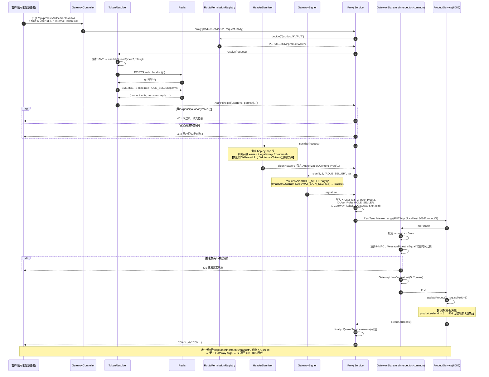
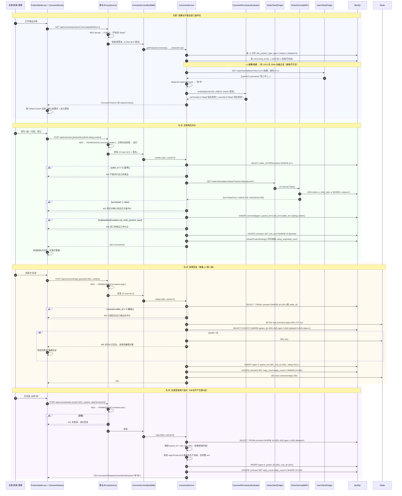
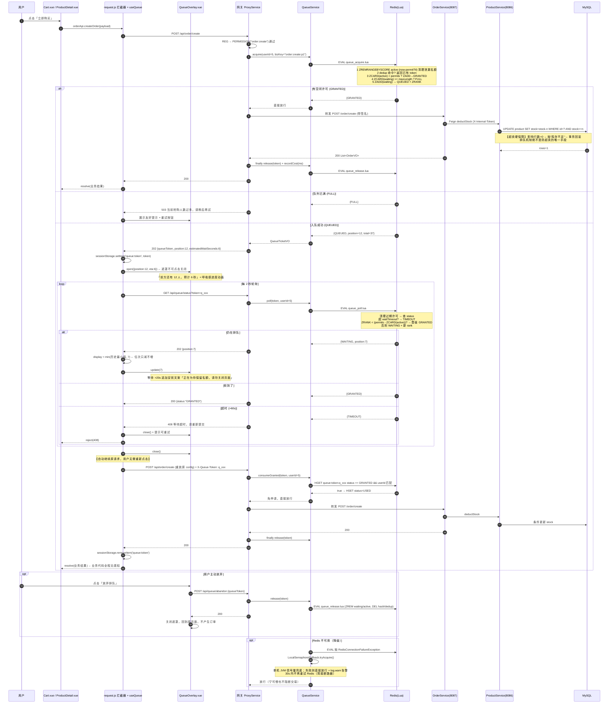
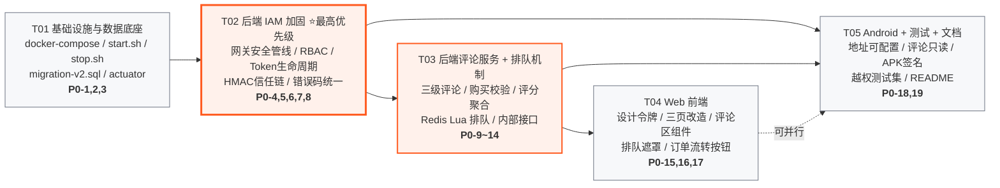

# 电商平台 增量架构设计（ARCH v2）

| 项目信息 | 内容 |
| --- | --- |
| 文档语言 | 简体中文 |
| 项目 | `e_platform` |
| 文档类型 | **增量架构设计 + 任务分解**（仅描述本次变更） |
| 上游输入 | `docs/PRD-增量需求.md`（许清楚） |
| 作者 | 高见远（架构师） |
| 版本 | v2.0 |

> **本文档所有结论均基于实地读码**，非推测。已读：`GatewayController.java`(250行) / `JwtUtil.java` / `ReviewService.java` / `ReviewController.java` / `Review.java` / `ProductController.java` / `ProductService.java` / `ProductMapper.java` / `OrderController.java` / `OrderService.java` / `UserService.java` / `Result.java` / `GlobalExceptionHandler.java` / `RedisConfig.java` / 5 个 `application.yml` / 6 个 `pom.xml` / `database/init.sql` / `docker-compose.yml` / `stop.sh` / `.env.example` / `frontend/{package.json,vite.config.js,src/utils/request.js,src/api/*,src/main.js,src/router/index.js,src/stores/user.js,src/views/ProductDetail.vue}` / `android/{build.gradle.kts,settings.gradle.kts,gradle.properties,*/build.gradle.kts,shared-core/network/*,shared-core/di/CoreModule.kt}`。

---

## 0. 读码补充发现（PRD C1–C6 之外，直接影响设计）

| # | 发现 | 影响 |
| --- | --- | --- |
| **A1** | **包名是 `com.ecommerce.*`，不是 `com.eplatform.*`** | 所有新增类必须落在 `com.ecommerce.*` 下，否则组件扫描不到 |
| **A2** | 根 `pom.xml` 已设 `<release>17</release>`，且 `GatewayController` 用了 `Set.of`、`ProductService` 用了 `List.of`（Java 9+ API） | **JDK 8 编译不可能**，JDK 版本冲突只有一个解（见 §1.1）。已实测 `JAVA_HOME=JDK21 mvn compile` **BUILD SUCCESS** |
| **A3** | `e-platform-gateway/pom.xml` 有 `maven-resources-plugin`，在 `generate-resources` 阶段把 `frontend/dist` 拷进 `src/main/resources/static`；`GatewayConfig` 注册了 SPA forward | **前端由网关 :8088 托管**。所以 `request.js` 用 `baseURL:'/api'` 同源可用 |
| **A4** | 但 `vite.config.js` **没有任何 dev proxy** | `npm run dev`(:3000) 下 `/api` 必然 404。本次必须补 proxy，否则前端无法本地开发调试 |
| **A5** | `ProductController.deductStock/restoreStock` **已有 `X-Internal-Token` 校验** | P0-14 中"保护 `PUT /api/product/{id}/deduct`"在网关侧是死代码（网关已 403 拦截），真正需要保护的位置在 product 服务内部（见 §1.4） |
| **A6** | `OrderService.deliverOrder()/receiveOrder()` **已完整实现**（含归属校验 + 状态机 1→2→3），`OrderController` 也已暴露 `POST /order/deliver/{id}`、`/receive/{id}`；`OrderApi.kt` 也已声明 | **「模拟发货/模拟收货」后端零开发**，只需补前端按钮。工作量比预估低 |
| **A7** | `Review.java` 缺 `updateTime` 字段映射；`ReviewService.deleteReview` 用 `LambdaQueryWrapper` + `@TableLogic` → 实际是逻辑删除 | 新 `Comment` 实体需补齐字段 |
| **A8** | `Result.error(403,...)` 返回的 **HTTP 状态码仍是 200**，403 只在 body 里；而网关返回的是**真实 HTTP 401/403** | 两套语义不一致。`tests/e2e_test.sh` 已同时用 `assert_success`(body) 与 `assert_status`(HTTP) 两种断言。P0-6 要求"严格区分 401/403" → 必须统一（见 §1.6） |
| **A9** | `ProductDetail.vue` 第 250 行 `const orderId = createRes.data.id`，但 `createOrder` 返回的是 `List<OrderVO>` | **存量 Bug**：立即购买后拿到的 orderId 是 `undefined`。本次前端改造顺手修为 `data[0].id` |
| **A10** | `request.js` 响应拦截器 `if (res.code !== 200) → reject`；axios 默认 `validateStatus` 只放行 2xx | HTTP 202 会走成功分支但被 `code!==200` 拒绝；403/503 走 error 分支拿不到 body。**排队机制必须先改造 request.js**（见 §1.5） |
| **A11** | `e-platform-gateway/pom.xml` **不依赖 `e-platform-common`，也没有 redis starter** | 网关要做 Token 黑名单 + 排队，必须新增 `spring-boot-starter-data-redis`。**但不要让网关依赖 common** —— common 里的签名校验拦截器是给下游服务用的，网关引入会自我拦截 |
| **A12** | `e-platform-product/pom.xml` **没有 openfeign** | L1 购买校验需要 product → order 的跨服务调用，需新增 feign 依赖（order 模块已有，可照抄） |
| **A13** | `docker.1ms.run/redis:7` 与 `docker.1ms.run/mysql:8.0` **本机已 pull 完成** | P0-1 切换零网络风险 |
| **A14** | Android：AGP 8.2.2 / Kotlin 1.9.22 / Gradle 8.5 / kapt；`shared-core` 的 `BASE_URL` 由 `buildConfigField` 硬编码到 BuildConfig，`NetworkFactory.BASE_URL` 是 `val`（编译期常量） | P0-18「地址可配置」不能只改 buildConfigField，需要**运行时可改**（见 §1.8） |
| **A15** | `buyer-app` release 配置 `isMinifyEnabled = true`，但两个 app **都没有 `signingConfigs`** | `assembleRelease` 产出的是 **unsigned APK，无法安装**；且 R8 + Hilt/Retrofit/kotlinx-serialization 无 keep 规则极易运行时崩溃。见 §1.8 的处置 |

---

## 1. 实现方案概述（技术选型与取舍）

### 1.1 JDK 版本冲突的解决方案 ⭐

**冲突分析**：

| 约束 | 要求 |
| --- | --- |
| Spring Boot 2.7.18 | 官方支持 Java 8–19，**不支持 JDK 24**（系统默认） |
| 根 pom `<release>17</release>` + 代码用 `Set.of`/`List.of` | 编译 JDK **必须 ≥ 17**，JDK 8 直接出局 |
| AGP 8.2.2 + Gradle 8.5 | Gradle 运行 JDK **必须 ≥ 17**；Gradle 8.5 官方支持到 JDK 21 |
| 本机可用 JDK | 24.0.1（默认）/ 21.0.9 / 1.8.0_472 —— **没有 17** |

**结论：唯一可行解 = 全栈统一 JDK 21.0.9，前后端 Android 共用一个版本，不存在冲突。**

- 后端：`JAVA_HOME=<JDK21>` 编译运行。字节码目标仍是 `release 17`（不改 pom），Spring Framework 5.3.31（SB 2.7.18 内置）的 ASM 9.5 / CGLIB 已支持 class file 65，实测编译通过。
- Android：Gradle 8.5 + AGP 8.2.2 在 JDK 21 下运行；Android Studio 自带 JBR 恰好是 **21.0.10**，说明现有 `dist/*.apk` 本来就是 21 构建出来的。
- **实测证据**：`JAVA_HOME=/Users/finn/Library/Java/JavaVirtualMachines/ms-21.0.9/Contents/Home mvn -DskipTests compile` → `BUILD SUCCESS`。

**落地方式**（不依赖开发者手工 export）：

```bash
# 新建 scripts/env.sh，被 start.sh / build-apk.sh 统一 source
export JAVA_HOME="${JAVA_HOME_21:-/Users/finn/Library/Java/JavaVirtualMachines/ms-21.0.9/Contents/Home}"
export PATH="$JAVA_HOME/bin:$PATH"
export MVN_BIN="${MVN_BIN:-/Users/finn/Maven/apache-maven-3.9.9/bin/mvn}"
```

- `start.sh` 启动每个 jar 时用 `"$JAVA_HOME/bin/java" -jar ...`，绝不用裸 `java`。
- 脚本开头做**硬校验**：`java -version` 主版本号必须 ∈ {17,18,19,20,21}，否则报错退出并提示如何指定 `JAVA_HOME_21`。
- Android：`scripts/build-apk.sh` 同样 `source scripts/env.sh` 后再调 `./gradlew`。**不写死进 `gradle.properties`**（那是团队共享文件，写死机器路径会污染仓库）。
- **kapt 兜底**：Kotlin 1.9.22 的 kapt 在 JDK 17+ 上偶发 `IllegalAccessError`。若构建失败，向 `android/gradle.properties` 的 `org.gradle.jvmargs` 追加：
  `--add-exports jdk.compiler/com.sun.tools.javac.api=ALL-UNNAMED --add-exports jdk.compiler/com.sun.tools.javac.util=ALL-UNNAMED --add-opens jdk.compiler/com.sun.tools.javac.comp=ALL-UNNAMED`

---

### 1.2 网关鉴权在手写 RestTemplate 代理上的重构 ⭐

**不引入 Spring Cloud Gateway**（它是 WebFlux 栈，与现有 Spring MVC + 静态资源托管 + `GatewayConfig` SPA forward 完全冲突，改造成本远大于收益）。

**做法：把 250 行的 `GatewayController` 拆成"路由壳 + 安全管线"，安全逻辑全部下沉到独立类，Controller 只剩转发。**

```
com.ecommerce.gateway
├─ controller/
│   ├─ GatewayController.java      【改】只保留 @RequestMapping 路由方法 + 委托 ProxyService
│   └─ QueueController.java        【新】/api/queue/status、/api/queue/abandon
├─ security/
│   ├─ AuthPrincipal.java          【新】不可变值对象：userId/userType/username/roles/perms/jti/exp
│   ├─ TokenResolver.java          【新】解析 JWT + 查 Redis 黑名单，产出 AuthPrincipal
│   ├─ RoutePermissionRegistry.java【新】「路径Pattern + 方法 → 访问策略」映射表（替代 isPublicPath/isPublicReadPath）
│   ├─ AccessDecision.java         【新】枚举 PUBLIC / AUTHENTICATED / PERMISSION(code) / INTERNAL_DENY
│   └─ GatewaySigner.java          【新】HMAC-SHA256 签名生成
├─ proxy/
│   ├─ HeaderSanitizer.java        【新】剥离内部头 + hop-by-hop 头（修 C4）
│   └─ ProxyService.java           【新】真正的 RestTemplate 转发 + 响应回写
├─ queue/
│   ├─ QueueService.java           【新】Redis Lua 排队核心
│   ├─ QueueProperties.java        【新】@ConfigurationProperties("queue")
│   └─ LocalSemaphoreFallback.java 【新】Redis 不可用降级
└─ config/
    ├─ GatewayConfig.java          【改】新增 /queue 的 SPA 排除
    └─ GatewaySecurityProperties.java 【新】gateway.sign.*
```

**请求处理管线（`ProxyService.proxy()` 内的固定顺序）**：

```
1. INTERNAL_DENY 判定   → 命中 deduct/restore 等内部接口 → 403（保留现有 isInternalOnlyPath 逻辑，改为注册表驱动）
2. TokenResolver 解析   → 无 Token/解析失败 → principal = ANONYMOUS
                        → jti 命中 Redis 黑名单 → 直接 401（P0-8）
3. RoutePermissionRegistry 决策：
     PUBLIC        → 放行
     AUTHENTICATED → principal==ANONYMOUS ? 401 : 放行
     PERMISSION(c) → principal==ANONYMOUS ? 401 : (perms.contains(c) ? 放行 : 403)   ← 严格区分 401/403
4. QueueService 守卫    → 命中受保护路径（POST /order/create）→ 见 §1.4
5. HeaderSanitizer      → 构造干净的下游 Header（修 C4）
6. GatewaySigner        → 写入 X-User-Id / X-User-Type / X-User-Roles / X-Gateway-Ts / X-Gateway-Sign（修 C5）
7. RestTemplate 转发    → finally 中 QueueService.release()
```

**修复 C4（Header 伪造）—— `HeaderSanitizer` 的核心规则**：

现状代码是"全量透传 → 再覆盖"，只要 Token 无 `userId` claim 或走公开路径，伪造头就穿透。改为**先剥离，后写入，且剥离基于前缀而非枚举**：

```java
// 逐条剥离，任何客户端传入的以下头一律丢弃，不做例外
private static final Set<String> HOP_BY_HOP = Set.of(
        "host","content-length","transfer-encoding","connection","keep-alive",
        "upgrade","te","trailer","proxy-authenticate","proxy-authorization");

// 前缀黑名单：一切内部身份/信任凭证头，客户端永远无权携带
private static final List<String> BLOCKED_PREFIXES = List.of(
        "x-user-", "x-gateway-", "x-internal-");

boolean isBlocked(String name) {
    String n = name.toLowerCase(Locale.ROOT);
    return HOP_BY_HOP.contains(n) || BLOCKED_PREFIXES.stream().anyMatch(n::startsWith);
}
```

> **为什么用前缀而不是枚举**：枚举 `X-User-Id/X-User-Type/X-User-Roles/X-Gateway-Sign` 四个头，将来任何人加第五个内部头都会重新引入漏洞。前缀规则是"默认拒绝"，一劳永逸。
> **注意 `x-internal-` 也必须剥离** —— 否则外部可伪造 `X-Internal-Token` 直接调用 product 的库存接口。order→product 是**服务间直连**（不经网关），不受影响。

写入阶段（**只有网关能写**）：

```java
proxyHeaders.set("X-User-Id",    String.valueOf(p.userId()));      // 匿名时为 "0"
proxyHeaders.set("X-User-Type",  String.valueOf(p.userType()));    // 匿名时为 "0"
proxyHeaders.set("X-User-Roles", p.rolesJoined());                 // "ROLE_BUYER,ROLE_SELLER"，字典序，匿名时 ""
proxyHeaders.set("X-Gateway-Ts", String.valueOf(ts));
proxyHeaders.set("X-Gateway-Sign", sign);
```

**`RoutePermissionRegistry` 映射表**（`AntPathMatcher` 匹配，**从上往下第一条命中即生效**，顺序敏感）：

| 顺序 | 路径 Pattern | 方法 | 策略 |
| --- | --- | --- | --- |
| 1 | `/product/*/deduct`, `/product/*/restore` | ANY | `INTERNAL_DENY` → 403 |
| 2 | `/user/login`, `/user/register`, `/mobile/auth/login`, `/mobile/auth/register` | POST | `PUBLIC` |
| 3 | `/user/refresh` | POST | `PUBLIC`（凭 refreshToken 换新，本身不带 access token） |
| 4 | `/user/logout` | POST | `AUTHENTICATED` |
| 5 | `/product/list`, `/product/batch`, `/product/seller/*`, `/product/{id}` | GET | `PUBLIC` |
| 6 | `/category/**` | GET | `PUBLIC` |
| 7 | `/comment/product/**`, `/comment/*/replies`, `/review/**` | GET | `PUBLIC`（游客可读全部评论） |
| 8 | `/mobile/home/**`, `/mobile/products/**` | GET | `PUBLIC` |
| 9 | `/queue/**` | ANY | `AUTHENTICATED` |
| 10 | `/product/add` | POST | `PERMISSION("product:write")` |
| 11 | `/product/{id}` | PUT | `PERMISSION("product:write")` |
| 12 | `/product/{id}` | DELETE | `PERMISSION("product:delete")` |
| 13 | `/order/cart/**`, `/order/cart` | ANY | `PERMISSION("cart:manage")` |
| 14 | `/order/create` | POST | `PERMISSION("order:create")` + **排队保护** |
| 15 | `/order/deliver/**` | POST | `PERMISSION("order:manage")` |
| 16 | `/order/**`, `/address/**` | ANY | `PERMISSION("order:read")` |
| 17 | `/comment` | POST | `PERMISSION("comment:create")` |
| 18 | `/comment/reply` | POST | `PERMISSION("comment:reply")` |
| 19 | `/comment/ask` | POST | `PERMISSION("comment:ask")` |
| 20 | `/comment/**` | PUT/DELETE | `AUTHENTICATED`（细粒度归属校验在服务层） |
| 21 | `/admin/**` | ANY | `PERMISSION("admin:access")` |
| 22 | `/mobile/**` | ANY | `AUTHENTICATED` |
| **兜底** | `/**` | ANY | `AUTHENTICATED`（**默认拒绝**，新接口忘记登记也不会裸奔） |

> **取舍说明**：网关只做「有没有这张门票」的粗判；「这张票是不是你自己的资源」（归属校验）**一律在服务层做**。网关拿不到 `product.seller_id`、`order.user_id`，强行做归属校验会引入网关→DB 依赖，是架构污染。

**权限码从哪来**：JWT 的 `roles` claim 只带角色码（体积小）。网关启动时**不查库**，而是在 `TokenResolver` 中按 `roles` 从 Redis 读权限集合 `rbac:role:{code}:perms`（Set，由 user 服务在启动时 warm-up 写入，TTL 永久 + 启动覆盖）。Redis miss 时降级为**网关内置的静态角色→权限映射表**（与 `migration-v2.sql` 的 seed 一致），保证网关不因 Redis 抖动而全站 403。

---

### 1.3 `X-Gateway-Sign` HMAC 签名（修 C5）⭐

| 项 | 规格 |
| --- | --- |
| **算法** | `HmacSHA256`，输出 **Base64 URL-safe 无填充** |
| **签名原文**（字段顺序**严格固定**，`\n` 分隔） | `userId + "\n" + userType + "\n" + roles + "\n" + timestamp` |
| `userId` | 十进制字符串；**匿名请求为 `"0"`**（匿名也必须签，否则直连服务可用"无签名=匿名"绕过） |
| `userType` | 十进制字符串；匿名为 `"0"` |
| `roles` | 角色码 **字典序升序**、英文逗号连接、无空格；匿名为空串 `""` |
| `timestamp` | 网关生成的 **epoch 毫秒**，同时放入 `X-Gateway-Ts` |
| **密钥来源** | 环境变量 `GATEWAY_SIGN_SECRET`（写入 `.env` / `.env.example`），配置键 `gateway.sign.secret`，**≥32 字符**，由 `start.sh` 随机生成 |
| **传输头** | `X-Gateway-Sign: <base64>`、`X-Gateway-Ts: <millis>` |
| **校验位置** | `e-platform-common` 的 `GatewaySignatureInterceptor`，被 user / product / order / mobile **四个服务**自动装配（它们都依赖 common）。**网关自身不依赖 common，不会自我拦截** |
| **时间窗口** | `\|now - ts\| <= 300_000ms`（5 分钟），超窗 401 |
| **开关** | `gateway.sign.enabled`（默认 `true`）。本地裸调服务调试时可置 false |

**校验伪代码（common 模块）**：

```java
// GatewaySignatureInterceptor#preHandle
if (!props.isEnabled()) return true;
if (isWhitelisted(uri)) return true;                       // /actuator/**、/error
// 服务间内部直连（order→product 的 deduct/restore）走已有的 X-Internal-Token
if (internalToken.equals(req.getHeader("X-Internal-Token"))) return true;

String sign = req.getHeader("X-Gateway-Sign");
String ts   = req.getHeader("X-Gateway-Ts");
if (sign == null || ts == null) throw new BusinessException(401, "非法请求来源");
if (Math.abs(System.currentTimeMillis() - Long.parseLong(ts)) > 300_000L)
    throw new BusinessException(401, "请求已过期");

String raw = nvl(req.getHeader("X-User-Id"), "0") + "\n"
           + nvl(req.getHeader("X-User-Type"), "0") + "\n"
           + nvl(req.getHeader("X-User-Roles"), "") + "\n" + ts;
if (!MessageDigest.isEqual(hmac(raw).getBytes(UTF_8), sign.getBytes(UTF_8)))   // 常量时间比较
    throw new BusinessException(401, "签名校验失败");

GatewayUserContext.set(userId, userType, roles);           // ThreadLocal，afterCompletion 清理
return true;
```

**取舍说明**：
- **为什么不把 method+path 放进签名**：会让 mobile BFF 转发场景（BFF 用 Feign 二次调用 product/order）无法复用签名，需要 BFF 重新签名。当前 BFF 已用自己的 `AuthInterceptor` 解析 JWT，路径不一致会全线报错。字段只取身份三元组 + 时间戳，是**能落地**的最小可信集。
- **为什么不加 nonce 防重放**：需要下游服务共享一个 Redis nonce 池，mobile 模块当前**没有 redis starter**，为此加依赖收益极低。5 分钟时间窗 + 攻击者必须先能截获内网流量（此时他已在内网），威胁模型上可接受。列为 P1 增强项。
- **`X-Internal-Token` 白名单是必要的**：`OrderService` 通过 Feign 直连 `product:8086` 调 deduct/restore，这条链路不经网关、拿不到签名。它已有独立的共享密钥保护，且该头已被网关 `HeaderSanitizer` 从外部请求中剥离，外部无法伪造。

**这样就闭合了 C5**：直连 `localhost:8086` 伪造 `X-User-Id: 1` → 无 `X-Gateway-Sign` → 401。

---

### 1.4 Redis 排队机制的数据结构选型 ⭐

| 需求 | 选型 | 理由 |
| --- | --- | --- |
| **并发许可（信号量）** | **ZSet** `queue:permits:active`，member=`queueToken`，score=获取时刻(ms) | 用 `INCR/DECR` 计数器无法解决"进程崩溃导致名额泄漏"。ZSet 可用 `ZREMRANGEBYSCORE key -inf (now - permitTtl)` **惰性清理过期许可**，天然实现 `permit-ttl=30s`，无需守护线程 |
| **等待队列** | **ZSet** `queue:waiting`，member=`queueToken`，score=入队时刻(ms) | List 只能 FIFO 弹出，**算不了位次**、**删不了指定 token**（放弃排队/超时）。ZSet 的 `ZRANK` 直接给位次，`ZREM` 精确移除。O(logN) 足够 |
| **票据元数据** | **Hash** `queue:token:{token}` | 字段：`userId / bizKey / status(WAITING\|GRANTED\|USED\|EXPIRED\|ABANDONED) / createTime / minPosition`。TTL = `wait-timeout + 120s` |
| **同用户去重** | **String** `queue:dedup:{userId}:{bizKey}` → token，TTL = `wait-timeout` | PRD 6.5.5「同一用户同一商品重复提交返回已有 token」 |
| **平均耗时滑窗** | **List** `queue:stats:cost`，`LPUSH` + `LTRIM 0 99` | 近 100 次处理耗时，算术平均。冷启动（空列表）默认 **500ms** |

**三段 Lua 脚本（全部原子，放 `e-platform-gateway/src/main/resources/lua/`）**：

**① `queue_acquire.lua`** — 尝试直接拿许可，拿不到则入队
```
KEYS[1]=active  KEYS[2]=waiting  KEYS[3]=tokenHash  KEYS[4]=dedupKey
ARGV: now, permits, maxLength, permitTtl, token, userId, bizKey, tokenTtl

1) ZREMRANGEBYSCORE(active, '-inf', now - permitTtl)          -- 清理泄漏名额
2) if GET(dedupKey) then return {'DUP', 已有token} end
3) if ZCARD(active) < permits then
       ZADD(active, now, token); HSET(tokenHash,...status='GRANTED');
       SET(dedupKey, token, 'PX', tokenTtl); return {'GRANTED', 0}
   end
4) if ZCARD(waiting) >= maxLength then return {'FULL'} end     -- → 503
5) ZADD(waiting, now, token); HSET(tokenHash,...status='WAITING');
   SET(dedupKey, token, 'PX', tokenTtl)
   return {'QUEUED', ZRANK(waiting, token) + 1, ZCARD(waiting)}
```

**② `queue_poll.lua`** — 轮询推进（**无后台线程，由前端轮询驱动**）
```
1) ZREMRANGEBYSCORE(active, '-inf', now - permitTtl)
2) status = HGET(tokenHash,'status')
   if status == 'GRANTED' then return {'GRANTED'} end
   if status == nil       then return {'EXPIRED'} end          -- → 408
3) if now - HGET(tokenHash,'createTime') > waitTimeout then
       ZREM(waiting, token); DEL(tokenHash, dedupKey); return {'TIMEOUT'}   -- → 408
   end
4) rank = ZRANK(waiting, token)                                -- 0-based
   free = permits - ZCARD(active)
   if rank ~= nil and rank < free then                         -- 轮到了
       ZREM(waiting, token); ZADD(active, now, token);
       HSET(tokenHash,'status','GRANTED'); return {'GRANTED'}
   end
5) return {'WAITING', rank + 1, ZCARD(waiting)}                -- → 202
```

**③ `queue_release.lua`** — 业务处理完/放弃
```
ZREM(active, token); ZREM(waiting, token); DEL(tokenHash); DEL(dedupKey); return 1
```

**保护范围与「自动继续原请求」协议**：

1. 前端 `POST /api/order/create`（首次，无 `X-Queue-Token`）
2. 网关 `QueueService.acquire()` → `GRANTED` 则直接转发；`QUEUED` 返回 **202 + `{queueToken, position, estimatedWaitSeconds, totalInQueue}`**；`FULL` 返回 **503**
3. 前端每 2s `GET /api/queue/status?token=xxx` → 仍在排 → 202；轮到 → **200 `{status:"GRANTED"}`**
4. 前端**自动重发**原请求，带 `X-Queue-Token: xxx`
5. 网关看到 `X-Queue-Token` → 校验 Hash 中 `status==GRANTED` 且 `userId` 与当前 principal 一致 → **不再申请许可**，标记 `USED` 后直接转发
6. `finally { QueueService.release(token) }` —— 无论成功失败都释放

> 第 4 步的"自动重发"封装在 axios 响应拦截器里，**业务代码完全无感知**（`orderApi.createOrder()` 的 Promise 直到真正下单完成才 resolve），满足 P0-15④「无需重新点击」。

**`estimatedWaitSeconds`** = `ceil(position / permits) × avgCostMs / 1000`，`avgCostMs` 取 `queue:stats:cost` 均值，冷启动 500ms，结果 clamp 到 `[1, 300]`。

**降级（PRD 6.6）**：
- `RedisConnectionFailureException` / `RedisSystemException` → 切 `LocalSemaphoreFallback`（`new Semaphore(permits, true)`，`tryAcquire(0)`），失败**直接放行**并 `log.warn`。断路器用一个 `AtomicLong lastFailureAt`，30s 内不再重试 Redis。
- **Lua 脚本异常 / 任何其他异常 → 熔断为直接放行**。排队是体验优化，不是正确性保障。

**超卖硬保障（与排队解耦）**：
- 已有 `ProductMapper.deductStock`：`UPDATE product SET stock=stock-#{quantity}, sales=sales+#{quantity} WHERE id=#{id} AND stock>=#{quantity}`，`rows==0 → BusinessException("库存不足")`。**这条 SQL 本身就是防超卖的唯一真相来源，本次不改。**
- **A5 的处置**：`PUT /product/{id}/deduct` 外部已 403，网关排队够不着。在 **product 服务侧**给 `ProductController.deductStock` 加一道**本地信号量**（`Semaphore(queue.local-permits, 默认200)`，`tryAcquire(2s)`，超时返回 503），防止 order 服务并发风暴打穿 DB 连接池。这是"保护 deduct"在真实架构下的正确落点。

---

### 1.5 前端排队与错误码拦截（request.js 改造）

现有拦截器（A10）无法处理 202/403/503。改造要点：

```js
const request = axios.create({
  baseURL: '/api',
  timeout: 15000,
  // 关键：让 2xx/4xx/5xx 都进 then 分支，由我们统一决策
  validateStatus: () => true
})
```

响应拦截器按 **HTTP 状态码优先**分发：

| HTTP | 处理 |
| --- | --- |
| 200 | `body.code===200` → resolve `body`；否则 reject + ElMessage |
| **202** | 交给 `useQueue()`：打开遮罩 → 轮询 → GRANTED 后**用 `X-Queue-Token` 重放原 config** → 把最终结果 resolve 给原调用方 |
| 401 | `userStore.logout()` + 跳登录（**不弹重复 message**，用节流） |
| 403 | ElMessage.error(body.message)，**不跳登录** |
| 408 | ElMessage.warning('等待超时，请重新提交')，关闭遮罩 |
| 409 | reject 并把 body 抛给调用方（卖家重复回复 → 前端切"编辑"态） |
| 429 | ElMessage.warning('操作过于频繁，请稍后再试') |
| 503 | ElMessage.error('当前抢购人数过多，请稍后再试') + 可重试 |

`queueToken` 存 **sessionStorage**（key: `queue:token`），页面刷新后 `useQueue.restore()` 恢复遮罩。位次展示取 `Math.min(历史最小值, 当前)` 实现"只减不增"。

---

### 1.6 统一错误码与 HTTP 状态码对齐（修 A8）

**问题**：`Result.error(403,...)` 的 HTTP 状态是 200，而 P0-6 要求"无权限 403、未登录 401"必须严格区分，越权测试脚本也要按 HTTP 码断言。

**方案**：改造 `GlobalExceptionHandler`，把 `BusinessException.code` 映射到真实 HTTP 状态：

```java
@ExceptionHandler(BusinessException.class)
public ResponseEntity<Result<Void>> handleBusiness(BusinessException e) {
    HttpStatus http = switch (e.getCode()) {
        case 400, 401, 403, 404, 408, 409, 429, 503 -> HttpStatus.valueOf(e.getCode());
        default -> HttpStatus.OK;   // 500 等业务软失败保持 200 + body.code，兼容现有前端与 e2e_test.sh
    };
    return ResponseEntity.status(http).body(Result.error(e.getCode(), e.getMessage()));
}
```

> **向后兼容**：只有显式抛出上述状态码的**新代码**会改变 HTTP 状态；存量 `throw new BusinessException("商品不存在")`（code=500）行为完全不变，`tests/e2e_test.sh` 的 `assert_success` 断言不受影响。这是"能落地"的关键——不做全量重构。
>
> 同时 `ProductController` 里 `return Result.error(403, ...)` 这种**直接返回**的写法要改成 `throw new BusinessException(403, ...)`，才能进异常处理器拿到真实 403。

**统一错误码表**（所有模块共用，定义在 `common/result/ErrorCode.java`）：

| Code | HTTP | 语义 | 典型场景 |
| --- | --- | --- | --- |
| 200 | 200 | 成功 | — |
| 202 | 202 | 已入队 | 下单排队中 |
| 400 | 400 | 参数错误 | 校验失败 |
| 401 | 401 | 未认证 | 无 Token / Token 失效 / 黑名单 / 签名校验失败 |
| 403 | 403 | 无权限 | 权限码不足 / 未购买 / 跨店回复 / 内部接口 / 自评 |
| 404 | 404 | 资源不存在 | 评论/商品不存在 |
| 408 | 408 | 排队超时 | 等待 >60s |
| 409 | 409 | 冲突 | 重复评价 / 卖家重复回复 |
| 429 | 429 | 限流 | 令牌桶超限 |
| 500 | 200 | 业务失败（软） | 存量行为，保持不变 |
| 503 | 503 | 不可用 | 队列已满 / 下游不可达 |

---

### 1.7 三级评论服务设计

**落在 `e-platform-product` 模块**（`comment` 表与 product 强相关，且现有 `Review` 就在这里，避免新建微服务）。

- **新增 `/comment` 接口族**，`ReviewController`(`/review`) **保留但降级为兼容层**：`GET` 直接委托新 service；`POST`/`DELETE` 委托到带完整校验的 `CommentService`（**这就修复了 C2 的无校验缺陷**，且旧 Android/前端调用不会突然 500）。类上标 `@Deprecated`。
- **`Review.java` 保留不动**（Android/mobile BFF 的 `ReviewInfo` 还引用它），**新建 `Comment.java`** 映射同一张 `comment` 表的完整字段。两个实体共表不冲突（MyBatis-Plus 按字段映射）。

**购买校验的跨服务调用**：product 需要问 order「该用户对该商品有没有 status=3 的订单」。

- order 服务新增内部接口 `GET /order/internal/purchased?userId=&productId=` → `Result<PurchaseCheckVO>`，用**已有的 `X-Internal-Token`** 保护（与 deduct/restore 同款，零新机制）。
- product 新增 `OrderClient`（Feign，需给 product pom 加 `spring-cloud-starter-openfeign`，配置照抄 order 模块的 `FeignConfig`）。
- **该接口必须在网关注册为 `INTERNAL_DENY`**（路径含 `/order/internal/`），外部一律 403。

**L1 唯一性**：靠 DB 唯一索引 `uk_order_product_user(order_id, product_id, user_id)` 兜底。
> ✅ **已实测**（临时 MySQL 容器，见 §2）：L1 重复插入报 `1062 Duplicate entry`；L2/L3 因 `order_id IS NULL`，MySQL 唯一索引允许多个 NULL，可自由插入多条。
> ⚠️ **显式决策**：逻辑删除自己的 L1 后**不能重新评价**（唯一索引不区分 `deleted`）。这是反刷单的正确行为，需在前端文案说明「评价删除后不可重新发表」。

**L2 唯一性**（每条 L1 最多 1 条有效 L2）：无法用 DB 部分索引表达（MySQL 不支持）。方案 = **Redis 分布式锁 + 应用层查询**：
```java
String lock = "lock:comment:reply:" + parentId;
if (!redis.opsForValue().setIfAbsent(lock, "1", 5, SECONDS)) throw new BusinessException(409, "回复处理中");
try {
    if (commentMapper.existsValidL2(parentId)) throw new BusinessException(409, "该评价已回复，请使用编辑功能");
    ...insert...
} finally { redis.delete(lock); }
```

**级联可见性（P0-13⑧）**：查询层直接过滤，不做物理级联更新。
```sql
-- L2/L3 查询时 JOIN 回 L1 校验可见性
SELECT c.* FROM comment c
JOIN comment root ON root.id = c.root_id AND root.deleted = 0 AND root.status = 1
WHERE c.root_id IN (...) AND c.deleted = 0 AND c.status = 1
```

**用户名脱敏**：`common/util/MaskUtil.maskUsername()`
- 长度 1 → `*`；长度 2 → `张*`；长度 ≥3 → 首字符 + `*`×(n-2) + 尾字符（`张三丰` → `张*丰`，`buyer1` → `b****1`）。
- 用户名从 user 服务批量取。product 服务新增 `UserClient` Feign：`GET /user/internal/batch?ids=1,2,3` → `Result<List<UserBriefVO>>`（内部接口）。**批量取一次，避免 N+1**。

**评分聚合（同步 + 定时兜底，不引入 RabbitMQ）**：
- L1 发表/编辑/删除后，同事务内执行 `ProductMapper.refreshRating(productId)`：
  `UPDATE product p LEFT JOIN (SELECT product_id, ROUND(AVG(rating),2) a, COUNT(*) c FROM comment WHERE type=1 AND status=1 AND deleted=0 GROUP BY product_id) t ON t.product_id=p.id SET p.rating_avg=IFNULL(t.a,0), p.rating_count=IFNULL(t.c,0) WHERE p.id=#{productId}`
- `RatingSyncJob`：`@Scheduled(cron = "0 */10 * * * ?")` 全表重算兜底。`ProductApplication` 加 `@EnableScheduling`。

---

### 1.8 Android 方案（P0 范围收敛）

**P0 只保三件事**：两个 APK 能构建安装、登录/浏览/下单主链路跑通、买家 App 评论**只读**。

**① 后端地址可配置（P0-18③）—— 运行时可改，不是编译期**

现状 `NetworkFactory.BASE_URL = BuildConfig.BASE_URL` 是 `val` 常量，Retrofit 单例在 Hilt 里构建一次。改造：

- 新增 `shared-core/config/AppConfigStore.kt`（DataStore Preferences）：`baseUrlFlow`，默认值 `BuildConfig.BASE_URL`。
- 新增 `shared-core/network/DynamicHostInterceptor.kt`：**不重建 Retrofit**，在 OkHttp 拦截器里重写 URL 的 scheme/host/port/前缀路径：
  ```kotlin
  class DynamicHostInterceptor(private val store: AppConfigStore) : Interceptor {
      override fun intercept(chain: Interceptor.Chain): Response {
          val base = runBlocking { store.baseUrl() }.toHttpUrlOrNull() ?: return chain.proceed(chain.request())
          val old = chain.request().url
          val new = old.newBuilder().scheme(base.scheme).host(base.host).port(base.port).build()
          return chain.proceed(chain.request().newBuilder().url(new).build())
      }
  }
  ```
- Retrofit 的 `baseUrl` 仍用 BuildConfig 占位（Retrofit 要求编译期有合法 URL），实际生效的是拦截器。
- UI：两个 App 的 `ProfileScreen` 各加一个「服务器地址」入口（`SettingsDialog`），可填 `http://192.168.x.x:8088/api/`，保存即生效。
- `buildConfigField` 改为可被 Gradle 属性覆盖：`./gradlew assembleDebug -PbaseUrl=http://192.168.1.5:8088/api/`

**② APK 可安装（修 A15）**

- 两个 app 的 `build.gradle.kts` 增加 `signingConfigs`，release 复用 **debug keystore**（`~/.android/debug.keystore`，别名 androiddebugkey / 密码 android）。演示项目不需要正式签名，但必须**已签名**才能安装。
- `buyer-app` 的 `release { isMinifyEnabled = true }` **改为 `false`**。理由：R8 + Hilt + Retrofit 动态代理 + kotlinx-serialization 缺 keep 规则必然运行时崩溃，为演示项目写全套 proguard 规则是纯负收益。
- `scripts/build-apk.sh`：`source scripts/env.sh` → `./gradlew :buyer-app:assembleRelease :seller-app:assembleRelease` → 拷贝并重命名到 `dist/buyer-app-v1.0.0-release.apk` / `dist/seller-app-v1.0.0-release.apk`。

**③ 评论只读**

- `shared-core/model/Comment.kt`：`CommentNode` / `CommentTree`（与 Web 同结构，`@Serializable`）
- `shared-core/network/ApiService.kt` 增加 `CommentApi`：`GET comment/product/{id}`
- `CoreModule` 增加 `provideCommentApi`
- `buyer-app/feature/product/CommentSection.kt`：Compose 只读三级列表（L1 卡片 / L2 浅橙底 + 「卖家」徽标 / L3 缩进 + `@昵称`）
- 接入 `ProductDetailScreen` + `ProductDetailViewModel`
- **seller-app 不动评论**

**④ 视觉令牌对齐**：`shared-core/ui/Theme.kt`（新建）定义 `BrandPrimary = Color(0xFFFF5A1F)` 等，与 Web tokens 同源。

---

### 1.9 启停脚本与基础设施

**`docker-compose.yml` 改动（P0-1）**：
```yaml
  redis:
    image: docker.1ms.run/redis:7          # 官方镜像（本机已 pull）
    container_name: e-platform-redis
    command: redis-server --appendonly yes  # 删除 bitnami 专有的 ALLOW_EMPTY_PASSWORD
    ports: ["6379:6379"]
    volumes: [redis_data:/data]             # 官方镜像路径正确，不改
    healthcheck:                            # 新增，供 start.sh 轮询
      test: ["CMD", "redis-cli", "ping"]
      interval: 3s
      timeout: 3s
      retries: 20
```
MySQL 同步加 `healthcheck: ["CMD","mysqladmin","ping","-h","127.0.0.1","-uroot","-proot"]`。

**`start.sh` 流程（P0-2）**：
```
1.  source scripts/env.sh；校验 JDK 主版本 ∈ [17,21]，否则退出
2.  环境检查：java / mvn / node / docker / docker-compose，缺一即报错退出
3.  .env 处理（Q8）：不存在 → 从 .env.example 复制，并用 openssl rand -base64 48
      随机生成 JWT_SECRET、GATEWAY_SIGN_SECRET、INTERNAL_TOKEN，控制台高亮提示
4.  端口预检：3306/6379/8085-8089 被占用 → 打印占用 PID 与进程名，明确报错退出
5.  docker-compose up -d mysql redis rabbitmq
6.  轮询健康：docker inspect 的 Health.Status == healthy（MySQL 最长 120s，Redis 30s），超时退出
7.  数据库迁移：mysql < database/migration-v2.sql（幂等，每次都跑）
8.  构建：--skip-build 可跳过
       前端  npm ci --silent && npm run build      （产出 frontend/dist）
       后端  $MVN_BIN -q -DskipTests clean package  （gateway 会自动把 frontend/dist 打进 static）
9.  按序启动，每个都等健康检查过再启下一个：
       user 8085 → product 8086 → order 8087 → mobile 8089 → gateway 8088
       nohup "$JAVA_HOME/bin/java" -jar xxx.jar > logs/{service}.log 2>&1 &
       echo $! > logs/{service}.pid
       健康检查：curl -fs http://localhost:{port}/actuator/health（需给各服务加 actuator 依赖）
                 —— 若不加 actuator，退化为 curl 任一公开接口 + 端口 LISTEN 检测
       单服务最长等 90s，超时则 tail -50 logs/{service}.log 并退出
10. 打印：http://localhost:8088 / 测试账号 buyer1、seller1、admin（密码 123456）/ 日志路径 / 停止命令
```
> 注：为让健康检查可靠，给 user/product/order/mobile/gateway **五个 pom 加 `spring-boot-starter-actuator`**，`application.yml` 暴露 `health` 端点。这是最小且标准的做法。actuator 路径需在网关 `RoutePermissionRegistry` 之外（各服务本地端口直接访问，不经网关），并在 common 的签名拦截器里白名单放行。

**`stop.sh` 改动（P0-3）**：
- 保留现有按端口 kill 的逻辑（优先用 `logs/{service}.pid`，回退 `lsof -i:port -t`）
- 新增 `docker-compose down`（默认，**保留数据卷**）
- `--with-data` → `docker-compose down -v`（并二次确认）
- 幂等：进程不存在/容器不存在都只打印"未运行"，`exit 0`

---

## 2. 数据库变更

**完整迁移 SQL 已落盘：`database/migration-v2.sql`**（约 250 行）。

**✅ 已实测验证**（用 `docker.1ms.run/mysql:8.0` 临时容器）：
1. `init.sql` → `migration-v2.sql` **连续执行 3 次，全部成功无报错**（幂等达标）
2. 迁移后 `comment` 表字段与索引齐全，`role/permission/role_permission/user_role` 四表建立
3. 权限绑定数：`ROLE_BUYER=7`、`ROLE_SELLER=11`、`ROLE_ADMIN=13`
4. 存量用户迁移：`buyer1→ROLE_BUYER`、`seller1→ROLE_SELLER`，新增 `admin→ROLE_ADMIN`
5. 唯一索引行为验证：重复 L1 → `ERROR 1062`；L2/L3（`order_id IS NULL`）可插入多条 ✅

**幂等实现方式**：MySQL 8 不支持 `ADD COLUMN IF NOT EXISTS`，故脚本内定义两个临时存储过程 `sp_add_column_if_missing` / `sp_add_index_if_missing`，查 `information_schema` 后动态 `PREPARE`，脚本末尾 `DROP PROCEDURE`。表用 `CREATE TABLE IF NOT EXISTS`，种子数据用 `INSERT ... ON DUPLICATE KEY UPDATE` / `INSERT IGNORE`。

**变更摘要**：

| 对象 | 变更 |
| --- | --- |
| `role` | **新建**。`code`(UK) / `name` / `description` / `status` |
| `permission` | **新建**。`code`(UK, 格式 `资源:动作`) / `resource` / `action` |
| `role_permission` | **新建**。UK(`role_id`,`permission_id`) |
| `user_role` | **新建**。UK(`user_id`,`role_id`) |
| `comment` | **加列** `order_item_id` / `parent_id`(默认0) / `root_id`(默认0) / `type`(默认1) / `reply_to_user_id` / `seller_id`(默认0) / `reply_count`(默认0)；`rating` 改为可空 |
| `comment` | **加索引** `idx_root_id` / `idx_parent_id` / `idx_product_type(product_id,type,status,deleted)` / `idx_seller_type` / **UK `uk_order_product_user(order_id,product_id,user_id)`** |
| `comment` | **回填** `type=1`、`seller_id` 从 product 关联、`rating` 空值补 5；**加 UK 前先按 (order_id,product_id,user_id) 去重** |
| `product` | **加列** `rating_avg DECIMAL(3,2)` / `rating_count INT`，并初始回填 |
| `user` | **新增 admin 账号**（幂等，密码同现有测试账号 `123456`），绑定 `ROLE_ADMIN` |

---

## 3. 接口契约

> 统一响应体：`{ "code": int, "message": string, "data": any, "success": bool }`（`Result` 已有 `isSuccess()`，Jackson 序列化出 `success`）。
> 所有路径均为**网关对外**路径，需加 `/api` 前缀。

### 3.1 IAM / Token（e-platform-user）

#### `POST /api/user/login` — 公开
```json
// Request
{ "username": "buyer1", "password": "123456" }
// Response 200
{ "code":200, "message":"操作成功", "success":true, "data":{
    "accessToken":"eyJ...", "refreshToken":"eyJ...",
    "expiresIn":7200, "tokenType":"Bearer",
    "userId":1, "username":"buyer1", "userType":1, "avatar":null,
    "roles":["ROLE_BUYER"],
    "permissions":["user:read","product:read","cart:manage","order:create","order:read","comment:create","comment:ask"]
}}
```
> **兼容性**：`data.token` 字段**保留**（值 = accessToken），否则现有 Web `Login.vue` 与 Android `LoginViewModel` 全部失效。

#### `POST /api/user/refresh` — 公开
```json
{ "refreshToken": "eyJ..." }
→ 200 { "data": { "accessToken":"...", "refreshToken":"...", "expiresIn":7200 } }
→ 401 refreshToken 失效/已登出
```

#### `POST /api/user/logout` — 需登录
无请求体，取 `Authorization` 头。把 access 的 `jti` 与 refresh 的 `jti` 写入 Redis 黑名单（TTL=剩余有效期）。→ `200`

#### `GET /api/user/permissions` — 需登录
→ `{ "data": { "roles":[...], "permissions":[...] } }`（前端按钮显隐用）

#### `GET /user/internal/batch?ids=1,2,3` — **内部接口**（`X-Internal-Token`，网关 403）
→ `{ "data":[ {"userId":1,"username":"buyer1","avatar":null,"userType":1} ] }`

**JWT Claims 结构（access）**：
```json
{ "jti":"<uuid>", "sub":"buyer1", "userId":1, "username":"buyer1", "userType":1,
  "roles":["ROLE_BUYER"], "typ":"access", "iat":..., "exp":... }
```
- access `exp = iat + 2h`（`jwt.access-expiration=7200000`）
- refresh `exp = iat + 7d`（`jwt.refresh-expiration=604800000`），`typ:"refresh"`，**不带 roles**（防止提权后 refresh 仍是旧权限）
- **`JwtUtil` 保留旧的 `generateToken(userId, username, userType)` 方法签名**（mobile BFF `AuthInterceptor` 依赖同款解析），新增 `generateAccessToken(...)` / `generateRefreshToken(...)` / `getJti(...)` / `getRoles(...)`

### 3.2 三级评论（e-platform-product）

#### `GET /api/comment/product/{productId}` — **公开，游客可读**
Query：`current=1` `size=10` `sort=latest|rating` `l3Size=3`

```json
{
  "code": 200, "message": "操作成功", "success": true,
  "data": {
    "productId": 1,
    "summary": { "ratingAvg": 4.6, "ratingCount": 128,
                 "distribution": { "5": 90, "4": 25, "3": 8, "2": 3, "1": 2 } },
    "page": { "current": 1, "size": 10, "total": 128 },
    "list": [
      {
        "id": 1001, "type": 1, "level": 1,
        "userId": 5, "userNameMasked": "张*三", "avatar": null,
        "rating": 5, "content": "续航很给力，做工扎实。",
        "images": [],
        "createTime": "2026-07-20 14:05:11",
        "editable": false, "deletable": false,
        "sellerReply": {
          "id": 1002, "type": 2, "level": 2,
          "userId": 2, "userNameMasked": "s****1", "isSeller": true, "sellerBadge": "卖家",
          "content": "感谢支持，有问题随时联系客服。",
          "createTime": "2026-07-20 16:30:00",
          "editable": false, "deletable": false
        },
        "asks": {
          "total": 7, "hasMore": true,
          "list": [
            { "id": 1003, "type": 3, "level": 3,
              "userId": 8, "userNameMasked": "李*四",
              "replyToUserId": null, "replyToUserNameMasked": null,
              "content": "冬天掉电快吗？",
              "createTime": "2026-07-21 09:00:00",
              "deletable": false },
            { "id": 1004, "type": 3, "level": 3,
              "userId": 5, "userNameMasked": "张*三",
              "replyToUserId": 8, "replyToUserNameMasked": "李*四",
              "content": "@李*四 零下也还行，掉 10% 左右。",
              "createTime": "2026-07-21 10:12:00",
              "deletable": false }
          ]
        }
      }
    ],
    "viewerContext": {
      "loggedIn": true, "userId": 5, "isSeller": false, "isProductSeller": false, "isAdmin": false,
      "canCreateL1": false, "canCreateL1Reason": "购买并确认收货后才能评价",
      "canReplyL2": false,  "canReplyL2Reason": "仅商品卖家可回复",
      "canAskL3": true,     "canAskL3Reason": null
    }
  }
}
```
> **`viewerContext` 是 P0-17③「按权限动态显隐、无权限置灰并给出原因」的数据来源**——前端不自己推断权限，一律照后端给的布尔值 + 原因文案渲染，保证前后端权限判定不漂移。
> `sellerReply` 为 `null` 表示未回复；`asks.list` 按 **createTime 正序**；L1 按 `sort` 排序（`latest`=createTime DESC，`rating`=rating DESC, createTime DESC）。

#### `GET /api/comment/{rootId}/replies` — 公开
Query：`current=1` `size=20` → 「查看全部 N 条」用，返回 L3 分页列表（正序）。

#### `POST /api/comment` — L1 买家评价 · `comment:create` + 购买校验
```json
// Request
{ "productId": 1, "orderId": 100, "rating": 5, "content": "续航很给力，做工扎实。" }
```
| 状态 | 场景 |
| --- | --- |
| 200 | 成功，返回创建的 `CommentVO` |
| 400 | `rating` 不在 1–5；`content` 长度 <5 或 >1000 |
| 401 | 未登录 |
| 403 | 未购买 →「购买并确认收货后才能评价」；订单 status≠3 →「订单完成后才能评价」；`seller_id == userId` →「不能评价自己的商品」 |
| 409 | 已评价过 →「该订单商品已评价过」 |
> `images` 字段**接口保留但本次前端不暴露入口**（用户决策：本次不做图片）。

#### `POST /api/comment/reply` — L2 卖家回复 · `comment:reply` + 商品归属校验
```json
{ "parentId": 1001, "content": "感谢支持..." }
```
| 状态 | 场景 |
| --- | --- |
| 200 | 成功 |
| 400 | content 长度不在 1–500 |
| 403 | 非该商品 `seller_id` 本人 →「只能回复自己商品的评价」 |
| 404 | 父评价不存在或已删除 |
| **409** | 该 L1 已有有效 L2 →「该评价已回复，请使用编辑功能」 |
> 服务端强制：`type=2`、`rating=null`、`root_id=parentId`、`parent_id=parentId`。

#### `POST /api/comment/ask` — L3 追问 · `comment:ask`
```json
{ "rootId": 1001, "content": "冬天掉电快吗？", "replyToUserId": 8 }
```
| 状态 | 场景 |
| --- | --- |
| 200 | 成功（**任意登录用户**，含未购买者、其他卖家、商品卖家） |
| 400 | content 长度不在 1–200 |
| 401 | 游客 |
| 404 | `rootId` 不存在 / 不是 L1 / 已删除 |
> **服务端强制 `parent_id = root_id = rootId`（恒指向 L1），无论前端传什么**——这是"DB 不产生第 4 层"的硬保证。`replyToUserId` 仅用于渲染 `@昵称`，必须校验该用户确实在这棵树里出现过，否则置 null。

#### `PUT /api/comment/{id}` — 编辑（24h 内）
`{ "content": "...", "rating": 4 }` · 200 / 403（非本人 or 超 24h，文案「超过 24 小时不可编辑」）/ 404
> L2 编辑时忽略 `rating`；L3 不可编辑（返回 403）。

#### `DELETE /api/comment/{id}` — 逻辑删除
| 角色 | 可删 |
| --- | --- |
| 本人 | 自己的 L1 / L2 / L3 |
| 商品卖家 | **仅自己的 L2**（不能删买家 L1/L3 → 403「卖家不能删除买家评价」） |
| `ROLE_ADMIN` | 任意 |
> 删 L1 后其 L2/L3 由查询层级联过滤，**不做物理级联更新**。同事务刷新 `product.rating_*`。

#### `GET /api/comment/can-review?productId=&orderId=` — 需登录
→ `{ "data": { "canReview": false, "reason": "该订单商品已评价过" } }`（Orders.vue「去评价/已评价」按钮置灰用）

#### `GET /api/comment/my?type=1&current=1&size=10` — 需登录 → 我的评价列表
#### `GET /api/comment/seller/pending-count` — `comment:reply` → `{ "data": { "count": 3 } }`（卖家中心红点）

### 3.3 订单（e-platform-order）

| 接口 | 状态 |
| --- | --- |
| `POST /api/order/deliver/{orderId}` | **已存在**，仅需前端接入（SellerOrders「模拟发货」，status 1→2） |
| `POST /api/order/receive/{orderId}` | **已存在**，仅需前端接入（Orders「模拟收货」，status 2→3） |
| `GET /order/internal/purchased?userId=&productId=` | **新增内部接口**，`X-Internal-Token`，网关 `INTERNAL_DENY` |

```json
// GET /order/internal/purchased 响应
{ "code":200, "data": { "purchased": true, "orderId": 100, "orderItemId": 200, "receiveTime": "..." } }
```
判定 SQL：`SELECT o.id, oi.id FROM orders o JOIN order_item oi ON oi.order_id=o.id WHERE o.user_id=? AND oi.product_id=? AND o.status=3 AND o.deleted=0 ORDER BY o.receive_time DESC LIMIT 1`

### 3.4 排队（e-platform-gateway）

#### 受保护请求首次调用 → 可能返回 202
```json
// POST /api/order/create ，无空闲许可
HTTP 202
{ "code":202, "message":"排队中", "success":false, "data":{
    "queueToken":"q_8f3a1c9e...", "position": 12,
    "estimatedWaitSeconds": 6, "totalInQueue": 37 } }
```

#### `GET /api/queue/status?token=q_xxx` — 需登录
| HTTP | data | 含义 |
| --- | --- | --- |
| 202 | `{status:"WAITING", position, totalInQueue, estimatedWaitSeconds}` | 仍在排队 |
| 200 | `{status:"GRANTED"}` | 轮到了，前端立即带 `X-Queue-Token` 重发原请求 |
| 408 | `{code:408,message:"等待超时，请重新提交"}` | 超 60s 或票据过期 |

#### `POST /api/queue/abandon` — 需登录
`{ "queueToken":"q_xxx" }` → `200`，释放名额，不产生订单

#### 队列已满 → `503 { "code":503, "message":"当前抢购人数过多，请稍后再试" }`

**配置项（全部环境变量可覆盖）**：
```yaml
queue:
  enabled:       ${QUEUE_ENABLED:true}
  permits:       ${QUEUE_PERMITS:50}
  max-length:    ${QUEUE_MAX_LENGTH:500}
  wait-timeout:  ${QUEUE_WAIT_TIMEOUT:60s}
  permit-ttl:    ${QUEUE_PERMIT_TTL:30s}
  poll-interval: ${QUEUE_POLL_INTERVAL:2s}
  protected-paths: ${QUEUE_PROTECTED_PATHS:POST /order/create}
```
> **演示排队**：`QUEUE_PERMITS=1 ./start.sh` 即可复现（用户决策 Q5）。

---

## 4. 数据结构与类图

```mermaid
classDiagram
    %% ==================== 后端 - 实体层 ====================
    class Comment {
        +Long id
        +Long productId
        +Long userId
        +Long orderId
        +Long orderItemId
        +Long parentId
        +Long rootId
        +Integer type
        +Long replyToUserId
        +Long sellerId
        +Integer replyCount
        +Integer rating
        +String content
        +String images
        +Integer status
        +LocalDateTime createTime
        +LocalDateTime updateTime
        +Integer deleted
    }
    class Role {
        +Long id
        +String code
        +String name
        +String description
        +Integer status
    }
    class Permission {
        +Long id
        +String code
        +String name
        +String resource
        +String action
    }
    class UserRole {
        +Long id
        +Long userId
        +Long roleId
    }
    class RolePermission {
        +Long id
        +Long roleId
        +Long permissionId
    }

    %% ==================== 后端 - DTO / VO ====================
    class CommentCreateDTO {
        +Long productId
        +Long orderId
        +Integer rating
        +String content
    }
    class CommentReplyDTO {
        +Long parentId
        +String content
    }
    class CommentAskDTO {
        +Long rootId
        +String content
        +Long replyToUserId
    }
    class CommentVO {
        +Long id
        +Integer type
        +Integer level
        +Long userId
        +String userNameMasked
        +Integer rating
        +String content
        +Boolean isSeller
        +Long replyToUserId
        +String replyToUserNameMasked
        +Boolean editable
        +Boolean deletable
        +LocalDateTime createTime
        +CommentVO sellerReply
        +AskPageVO asks
    }
    class CommentTreeVO {
        +Long productId
        +RatingSummaryVO summary
        +PageResult~CommentVO~ page
        +ViewerContextVO viewerContext
    }
    class ViewerContextVO {
        +Boolean loggedIn
        +Boolean isProductSeller
        +Boolean canCreateL1
        +String canCreateL1Reason
        +Boolean canReplyL2
        +String canReplyL2Reason
        +Boolean canAskL3
    }
    class RatingSummaryVO {
        +BigDecimal ratingAvg
        +Integer ratingCount
        +Map~Integer,Integer~ distribution
    }
    class PurchaseCheckVO {
        +Boolean purchased
        +Long orderId
        +Long orderItemId
    }
    class QueueTicketVO {
        +String queueToken
        +String status
        +Integer position
        +Integer totalInQueue
        +Integer estimatedWaitSeconds
    }
    class LoginResponse {
        +String token
        +String accessToken
        +String refreshToken
        +Long expiresIn
        +Long userId
        +String username
        +Integer userType
        +List~String~ roles
        +List~String~ permissions
    }

    %% ==================== 后端 - 服务层 ====================
    class CommentService {
        -CommentMapper commentMapper
        -OrderClient orderClient
        -UserClient userClient
        -ProductMapper productMapper
        -RedisTemplate redis
        +CommentTreeVO getProductComments(Long, Integer, Integer, String, Integer, Long)
        +CommentVO createL1(CommentCreateDTO, Long)
        +CommentVO replyL2(CommentReplyDTO, Long)
        +CommentVO askL3(CommentAskDTO, Long)
        +CommentVO update(Long, CommentUpdateDTO, Long)
        +void delete(Long, Long, boolean)
        +CanReviewVO canReview(Long, Long, Long)
        -void assertPurchased(Long, Long, Long)
        -void refreshProductRating(Long)
    }
    class CommentPermissionEvaluator {
        +ViewerContextVO evaluate(Long productId, Long sellerId, AuthUser user)
        +boolean canEdit(Comment, Long)
        +boolean canDelete(Comment, Long, boolean)
    }
    class RbacService {
        -RoleMapper roleMapper
        -PermissionMapper permissionMapper
        +List~String~ getRoleCodes(Long userId)
        +Set~String~ getPermissions(List~String~ roleCodes)
        +void bindDefaultRole(Long userId, Integer userType)
        +void warmUpRedisCache()
    }
    class TokenService {
        -JwtUtil jwtUtil
        -RedisTemplate redis
        +LoginResponse issue(User, List~String~, Set~String~)
        +LoginResponse refresh(String refreshToken)
        +void logout(String accessToken)
        +boolean isBlacklisted(String jti)
    }

    %% ==================== 网关 - 安全管线 ====================
    class AuthPrincipal {
        +Long userId
        +Integer userType
        +String username
        +List~String~ roles
        +Set~String~ permissions
        +String jti
        +boolean anonymous()
        +String rolesJoined()
    }
    class TokenResolver {
        -RedisTemplate redis
        -String jwtSecret
        +AuthPrincipal resolve(HttpServletRequest)
    }
    class RoutePermissionRegistry {
        -List~RouteRule~ rules
        +AccessDecision decide(String path, String method)
    }
    class GatewaySigner {
        -String secret
        +String sign(Long userId, Integer userType, String roles, long ts)
    }
    class HeaderSanitizer {
        +HttpHeaders sanitize(HttpServletRequest)
        -boolean isBlocked(String headerName)
    }
    class ProxyService {
        -RestTemplate restTemplate
        -HeaderSanitizer sanitizer
        -GatewaySigner signer
        -TokenResolver tokenResolver
        -RoutePermissionRegistry registry
        -QueueService queueService
        +ResponseEntity~byte[]~ proxy(String target, HttpServletRequest, byte[])
    }
    class QueueService {
        -StringRedisTemplate redis
        -QueueProperties props
        -LocalSemaphoreFallback fallback
        +QueueTicketVO acquire(Long userId, String bizKey)
        +QueueTicketVO poll(String token, Long userId)
        +void release(String token)
        +boolean consumeGranted(String token, Long userId)
        -void recordCost(long ms)
    }
    class QueueProperties {
        +boolean enabled
        +int permits
        +int maxLength
        +Duration waitTimeout
        +Duration permitTtl
        +Duration pollInterval
    }
    class LocalSemaphoreFallback {
        -Semaphore semaphore
        +boolean tryAcquire()
        +void release()
    }

    %% ==================== common - 信任链 ====================
    class GatewaySignatureInterceptor {
        -GatewaySignProperties props
        +boolean preHandle(req, resp, handler)
        +void afterCompletion(...)
    }
    class GatewayUserContext {
        +set(Long, Integer, List~String~)
        +Long getUserId()
        +Integer getUserType()
        +List~String~ getRoles()
        +void clear()
    }
    class MaskUtil {
        +String maskUsername(String)
    }
    class ErrorCode {
        +int UNAUTHORIZED
        +int FORBIDDEN
        +int CONFLICT
        +int QUEUE_TIMEOUT
        +int TOO_MANY_REQUESTS
        +int SERVICE_BUSY
    }

    %% ==================== 关系 ====================
    Role "1" -- "*" RolePermission : 拥有
    Permission "1" -- "*" RolePermission : 被授予
    Role "1" -- "*" UserRole : 分配给
    Comment "1" o-- "0..1" Comment : sellerReply(L2, parentId)
    Comment "1" o-- "*" Comment : asks(L3, rootId)

    CommentService ..> Comment : 读写
    CommentService ..> CommentCreateDTO : 入参
    CommentService ..> CommentReplyDTO : 入参
    CommentService ..> CommentAskDTO : 入参
    CommentService ..> CommentTreeVO : 出参
    CommentService --> CommentPermissionEvaluator : 委托权限判定
    CommentService ..> PurchaseCheckVO : 依赖购买校验
    CommentPermissionEvaluator ..> ViewerContextVO : 产出
    CommentTreeVO *-- RatingSummaryVO
    CommentTreeVO *-- ViewerContextVO
    CommentTreeVO o-- CommentVO
    CommentVO o-- CommentVO : 内嵌L2/L3

    RbacService ..> Role : 查询
    RbacService ..> Permission : 查询
    RbacService ..> UserRole : 绑定
    TokenService ..> LoginResponse : 签发
    TokenService --> RbacService : 取角色权限

    ProxyService --> TokenResolver
    ProxyService --> RoutePermissionRegistry
    ProxyService --> HeaderSanitizer
    ProxyService --> GatewaySigner
    ProxyService --> QueueService
    TokenResolver ..> AuthPrincipal : 产出
    QueueService --> QueueProperties
    QueueService --> LocalSemaphoreFallback : Redis故障降级
    QueueService ..> QueueTicketVO : 产出

    GatewaySignatureInterceptor --> GatewayUserContext : 写入
    GatewaySignatureInterceptor ..> ErrorCode : 抛401
    CommentService ..> MaskUtil : 脱敏
```



---

## 5. 关键流程时序图

### 5.1 带签名的网关鉴权链路（修 C4 + C5）



### 5.2 三级评论发表与权限校验



### 5.3 下单排队完整流程（入队 / 轮询 / 授予 / 超时 / 放弃）



---

## 6. 完整文件清单

> 图例：**【新】** 新建 · **【改】** 修改 · 路径均相对项目根 `/Users/finn/Documents/workbuddy/e_platform`

### 6.1 基础设施与脚本

| 文件 | 状态 | 说明 |
| --- | --- | --- |
| `docker-compose.yml` | 【改】 | redis 换 `docker.1ms.run/redis:7`；删 `ALLOW_EMPTY_PASSWORD`；加 `command: redis-server --appendonly yes`；mysql/redis 加 `healthcheck` |
| `.env.example` | 【改】 | 新增 `GATEWAY_SIGN_SECRET` / `QUEUE_*` / `JWT_ACCESS_EXPIRATION` / `JWT_REFRESH_EXPIRATION` / `JAVA_HOME_21` |
| `scripts/env.sh` | 【新】 | 统一 JDK21 与 Maven 路径，被 start.sh / build-apk.sh source |
| `start.sh` | 【新】 | 覆盖 0 字节空文件。完整 10 步流程（§1.9） |
| `stop.sh` | 【改】 | 增加 `docker-compose down`；`--with-data` 走 `down -v`；优先用 pid 文件；幂等 |
| `scripts/build-apk.sh` | 【新】 | JDK21 构建两个 APK 并输出到 `dist/` |
| `database/migration-v2.sql` | 【新】✅**已落盘并实测** | RBAC 四表 + comment 扩展 + product 聚合 + 回填，幂等 |
| `README.md` | 【改】 | 启动方式、测试账号（buyer1/seller1/admin，密码 123456）、APK 安装、排队演示（`QUEUE_PERMITS=1`）、JDK21 说明 |

### 6.2 后端 · e-platform-common（信任链 + 通用能力）

| 文件 | 状态 | 说明 |
| --- | --- | --- |
| `common/.../security/GatewaySignProperties.java` | 【新】 | `@ConfigurationProperties("gateway.sign")`：enabled / secret / toleranceMs |
| `common/.../security/GatewaySignatureInterceptor.java` | 【新】 | **核心**：校验 HMAC + 时间窗，写 `GatewayUserContext`；`X-Internal-Token` 白名单 |
| `common/.../security/GatewayUserContext.java` | 【新】 | ThreadLocal 持有 userId/userType/roles，`afterCompletion` 清理 |
| `common/.../security/InternalSecurityAutoConfig.java` | 【新】 | `WebMvcConfigurer` 注册拦截器；排除 `/actuator/**`、`/error` |
| `common/.../util/HmacUtil.java` | 【新】 | HmacSHA256 + Base64 URL-safe + 常量时间比较 |
| `common/.../util/MaskUtil.java` | 【新】 | 用户名脱敏 `张*丰` |
| `common/.../result/ErrorCode.java` | 【新】 | 统一错误码常量（§1.6 表） |
| `common/.../exception/GlobalExceptionHandler.java` | 【改】 | `BusinessException` 映射到真实 HTTP 状态（401/403/404/408/409/429/503），其余保持 200 |
| `common/.../util/JwtUtil.java` | 【改】 | 新增 `generateAccessToken` / `generateRefreshToken` / `getJti` / `getRoles` / `getTokenType` / `getRemainingMillis`；**保留旧 `generateToken` 签名**（mobile BFF 依赖） |
| `backend/e-platform-common/pom.xml` | 【改】 | 加 `spring-boot-starter-actuator` |

### 6.3 后端 · e-platform-user（RBAC + Token 生命周期）

| 文件 | 状态 | 说明 |
| --- | --- | --- |
| `user/.../entity/Role.java`、`Permission.java`、`UserRole.java`、`RolePermission.java` | 【新】 | RBAC 四实体 |
| `user/.../mapper/RoleMapper.java`、`PermissionMapper.java`、`UserRoleMapper.java` | 【新】 | 含 `selectPermCodesByUserId`、`selectPermCodesByRoleCodes` |
| `user/.../service/RbacService.java` | 【新】 | 角色权限查询、注册绑定默认角色、Redis 缓存 warm-up |
| `user/.../service/TokenService.java` | 【新】 | 签发 access/refresh、refresh 换取、logout 黑名单 |
| `user/.../service/UserService.java` | 【改】 | `register()` 调 `RbacService.bindDefaultRole`；`login()` 改调 `TokenService.issue` |
| `user/.../controller/UserController.java` | 【改】 | 新增 `POST /user/refresh`、`POST /user/logout`、`GET /user/permissions`、`GET /user/internal/batch` |
| `user/.../dto/LoginResponse.java` | 【改】 | 加 `accessToken/refreshToken/expiresIn/roles/permissions`，**保留 `token` 字段** |
| `user/.../dto/RefreshRequest.java`、`UserBriefVO.java` | 【新】 | — |
| `user/.../config/RbacWarmUpRunner.java` | 【新】 | `ApplicationRunner`，启动时把 `rbac:role:{code}:perms` 写入 Redis |
| `user/src/main/resources/application.yml` | 【改】 | `jwt.access-expiration`/`refresh-expiration`、`gateway.sign.*`、actuator |
| `backend/e-platform-user/pom.xml` | 【改】 | 加 actuator |

### 6.4 后端 · e-platform-gateway（安全管线 + 排队）

| 文件 | 状态 | 说明 |
| --- | --- | --- |
| `gateway/.../controller/GatewayController.java` | 【改】 | 瘦身为路由壳；**新增 `/comment/**`、`/queue/**` 路由**；全部委托 `ProxyService` |
| `gateway/.../controller/QueueController.java` | 【新】 | `GET /api/queue/status`、`POST /api/queue/abandon` |
| `gateway/.../security/AuthPrincipal.java` | 【新】 | 不可变身份对象，含 `ANONYMOUS` 常量 |
| `gateway/.../security/TokenResolver.java` | 【新】 | JWT 解析 + Redis 黑名单 + 角色→权限查询（Redis miss 降级静态表） |
| `gateway/.../security/RoutePermissionRegistry.java` | 【新】 | **22 条规则 + 默认拒绝兜底**（§1.2 表），`AntPathMatcher` |
| `gateway/.../security/AccessDecision.java` | 【新】 | 枚举 PUBLIC / AUTHENTICATED / PERMISSION / INTERNAL_DENY |
| `gateway/.../security/GatewaySigner.java` | 【新】 | HMAC 签名生成 |
| `gateway/.../security/StaticRolePermissions.java` | 【新】 | 与 SQL seed 一致的静态兜底映射 |
| `gateway/.../proxy/HeaderSanitizer.java` | 【新】 | **修 C4**：hop-by-hop + `x-user-`/`x-gateway-`/`x-internal-` 前缀剥离 |
| `gateway/.../proxy/ProxyService.java` | 【新】 | 7 步管线（§1.2） |
| `gateway/.../queue/QueueService.java` | 【新】 | 三段 Lua 调度 + 耗时统计 + 降级 |
| `gateway/.../queue/QueueProperties.java` | 【新】 | `@ConfigurationProperties("queue")` |
| `gateway/.../queue/LocalSemaphoreFallback.java` | 【新】 | JVM 信号量降级 |
| `gateway/.../queue/QueueTicketVO.java`、`QueueStatus.java` | 【新】 | — |
| `gateway/src/main/resources/lua/queue_acquire.lua` | 【新】 | 原子入队/取许可 |
| `gateway/src/main/resources/lua/queue_poll.lua` | 【新】 | 原子轮询晋级 |
| `gateway/src/main/resources/lua/queue_release.lua` | 【新】 | 原子释放 |
| `gateway/.../config/GatewayConfig.java` | 【改】 | RestTemplate 加超时（连接 3s / 读 20s）；SPA forward 保持 |
| `gateway/src/main/resources/application.yml` | 【改】 | `spring.redis.*`、`gateway.sign.*`、`queue.*`、actuator |
| `backend/e-platform-gateway/pom.xml` | 【改】 | **加 `spring-boot-starter-data-redis`、actuator**；**不加 e-platform-common** |

### 6.5 后端 · e-platform-product（三级评论 + 评分聚合）

| 文件 | 状态 | 说明 |
| --- | --- | --- |
| `product/.../entity/Comment.java` | 【新】 | 映射 `comment` 全字段（`Review.java` 保留不动） |
| `product/.../mapper/CommentMapper.java` | 【新】 | L1 分页 / L2L3 批量（JOIN 回 L1 做级联可见性）/ `existsValidL2` / 评分分布 |
| `product/.../service/CommentService.java` | 【新】 | **核心**：createL1 / replyL2 / askL3 / update / delete / getProductComments / canReview |
| `product/.../service/CommentPermissionEvaluator.java` | 【新】 | 产出 `viewerContext`；editable/deletable 判定（24h、归属、admin） |
| `product/.../controller/CommentController.java` | 【新】 | `/comment` 全部接口（§3.2） |
| `product/.../controller/ReviewController.java` | 【改】 | 降级为兼容层，POST/DELETE 委托 `CommentService`（**修复 C2 无校验缺陷**），标 `@Deprecated` |
| `product/.../service/ReviewService.java` | 【改】 | `addReview` 委托 `CommentService.createL1`，删除裸 insert |
| `product/.../client/OrderClient.java` | 【新】 | Feign `GET /order/internal/purchased`，带 `X-Internal-Token` |
| `product/.../client/UserClient.java` | 【新】 | Feign `GET /user/internal/batch`（批量取用户名，防 N+1） |
| `product/.../config/FeignConfig.java` | 【新】 | 照抄 order 模块 |
| `product/.../dto/CommentCreateDTO.java`、`CommentReplyDTO.java`、`CommentAskDTO.java`、`CommentUpdateDTO.java` | 【新】 | 带 `@Valid` 长度/范围约束 |
| `product/.../vo/CommentVO.java`、`CommentTreeVO.java`、`ViewerContextVO.java`、`RatingSummaryVO.java`、`AskPageVO.java`、`CanReviewVO.java` | 【新】 | — |
| `product/.../mapper/ProductMapper.java` | 【改】 | 加 `refreshRating(productId)`、`refreshAllRating()` |
| `product/.../entity/Product.java` | 【改】 | 加 `ratingAvg` / `ratingCount` |
| `product/.../job/RatingSyncJob.java` | 【新】 | `@Scheduled(cron="0 */10 * * * ?")` 全量兜底 |
| `product/.../ProductApplication.java` | 【改】 | 加 `@EnableFeignClients`、`@EnableScheduling` |
| `product/.../controller/ProductController.java` | 【改】 | `Result.error(403,...)` 改 `throw new BusinessException(403,...)`；`deductStock` 加本地信号量 |
| `product/src/main/resources/application.yml` | 【改】 | feign url、`gateway.sign.*`、`queue.local-permits`、actuator |
| `backend/e-platform-product/pom.xml` | 【改】 | **加 `spring-cloud-starter-openfeign`**、actuator |

### 6.6 后端 · e-platform-order / e-platform-mobile

| 文件 | 状态 | 说明 |
| --- | --- | --- |
| `order/.../controller/OrderInternalController.java` | 【新】 | `GET /order/internal/purchased`，`X-Internal-Token` 校验 |
| `order/.../service/OrderService.java` | 【改】 | 加 `checkPurchased(userId, productId)`（**deliver/receive 已存在，不动**） |
| `order/.../mapper/OrderMapper.java` | 【改】 | 加 `selectCompletedPurchase` 联表查询 |
| `order/.../dto/PurchaseCheckVO.java` | 【新】 | — |
| `order/src/main/resources/application.yml` | 【改】 | `gateway.sign.*`、actuator |
| `backend/e-platform-order/pom.xml` | 【改】 | 加 actuator |
| `mobile/.../interceptor/AuthInterceptor.java` | 【改】 | 加黑名单查询（需给 mobile 加 redis starter）**或**保持现状仅解析（见 §10 风险 R4） |
| `mobile/src/main/resources/application.yml` | 【改】 | `gateway.sign.*`、actuator |
| `backend/e-platform-mobile/pom.xml` | 【改】 | 加 actuator（+ 可选 redis starter） |

### 6.7 前端 Web（Vue3 + Element Plus + Sass，**不引入 Tailwind**）

| 文件 | 状态 | 说明 |
| --- | --- | --- |
| `frontend/src/styles/tokens.scss` | 【新】 | **设计令牌单一真源**：brand/ink/status/bg/border + 间距 + 圆角 + 阴影 + 动效时长 |
| `frontend/src/styles/element-override.scss` | 【新】 | 覆盖 `--el-color-primary` 及 light-3/5/7/8/9、dark-2 等，**消灭默认蓝 #409EFF** |
| `frontend/src/styles/mixins.scss` | 【新】 | 响应式断点、卡片、文本省略、骨架屏 mixin |
| `frontend/src/styles/index.scss` | 【改】 | 引入 tokens/override/mixins；移除硬编码 `#ff6700`、`#f5f5f5` |
| `frontend/vite.config.js` | 【改】 | **加 dev proxy `/api → http://localhost:8088`（修 A4）**；`css.preprocessorOptions.scss.additionalData` 自动注入 mixins |
| `frontend/src/main.js` | 【改】 | 引入顺序：`element-plus/dist/index.css` → `styles/index.scss`（保证覆盖生效） |
| `frontend/src/utils/request.js` | 【改】 | **核心改造**：`validateStatus:()=>true`；202/401/403/408/409/429/503 分发；排队自动重放 |
| `frontend/src/api/comment.js` | 【新】 | 评论全部接口 |
| `frontend/src/api/queue.js` | 【新】 | `status` / `abandon` |
| `frontend/src/api/user.js` | 【改】 | 加 `refresh` / `logout` / `permissions` |
| `frontend/src/api/product.js` | 【改】 | `getReviews`/`addReview` 切到 `/comment` |
| `frontend/src/stores/user.js` | 【改】 | 存 `refreshToken` / `roles` / `permissions`；加 `hasPerm(code)` getter；`logout()` 调后端接口 |
| `frontend/src/composables/useQueue.js` | 【新】 | 排队状态机 + 轮询 + sessionStorage 恢复 + 位次只减不增 |
| `frontend/src/components/queue/QueueOverlay.vue` | 【新】 | 遮罩（不可点击关闭）+ 呼吸动画 + 放弃按钮 + 20s 安抚文案 |
| `frontend/src/components/comment/CommentSection.vue` | 【新】 | 评论区容器：概览 + 排序 Tab + 分页 + 发表入口 |
| `frontend/src/components/comment/CommentItem.vue` | 【新】 | L1 主卡 |
| `frontend/src/components/comment/SellerReply.vue` | 【新】 | L2：缩进 24px + `--brand-primary-light` 浅橙底 + 「卖家」徽标 |
| `frontend/src/components/comment/AskItem.vue` | 【新】 | L3：再缩进 + 浅灰底 + `@昵称` 高亮 |
| `frontend/src/components/comment/CommentEditor.vue` | 【新】 | 通用输入（星级可选）+ 按 `viewerContext` 置灰与原因提示 |
| `frontend/src/components/comment/RatingSummary.vue` | 【新】 | 平均分 + 星级分布条 |
| `frontend/src/components/common/SkeletonCard.vue` | 【新】 | 骨架屏 |
| `frontend/src/components/common/ProductCard.vue` | 【新】 | 统一商品卡（hover translateY(-4px) 240ms） |
| `frontend/src/views/Home.vue` | 【改】 | Banner 轮播 + 分类宫格 + 热销/新品卡片流 + 骨架屏 |
| `frontend/src/views/Products.vue` | 【改】 | 左筛选栏 + 排序 Tab + 网格（桌面4/平板3）+ 骨架屏 + 空态 |
| `frontend/src/views/ProductDetail.vue` | 【改】 | 图廊 + 信息区重构；**接入 CommentSection**；**修 A9 `data[0].id`**；下单接排队 |
| `frontend/src/views/Orders.vue` | 【改】 | 状态时间轴 + **「模拟收货」按钮**（status=2）+ 「去评价/已评价」（status=3，调 `can-review` 置灰） |
| `frontend/src/views/seller/SellerOrders.vue` | 【改】 | **「模拟发货」按钮**（status=1） |
| `frontend/src/views/seller/SellerCenter.vue` | 【改】 | 数据卡片 + 「待回复评价」红点 |
| `frontend/src/layouts/MainLayout.vue` | 【改】 | 导航统一：Logo + 搜索 + 购物车角标 + 用户下拉 |
| `frontend/src/router/index.js` | 【改】 | 守卫改用 `hasPerm` / `roles`，兼容 `userType` |

### 6.8 Android

| 文件 | 状态 | 说明 |
| --- | --- | --- |
| `android/shared-core/.../config/AppConfigStore.kt` | 【新】 | DataStore 存 baseUrl，默认 `BuildConfig.BASE_URL` |
| `android/shared-core/.../network/DynamicHostInterceptor.kt` | 【新】 | 运行时改写 URL host/port（**P0-18③ 不硬编码**） |
| `android/shared-core/.../network/NetworkFactory.kt` | 【改】 | 注入 `DynamicHostInterceptor` |
| `android/shared-core/.../di/CoreModule.kt` | 【改】 | provide `AppConfigStore` / `DynamicHostInterceptor` / `CommentApi` |
| `android/shared-core/.../model/Comment.kt` | 【新】 | `CommentNode` / `CommentTree` / `RatingSummary`（`@Serializable`） |
| `android/shared-core/.../network/ApiService.kt` | 【改】 | 加 `CommentApi.getProductComments` |
| `android/shared-core/.../ui/Theme.kt` | 【新】 | 品牌色令牌与 Web 对齐（`BrandPrimary=0xFFFF5A1F`） |
| `android/shared-core/.../ui/SettingsDialog.kt` | 【新】 | 服务器地址输入弹窗 |
| `android/shared-core/build.gradle.kts` | 【改】 | `buildConfigField` 支持 `-PbaseUrl` 覆盖 |
| `android/buyer-app/.../feature/product/CommentSection.kt` | 【新】 | 三级评论**只读** Compose 列表 |
| `android/buyer-app/.../feature/product/ProductDetailViewModel.kt` | 【改】 | 加载评论树 |
| `android/buyer-app/.../feature/product/ProductDetailScreen.kt` | 【改】 | 接入 CommentSection |
| `android/buyer-app/.../feature/profile/ProfileScreen.kt` | 【改】 | 加「服务器地址」入口 |
| `android/seller-app/.../feature/profile/ProfileScreen.kt` | 【改】 | 同上 |
| `android/buyer-app/build.gradle.kts` | 【改】 | 加 `signingConfigs`（debug keystore）；**`isMinifyEnabled = false`** |
| `android/seller-app/build.gradle.kts` | 【改】 | 加 `signingConfigs` |

### 6.9 测试

| 文件 | 状态 | 说明 |
| --- | --- | --- |
| `tests/security_test.sh` | 【新】 | **P0-19**：≥6 个越权场景（详见 §9.5） |
| `tests/comment_test.sh` | 【新】 | 三级评论权限矩阵 + 9 条边界规则全覆盖 |
| `tests/concurrency_test.sh` | 【新】 | 50 并发下单，断言不超卖（`stock+sales` 守恒）、无 500 |
| `tests/queue_test.sh` | 【新】 | `QUEUE_PERMITS=1` 下验证 202/轮询/408/放弃/503 |
| `tests/run_all.sh` | 【新】 | 汇总执行 + 统计 PASS/FAIL |
| `tests/e2e_test.sh` | 【改】 | 适配新登录响应（`data.token` 兼容保留，故改动很小） |

---

## 7. 有序任务列表

> **排序原则（严格遵守 PM 建议）**：网关加固（P0-4/5/6/7/8）**必须早于**评论功能（P0-9~13）。
> 「三级评论建在不可信的身份链上等于白做」—— 认同。
> 任务粒度按**模块分层**，适合工程师批量执行。

### T01 · 基础设施与数据底座 【P0】

| 项 | 内容 |
| --- | --- |
| **覆盖需求** | P0-1、P0-2、P0-3、P0-5(DB 部分)、P0-9(DB 部分)、Q8 |
| **前置依赖** | 无 |
| **源文件** | `docker-compose.yml`、`.env.example`、`scripts/env.sh`、`start.sh`、`stop.sh`、`database/migration-v2.sql`(**已落盘，直接用**)、五个模块 `pom.xml`(加 actuator)、五个 `application.yml`(actuator + 新配置项) |
| **交付判定** | ① `./start.sh` 全新环境一条命令拉起全栈，访问 `http://localhost:8088` 正常<br/>② `./stop.sh` 停 Java + Docker，`--with-data` 清卷，重复执行不报错<br/>③ `docker-compose up -d redis && redis-cli ping` → `PONG`<br/>④ `migration-v2.sql` 连跑 3 次无错<br/>⑤ 端口占用/JDK 版本错误有明确报错<br/>⑥ `.env` 缺失时自动生成随机密钥 |
| **关键提示** | JDK 必须锁 21（`scripts/env.sh`）。`migration-v2.sql` 已由架构师实测幂等，**不要重写**，如需增量另开 `migration-v3.sql` |

### T02 · 后端 IAM 加固（网关 + 用户服务 + 信任链） 【P0 · 最高优先级】

| 项 | 内容 |
| --- | --- |
| **覆盖需求** | **P0-4、P0-5、P0-6、P0-7、P0-8** + 错误码统一(A8) |
| **前置依赖** | **T01** |
| **源文件** | §6.2 common 全部（10 个文件）+ §6.3 user 全部（12 个文件）+ §6.4 gateway 的 security/proxy 部分（10 个文件）+ 三个 `pom.xml` |
| **交付判定** | ① 带 `X-User-Id:1` 无 Token 请求受保护接口 → **401**<br/>② 用户 A 的 Token + 伪造 `X-User-Id:B` → 下游 `GatewayUserContext.getUserId()` 是 **A**<br/>③ 买家 Token 调 `POST /api/product/add` → **403**（HTTP 状态真是 403）<br/>④ 游客调 `POST /api/comment` → **401**（严格区分）<br/>⑤ 直连 `localhost:8086` 伪造 `X-User-Id` 调写接口 → **401**<br/>⑥ 登出后旧 Token 请求 → **401**<br/>⑦ `POST /api/user/refresh` 可换新 access<br/>⑧ 登录响应仍含 `data.token`，**旧前端与 Android 不回归** |
| **关键提示** | `HeaderSanitizer` 用**前缀黑名单**不是枚举。网关**不要**依赖 `e-platform-common`（会自我拦截）。`GlobalExceptionHandler` 只映射新错误码，存量 500 行为不变 |

### T03 · 后端评论服务 + 排队机制 【P0】

| 项 | 内容 |
| --- | --- |
| **覆盖需求** | P0-9~P0-13（服务端）、P0-14、评分聚合、A5/A6 |
| **前置依赖** | **T01、T02**（必须先有可信身份链） |
| **源文件** | §6.5 product 全部（约 22 个文件）+ §6.6 order 的 internal 接口（4 个）+ §6.4 gateway 的 queue 包与 3 个 Lua（8 个文件）+ pom/yml |
| **交付判定** | ① 未购买者发 L1 → **403**「购买并确认收货后才能评价」<br/>② 订单 status≠3 → 403；`seller_id==userId` → 403<br/>③ 同订单同商品重复评价 → **409**<br/>④ 卖家跨店回复 → 403；重复回复 → **409**<br/>⑤ 游客 L3 → 401；登录用户 L3 → 200，且 DB 中 `parent_id==root_id==L1.id`（**无第 4 层**）<br/>⑥ `GET /api/comment/product/{id}` 游客可读，返回树形 + `viewerContext`，L1 倒序 / L3 正序 / 用户名脱敏<br/>⑦ 删除 L1 后其 L2/L3 查询不返回<br/>⑧ `QUEUE_PERMITS=1` 时下单返回 **202**，轮询后 200；队满 503；超时 408<br/>⑨ 50 并发下单**不超卖**、无 500 |
| **关键提示** | L2 唯一性用 Redis 锁 + 查询（MySQL 无部分索引）。L3 的 `parent_id/root_id` **服务端强制赋值，忽略前端**。Lua 脚本必须原子，不要拆成多次 Redis 调用。排队异常一律**熔断放行**，防超卖只靠 DB 条件更新 |

### T04 · Web 前端（视觉升级 + 评论区 + 排队体验） 【P0】

| 项 | 内容 |
| --- | --- |
| **覆盖需求** | P0-15、P0-16、P0-17 + 订单模拟发货/收货按钮 + A4/A9/A10 修复 |
| **前置依赖** | **T03**（接口契约需先可联调；可在 T03 后半程并行起步，先做视觉层） |
| **源文件** | §6.7 全部（约 30 个文件） |
| **交付判定** | ① 全站**无 `#409EFF` 默认蓝残留**（`grep -r "409EFF" src/` 为空，且视觉检查主按钮为橙）<br/>② Home/Products/ProductDetail 三页改造完成，≥768px 不塌陷<br/>③ 列表页有骨架屏 + 图片懒加载<br/>④ 商品详情三级评论区层次分明（L1 主卡 / L2 浅橙底+卖家徽标 / L3 缩进灰底+@昵称）<br/>⑤ 无权限时输入框**置灰并显示原因**（读 `viewerContext`），不是直接隐藏<br/>⑥ 发表/回复局部刷新，无整页重载<br/>⑦ 收 202 弹遮罩「前方还有 N 人，预计 X 秒」，2s 轮询，位次只减不增，可放弃，**轮到时自动继续下单无需重新点击**<br/>⑧ 卖家中心可「模拟发货」，买家订单页可「模拟收货」→ status 到 3 后「去评价」可点<br/>⑨ `npm run dev` 下 `/api` 可通（proxy 生效） |
| **关键提示** | **不引入 Tailwind**。Element Plus 换肤用 **CSS 变量覆盖 `--el-color-primary` 系列**，不改 SCSS 编译链（避免 Vite4+EP 主题编译踩坑）。**禁止业务组件硬编码色值**，一律 `var(--brand-primary)`。动效 200–300ms，禁超 400ms |

### T05 · Android + 测试用例集 + 文档 【P0】

| 项 | 内容 |
| --- | --- |
| **覆盖需求** | P0-18、P0-19 + README |
| **前置依赖** | **T02、T03**（后端接口就绪即可，可与 T04 **并行**） |
| **源文件** | §6.8 Android 全部（16 个文件）+ §6.9 测试全部（6 个文件）+ `README.md` + `scripts/build-apk.sh` |
| **交付判定** | ① `bash scripts/build-apk.sh` 产出 `dist/buyer-app-v1.0.0-release.apk`、`dist/seller-app-v1.0.0-release.apk`，**已签名可安装**<br/>② App 内可修改后端地址（不硬编码 localhost），改后立即生效<br/>③ 登录 → 浏览 → 下单主链路真机/模拟器跑通<br/>④ 买家 App 商品详情可查看三级评论（只读）<br/>⑤ 现有功能无回归<br/>⑥ `tests/security_test.sh` ≥6 场景全 PASS<br/>⑦ `tests/run_all.sh` 可重复执行 |
| **关键提示** | JDK 21 构建（`source scripts/env.sh`）。`isMinifyEnabled` 必须关（R8 会打崩 Hilt/Retrofit）。必须配 `signingConfigs` 否则 APK 装不上。**seller-app 评论回复不做** |

### 任务依赖图



> **关键路径**：T01 → T02 → T03 → T04。T05 在 T03 完成后可与 T04 并行。
> **安全优先级铁律**：**T02 未完成，绝不开工 T03。** 在伪造身份可穿透的网关上建三级评论权限矩阵，等于给纸糊的门装指纹锁。

---

## 8. 依赖包清单

### 8.1 Maven（后端）

| 依赖 | 版本 | 加到哪 | 用途 |
| --- | --- | --- | --- |
| `org.springframework.boot:spring-boot-starter-actuator` | 由 BOM 管理(2.7.18) | common / user / product / order / mobile / gateway | `start.sh` 健康检查（`/actuator/health`） |
| `org.springframework.boot:spring-boot-starter-data-redis` | BOM | **gateway**（新增） | Token 黑名单 + 排队 Lua |
| `org.springframework.cloud:spring-cloud-starter-openfeign` | BOM(2021.0.8) | **product**（新增） | 调 order 购买校验、user 批量取名 |
| `org.apache.commons:commons-pool2` | BOM | gateway | Lettuce 连接池（redis starter 需要） |

> **不新增任何第三方库**。HMAC 用 JDK `javax.crypto.Mac`，JSON 用已有 Jackson/fastjson，限流用 Redis + 已有 hutool。**不引入 Sa-Token / Spring Security / Spring Cloud Gateway / Resilience4j / RabbitMQ**——现有栈完全够用，引入即增加编译与调试风险。

### 8.2 npm（前端）

**零新增依赖。** 现有 `vue@3.3` / `vue-router@4.2` / `pinia@2.1` / `axios@1.5` / `element-plus@2.3` / `@element-plus/icons-vue@2.1` / `sass@1.66` / `vite@4.4` 完全够用：

- 设计令牌 → 原生 CSS 变量 + 已有 sass
- 骨架屏 → Element Plus 自带 `el-skeleton`
- 图片懒加载 → 原生 `` + `el-image` 的 `lazy` 属性
- 轮播 → `el-carousel`
- 排队遮罩 → 自研组件 + CSS animation

> **明确不引入 Tailwind**（PRD 与 PM 均已确认）。

### 8.3 Gradle（Android）

**零新增依赖。** `datastore-preferences`（`Deps.datastore`）、`retrofit`、`kotlinx-serialization`、`hilt` 均已在 `shared-core` 中声明为 `api`，buyer-app 自动可用。

**仅配置变更**：
- `buyer-app/build.gradle.kts` + `seller-app/build.gradle.kts`：新增 `signingConfigs { create("release") { storeFile = file("${System.getProperty("user.home")}/.android/debug.keystore"); storePassword="android"; keyAlias="androiddebugkey"; keyPassword="android" } }`，release 引用之
- `buyer-app`：`isMinifyEnabled = true` → `false`
- `shared-core`：`buildConfigField` 的 debug 分支也支持 `-PbaseUrl` 覆盖

---

## 9. 共享知识（跨文件约定，工程师必读）

### 9.1 包名与模块归属
- **根包一律 `com.ecommerce.*`**（不是 `com.eplatform`）。
- 新增类归属：信任链/工具 → `common`；RBAC/Token → `user`；评论/评分 → `product`；订单内部接口 → `order`；安全管线/排队 → `gateway`。
- **`gateway` 模块永远不依赖 `common`**（否则签名拦截器会拦截网关自己）。

### 9.2 统一响应与错误码
- 响应体恒为 `{code, message, data, success}`（`Result<T>`）。
- 错误码常量统一在 `common/result/ErrorCode.java`，**禁止散落魔法数字**。
- 抛错一律 `throw new BusinessException(ErrorCode.FORBIDDEN, "文案")`，**禁止 `return Result.error(403,...)`**（那样 HTTP 状态还是 200，越权测试断言不到）。
- 401 与 403 语义**严格区分**：401 = 你是谁我不知道；403 = 我知道你是谁，但你不能干这个。

### 9.3 Redis Key 命名规范
| 用途 | Key | 类型 | TTL |
| --- | --- | --- | --- |
| Token 黑名单 | `auth:blacklist:{jti}` | String | Token 剩余有效期 |
| 角色权限缓存 | `rbac:role:{roleCode}:perms` | Set | 永久（启动覆盖） |
| 用户权限缓存 | `rbac:user:{userId}:perms` | Set | 600s |
| 排队-活跃许可 | `queue:permits:active` | ZSet | — |
| 排队-等待队列 | `queue:waiting` | ZSet | — |
| 排队-票据 | `queue:token:{token}` | Hash | waitTimeout+120s |
| 排队-去重 | `queue:dedup:{userId}:{bizKey}` | String | waitTimeout |
| 排队-耗时滑窗 | `queue:stats:cost` | List | — |
| L2 回复锁 | `lock:comment:reply:{parentId}` | String | 5s |
| 限流令牌桶 | `ratelimit:{bucket}:{userId\|ip}` | String | 窗口期 |
| 商品缓存（存量） | `product:{id}` | String | 1h |

> 规范：**`域:子域:标识`**，全小写，冒号分隔，**禁止拼接中文与空格**。

### 9.4 权限码命名规范
- 格式 **`资源:动作`**，全小写，单数资源名。
- 已定义 13 个：`user:read`、`product:read|write|delete`、`cart:manage`、`order:create|read|manage`、`comment:create|reply|ask|manage`、`admin:access`。
- 角色码前缀 **`ROLE_`**：`ROLE_BUYER` / `ROLE_SELLER` / `ROLE_ADMIN`。
- **新增权限码必须同时改三处**：`migration-v2.sql` 的 seed、`RoutePermissionRegistry` 的规则表、`StaticRolePermissions` 的兜底表。**三处不一致会导致 Redis 故障时权限漂移。**

### 9.5 HMAC 签名格式（复制粘贴级）
```
原文  = userId + "\n" + userType + "\n" + roles + "\n" + timestamp
        userId    : 十进制字符串，匿名为 "0"
        userType  : 十进制字符串，匿名为 "0"
        roles     : 角色码字典序升序、英文逗号连接、无空格；匿名为 ""
        timestamp : epoch 毫秒（= X-Gateway-Ts 头的值）
算法  = HmacSHA256(原文.getBytes(UTF_8), GATEWAY_SIGN_SECRET.getBytes(UTF_8))
编码  = Base64.getUrlEncoder().withoutPadding().encodeToString(...)
头    = X-Gateway-Sign: <签名>
        X-Gateway-Ts:   <timestamp>
比较  = MessageDigest.isEqual(...)   ← 必须常量时间，禁止 String.equals
窗口  = |now - timestamp| <= 300000ms
```
**示例**：userId=5, userType=2, roles=`ROLE_SELLER`, ts=1753900000000
→ 原文（4 行）：`5\n2\nROLE_SELLER\n1753900000000`

### 9.6 三级评论字段不变式（写代码时逐条 assert）
| 层级 | `type` | `parent_id` | `root_id` | `rating` | `order_id` |
| --- | :-: | :-: | :-: | :-: | :-: |
| L1 买家评价 | 1 | `0` | **自身 id**（插入后回写） | 1–5 **必填** | **非空** |
| L2 卖家回复 | 2 | L1.id | L1.id | **NULL** | NULL |
| L3 追问留言 | 3 | **L1.id**（不是被回复者 id） | L1.id | **NULL** | NULL |

- **`parent_id`/`root_id` 一律由服务端赋值，永不信任前端传入。** 这是"DB 不产生第 4 层"的唯一保证。
- `seller_id` 冗余自 `product.seller_id`，**插入时写入**，用于跨店鉴权与卖家维度查询。
- `reply_count` 仅 L1 维护，L2/L3 插入/删除时 `±1`。
- 内容长度：L1 `[5,1000]`、L2 `[1,500]`、L3 `[1,200]`。
- 编辑窗口：L1/L2 均为 **24h**（`createTime + 24h > now`）；L3 不可编辑。

### 9.7 前端 API 封装约定
- 所有请求走 `@/utils/request`，**禁止组件里直接 `axios`**。
- 按域拆文件：`api/user.js`、`api/product.js`、`api/order.js`、`api/comment.js`、`api/queue.js`，`export default { 方法名 }`。
- 拦截器返回的是 **`body` 对象**（不是 `AxiosResponse`），业务代码用 `res.data` 取数据。
- 权限显隐一律读**后端给的 `viewerContext` / `userStore.hasPerm(code)`**，**禁止前端自己用 `userType===2` 推断权限**（会与后端 RBAC 漂移）。
- 色值一律 `var(--brand-primary)` 等 CSS 变量，**禁止硬编码 `#FF5A1F` / `#ff6700`**。

### 9.8 排队协议约定
- 首次请求**不带** `X-Queue-Token`；被授予后重放时**必须带**。
- `queueToken` 格式 `q_` + UUID(无横线)，存 **sessionStorage**（不是 localStorage，避免多标签页串号）。
- 前端展示位次 = `Math.min(所有历史 position)`，**只减不增**。
- 遮罩**点击遮罩层无效**，只能点「放弃排队」退出。
- 任何排队异常（Redis 挂 / Lua 报错）→ **放行**，绝不阻断交易。

### 9.9 内部接口约定
- 路径统一含 `/internal/` 段：`/order/internal/purchased`、`/user/internal/batch`。
- 网关 `RoutePermissionRegistry` 必须把 `**/internal/**` 与 `/product/*/deduct|restore` 列为 **`INTERNAL_DENY` → 403**。
- 服务侧用 **`X-Internal-Token`** 校验（复用已有 `internal.token` 配置）。
- `HeaderSanitizer` 剥离 `x-internal-` 前缀，外部永远伪造不了。

### 9.10 越权测试场景清单（P0-19，`tests/security_test.sh` 逐条实现）
| # | 场景 | 期望 |
| --- | --- | --- |
| 1 | 无 Token + 伪造 `X-User-Id: 1` 调 `PUT /api/product/1` | **401** |
| 2 | buyer1 的 Token + 伪造 `X-User-Id: 2` 调 `PUT /api/product/1` | **403**（权限码不足，且下游看到的是 buyer1） |
| 3 | seller1 的 Token 修改**他人**商品 | **403**（服务层归属校验） |
| 4 | 未购买用户发 L1 评价 | **403** |
| 5 | 卖家回复**他人商品**的评价 | **403** |
| 6 | 登出后用旧 Token 请求 | **401** |
| 7 | 直连 `http://localhost:8086/product/1` 带伪造 `X-User-Id` 调 PUT | **401**（无网关签名） |
| 8 | 外部调 `PUT /api/product/1/deduct` | **403**（内部接口） |
| 9 | 外部调 `GET /api/order/internal/purchased` | **403** |
| 10 | 同订单同商品重复评价 | **409** |
| 11 | 卖家对同一 L1 重复回复 | **409** |
| 12 | 游客发 L3 追问 | **401** |

---

## 10. 风险与待明确事项

### 10.1 技术风险

| # | 风险 | 等级 | 缓解措施 |
| --- | --- | --- | --- |
| **R1** | **Spring Boot 2.7.18 运行在 JDK 21 属"超出官方支持矩阵"**（官方 8–19），可能在 CGLIB 代理、反射、`--illegal-access` 上出现边缘问题 | 🟡 中 | 已实测**编译通过**；Spring 5.3.31 的 ASM 9.5 支持 class file 65。**T01 完成后必须立即做一次全服务启动冒烟**，重点观察 Druid/MyBatis-Plus/Feign 的动态代理。若启动失败，退路是给 JVM 加 `--add-opens java.base/java.lang=ALL-UNNAMED`。**没有 JDK 17 是硬约束，不存在更稳的选项** |
| **R2** | kapt（Kotlin 1.9.22）在 JDK 21 下偶发 `IllegalAccessError` | 🟡 中 | `dist/` 里已有历史 APK，说明本机曾构建成功。备用方案见 §1.1 的 `--add-exports` 参数 |
| **R3** | `GatewayController` 是全站流量入口，重构风险高，改坏则全站 502 | 🔴 高 | **保持路由方法签名不变**，只把方法体换成 `proxyService.proxy(...)`。先让 `RoutePermissionRegistry` 用宽松规则跑通，再逐条收紧。T02 完成后必须跑 `tests/e2e_test.sh` 验证无回归 |
| **R4** | **mobile BFF（8089）有独立的 `AuthInterceptor`，自己解析 JWT，不读 `X-User-Id`**。登出黑名单在 BFF 侧不生效（它没有 Redis） | 🟡 中 | 三选一：(a) 给 mobile 加 redis starter 后在 `AuthInterceptor` 查黑名单（**推荐**，改动小）；(b) 只靠网关拦截（BFF 只能经网关访问，`INTERNAL_DENY` 已挡住直连）；(c) 不处理。**建议 (a)**，成本约 20 行 |
| **R5** | `Review`（旧）与 `Comment`（新）两个实体共用 `comment` 表，`Review` 缺 `type/parent_id` 字段，其 `getReviewsByProductId` 会把 L2/L3 也查出来 | 🟡 中 | `ReviewService.getReviewsByProductId` 必须加 `type=1` 过滤。**这是必改项，否则旧接口会把卖家回复当评价返回** |
| **R6** | `uk_order_product_user` 不区分 `deleted`，用户删除自己的 L1 后**无法重新评价** | 🟢 低 | 已确认为**期望行为**（反刷单）。前端删除确认弹窗加文案「删除后不可重新评价」 |
| **R7** | 前端 `frontend/dist` 被 maven-resources-plugin 拷进 gateway 的 `src/main/resources/static`，**会污染源码目录** | 🟢 低 | 已是存量行为。建议给 `.gitignore` 加 `backend/e-platform-gateway/src/main/resources/static/`，并在 `start.sh` 中保证「先 npm build 再 mvn package」的顺序 |
| **R8** | 50 并发压测在单机 MySQL（Druid `max-active: 20`）上可能出现连接等待 | 🟢 低 | `deductStock` 是单条条件更新，耗时极短。若出现 `max-wait` 超时，把 `max-active` 提到 50 |
| **R9** | `RestTemplate` 无超时配置，下游 hang 会拖垮网关线程池 | 🟡 中 | T02 顺手给 `GatewayConfig.restTemplate()` 加 `SimpleClientHttpRequestFactory`（连接 3s / 读 20s） |

### 10.2 待需求方明确（不阻塞开工，建议在 T03 前给出答复）

| # | 问题 | 架构师建议 |
| --- | --- | --- |
| **Q-A1** | **管理员登录入口在哪？** 决策说"P0 只建角色权限模型，后台界面不做"，但 `migration-v2.sql` 建了 `admin` 账号。admin 的 `user_type=1`（买家），登录后 Web 端不会有任何管理入口 | 建议：P0 **不做任何 admin UI**，`ROLE_ADMIN` 的删评论能力仅通过 `tests/` 脚本用 curl 验证。这样既满足"预埋模型"，又零 UI 成本 |
| **Q-A2** | **卖家中心「待回复评价」红点是 P1-2，但 P0-17 的卖家回复入口在商品详情页**。卖家怎么发现有新评价需要回复？ | 建议：P0 在 `SellerCenter.vue` 加一个纯数字徽标（调 `GET /api/comment/seller/pending-count`，约 30 行），不做列表页。**已列入 T04 交付判定** |
| **Q-A3** | **`images` 字段前端完全不暴露**，但接口保留。是否需要在 API 文档里标注"预留"？ | 建议：DTO 保留 `images` 字段并做 JSON 数组校验，前端不渲染入口。P1 开图片时零改动 |
| **Q-A4** | **限流（429）的具体范围与阈值**。PRD 6.2 说"登录/注册/发评论/加购物车 → 令牌桶限流"，但未给阈值 | 建议：登录/注册 **5次/分钟/IP**，发评论 **10次/分钟/用户**（L3 单独 5次/分钟），加购物车 **30次/分钟/用户**。全部走 `ratelimit:*` key + 环境变量可覆盖。**若时间紧，429 可降为 P1**——它不在 P0 的 19 条里，PRD 只在 6.2 分层策略提到 |
| **Q-A5** | **Android 的排队体验（P1-5）确认不做？** buyer-app 下单若遇 202 会怎样？ | 当前 `ApiResponse` 反序列化 202 的 body 会得到 `code=202`，App 会当失败处理并提示。建议 P0 至少加一行 Toast「当前下单人数较多，请稍后重试」，**避免静默失败**。约 10 行 |

### 10.3 已在设计中消化、无需决策的事项
- ✅ **JDK 冲突**：统一 JDK 21，已实测编译通过（§1.1）
- ✅ **网关不换 Spring Cloud Gateway**：在手写代理上分层重构（§1.2）
- ✅ **模拟发货/收货后端零开发**：`deliverOrder`/`receiveOrder` 已存在（A6），只补前端按钮
- ✅ **迁移 SQL 幂等**：已实测连跑 3 次（§2）
- ✅ **不引入 RabbitMQ**：评分同步更新 + `@Scheduled` 兜底（§1.7）
- ✅ **不引入 Tailwind**：CSS 变量覆盖 Element Plus（§8.2）
- ✅ **Nacos 维持 false**：仅把服务地址抽为环境变量（`application.yml` 的 `service.*.url` 加 `${...:默认}`）

---

*文档结束。5 个任务构成本次增量交付的完整执行路径，关键路径 T01 → T02 → T03 → T04，T05 可与 T04 并行。*
*安全铁律：**T02 未完成，绝不开工 T03。***
